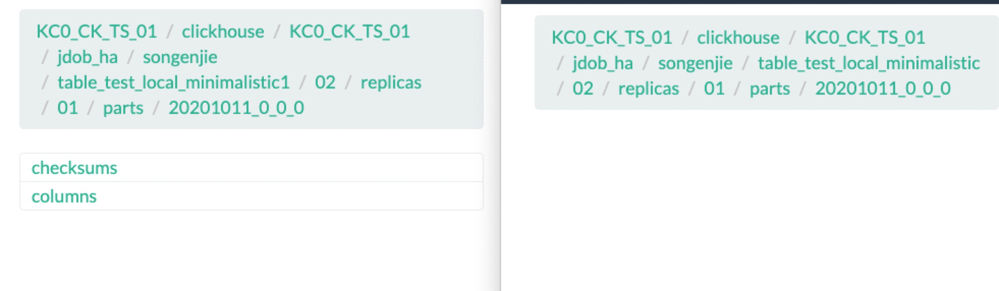

use_minimalistic_part_header_in_zookeeper [极简化zookeeper 数据存储](https://github.com/ClickHouse/ClickHouse/pull/6850/files) 在 2019 年 10月已经默认开启 20版本应该都已经开启

现在讨论已经没有啥意义了

准确说就是将zookeeper part存储，下原先有 checksum 和 columns 信息去除

左图为 table_test_local_minimalistic1， 右图为 table_test_local_minimalistic





```mysql
show create table songenjie.table_test_local_minimalistic1;

SHOW CREATE TABLE songenjie.table_test_local_minimalistic1

┌─statement──────────────────────────────────────────────────────────────────────────────────────────────────────────────────────────────────────────────────────────────────────────────────────────────────────────────────────────────────────────────────┐
│ CREATE TABLE songenjie.table_test_local_minimalistic1
(
    `EventDate` DateTime,
    `CounterID` UInt32,
    `UserID` UInt32
)
ENGINE = ReplicatedMergeTree('/clickhouse/***/jdob_ha/songenjie/table_test_local_minimalistic1/{shard}', '{replica}')
PARTITION BY toYYYYMMDD(EventDate)
ORDER BY (CounterID, EventDate, intHash32(UserID))
SETTINGS storage_policy = 'jdob_ha', use_minimalistic_part_header_in_zookeeper = 0, index_granularity = 8192 │
└────────────────────────────────────────────────────────────────────────────────────────────────────────────────────────────────────────────────────────────────────────────────────────────────────────────────────────────────────────────────────────────┘

1 rows in set. Elapsed: 0.003 sec.

:) show create table songenjie.table_test_local_minimalistic;

SHOW CREATE TABLE songenjie.table_test_local_minimalistic

┌─statement──────────────────────────────────────────────────────────────────────────────────────────────────────────────────────────────────────────────────────────────────────────────────────────────────────────────────────────────────────────────────┐
│ CREATE TABLE songenjie.table_test_local_minimalistic
(
    `EventDate` DateTime,
    `CounterID` UInt32,
    `UserID` UInt32
)
ENGINE = ReplicatedMergeTree('/clickhouse/***/jdob_ha/songenjie/table_test_local_minimalistic/{shard}', '{replica}')
PARTITION BY toYYYYMMDD(EventDate)
ORDER BY (CounterID, EventDate, intHash32(UserID))
SETTINGS storage_policy = 'jdob_ha', use_minimalistic_part_header_in_zookeeper = 1, index_granularity = 8192 │
```


