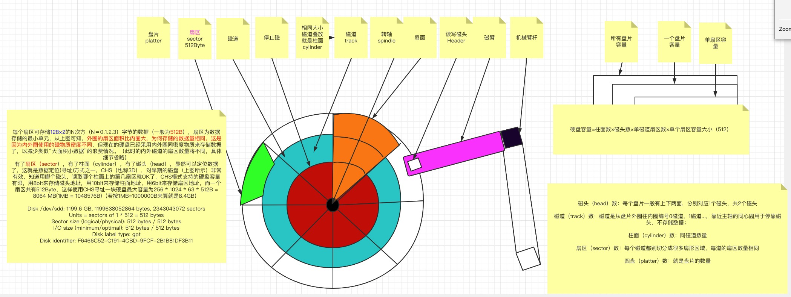

扇区组成一个圆圈，就是磁柱 C ylinder,磁柱是分割槽 partition 的最小单位

第一个扇区最重要 

1. 主要启动区 Master boot Record MBR ,分割表 parition table 
2. MBR 占有 446 bytes
3. partition table 则占有 64b bytes


所有实体磁盘的文件名都已经被模拟成 `/dev/sd[a-p]` 的格式

第一课磁盘文件名为 /dev/sda

而分区槽则为 `/dev/sda[1-128]`（以第一颗磁盘为例）。

/dev/sd[a-p][1-15]：为SCSI, SATA, U盘, Flash闪盘等接口的磁盘文件名；
/dev/hd[a-d][1-63]：为 IDE 接口的磁盘文件名


- inode： 权限与属性放置处
- data block ：实际的数据
- superblock（超级区块）：记录整个文件系统的整体信息，包括 inode 与 block 的总量、使用量、剩余量等


每个 inode 与 block 都有编号，简介如下：

- superblock

  记录此 filesystem 的整体信息，包括 inode、block 的总量、使用量、剩余量、文件系统的格式与相关信息等

- inode

  记录文件的属性，一个文件占用一个 inode，同时记录此文件的数据所在的 block 号码

- block

  实际记录文件的内容，若文件太大时，会占用多个 block

- inode 灰色

- Block 蓝色


假设 inode 4 中记录了 2、7、13、15 这 4 个 block 的号码，操作系统就能够依据此来排列磁盘的阅读顺序，可以一口气将 4 个 block 内容读出来。


这种数据存取方法称为「索引式文件系统（indexed allocation）。那么一般使用的 U 盘， 通常为 FAT 格式，这种文件系统没有 inode 存在，所以没法讲这个文件的所有 block 在一开始就读取出来。每个 block 号码都记录在前一个 block 中，读取方式如下图所示


它只能一个一个将 blcok 读出来后，才会知道下一个 block 在哪里。如果同一个文件数据写入的 block 分散太过厉害，则磁盘读取头可能需要多转好几圈才能读完整个文件内容


**磁盘碎片** 整理就是如此，文件写入的 block 1k 2k 3k 4k  太过于离散了，此时文件读取的效能将会变得很差。可以通过磁盘碎片整理程序将同一个文件所属的 blocks 汇总在一起，这样读取会比较容易


1bytes 

1024 2048 4196 8192 4kb

```
 tune2fs -l /dev/sdc1
tune2fs 1.42.9 (28-Dec-2013)
Filesystem volume name:   <none>
Last mounted on:          /data0
Filesystem UUID:          9d00266e-37b6-4fbc-af9e-9e1141311e93
Filesystem magic number:  0xEF53
Filesystem revision #:    1 (dynamic)
Filesystem features:      has_journal ext_attr resize_inode dir_index filetype needs_recovery sparse_super large_file
Filesystem flags:         signed_directory_hash
Default mount options:    user_xattr acl
Filesystem state:         clean
Errors behavior:          Continue
Filesystem OS type:       Linux
Inode count:              500072448
Block count:              292879872
Reserved block count:     14643993
Free blocks:              261540260
Free inodes:              500072437
First block:              0
Block size:               4096
Fragment size:            4096
Reserved GDT blocks:      1024
Blocks per group:         19192
Fragments per group:      19192
Inodes per group:         32768
Inode blocks per group:   2048
Filesystem created:       Wed Jul 15 11:47:31 2020
Last mount time:          Wed Jul 15 15:28:25 2020
Last write time:          Wed Jul 15 15:28:25 2020
Mount count:              1
Maximum mount count:      -1
Last checked:             Wed Jul 15 11:47:31 2020
Check interval:           0 (<none>)
Reserved blocks uid:      0 (user root)
Reserved blocks gid:      0 (group root)
First inode:              11
Inode size:               256
Required extra isize:     28
Desired extra isize:      28
Journal inode:            8
Default directory hash:   half_md4
Directory Hash Seed:      fcb2165e-78b2-4d4e-a611-6bea6f8e6b2f
Journal backup:           inode blocks
```

- 原则上，block 的大小与数理在格式化完成就不能够再改变了（除非重新格式化）
- 每个 block 内最多只能放置一个文件的数据
- 如果文件大于 block 的大小，则一个文件会占用多个 block 数量
- 若文件小于 block ，则该 block 的剩余容量就不能够再被使用（磁盘空间会浪费）

原理如上，那么假设你的 ext2 文件系统使用 4k block，有 10000 个小文件（均为 50 bytes），此时硬盘浪费多少容量？

```text
一个 block 只能存储一个文件，每个 block 会浪费：4096 - 50 = 4046 byte
所有文件总量为：50 bytes * 10000 = 488.3 kbytes
此时浪费容量为：4046 bytes * 10000 = 38.6 MBytes

总共不到 1 MB 的总文件容量却浪费近 40 MB 的容量

 
        Copied!
    
```

在什么场景下回出现以上所说的问题？比如在 BBS 网站中的数据，使用纯文本记录每篇留言， 当留言内容都都很少时，就会产生很多的小文件（留言越多产生小文件越多）


### 磁盘性能

其实block的大小与业务与磁盘的I/O性能有着密不可分的关系。 block并非越大越好或者越小越好，还是要看业务，下面就举两个例子：

-  如果遇到这种单个文件特别小（小于一个block），而且这种小文件特别多，block设置的太大则对block是一种浪费！这是因为一个文件不管有多小，它都会占用一个inode和一整个block，假如说一个block的大小为4k，磁盘里有一个小文件是1k，那么这个小文件会把4k的一整个block全部占用，剩下的3k就白白浪费掉了。 
-  如果单个文件很大的情况下，block设置的很小，就需要读取多个block，这对磁盘I／O是一种消耗（因为每读取一个block都会消耗磁盘I/O,磁盘每次读取都是以block为单位的） 
-  如果单个文件很大，适当的加大block的大小则会提高磁盘的读取效率，减少了磁盘的I/O。 
-  当block设置的太小，则会影响大文件的读取效率，如果block设置的太小，那么存储一个大文件就需要很多很多block，在读取数据的时候就需要到很多block中去读取内容，刚刚说过，磁盘每次读取内容都是以block为单位的，每读取一个block都会浪费一次磁盘I／O，所以，磁盘读取大文件的效率就回大大降低～


所以，综上所述，在进行磁盘格式化区时根据业务的不同对block做一些调整，可以提高磁盘的利用率和读取性能。


du -sh /data0/****/clickhouse/data/data/default/table/202004_4_4_0/*
4.0K    /data0/****/clickhouse/data/data/default/table/202004_4_4_0/acked.bin
4.0K    /data0/****/clickhouse/data/data/default/table/202004_4_4_0/acked.mrk2
4.0K    /data0/****/clickhouse/data/data/default/table/202004_4_4_0/ack_time.bin
4.0K    /data0/****/clickhouse/data/data/default/table/202004_4_4_0/ack_time.mrk2
4.0K    /data0/****/clickhouse/data/data/default/table/202004_4_4_0/ack_user.bin
4.0K    /data0/****/clickhouse/data/data/default/table/202004_4_4_0/ack_user.dict.bin
4.0K    /data0/****/clickhouse/data/data/default/table/202004_4_4_0/ack_user.dict.mrk2
4.0K    /data0/****/clickhouse/data/data/default/table/202004_4_4_0/ack_user.mrk2
4.0K    /data0/****/clickhouse/data/data/default/table/202004_4_4_0/alert_data.bin
4.0K    /data0/****/clickhouse/data/data/default/table/202004_4_4_0/alert_data.mrk2
4.0K    /data0/****/clickhouse/data/data/default/table/202004_4_4_0/alert_id.bin
4.0K    /data0/****/clickhouse/data/data/default/table/202004_4_4_0/alert_id.mrk2
4.0K    /data0/****/clickhouse/data/data/default/table/202004_4_4_0/checksums.txt
4.0K    /data0/****/clickhouse/data/data/default/table/202004_4_4_0/columns.txt
4.0K    /data0/****/clickhouse/data/data/default/table/202004_4_4_0/count.txt
4.0K    /data0/****/clickhouse/data/data/default/table/202004_4_4_0/minmax_timestamp.idx
4.0K    /data0/****/clickhouse/data/data/default/table/202004_4_4_0/partition.dat
4.0K    /data0/****/clickhouse/data/data/default/table/202004_4_4_0/primary.idx
4.0K    /data0/****/clickhouse/data/data/default/table/202004_4_4_0/tenant_id.bin
4.0K    /data0/****/clickhouse/data/data/default/table/202004_4_4_0/tenant_id.mrk2
4.0K    /data0/****/clickhouse/data/data/default/table/202004_4_4_0/timestamp.bin
4.0K    /data0/****/clickhouse/data/data/default/table/202004_4_4_0/timestamp.mrk2
[root@KC-BCC-POD22-10-196-102-3 prodadmin]# du -sh /data0/****/clickhouse/data/data/default/table/format_version.txt
4.0K    /data0/****/clickhouse/data/data/default/table/format_version.txt


