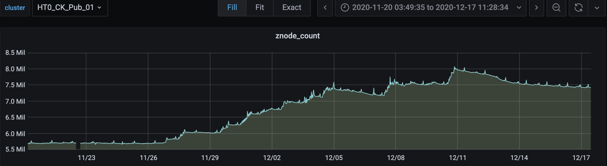

1. 排查zookeeper  znode 占用较高的重要来源

```mysql

CREATE TABLE system.parts_dis_system ON CLUSTER system_cluster
(
    `partition` String,
    `name` String,
    `part_type` String,
    `active` UInt8,
    `marks` UInt64,
    `rows` UInt64,
    `bytes_on_disk` UInt64,
    `data_compressed_bytes` UInt64,
    `data_uncompressed_bytes` UInt64,
    `marks_bytes` UInt64,
    `modification_time` DateTime,
    `remove_time` DateTime,
    `refcount` UInt32,
    `min_date` Date,
    `max_date` Date,
    `min_time` DateTime,
    `max_time` DateTime,
    `partition_id` String,
    `min_block_number` Int64,
    `max_block_number` Int64,
    `level` UInt32,
    `data_version` UInt64,
    `primary_key_bytes_in_memory` UInt64,
    `primary_key_bytes_in_memory_allocated` UInt64,
    `is_frozen` UInt8,
    `database` String,
    `table` String,
    `engine` String,
    `disk_name` String,
    `path` String,
    `hash_of_all_files` String,
    `hash_of_uncompressed_files` String,
    `uncompressed_hash_of_compressed_files` String,
    `delete_ttl_info_min` DateTime,
    `delete_ttl_info_max` DateTime,
    `move_ttl_info.expression` Array(String),
    `move_ttl_info.min` Array(DateTime),
    `move_ttl_info.max` Array(DateTime),
    `bytes` UInt64 ALIAS bytes_on_disk,
    `marks_size` UInt64 ALIAS marks_bytes
)
ENGINE = Distributed('system_cluster', 'system', 'parts', rand())


```




2. 数据写入

```mysql
SELECT count(partition) AS part_count
FROM system.parts_dis_system

┌─part_count─┐
│    5634907 │  7700000
└────────────┘


新增数据加入
SELECT count(partition) AS part_count
FROM system.parts_dis_system
WHERE modification_time > '2020-11-29 00:00:00'

┌─part_count─┐
│    2036780 │
└────────────┘


SELECT count(partition) AS part_count
FROM system.parts_dis_system
WHERE modification_time < '2020-11-29 00:00:00'

┌─part_count─┐
│    3590320 │
└────────────┘


SELECT count(partition) AS part_count
FROM system.parts_dis_system
WHERE min_time < '2020-11-29 00:00:00'

┌─part_count─┐
│    5634757 │
└────────────┘

5634757
```


```tex
12-19 后新模型接入，
-rw-r----- 1 clickhouse clickhouse 1805 Dec 2 21:28 app_ge_d0706t04_union_ord_det_snapshot_day_aggr_local.sql

-rw-r----- 1 clickhouse clickhouse 1534 Dec 2 21:28 app_ge_d0706t04_union_ord_det_snapshot_day_aggr_all.sql

-rw-r----- 1 clickhouse clickhouse 1246 Dec 2 17:08 app_ge_d0706t14_union_item_traffic_det_snapshot_day_aggr_local.sql

-rw-r----- 1 clickhouse clickhouse 964 Dec 2 17:08 app_ge_d0706t14_union_item_traffic_det_snapshot_day_aggr_all.sql

-rw-r----- 1 clickhouse clickhouse 1192 Dec 16 18:55 offline_app_purchase_of_users_t1_all.sql

-rw-r----- 1 clickhouse clickhouse 1368 Dec 16 18:55 offline_app_purchase_of_users_t1_local.sql
```


```mysql
SELECT 
    database,
    table,
    count(partition) AS cpartition
FROM system.parts_dis_system
GROUP BY 
    database,
    table
ORDER BY cpartition DESC

┌─database─┬─table────────────────────────────────────────────────────────────┬─cpartition─┐
│ pc       │ app_r07_cps_batch_erp_dept_sum_local                             │     259601 │
│ pc       │ app_ge_d13_social_fans_behavior_di_test_local                    │     236436 │
│ pc       │ app_ge_d13_social_fans_behavior_di_shop_test_local               │     197943 │
│ pc       │ app_ge_d13_social_fans_behavior_di_aggr_local                    │     196278 │
│ pc       │ app_ge_d13_social_fans_behavior_di_shop_aggr_local               │     172884 │
│ pc       │ app_ge_d13_social_fans_ord_di_test_local                         │     164856 │
│ app      │ offline_mob_ge_purchase_of_users_t1_dept_cate_brand_local        │     159241 │
│ app      │ offline_mob_ge_purchase_of_users_t1_cate_brand_local             │     155495 │
│ pc       │ adm_s07_cps_ord_sum_local                                        │     152429 │
│ app      │ app_purchase_of_users_t2_top50_local                             │     150060 │
│ app      │ offline_mob_ge_purchase_of_users_t2_dept_cate_brand_local        │     147919 │
│ pc       │ app_ge_d13_social_fans_ord_di_aggr_local                         │     147015 │
│ app      │ offline_mob_ge_purchase_of_users_t1_dept_cate_brand_01_local     │     143518 │
│ pc       │ adm_s07_cps_dept_purchase_label_sum_local                        │     139718 │
│ pc       │ app_r07_cps_batch_sum_local                                      │     138395 │
│ app      │ offline_mob_ge_purchase_of_users_t2_purchase_cate_brand_local    │     134975 │
│ app      │ app_purchase_of_users_t1_top50_local                             │     133813 │
│ app      │ offline_mob_ge_purchase_of_users_t1_dept_cate_brand_02_local     │     133219 │
│ app      │ app_s01_user_plat_global_mh_topresto_local                       │     129133 │
│ app      │ offline_mob_ge_purchase_of_users_t1_purchase_cate_brand_local    │     127434 │
│ app      │ offline_mob_ge_purchase_of_users_t1_dept_cate_brand_03_local     │     125630 │
│ app      │ offline_mob_ge_purchase_of_users_t2_shop_local                   │     124082 │
│ app      │ offline_mob_ge_purchase_of_users_t1_shop_local                   │     123700 │
│ app      │ offline_mob_ge_purchase_of_users_t2_dept_cate_brand_01_local     │     123468 │
│ app      │ offline_mob_ge_purchase_of_users_t2_dept_cate_brand_02_local     │     122774 │
│ app      │ offline_mob_ge_purchase_of_users_t2_dept_cate_brand_03_local     │     122329 │
│ app      │ offline_mob_ge_purchase_of_users_t1_purchase_cate_brand_02_local │     119239 │
│ app      │ offline_mob_ge_purchase_of_users_hour10min_local                 │     114283 │
│ pc       │ adm_d07_cps_batch_ord_sku_det_local                              │     112132 │
│ app      │ offline_mob_ge_purchase_of_users_t2_cate_brand_local             │     104483 │
│ pc       │ app_ge_r0706001_union_overview_sum_local                         │     103407 │
│ app      │ offline_mob_ge_purchase_of_users_t2_purchase_cate_brand_02_local │      99004 │
│ app      │ offline_mob_ge_offline_label_drill_presto_local                  │      85313 │
│ pc       │ adm_s07_cps_channel_sum_local                                    │      81004 │
│ pc       │ app_ge_d0706t04_union_ord_det_snapshot_day_local                 │      67338 │
│ pc       │ app_ge_d0706t14_union_traffic_det_snapshot_day_local             │      65427 │
│ pc       │ app_ge_s13_social_fans_sum_local                                 │      60616 │
│ pc       │ app_ge_d0706t14_union_item_traffic_det_snapshot_day_local        │      55350 │
│ pc       │ app_ge_d07_union_ord_det_snapshot_day_local                      │      51028 │
│ default  │ app_d1401005_traffic_plat_item_mins_hours_di_1_local             │      48780 │
│ default  │ app_d1401005_traffic_plat_item_di_local                          │      46666 │
│ pc       │ app_ge_s07_union_overview_ord_local                              │      41746 │
│ pc       │ app_ge_d0706t04_union_ord_det_snapshot_day_aggr_local            │      40899 │  1111
│ default  │ app_d1401005_trade_plat_item_di_local                            │      37803 │
│ default  │ app_d1401005_sku_addcart_mild_di_1_local                         │      37430 │
│ default  │ app_d1401005_traffic_plat_item_di_user_1_local                   │      36477 │
│ app      │ offline_app_purchase_of_users_t1_local                           │      36125 │  1111
│ pc       │ app_ge_d0706t14_union_item_traffic_det_snapshot_day_aggr_local   │      31683 │  1111
│ default  │ app_d1401005_traffic_plat_item_mins_hours_di_aggr                │      29194 │
│ default  │ app_s01_user_ord_det_snapshot_day_new_local                      │      27463 │
│ default  │ app_s01_user_ord_det_snapshot_day_local                          │      19929 │
│ default  │ dim_ge_right_sku_self_dict_local                                 │      18985 │
│ system   │ trace_log                                                        │      16232 │
│ default  │ dim_ge_right_shop_pop_dict_local                                 │      12894 │
│ default  │ app_cate_oper_erp_acct_local                                     │      12342 │
│ pc       │ app_ge_s13_dim_shop_dept_local                                   │      10559 │
│ default  │ app_d14_traffic_plat_item_di_new_aggr_local                      │      10463 │
│ default  │ app_join_id_local                                                │       9189 │
│ default  │ app_cate_brand_local                                             │       9149 │
│ default  │ app_ge_id_name_local                                             │       9056 │
│ default  │ app_d14_traffic_plat_item_di_new_local                           │       8449 │
│ system   │ query_log                                                        │       7167 │
│ system   │ query_thread_log                                                 │       6907 │
│ system   │ part_log                                                         │       4526 │
│ dict     │ dim_self_0431                                                    │        690 │
│ default  │ test_local                                                       │        123 │
│ dict     │ dim_app_join_id_local                                            │        117 │
│ dict     │ dim_fensi_shopid_l                                               │        117 │
│ dict     │ dim_pop_0431                                                     │        115 │
│ dict     │ dim_cate_erp_1                                                   │        115 │
│ dict     │ dim_fensi_shopid                                                 │        115 │
│ dict     │ dim_id_name_0430                                                 │        115 │
│ dict     │ dim_cate_brand                                                   │        115 │
└──────────┴──────────────────────────────────────────────────────────────────┴────────────┘
```


```mysql


SELECT 
    database,
    table,
    _shard_num,
    count(partition) AS cpartition,
    countDistinct(partition) AS uniqpartition
FROM 
(
    SELECT 
        database,
        table,
        _shard_num,
        partition
    FROM system.parts_dis
    WHERE table = 'app_r07_cps_batch_erp_dept_sum_local'
)
GROUP BY 
    database,
    table,
    _shard_num
ORDER BY 
    table ASC,
    _shard_num ASC,
    cpartition ASC

┌─database─┬─table────────────────────────────────┬─_shard_num─┬─cpartition─┬─uniqpartition─┐
│ pc       │ app_r07_cps_batch_erp_dept_sum_local │          1 │       2273 │          1143 │
│ pc       │ app_r07_cps_batch_erp_dept_sum_local │          2 │       2219 │          1143 │
│ pc       │ app_r07_cps_batch_erp_dept_sum_local │          3 │       2297 │          1143 │
│ pc       │ app_r07_cps_batch_erp_dept_sum_local │          4 │       2263 │          1143 │
│ pc       │ app_r07_cps_batch_erp_dept_sum_local │          5 │       2217 │          1143 │
│ pc       │ app_r07_cps_batch_erp_dept_sum_local │          6 │       2282 │          1143 │
│ pc       │ app_r07_cps_batch_erp_dept_sum_local │          7 │       2203 │          1143 │
│ pc       │ app_r07_cps_batch_erp_dept_sum_local │          8 │       2359 │          1143 │
│ pc       │ app_r07_cps_batch_erp_dept_sum_local │          9 │       2295 │          1143 │
│ pc       │ app_r07_cps_batch_erp_dept_sum_local │         10 │       2188 │          1143 │
│ pc       │ app_r07_cps_batch_erp_dept_sum_local │         11 │       2237 │          1143 │
│ pc       │ app_r07_cps_batch_erp_dept_sum_local │         12 │       2338 │          1143 │
│ pc       │ app_r07_cps_batch_erp_dept_sum_local │         13 │       2173 │          1143 │
│ pc       │ app_r07_cps_batch_erp_dept_sum_local │         14 │       2371 │          1143 │
│ pc       │ app_r07_cps_batch_erp_dept_sum_local │         15 │       2257 │          1143 │
│ pc       │ app_r07_cps_batch_erp_dept_sum_local │         16 │       2206 │          1143 │
│ pc       │ app_r07_cps_batch_erp_dept_sum_local │         17 │       2446 │          1143 │
│ pc       │ app_r07_cps_batch_erp_dept_sum_local │         18 │       2270 │          1143 │
│ pc       │ app_r07_cps_batch_erp_dept_sum_local │         19 │       2330 │          1143 │
│ pc       │ app_r07_cps_batch_erp_dept_sum_local │         20 │       2245 │          1143 │
│ pc       │ app_r07_cps_batch_erp_dept_sum_local │         21 │       2280 │          1143 │
│ pc       │ app_r07_cps_batch_erp_dept_sum_local │         22 │       2304 │          1143 │
│ pc       │ app_r07_cps_batch_erp_dept_sum_local │         23 │       2251 │          1143 │
│ pc       │ app_r07_cps_batch_erp_dept_sum_local │         24 │       2373 │          1143 │
│ pc       │ app_r07_cps_batch_erp_dept_sum_local │         25 │       2328 │          1143 │
│ pc       │ app_r07_cps_batch_erp_dept_sum_local │         26 │       2212 │          1143 │
│ pc       │ app_r07_cps_batch_erp_dept_sum_local │         27 │       2263 │          1143 │
│ pc       │ app_r07_cps_batch_erp_dept_sum_local │         28 │       2242 │          1143 │
│ pc       │ app_r07_cps_batch_erp_dept_sum_local │         29 │       2329 │          1143 │
│ pc       │ app_r07_cps_batch_erp_dept_sum_local │         30 │       2169 │          1143 │
│ pc       │ app_r07_cps_batch_erp_dept_sum_local │         31 │       2246 │          1143 │
│ pc       │ app_r07_cps_batch_erp_dept_sum_local │         32 │       2215 │          1143 │
│ pc       │ app_r07_cps_batch_erp_dept_sum_local │         33 │       2298 │          1143 │
│ pc       │ app_r07_cps_batch_erp_dept_sum_local │         34 │       2163 │          1143 │
│ pc       │ app_r07_cps_batch_erp_dept_sum_local │         35 │       2260 │          1143 │
│ pc       │ app_r07_cps_batch_erp_dept_sum_local │         36 │       2249 │          1143 │
│ pc       │ app_r07_cps_batch_erp_dept_sum_local │         37 │       2281 │          1143 │
│ pc       │ app_r07_cps_batch_erp_dept_sum_local │         38 │       2304 │          1143 │
│ pc       │ app_r07_cps_batch_erp_dept_sum_local │         39 │       2220 │          1143 │
└──────────┴──────────────────────────────────────┴────────────┴────────────┴───────────────┘


A01-R21-I41-135-300022P.JD.LOCAL :) select database,table, partition ,count(partition) as cpartition from system.parts where database !='system'  group by database,table,partition order by cpartition DESC limit 100;

SELECT 
    database,
    table,
    partition,
    count(partition) AS cpartition
FROM system.parts
WHERE database != 'system'
GROUP BY 
    database,
    table,
    partition
ORDER BY cpartition DESC
LIMIT 100

┌─database─┬─table─────────────────────────────────────────────────────┬─partition──┬─cpartition─┐
│ pc       │ app_ge_d13_social_fans_behavior_di_test_local             │ 2019-09-25 │         12 │
│ pc       │ app_ge_d13_social_fans_behavior_di_test_local             │ 2019-01-05 │         12 │
│ pc       │ app_ge_d13_social_fans_behavior_di_test_local             │ 2019-09-09 │         12 │
│ pc       │ app_ge_d13_social_fans_behavior_di_test_local             │ 2019-08-14 │         11 │
│ pc       │ app_ge_d13_social_fans_behavior_di_test_local             │ 2019-11-15 │         11 │
│ pc       │ app_ge_d13_social_fans_behavior_di_test_local             │ 2019-11-14 │         11 │
│ pc       │ app_ge_d13_social_fans_behavior_di_test_local             │ 2019-08-03 │         11 │
│ pc       │ app_ge_d13_social_fans_behavior_di_aggr_local             │ 2019-01-24 │         11 │
│ pc       │ app_ge_d13_social_fans_behavior_di_test_local             │ 2019-10-05 │         11 │
│ pc       │ app_ge_d13_social_fans_behavior_di_aggr_local             │ 2019-01-23 │         11 │
│ pc       │ app_ge_d13_social_fans_behavior_di_test_local             │ 2019-09-29 │         11 │
│ pc       │ app_ge_d13_social_fans_behavior_di_test_local             │ 2019-01-13 │         11 │
│ pc       │ app_ge_d13_social_fans_behavior_di_test_local             │ 2019-07-29 │         11 │
│ pc       │ app_ge_d13_social_fans_behavior_di_test_local             │ 2019-01-07 │         11 │
│ pc       │ app_ge_d13_social_fans_behavior_di_aggr_local             │ 2019-01-25 │         11 │
│ pc       │ app_ge_d13_social_fans_behavior_di_test_local             │ 2019-10-07 │         11 │
│ pc       │ app_ge_d13_social_fans_behavior_di_test_local             │ 2019-10-03 │         10 │
│ pc       │ app_ge_r0706001_union_overview_sum_local                  │ 2019-12-14 │         10 │
│ pc       │ app_ge_d13_social_fans_behavior_di_test_local             │ 2019-01-15 │         10 │
│ pc       │ app_ge_r0706001_union_overview_sum_local                  │ 2019-12-12 │         10 │
│ pc       │ app_ge_d13_social_fans_behavior_di_test_local             │ 2019-11-26 │         10 │
│ pc       │ app_ge_d13_social_fans_behavior_di_test_local             │ 2019-08-27 │         10 │
│ pc       │ app_ge_d13_social_fans_behavior_di_test_local             │ 2019-07-27 │         10 │
│ pc       │ app_ge_r0706001_union_overview_sum_local                  │ 2020-12-16 │         10 │
│ pc       │ app_ge_d13_social_fans_behavior_di_test_local             │ 2019-08-22 │         10 │
│ pc       │ app_ge_r0706001_union_overview_sum_local                  │ 2020-12-14 │         10 │
│ pc       │ app_ge_d13_social_fans_behavior_di_test_local             │ 2019-11-19 │         10 │
│ pc       │ app_ge_d13_social_fans_behavior_di_test_local             │ 2019-01-24 │         10 │
│ pc       │ app_ge_d13_social_fans_behavior_di_test_local             │ 2019-10-10 │         10 │
│ pc       │ app_ge_d13_social_fans_behavior_di_test_local             │ 2019-08-04 │         10 │
│ pc       │ app_ge_d13_social_fans_behavior_di_test_local             │ 2019-10-06 │         10 │
│ pc       │ app_ge_d13_social_fans_behavior_di_test_local             │ 2019-10-12 │         10 │
│ pc       │ app_ge_d13_social_fans_behavior_di_test_local             │ 2019-11-28 │         10 │
│ pc       │ app_ge_d13_social_fans_behavior_di_test_local             │ 2019-11-27 │         10 │
│ pc       │ app_ge_d13_social_fans_behavior_di_test_local             │ 2019-11-04 │         10 │
│ pc       │ app_ge_d13_social_fans_behavior_di_test_local             │ 2019-08-07 │         10 │
│ pc       │ app_ge_d13_social_fans_behavior_di_test_local             │ 2019-01-21 │         10 │
│ pc       │ app_ge_d13_social_fans_behavior_di_test_local             │ 2019-09-03 │          9 │
│ pc       │ app_ge_d13_social_fans_behavior_di_test_local             │ 2019-10-28 │          9 │
│ pc       │ app_ge_d13_social_fans_behavior_di_test_local             │ 2019-09-02 │          9 │
│ pc       │ app_ge_d13_social_fans_behavior_di_test_local             │ 2019-09-26 │          9 │
│ pc       │ app_ge_d13_social_fans_behavior_di_test_local             │ 2019-08-20 │          9 │
│ pc       │ app_ge_d13_social_fans_behavior_di_test_local             │ 2019-09-27 │          9 │
│ pc       │ app_ge_d13_social_fans_behavior_di_test_local             │ 2019-01-22 │          9 │
│ pc       │ app_ge_d13_social_fans_behavior_di_test_local             │ 2019-11-18 │          9 │
│ pc       │ app_ge_r0706001_union_overview_sum_local                  │ 2019-12-11 │          9 │
│ pc       │ app_ge_d13_social_fans_behavior_di_test_local             │ 2019-09-24 │          9 │
│ pc       │ app_ge_d13_social_fans_behavior_di_test_local             │ 2019-01-03 │          9 │
│ pc       │ app_ge_d13_social_fans_behavior_di_test_local             │ 2019-09-18 │          9 │
│ pc       │ app_ge_d13_social_fans_behavior_di_test_local             │ 2019-11-29 │          9 │
│ pc       │ app_ge_d13_social_fans_behavior_di_test_local             │ 2019-11-16 │          9 │
│ pc       │ app_ge_d13_social_fans_behavior_di_test_local             │ 2019-09-07 │          9 │
│ pc       │ app_ge_d13_social_fans_behavior_di_test_local             │ 2019-09-05 │          9 │
│ pc       │ app_ge_d13_social_fans_behavior_di_test_local             │ 2019-08-05 │          9 │
│ pc       │ app_ge_r0706001_union_overview_sum_local                  │ 2020-12-19 │          9 │
│ pc       │ app_ge_d13_social_fans_behavior_di_test_local             │ 2019-10-17 │          9 │
│ pc       │ app_ge_d13_social_fans_behavior_di_test_local             │ 2019-08-17 │          9 │
│ pc       │ app_ge_r0706001_union_overview_sum_local                  │ 2019-12-17 │          9 │
│ pc       │ app_ge_d13_social_fans_behavior_di_test_local             │ 2019-09-16 │          9 │
│ pc       │ app_ge_d13_social_fans_behavior_di_test_local             │ 2019-09-30 │          9 │
│ pc       │ app_ge_d13_social_fans_behavior_di_test_local             │ 2019-10-18 │          9 │
│ pc       │ app_ge_d13_social_fans_behavior_di_test_local             │ 2019-11-10 │          9 │
│ pc       │ app_ge_d13_social_fans_behavior_di_test_local             │ 2019-10-15 │          9 │
│ pc       │ app_ge_r0706001_union_overview_sum_local                  │ 2019-12-16 │          9 │
│ pc       │ app_ge_d13_social_fans_behavior_di_test_local             │ 2019-11-11 │          9 │
│ pc       │ app_ge_d13_social_fans_behavior_di_test_local             │ 2019-08-30 │          9 │
│ pc       │ app_ge_d13_social_fans_behavior_di_test_local             │ 2019-09-23 │          9 │
│ pc       │ app_ge_d13_social_fans_behavior_di_test_local             │ 2019-08-16 │          9 │
│ pc       │ app_ge_d13_social_fans_behavior_di_test_local             │ 2019-08-21 │          9 │
│ default  │ app_d1401005_traffic_plat_item_mins_hours_di_1_local      │ 2020-12-20 │          9 │
│ pc       │ app_ge_d13_social_fans_behavior_di_test_local             │ 2019-11-01 │          9 │
│ pc       │ app_ge_d13_social_fans_behavior_di_test_local             │ 2019-09-08 │          9 │
│ pc       │ app_ge_d13_social_fans_behavior_di_test_local             │ 2019-01-14 │          9 │
│ pc       │ app_ge_d13_social_fans_behavior_di_test_local             │ 2019-01-11 │          8 │
│ pc       │ app_ge_d13_social_fans_behavior_di_test_local             │ 2019-10-04 │          8 │
│ pc       │ app_ge_d13_social_fans_behavior_di_test_local             │ 2019-09-22 │          8 │
│ pc       │ app_ge_d13_social_fans_behavior_di_test_local             │ 2019-01-17 │          8 │
│ pc       │ app_ge_r0706001_union_overview_sum_local                  │ 2020-12-13 │          8 │
│ pc       │ app_ge_d13_social_fans_behavior_di_test_local             │ 2019-10-14 │          8 │
│ pc       │ app_ge_d0706t14_union_item_traffic_det_snapshot_day_local │ 2019-12-12 │          8 │
│ pc       │ app_ge_r0706001_union_overview_sum_local                  │ 2019-12-22 │          8 │
│ pc       │ app_ge_d13_social_fans_behavior_di_test_local             │ 2019-08-28 │          8 │
│ pc       │ app_ge_d13_social_fans_behavior_di_test_local             │ 2019-11-21 │          8 │
│ pc       │ app_ge_d13_social_fans_behavior_di_test_local             │ 2019-01-20 │          8 │
│ pc       │ app_ge_d13_social_fans_behavior_di_test_local             │ 2019-11-03 │          8 │
│ pc       │ app_ge_d13_social_fans_behavior_di_test_local             │ 2019-01-25 │          8 │
│ pc       │ app_ge_d13_social_fans_behavior_di_test_local             │ 2019-08-06 │          8 │
│ pc       │ app_ge_d13_social_fans_ord_di_test_local                  │ 2020-12-22 │          8 │
│ pc       │ app_ge_d13_social_fans_behavior_di_test_local             │ 2019-10-30 │          8 │
│ pc       │ app_ge_d13_social_fans_behavior_di_shop_test_local        │ 2019-02-20 │          8 │
│ pc       │ app_ge_d13_social_fans_behavior_di_test_local             │ 2019-07-28 │          8 │
│ pc       │ app_ge_d13_social_fans_behavior_di_test_local             │ 2019-11-23 │          8 │
│ pc       │ app_ge_d13_social_fans_behavior_di_test_local             │ 2019-01-12 │          8 │
│ pc       │ app_ge_d13_social_fans_behavior_di_test_local             │ 2019-10-09 │          8 │
│ pc       │ app_ge_d13_social_fans_ord_di_test_local                  │ 2020-12-19 │          8 │
│ pc       │ app_ge_d13_social_fans_behavior_di_test_local             │ 2019-09-21 │          8 │
│ pc       │ app_ge_d13_social_fans_behavior_di_test_local             │ 2019-07-30 │          8 │
│ pc       │ app_ge_d13_social_fans_behavior_di_test_local             │ 2019-08-29 │          8 │
│ pc       │ app_ge_d13_social_fans_behavior_di_test_local             │ 2019-01-16 │          8 │
│ pc       │ app_ge_d13_social_fans_behavior_di_test_local             │ 2019-01-08 │          8 │
└──────────┴───────────────────────────────────────────────────────────┴────────────┴────────────┘

100 rows in set. Elapsed: 1.303 sec. Processed 48.46 thousand rows, 27.81 MB (37.19 thousand rows/s., 21.35 MB/s.) 
```


```mysql
SELECT 
    database,
    table,
    countDistinct(partition) AS partition_count,
    count(partition) AS part_count,
    formatReadableSize(sum(bytes_on_disk)) AS table_size,
    formatReadableSize(sum(bytes_on_disk) / count(partition)) AS avg_part_size,
    formatReadableSize(sum(bytes_on_disk) / countDistinct(partition)) AS avg_partition_size,
    sum(bytes_on_disk) / count(partition) AS avg_part_size_order
FROM system.parts
WHERE database != 'system'
GROUP BY 
    database,
    table
ORDER BY partition_count DESC

┌─database─┬─table────────────────────────────────────────────────────────────┬─partition_count─┬─part_count─┬─table_size─┬─avg_part_size─┬─avg_partition_size─┬─avg_part_size_order─┐
│ pc       │ app_r07_cps_batch_erp_dept_sum_local                             │            1143 │       2245 │ 60.91 GiB  │ 27.78 MiB     │ 54.57 MiB          │  29134249.894877505 │
│ app      │ app_purchase_of_users_t1_top50_local                             │             738 │       1158 │ 20.66 GiB  │ 18.27 MiB     │ 28.67 MiB          │    19160344.7746114 │
│ app      │ offline_mob_ge_purchase_of_users_t1_dept_cate_brand_02_local     │             738 │       1236 │ 11.09 GiB  │ 9.19 MiB      │ 15.39 MiB          │    9632623.28802589 │
│ app      │ offline_mob_ge_purchase_of_users_t1_dept_cate_brand_local        │             738 │       1375 │ 8.51 GiB   │ 6.34 MiB      │ 11.81 MiB          │   6646648.715636363 │
│ app      │ offline_mob_ge_purchase_of_users_t1_shop_local                   │             738 │       1070 │ 961.99 MiB │ 920.64 KiB    │ 1.30 MiB           │   942731.6803738318 │
│ app      │ offline_mob_ge_purchase_of_users_t1_purchase_cate_brand_02_local │             738 │       1018 │ 1.43 GiB   │ 1.43 MiB      │ 1.98 MiB           │  1504025.7033398822 │
│ app      │ offline_mob_ge_purchase_of_users_t1_purchase_cate_brand_local    │             738 │       1106 │ 1.35 GiB   │ 1.25 MiB      │ 1.87 MiB           │  1307627.1202531646 │
│ app      │ offline_mob_ge_purchase_of_users_t1_dept_cate_brand_01_local     │             738 │       1259 │ 7.69 GiB   │ 6.26 MiB      │ 10.67 MiB          │   6559981.154090548 │
│ app      │ offline_mob_ge_purchase_of_users_t1_cate_brand_local             │             738 │       1343 │ 17.54 GiB  │ 13.37 MiB     │ 24.34 MiB          │  14022264.481757259 │
│ app      │ offline_mob_ge_purchase_of_users_t1_dept_cate_brand_03_local     │             738 │       1125 │ 5.65 GiB   │ 5.14 MiB      │ 7.84 MiB           │   5394517.169777778 │
│ app      │ offline_mob_ge_purchase_of_users_t2_purchase_cate_brand_local    │             737 │       1135 │ 23.68 GiB  │ 21.36 MiB     │ 32.90 MiB          │  22400750.653744493 │
│ app      │ offline_mob_ge_purchase_of_users_t2_purchase_cate_brand_02_local │             737 │        819 │ 270.26 MiB │ 337.90 KiB    │ 375.50 KiB         │   346014.0256410256 │
│ app      │ offline_mob_ge_purchase_of_users_t2_cate_brand_local             │             737 │        914 │ 1.34 GiB   │ 1.51 MiB      │ 1.87 MiB           │   1579458.863238512 │
│ app      │ offline_mob_ge_purchase_of_users_t2_shop_local                   │             737 │       1067 │ 932.38 MiB │ 894.81 KiB    │ 1.27 MiB           │   916283.4545454546 │
│ app      │ offline_mob_ge_purchase_of_users_t2_dept_cate_brand_01_local     │             737 │       1059 │ 2.67 GiB   │ 2.58 MiB      │ 3.71 MiB           │   2705999.525967894 │
│ app      │ offline_mob_ge_purchase_of_users_t2_dept_cate_brand_03_local     │             737 │       1058 │ 1.79 GiB   │ 1.73 MiB      │ 2.48 MiB           │  1812422.0633270321 │
│ app      │ offline_mob_ge_purchase_of_users_t2_dept_cate_brand_02_local     │             737 │       1066 │ 1.48 GiB   │ 1.42 MiB      │ 2.05 MiB           │   1487692.892120075 │
│ app      │ app_purchase_of_users_t2_top50_local                             │             737 │       1263 │ 19.48 GiB  │ 15.80 MiB     │ 27.07 MiB          │  16565177.333333334 │
│ app      │ offline_mob_ge_purchase_of_users_t2_dept_cate_brand_local        │             731 │       1257 │ 6.82 GiB   │ 5.55 MiB      │ 9.55 MiB           │   5823195.935560859 │
│ app      │ app_s01_user_plat_global_mh_topresto_local                       │             722 │       1110 │ 13.00 GiB  │ 11.99 MiB     │ 18.43 MiB          │  12572426.604504505 │
│ app      │ offline_mob_ge_offline_label_drill_presto_local                  │             722 │        729 │ 81.06 MiB  │ 113.86 KiB    │ 114.97 KiB         │  116597.21399176955 │
│ app      │ offline_mob_ge_purchase_of_users_hour10min_local                 │             722 │       1012 │ 8.02 GiB   │ 8.11 MiB      │ 11.37 MiB          │    8504895.31916996 │
│ pc       │ app_ge_d13_social_fans_behavior_di_shop_test_local               │             721 │       1691 │ 62.02 GiB  │ 37.55 MiB     │ 88.08 MiB          │   39378055.44884684 │
│ pc       │ app_ge_d13_social_fans_ord_di_aggr_local                         │             720 │       1192 │ 90.46 GiB  │ 77.71 MiB     │ 128.65 MiB         │   81481792.56124161 │
│ pc       │ app_ge_d13_social_fans_ord_di_test_local                         │             720 │       1378 │ 142.89 GiB │ 106.18 MiB    │ 203.22 MiB         │  111338892.49564587 │
│ pc       │ app_ge_d13_social_fans_behavior_di_shop_aggr_local               │             708 │       1597 │ 18.21 GiB  │ 11.68 MiB     │ 26.34 MiB          │   12244152.82467126 │
│ pc       │ adm_d07_cps_batch_ord_sku_det_local                              │             614 │        949 │ 48.52 GiB  │ 52.35 MiB     │ 80.91 MiB          │   54892101.50052687 │
│ pc       │ adm_s07_cps_dept_purchase_label_sum_local                        │             614 │       1179 │ 8.75 GiB   │ 7.60 MiB      │ 14.59 MiB          │   7967696.244274809 │
│ pc       │ app_r07_cps_batch_sum_local                                      │             614 │       1167 │ 652.54 MiB │ 572.58 KiB    │ 1.06 MiB           │   586321.6101113968 │
│ pc       │ adm_s07_cps_ord_sum_local                                        │             614 │       1336 │ 4.84 GiB   │ 3.71 MiB      │ 8.07 MiB           │   3888653.849550898 │
│ pc       │ adm_s07_cps_channel_sum_local                                    │             571 │        677 │ 308.34 MiB │ 466.38 KiB    │ 552.96 KiB         │  477576.90694239293 │
│ pc       │ app_ge_d13_social_fans_behavior_di_test_local                    │             566 │       2080 │ 227.87 GiB │ 112.18 MiB    │ 412.26 MiB         │  117631958.96923077 │
│ pc       │ app_ge_d13_social_fans_behavior_di_aggr_local                    │             566 │       1687 │ 97.08 GiB  │ 58.93 MiB     │ 175.63 MiB         │  61788399.151748665 │
│ pc       │ app_ge_s13_social_fans_sum_local                                 │             333 │        754 │ 1.96 GiB   │ 2.66 MiB      │ 6.02 MiB           │  2789070.3633952253 │
│ pc       │ app_ge_s07_union_overview_ord_local                              │             292 │        414 │ 1.05 GiB   │ 2.59 MiB      │ 3.67 MiB           │  2712677.7995169084 │
│ pc       │ app_ge_d0706t04_union_ord_det_snapshot_day_aggr_local            │             283 │        353 │ 4.83 GiB   │ 14.01 MiB     │ 17.48 MiB          │   14695464.40509915 │
│ pc       │ app_ge_d07_union_ord_det_snapshot_day_local                      │             283 │        438 │ 4.32 GiB   │ 10.09 MiB     │ 15.62 MiB          │  10581475.570776256 │
│ pc       │ app_ge_d0706t04_union_ord_det_snapshot_day_local                 │             283 │        574 │ 5.28 GiB   │ 9.42 MiB      │ 19.10 MiB          │    9876467.55400697 │
│ pc       │ app_ge_r0706001_union_overview_sum_local                         │             282 │        927 │ 111.98 GiB │ 123.70 MiB    │ 406.62 MiB         │  129706730.77885653 │
│ pc       │ app_ge_d0706t14_union_traffic_det_snapshot_day_local             │             268 │        553 │ 14.28 GiB  │ 26.45 MiB     │ 54.58 MiB          │  27736443.672694393 │
│ pc       │ app_ge_d0706t14_union_item_traffic_det_snapshot_day_aggr_local   │             207 │        274 │ 5.19 GiB   │ 19.39 MiB     │ 25.66 MiB          │   20329110.94890511 │
│ pc       │ app_ge_d0706t14_union_item_traffic_det_snapshot_day_local        │             207 │        457 │ 13.53 GiB  │ 30.32 MiB     │ 66.94 MiB          │  31792478.814004377 │
│ default  │ app_d1401005_trade_plat_item_di_local                            │             161 │        328 │ 3.57 GiB   │ 11.15 MiB     │ 22.71 MiB          │  11689743.548780488 │
│ default  │ app_d1401005_traffic_plat_item_di_user_1_local                   │             160 │        316 │ 9.37 GiB   │ 30.37 MiB     │ 59.98 MiB          │   31843021.05379747 │
│ default  │ app_d1401005_traffic_plat_item_di_local                          │             160 │        387 │ 111.16 GiB │ 294.14 MiB    │ 711.44 MiB         │   308424637.4857881 │
│ default  │ app_d1401005_traffic_plat_item_mins_hours_di_1_local             │             160 │        431 │ 192.76 GiB │ 457.96 MiB    │ 1.20 GiB           │  480206792.36890954 │
│ default  │ app_d1401005_sku_addcart_mild_di_1_local                         │             159 │        327 │ 5.77 GiB   │ 18.06 MiB     │ 37.13 MiB          │   18932081.95412844 │
│ default  │ app_d1401005_traffic_plat_item_mins_hours_di_aggr                │             157 │        254 │ 78.57 GiB  │ 316.74 MiB    │ 512.43 MiB         │   332122248.3070866 │
│ default  │ app_s01_user_ord_det_snapshot_day_new_local                      │             115 │        234 │ 19.61 GiB  │ 85.80 MiB     │ 174.59 MiB         │   89970520.24358974 │
│ pc       │ app_ge_s13_dim_shop_dept_local                                   │              87 │         93 │ 21.88 MiB  │ 240.87 KiB    │ 257.48 KiB         │  246653.01075268816 │
│ default  │ app_s01_user_ord_det_snapshot_day_local                          │              82 │        175 │ 10.17 GiB  │ 59.48 MiB     │ 126.94 MiB         │   62369883.51428571 │
│ app      │ offline_app_purchase_of_users_t1_local                           │              80 │        220 │ 192.60 MiB │ 896.45 KiB    │ 2.41 MiB           │   917962.9772727273 │
│ default  │ dim_ge_right_shop_pop_dict_local                                 │              77 │        109 │ 84.53 MiB  │ 794.13 KiB    │ 1.10 MiB           │   813184.9908256881 │
│ default  │ app_join_id_local                                                │              77 │         80 │ 498.89 KiB │ 6.24 KiB      │ 6.48 KiB           │             6385.85 │
│ default  │ app_cate_oper_erp_acct_local                                     │              77 │        108 │ 164.55 MiB │ 1.52 MiB      │ 2.14 MiB           │  1597663.6944444445 │
│ default  │ app_cate_brand_local                                             │              77 │         78 │ 60.18 MiB  │ 790.11 KiB    │ 800.37 KiB         │   809073.4230769231 │
│ default  │ dim_ge_right_sku_self_dict_local                                 │              77 │        170 │ 3.33 GiB   │ 20.03 MiB     │ 44.22 MiB          │          21003432.1 │
│ default  │ app_ge_id_name_local                                             │              77 │         77 │ 339.63 KiB │ 4.41 KiB      │ 4.41 KiB           │   4516.688311688312 │
│ default  │ app_d14_traffic_plat_item_di_new_local                           │              43 │         73 │ 164.55 GiB │ 2.25 GiB      │ 3.83 GiB           │  2420276963.6438355 │
│ default  │ app_d14_traffic_plat_item_di_new_aggr_local                      │              39 │         92 │ 119.93 GiB │ 1.30 GiB      │ 3.08 GiB           │  1399705704.0869565 │
│ dict     │ dim_app_join_id_local                                            │               1 │          1 │ 6.56 KiB   │ 6.56 KiB      │ 6.56 KiB           │                6718 │
│ dict     │ dim_pop_0431                                                     │               1 │          1 │ 1.17 MiB   │ 1.17 MiB      │ 1.17 MiB           │             1231608 │
│ dict     │ dim_cate_erp_1                                                   │               1 │          1 │ 156.75 KiB │ 156.75 KiB    │ 156.75 KiB         │              160516 │
│ dict     │ dim_fensi_shopid                                                 │               1 │          1 │ 266.44 KiB │ 266.44 KiB    │ 266.44 KiB         │              272830 │
│ dict     │ dim_self_0431                                                    │               1 │          6 │ 56.47 MiB  │ 9.41 MiB      │ 56.47 MiB          │   9868477.333333334 │
│ default  │ test_local                                                       │               1 │          1 │ 692.59 KiB │ 692.59 KiB    │ 692.59 KiB         │              709214 │
│ dict     │ dim_id_name_0430                                                 │               1 │          1 │ 4.17 KiB   │ 4.17 KiB      │ 4.17 KiB           │                4272 │
│ dict     │ dim_fensi_shopid_l                                               │               1 │          1 │ 269.43 KiB │ 269.43 KiB    │ 269.43 KiB         │              275893 │
│ dict     │ dim_cate_brand                                                   │               1 │          1 │ 812.86 KiB │ 812.86 KiB    │ 812.86 KiB         │              832373 │
└──────────┴──────────────────────────────────────────────────────────────────┴─────────────────┴────────────┴────────────┴───────────────┴────────────────────┴─────────────────────┘
```


1. 单个表  partition:part 比是 1:2  小表也需要优化
2. 这集群中所有表 partition 基本都在 两年 且表很多
3. Znode.  Table_count  Shard_count  Replica_count+1  Partition_count *2  都是成正比的


1000w 


40shard  3副本 4   700天 partiion  1w ，那就只能放 500-1000个表了


100w 了


