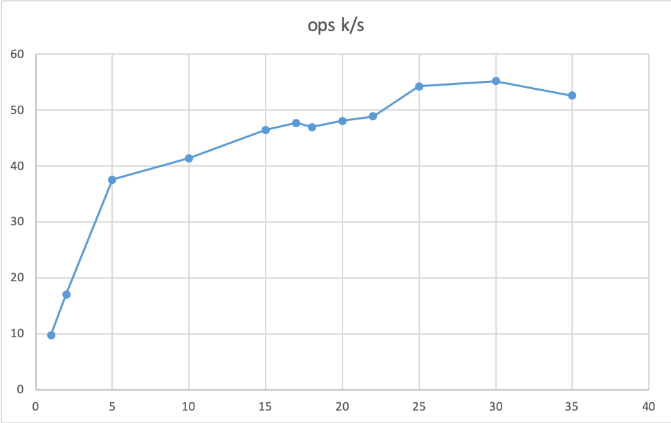
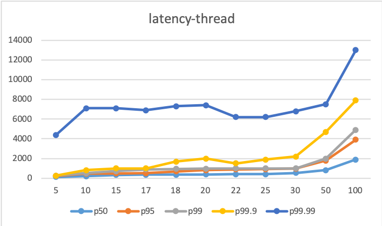
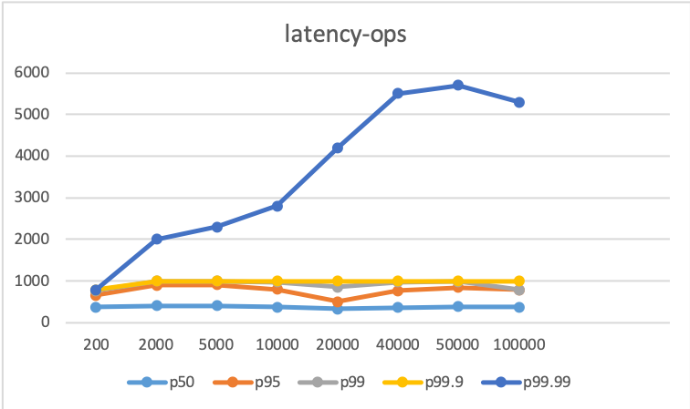

### 1 帮助


```sh
Git clone NuRaft && cd NuRaft
/bin/bash [prepare.sh](https://github.com/eBay/NuRaft/blob/master/prepare.sh)
install cmake 
mkdir build  && cd build && cmake ../  && make && cd test
```


- Parameters

```
$ ./raft_bench <server ID> <IP address:port> <benchmark duration in second> <input traffic (IOPS)> <number of threads> <payload size in byte> <server 2 IP address:port> <server 3 IP address:port> ...
```

- Run followers first

```
$ ./raft_bench 2 10.10.10.2:12345 3600
$ ./raft_bench 3 10.10.10.3:12345 3600
```

It will run follower 2 and 3 for an hour.

- Run leader

```
$ ./raft_bench 1 10.10.10.1:12345 30 100 2 256 10.10.10.2:12345 10.10.10.3:12345
```

It will

- Run the benchmark for 30 seconds.
- Target traffic: 100 requests/second.
- 2 client threads.
- Each payload size will be 256 bytes.

After each run, **all followers MUST BE killed and then re-launched**.


### 2 参数


3副本、96c、256G

```
size_t _duration = 30,
size_t _iops = 5,
size_t _num_threads = 1,
size_t _payload_size = 128
```

| 测试参数      | 含义             | 默认值  |
| ------------- | ---------------- | ------- |
| Duration      | 测试时间间隔     | 30s     |
| iops          | input traffic    | 5/s     |
| _num_threads  | 客户端请求线程数 | 1       |
| _payload_size | 客户端请求大小   | 128byte |


### 3 吞吐量 tps

transfer size : 2k

| Thread | ops k/s |
| ------ | ------- |
| 1      | 9.8     |
| 2      | 17.1    |
| 5      | 37.6    |
| 10     | 41.4    |
| 15     | 46.5    |
| 17     | 47.7    |
| 18     | 47      |
| 20     | 48.1    |
| 22     | 48.9    |
| 25     | 54.3    |
| 30     | 55.2    |
| 35     | 52.6    |




### 4 latency by thread. 

transfer size 2048bytes

ops <=100k	

| thread\latency | p50  | p95  | p99  | p99.9 | p99.99 |
| -------------- | ---- | ---- | ---- | ----- | ------ |
| 5              | 139  | 241  | 253  | 255   | 4400   |
| 10             | 215  | 463  | 503  | 827   | 7100   |
| 15             | 332  | 497  | 714  | 1000  | 7100   |
| 17             | 351  | 510  | 891  | 1000  | 6900   |
| 18             | 364  | 683  | 951  | 1700  | 7300   |
| 20             | 379  | 814  | 983  | 2000  | 7400   |
| 22             | 401  | 892  | 998  | 1500  | 6200   |
| 25             | 414  | 914  | 1000 | 1900  | 6200   |
| 30             | 541  | 967  | 1000 | 2200  | 6800   |
| 50             | 822  | 1800 | 2000 | 4700  | 7500   |
| 100            | 1900 | 3900 | 4900 | 7900  | 13000  |



线程太多不好


### 5  latency by ops

transfer ize: 1320bytes

Thread：21

| ops\latency | p50  | p95  | p99  | p99.9 | p99.99 |
| ----------- | ---- | ---- | ---- | ----- | ------ |
| 200         | 367  | 656  | 761  | 787   | 790    |
| 2000        | 399  | 895  | 999  | 1000  | 2000   |
| 5000        | 403  | 906  | 999  | 1000  | 2300   |
| 10000       | 367  | 794  | 974  | 1000  | 2800   |
| 20000       | 324  | 505  | 857  | 1000  | 4200   |
| 40000       | 362  | 760  | 968  | 1000  | 5500   |
| 50000       | 383  | 839  | 986  | 1000  | 5700   |
| 100000      | 373  | 783  | 783  | 1000  | 5300   |




### 6 conclusion

吞吐量 5w/s

latency: 随并发和吞吐量调整