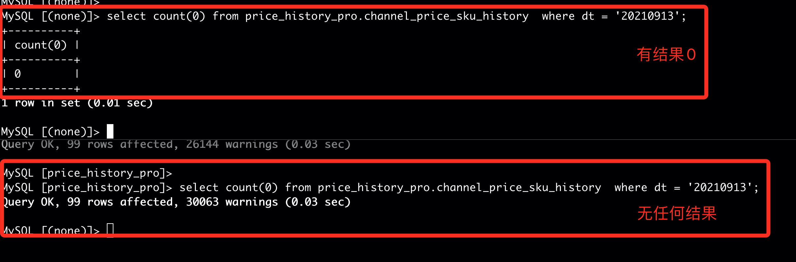

empty_result_for_aggregation_by_empty_set





# 1 本地表


## 1.1 table 总存储粒度统计

```
--create view meta.tables_info as
SELECT 
    database,
    table,
   formatReadableSize(size) AS size,
   formatReadableSize(bytes_on_disk) AS bytes_on_disk,
   formatReadableSize(data_uncompressed_bytes) AS data_uncompressed_bytes,
   formatReadableSize(data_compressed_bytes) AS data_compressed_bytes,
   compress_rate,
   rows,
   days,
   formatReadableSize(avgDaySize) AS avgDaySize
FROM 
(
    SELECT 
        database,
        table,
        sum(bytes) AS size,
        sum(rows) AS rows,
        min(min_date) AS min_date,
        max(max_date) AS max_date,
        sum(bytes_on_disk) AS bytes_on_disk,
        sum(data_uncompressed_bytes) AS data_uncompressed_bytes,
        sum(data_compressed_bytes) AS data_compressed_bytes,
       (data_compressed_bytes / data_uncompressed_bytes) * 100 AS compress_rate,
       max_date - min_date AS days,
       size / (max_date - min_date) AS avgDaySize
    FROM system.parts
    GROUP BY 
        database,
        table
)order by database,table;

```

## 1.2 table 在 磁盘存储 统计

```
SELECT 
    database,
    table,
   disk_name,
   formatReadableSize(size) AS size,
   formatReadableSize(bytes_on_disk) AS bytes_on_disk,
   formatReadableSize(data_uncompressed_bytes) AS data_uncompressed_bytes,
   formatReadableSize(data_compressed_bytes) AS data_compressed_bytes,
   compress_rate,
   rows,
   days,
   formatReadableSize(avgDaySize) AS avgDaySize
FROM 
(
    SELECT 
        database,
        table,
       disk_name,
        sum(bytes) AS size,
        sum(rows) AS rows,
        min(min_date) AS min_date,
        max(max_date) AS max_date,
        sum(bytes_on_disk) AS bytes_on_disk,
        sum(data_uncompressed_bytes) AS data_uncompressed_bytes,
        sum(data_compressed_bytes) AS data_compressed_bytes,
       (data_compressed_bytes / data_uncompressed_bytes) * 100 AS compress_rate,
       max_date - min_date AS days,
       size / (max_date - min_date) AS avgDaySize
    FROM system.parts
    GROUP BY 
        database,
        table,
       disk_name
)order by database,table;
```


## 1.3 partition 在磁盘占用情况

```
SELECT 
    database,
    table,
    partition,
   formatReadableSize(size) AS size,
   formatReadableSize(bytes_on_disk) AS bytes_on_disk,
   formatReadableSize(data_uncompressed_bytes) AS data_uncompressed_bytes,
   formatReadableSize(data_compressed_bytes) AS data_compressed_bytes,
   compress_rate,
   rows,
   days,
   formatReadableSize(avgDaySize) AS avgDaySize
FROM 
(
    SELECT 
        database,
        table,
        partition,
        sum(bytes) AS size,
        sum(rows) AS rows,
        min(min_date) AS min_date,
        max(max_date) AS max_date,
        sum(bytes_on_disk) AS bytes_on_disk,
        sum(data_uncompressed_bytes) AS data_uncompressed_bytes,
        sum(data_compressed_bytes) AS data_compressed_bytes,
       (data_compressed_bytes / data_uncompressed_bytes) * 100 AS compress_rate,
       max_date - min_date AS days,
       size / (max_date - min_date) AS avgDaySize
    FROM system.parts
    GROUP BY 
        database,
        table,
        partition
)
ORDER BY 
    database ASC,
    table ASC,
    partition ASC
```


# 2 集群汇总粒度

- 需求,创建分布式表

**ATTACH TABLE IF NOT EXISTS** system.parts_dis **ON CLUSTER** CLUSTERNAME **AS** system.parts

**ENGINE** = Distributed('CLUSTERNAME', 'system', 'parts', rand());

## 2.1 table 总存储粒度统计


```
--create view meta.tables_info as
SELECT 
    database,
    table,
   formatReadableSize(size) AS size,
   formatReadableSize(bytes_on_disk) AS bytes_on_disk,
   formatReadableSize(data_uncompressed_bytes) AS data_uncompressed_bytes,
   formatReadableSize(data_compressed_bytes) AS data_compressed_bytes,
   compress_rate,
   rows,
   days,
   formatReadableSize(avgDaySize) AS avgDaySize
FROM 
(
    SELECT 
        database,
        table,
        sum(bytes) AS size,
        sum(rows) AS rows,
        min(min_date) AS min_date,
        max(max_date) AS max_date,
        sum(bytes_on_disk) AS bytes_on_disk,
        sum(data_uncompressed_bytes) AS data_uncompressed_bytes,
        sum(data_compressed_bytes) AS data_compressed_bytes,
       (data_compressed_bytes / data_uncompressed_bytes) * 100 AS compress_rate,
       max_date - min_date AS days,
       size / (max_date - min_date) AS avgDaySize
    FROM system.parts_dis
    GROUP BY 
        database,
        table
)order by database,table;
```

## 2.2 table 在 磁盘存储 统计

```
SELECT 
    database,
    table,
   disk_name,
   formatReadableSize(size) AS size,
   formatReadableSize(bytes_on_disk) AS bytes_on_disk,
   formatReadableSize(data_uncompressed_bytes) AS data_uncompressed_bytes,
   formatReadableSize(data_compressed_bytes) AS data_compressed_bytes,
   compress_rate,
   rows,
   days,
   formatReadableSize(avgDaySize) AS avgDaySize
FROM 
(
    SELECT 
        database,
        table,
       disk_name,
        sum(bytes) AS size,
        sum(rows) AS rows,
        min(min_date) AS min_date,
        max(max_date) AS max_date,
        sum(bytes_on_disk) AS bytes_on_disk,
        sum(data_uncompressed_bytes) AS data_uncompressed_bytes,
        sum(data_compressed_bytes) AS data_compressed_bytes,
       (data_compressed_bytes / data_uncompressed_bytes) * 100 AS compress_rate,
       max_date - min_date AS days,
       size / (max_date - min_date) AS avgDaySize
    FROM system.parts_dis
    GROUP BY 
        database,
        table,
       disk_name
)order by database,table;
```

## 2.3 partition 在磁盘占用情况

```
SELECT 
    database,
    table,
    partition,
   formatReadableSize(size) AS size,
   formatReadableSize(bytes_on_disk) AS bytes_on_disk,
   formatReadableSize(data_uncompressed_bytes) AS data_uncompressed_bytes,
   formatReadableSize(data_compressed_bytes) AS data_compressed_bytes,
   compress_rate,
   rows,
   days,
   formatReadableSize(avgDaySize) AS avgDaySize
FROM 
(
    SELECT 
        database,
        table,
        partition,
        sum(bytes) AS size,
        sum(rows) AS rows,
        min(min_date) AS min_date,
        max(max_date) AS max_date,
        sum(bytes_on_disk) AS bytes_on_disk,
        sum(data_uncompressed_bytes) AS data_uncompressed_bytes,
        sum(data_compressed_bytes) AS data_compressed_bytes,
       (data_compressed_bytes / data_uncompressed_bytes) * 100 AS compress_rate,
       max_date - min_date AS days,
       size / (max_date - min_date) AS avgDaySize
    FROM system.parts_dis
    GROUP BY 
        database,
        table,
        partition
)
ORDER BY 
    database ASC,
    table ASC,
    partition ASC
```