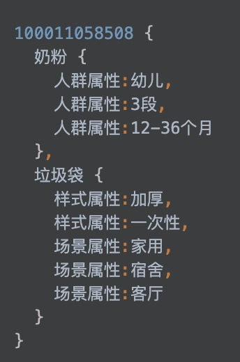

CREATE TABLE IF NOT EXISTS kg_lable
(
userId String,
gender_value String,
gender_confidence UInt32,
age_value String,
age_confidence UInt32，
jd_level_value String,
jd_level_confidence UInt32，
work_location_value String,
work_location_confidence UInt32，
home_location_value String,
home_location_confidence UInt32，

50
UserInterestLabel Nested(
    product String,   50 
    interest_level Double,
    labels Nested(
      id_type String,
      id String,
      interest_level Double
     ),
    last_access_timestamp UInt64
)

）
 product:苹果手机 
 interest_level: 级别 
  [（
    id_type:颜色偏好
    id: 红色
    兴趣：20
  ）(
    id_type:颜色
    型号偏好：12
  )
  ]

  

 购买力
UserPurchasingPower Nested(
     cid3 UInt32，50
     mu float,
     sigma float,
     mean_price float,
     sum_of_squares float
),

 爱好
Likelihood Nested(
    id_type String, 
    id String,
    likelihood Double
),

促销敏感度
PromotionSensitivity Nested(
    cid3 UInt32，
    sensitivity Double
),
last_update_timestamp UInt64,
start_timestamp UInt64
)

CREATE TABLE queries2
(
    Period Date,
    QueryID UInt32,
    Fingerprint String,
    Errors Nested
    (
        ErrorCode String,
        ErrorCnt UInt32,
        Errorsarray Array(String)
    )
)Engine=MergeTree(Period,QueryID,8192);

strings Array(String)

CREATE TABLE queries2
(
    `Period` Date,
    `QueryID` UInt32,
    `Fingerprint` String,
    `Errors` Nested(ErrorCode String, ErrorCnt UInt32, Errorsarray Array(String))
)
ENGINE = MergeTree(Period, QueryID, 8192)

┌─name───────────────┬─type─────────────────┬─default_type─┬─default_expression─┬─comment─┬─codec_expression─┬─ttl_expression─┐
│ Period             │ Date                 │              │                    │         │                  │                │
│ QueryID            │ UInt32               │              │                    │         │                  │                │
│ Fingerprint        │ String               │              │                    │         │                  │                │
│ Errors.ErrorCode   │ Array(String)        │              │                    │         │                  │                │
│ Errors.ErrorCnt    │ Array(UInt32)        │              │                    │         │                  │                │
│ Errors.Errorsarray │ Array(Array(String)) │              │                    │         │                  │                │
└────────────────────┴──────────────────────┴──────────────┴────────────────────┴─────────┴──────────────────┴────────────────┘

INSERT INTO queries2 VALUES ('2017-08-17',5,'SELECT foo FROM bar WHERE id=?',['1220','1230','1212'],[5,6,2],[['1','2','3'],['10','11','12'],['7','8','9']]);

┌─────Period─┬─QueryID─┬─Fingerprint────────────────────┬─Errors.ErrorCode───────┬─Errors.ErrorCnt─┬─Errors.Errorsarray─────────────────────────────┐
│ 2017-08-17 │       5 │ SELECT foo FROM bar WHERE id=? │ ['1220','1230','1212'] │ [5,6,2]         │ [['1','2','3'],['10','11','12'],['7','8','9']] │
└────────────┴─────────┴────────────────────────────────┴────────────────────────┴─────────────────┴────────────────────────────────────────────────┘

SELECT *
FROM queries2
ARRAY JOIN Errors.Errorsarray
┌─────Period─┬─QueryID─┬─Fingerprint────────────────────┬─Errors.ErrorCode───────┬─Errors.ErrorCnt─┬─Errors.Errorsarray─┐
│ 2017-08-17 │       5 │ SELECT foo FROM bar WHERE id=? │ ['1220','1230','1212'] │ [5,6,2]         │ ['1','2','3']      │
│ 2017-08-17 │       5 │ SELECT foo FROM bar WHERE id=? │ ['1220','1230','1212'] │ [5,6,2]         │ ['10','11','12']   │
│ 2017-08-17 │       5 │ SELECT foo FROM bar WHERE id=? │ ['1220','1230','1212'] │ [5,6,2]         │ ['7','8','9']      │
└────────────┴─────────┴────────────────────────────────┴────────────────────────┴─────────────────┴────────────────────┘

CREATE TABLE IF NOT EXISTS kg.table_test_local 
(
EventDate DateTime,
CounterID UInt32,
UserID UInt32
) ENGINE = ReplicatedMergeTree(‘/clickhouse/KC0_CK_TS_01/jdob_ha/kg/table_test_local/{shard}’, ‘{replica}’)
PARTITION BY toYYYYMMDD(EventDate)
ORDER BY (CounterID, EventDate, intHash32(UserID))
SAMPLE BY intHash32(UserID)
SETTINGS storage_policy = ‘jdob_ha’;

