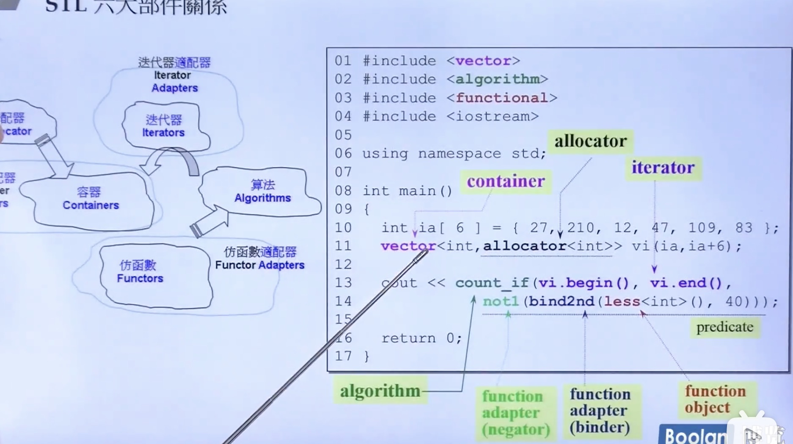

c++ standard library

c++ stl: standard template library

课件和源代码：https://wws.lanzous.com/iLDTYlv87qd 

特地建了个仓库更新维护：https://github.com/19PDP/Bilibili-plus

| 六大组件   | 功能 作用                                        |
| ---------- | ------------------------------------------------ |
| contianer  | 放东西 占用内存 帮我们管理内存                   |
| allocator  | 分配器 管理 container                            |
| Algorithms | 模版函  操作容器                                 |
| iterator   | 范化的指针. Algorithms 操作 container 的桥梁     |
| Functors   | 仿函数                                           |
| Adapter    | 变压器/适配器  转换(container functors iterator) |

