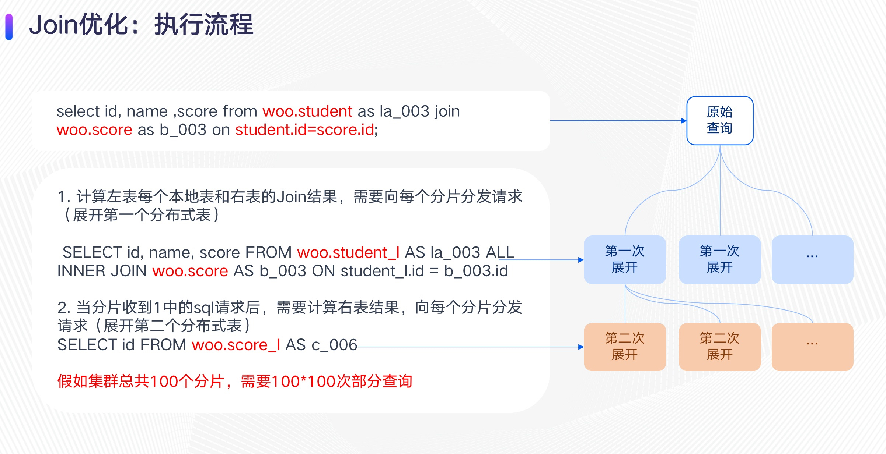
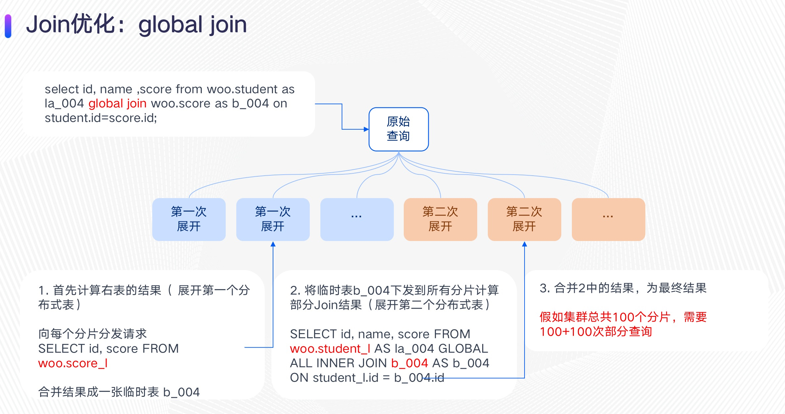
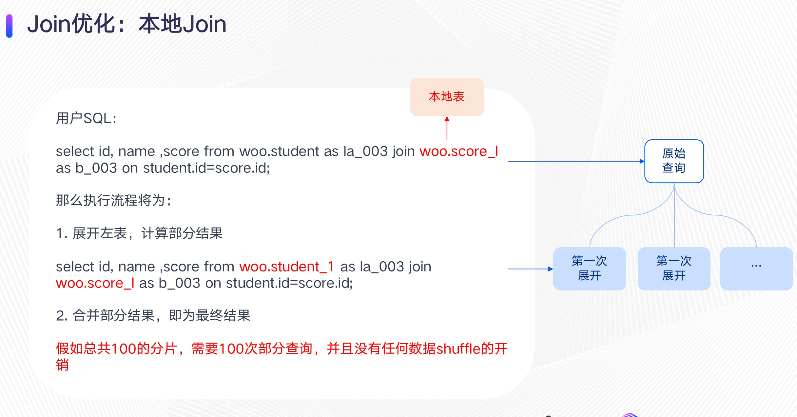

ClickHouse在处理对分布式表的查询时，会将查询拆分成对本地表的查询，这里称之为“部分查询”，然后在第一个接收到查询的节点将部分查询结果进行合并

那么对于向Join和In(包含子查询)这样的包含多个分布式表的查询，ClickHouse如何处理呢？

PS：woo.student woo.score为分布式表，以“_l”结尾的表为本地表

## 1. Join执行流程

> select id, name ,score from woo.student as la_003 join woo.score as b_003 on [student.id](http://student.id/)=[score.id](http://score.id/);

\1. 向每个分片分发请求，以计算左表每个本地表的Join结果（展开第一个分布式表）

>  SELECT id, name, score FROM woo.student_l AS la_003 ALL INNER JOIN woo.score AS b_003 ON [student_l.id](http://student_l.id/) = [b_003.id](http://b_003.id/)

\2. 当分片收到1中的sql请求后，需要计算右表结果，所以向每个分片分发请求（展开第二个分布式表）

> SELECT id FROM woo.student_l AS c_006

假如集群总共100的分片，需要100*100次部分查询

## 2. Global Join执行流程

> select id, name ,score from woo.student as la_004 global join woo.score as b_004 on [student.id](http://student.id/)=[score.id](http://score.id/);

\1. 首先计算右表的结果（ 展开第一个分布式表）

向每个分片分发请求

> SELECT id, score FROM woo.score_l

合并结果成一张临时表 b_004

\2. 将临时表b_004下发到所有分片计算部分Join结果（展开第二个分布式表）

> SELECT id, name, score FROM woo.student_l AS la_004 GLOBAL ALL INNER JOIN b_004 AS b_004 ON [student_l.id](http://student_l.id/) = [b_004.id](http://b_004.id/)

\3. 合并2中的结果，为最终结果

假如总共100的分片，需要2 * 100次部分查询

## 3. colocate Join

假设woo.student和woo.score 两个表严格按照id字段将数据hash散列到不同的节点上，那么Join可以采用一种非常高效的方式，colocate Join（本地Join），sql中将右表直接用本地表代替，具体如下：

> select id, name ,score from woo.student as la_003 join woo.score_l as b_003 on [student.id](http://student.id/)=[score.id](http://score.id/);

那么执行流程将为：

\1. 展开左表，计算部分结果

> select id, name ,score from woo.student_1 as la_003 join woo.score_l as b_003 on [student.id](http://student.id/)=[score.id](http://score.id/);

\2. 合并部分结果，即为最终结果

## 6. 小结

对于用户：

1. 对于in与join查询会进行指数级的部分查询分发，所以建议使用global in和global join。
2. 对于Join来说会优先计算右表，右表数据合并后有一个完全的数据集，所以查询建议将小标放到右边。
3. 对于需要Join两个大表的情况，可以通过导入数据时将两个表按照Join条件中的列散列数据，然后通过5中的sql来触发colocate join机制

其它：

ClickHouse因为两层的查询执行引擎，导致没有完整distributed_join机制，所以Join大表性能低下。