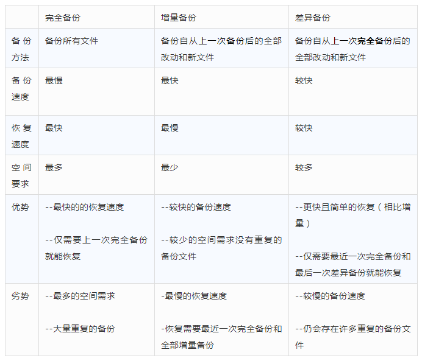
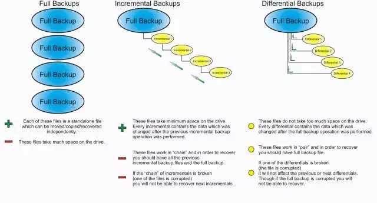
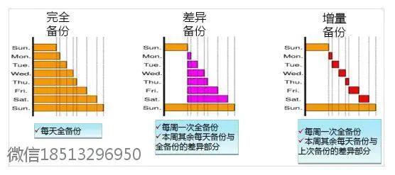
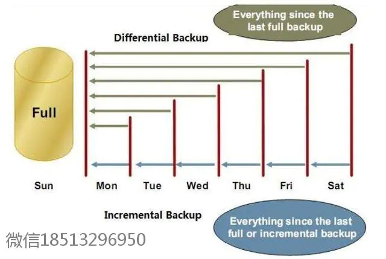
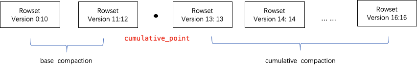

# 完全备份、增量备份、差异备份

一图总结完全、增量与差异备份：

还有疑问？下面这篇文章帮你彻底理清。

*作者/Dell EMC研发人员 Roger W.* 

## **完全备份（Full Backup）**

完全备份即对系统进行完全备份，包括系统和数据。如果两个时间点备份之间，数据没有任何更动，那么所有备份数据都是一样的，备份系统不会检查自上次备份后，档案有没有被更动过，它只是机械性地将每个档案读出、写入，不管档案有没有被修改过。备份全部选中的文件及文件夹，并不依赖文件的存盘属性来确定备份哪些文件。在备份过程中，任何现有的标记都被清除，每个文件都被标记为已备份，换言之，清除存盘属性。

对于完全备份，相信大家都比较好理解，接下来说的是**“增量备份”**和**“差异备份”**，这两个概念可能很多人会混淆。的确，增量备份和差异备份确实有相似的地方，但仍有不同。

## **增量备份（Incremental Backup）**

前面我们说完全备份不管档案有没有被修改过，只是机械性地备份全部文件和文件夹。这听起来实现了备份最大化，但绝对不是个好办法。如果一个企业每天变动的档案只有10MB，每晚却要花费100GB的存储空间做备份，相信这个企业很快就会因无法承受存储费用而倒闭。这就是我们不会一味采取完全备份的原因，也是推出增量备份的主要原因。

跟完全备份不同，**增量备份在做数据备份前会先判断，档案的最后修改时间是否比上次备份的时间来得晚。如果不是，那表示自上次备份后，这档案并没有被更动过，所以这次不需要备份。**

使用增量备份最大的好处在于备份速度：它的速度比完全备份快上许多，同时由于增量备份在做备份前会自动判断备份时间点及文件是否已作改动，所以相对于完全备份其对于**节省存储空间也大有益处**。**增量备份的不足之处在于数据还原的时间较长，效率相对较低**。例如，如果你要还原一个备份档案，你必须把所有增量备份的磁盘都找一遍，直到找到为止，如果您要复原整个档案系统，那就得先复原最近一次的完整备份，然后复原一个又一个的增量备份。

要避免复原一个又一个的递增数据，提升数据的复原的效率，把做法稍微改变一下，就变成了差异备份。

举例来说，在星期一，网络管理员按惯例进行系统完全备份；在星期二，假设系统内只多了一个资产清单，于是管理员只需将这份资产清单一并备份下来即可；在星期三，系统内又多了一份产品目录，于是管理员不仅要将这份目录，还要连同星期二的那份资产清单一并备份下来。如果在星期四系统内有多了一张工资表，那么星期四需要备份的内容就是：工资表+产品目录+资产清单。

差异备份在避免了另外两种备份策略缺陷的同时，又具备了它们各自的优点。首先，它具有了增量备份需要时间短、节省磁盘空间的优势；其次，它又具有了全备份恢复所需磁带少、恢复时间短的特点。系统管理员只需要两盘磁带，即全备份磁带与灾难发生前一天的差异备份磁带，就可以将系统恢复。

举例来说，如果系统在星期四的早晨发生故障，丢失大批数据，那么现在就需要将系统恢复到星期三晚上的状态。这时管理员需要首先找出星期一的那盘完全备份磁带进行系统恢复，然后再找出星期二的磁带来恢复星期二的数据，然后在找出星期三的磁带来恢复星期三的数据。很明显这比第一种策略要麻烦得多。另外这种备份可靠性也差。在这种备份下，各磁带间的关系就象链子一样，一环套一环，其中任何一盘磁带出了问题都会导致整条链子脱节。

这种备份方式最显著的优点就是：没有重复的备份数据，因此备份的数据量不大，备份所需的时间很短。但增量备份的数据恢复是比较麻烦的。您必须具有上一次全备份和所有增量备份磁带（一旦丢失或损坏其中的一盘磁带，就会造成恢复的失败），并且它们必须沿着从全备份到依次增量备份的时间顺序逐个反推恢复，因此这就极大地延长了恢复时间。 

## 差异备份（Differential Backup）

差异备份与增量备份一样，都只备份变动过的数据。但差异备份是累积的—— 一个档案只要自上次完整备份后，曾被更新过，那么接下来每次做差异备份时，这个档案都会被备份。这表示**差异备份中的档案，都是自上次完全备份之后，曾被改变的档案。如果要复原整个系统，那么您只要先复原完全备份，再复原最后一次的差异备份即可。增量备份是针对于上一次备份（无论是哪种备份）：备份上一次备份后，所有发生变化的文件。**

所以，差异备份的大小，会随着时间过去而不断增加（假设在完全备份间，每天修改的档案都不一样）。以备份空间与速度来说，差异备份介于增量备份与完全备份之间；但不管是复原一个档案或是整个系统，速度通常比完全备份、增量备份快（因为要搜寻/复原的磁盘数目比较少）。

基于这些特点，差异备份是值得考虑的方案，增量备份与差异备份技术也是目前所有企业级备份软件的必备功能。

## 备份组合实例

- **完全备份与差异备份**

以每周数据备份计划为例，我们可以在星期一进行完全备份，在星期二至星期五进行差异备份。如果在星期五数据被破坏了，则只需要还原星期一完全的备份和星期四的差异备份。`这种策略备份数据需要较多的时间，但还原数据使用较少的时间`。

- **完全备份与增量备份**

还是以每周数据备份为例，在星期一进行完全备份，在星期二至星期五进行增量备份。如果在星期五数据被破坏了，则需要还原星期一正常的备份和从星期二至星期五的所有增量备份。`这种策略备份数据需要较少的时间，但还原数据使用较长的时`·。

## Eg: 完全备份+增量备份

zookeeper 回复

完全备份+增量备份 完全备份和增量备份 次数是 1:1 的，即一次全量备份完成即进行一次增量备份 保证数据数据的完整性

- eg：zookeerper. 存储文件如下

alldata1.data

Incremental.data

alldata2.data

incremental2.data

这里alldata即为 数据文件、incremental 为事务文件 全量即为二者循环相加的结果

- 全量数据计算，恢复过程

最终的数据为： alldata2.data + incremental2.data

也因为：alldata2.data=allldata1.data+incremental1data

也等于： alldata1.data+incretmental1.data+incretmental2.data

## Eg: 增量备份 vs 差异备份

Doris 压缩 [学习链接](https://github.com/songenjie/daily_notes/blob/master/2021/3%E6%9C%88/doris_3%E6%9F%A5%E8%AF%A2%EF%BC%8C%E5%8E%8B%E7%BC%A9.md#3compaction%E6%B5%81%E7%A8%8B)

Cumulative compassion: 实现增量备份的差异备份 ；将多次的增量数据合并

base compaction :实现全量备份的增量备份；将上次的全量数据和后面的增量数据进行合并

