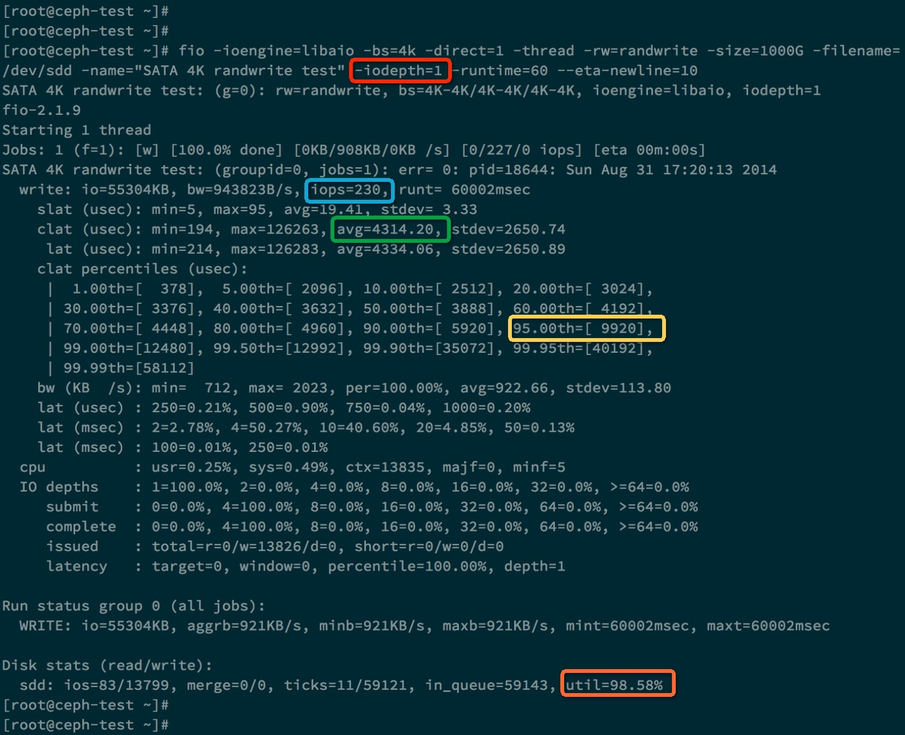
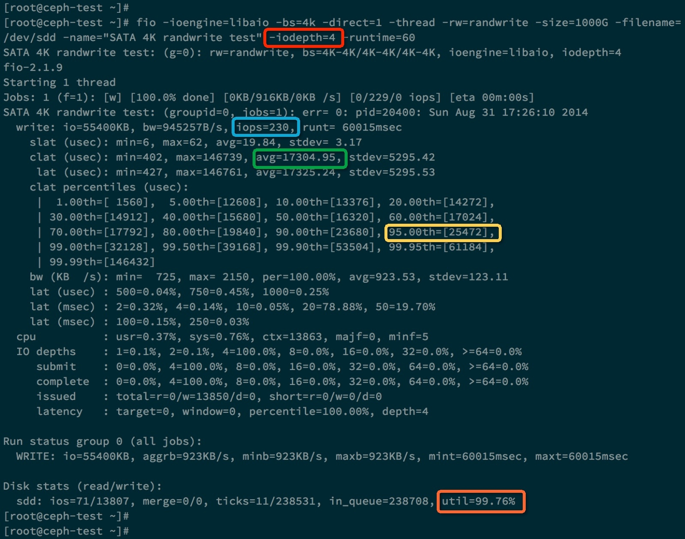
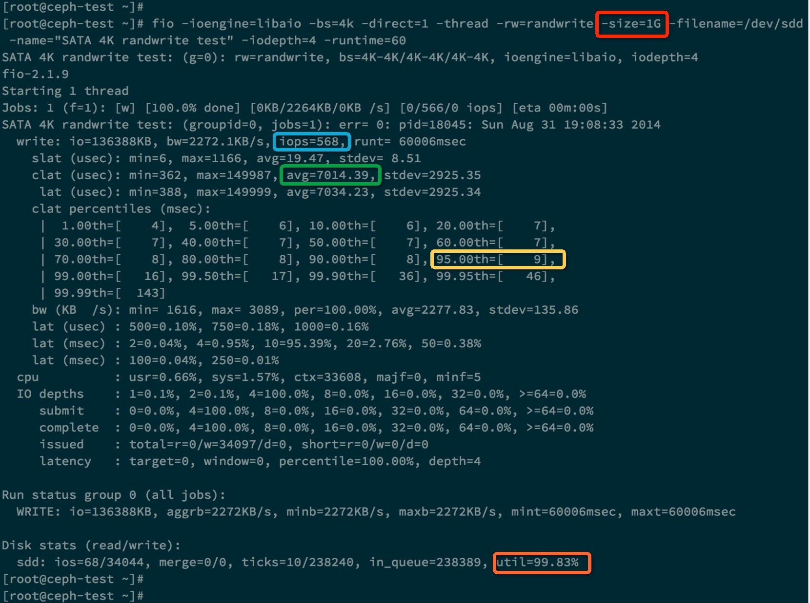
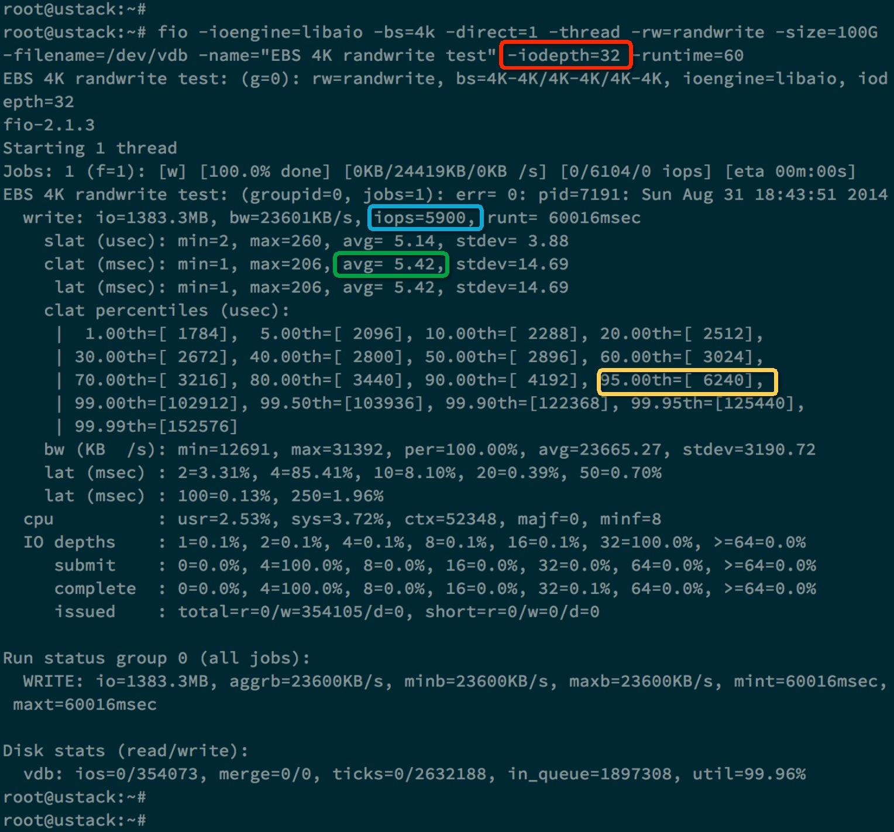
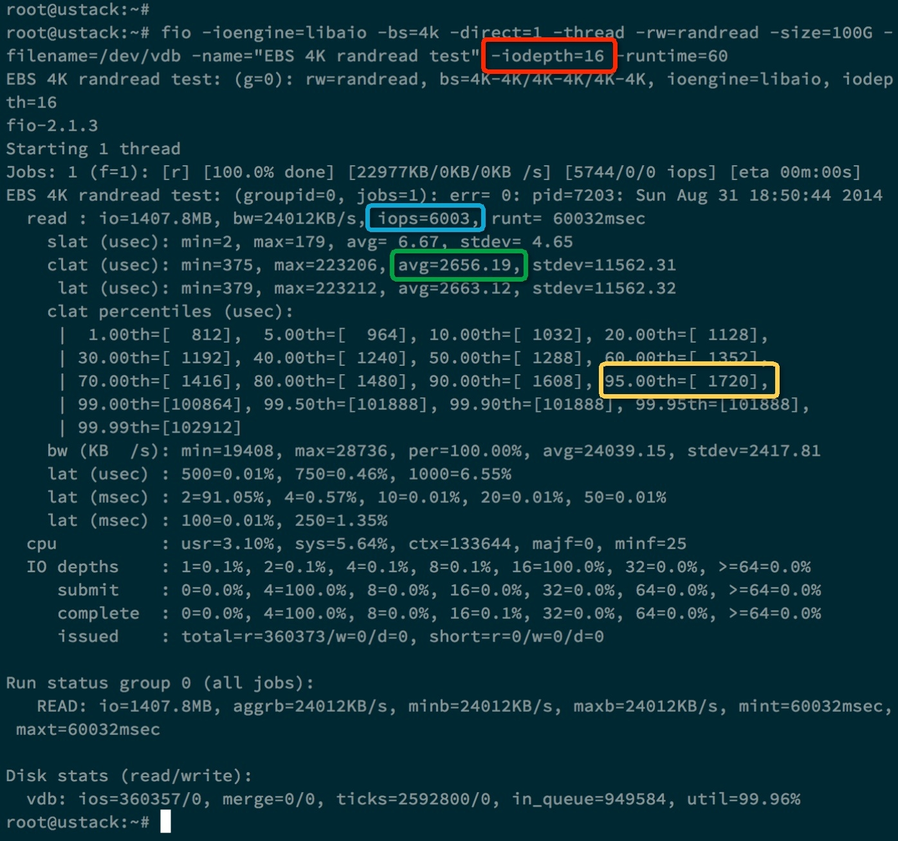
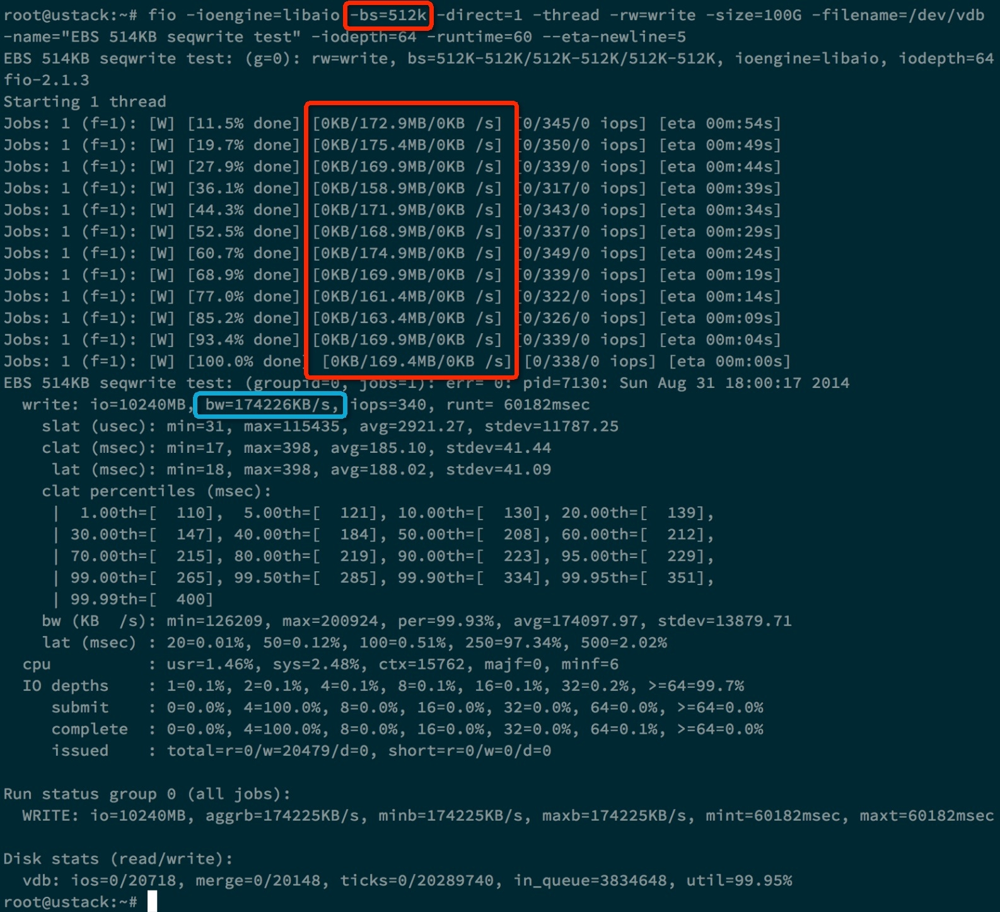

**一、概念介绍：**


120M/s

100000k/s


磁盘性能指标--IOPS
\----------------------------------------------------------
    IOPS (Input/Output Per Second)即每秒的输入输出量(或读写次数)，是衡量磁盘性能的主要指标之一。IOPS是指单位时间内系统能处理的I/O请求数量，一般以每秒处理的I/O请求数量为单位，I/O请求通常为读或写数据操作请求。

  随机读写频繁的应用，如小文件存储(图片)、OLTP数据库、邮件服务器，关注随机读写性能，IOPS是关键衡量指标。
  顺序读写频繁的应用，传输大量连续数据，如电视台的视频编辑，视频点播VOD(Video On Demand)，关注连续读写性能。数据吞吐量是关键衡量指标。

IOPS和数据吞吐量适用于不同的场合：
读取10000个1KB文件，用时10秒 Throught(吞吐量)=1MB/s ，IOPS=1000 追求IOPS
读取1个10MB文件，用时0.2秒 Throught(吞吐量)=50MB/s, IOPS=5 追求吞吐量

磁盘服务时间
\--------------------------------------
传统磁盘本质上一种机械装置，如FC, SAS, SATA磁盘，转速通常为5400/7200/10K/15K rpm不等。影响磁盘的关键因素是磁盘服务时间，即磁盘完成一个I/O请求所花费的时间，它由寻道时间、旋转延迟和数据传输时间三部分构成。

**寻道时间** Tseek是指将读写磁头移动至正确的磁道上所需要的时间。寻道时间越短，I/O操作越快，目前磁盘的平均寻道时间一般在3－15ms。
**旋转延迟** Trotation是指盘片旋转将请求数据所在扇区移至读写磁头下方所需要的时间。旋转延迟取决于磁盘转速，通常使用磁盘旋转一周所需时间的1/2表示。比如，7200 rpm的磁盘平均旋转延迟大约为60*1000/7200/2 = 4.17ms，而转速为15000 rpm的磁盘其平均旋转延迟为2ms。
**数据传输时间** Ttransfer是指完成传输所请求的数据所需要的时间，它取决于数据传输率，其值等于数据大小除以数据传输率。目前IDE/ATA能达到133MB/s，SATA II可达到300MB/s的接口数据传输率，数据传输时间通常远小于前两部分消耗时间。简单计算时可忽略。

 

**常见磁盘平均物理寻道时间为：**
7200转/分的STAT硬盘平均物理寻道时间是9ms
10000转/分的STAT硬盘平均物理寻道时间是6ms
15000转/分的SAS硬盘平均物理寻道时间是4ms

 

常见硬盘的旋转延迟时间为：

7200 rpm的磁盘平均旋转延迟大约为60*1000/7200/2 = 4.17ms

10000 rpm的磁盘平均旋转延迟大约为60*1000/10000/2 = 3ms，

15000 rpm的磁盘其平均旋转延迟约为60*1000/15000/2 = 2ms。


最大IOPS的理论计算方法
\--------------------------------------
IOPS = 1000 ms/ (寻道时间 + 旋转延迟)。可以忽略数据传输时间。

7200 rpm的磁盘IOPS = 1000 / (9 + 4.17) = 76 IOPS
10000 rpm的磁盘IOPS = 1000 / (6+ 3) = 111 IOPS
15000 rpm的磁盘IOPS = 1000 / (4 + 2) = 166 IOPS


影响测试的因素
\-----------------------------------------
实际测量中，IOPS数值会受到很多因素的影响，包括I/O负载特征(读写比例，顺序和随机，工作线程数，队列深度，数据记录大小)、系统配置、操作系统、磁盘驱动等等。因此对比测量磁盘IOPS时，必须在同样的测试基准下进行，即便如此也会产生一定的随机不确定性。


队列深度说明 
NCQ、SCSI TCQ、PATA TCQ和SATA TCQ技术解析 
\----------------------------------------
  是一种命令排序技术，一把喂给设备更多的IO请求，让电梯算法和设备有机会来安排合并以及内部并行处理，提高总体效率。
SCSI TCQ的队列深度支持256级
ATA TCQ的队列深度支持32级 （需要8M以上的缓存）
NCQ最高可以支持命令深度级数为32级，NCQ可以最多对32个命令指令进行排序。
  大多数的软件都是属于同步I/O软件，也就是说程序的一次I/O要等到上次I/O操作的完成后才进行，这样在硬盘中同时可能仅只有一个命令，也是无法发挥这个技术的优势，这时队列深度为1。
  随着Intel的超线程技术的普及和应用环境的多任务化，以及异步I/O软件的大量涌现。这项技术可以被应用到了，实际队列深度的增加代表着性能的提高。
在测试时，队列深度为1是主要指标，大多数时候都参考1就可以。实际运行时队列深度也一般不会超过4.


IOPS可细分为如下几个指标：
\-----------------------------------------
数据量为n字节，队列深度为k时，随机读取的IOPS
数据量为n字节，队列深度为k时，随机写入的IOPS


**二、举例测试：**

UOS公有云开放以来，一些用户反应用dd命令测试出来的1TB云硬盘的吞吐率(MBPS)只有128MB/s，而不是我们SLA保证的170MB /s ，这是为什么？下面我会简单介绍如何测试硬盘，RAID，SAN，SSD，云硬盘等，然后再来回答上面的问题。

# 测试前提

我们在进行测试时，都会分清楚:

- 测试对象：要区分硬盘、SSD、RAID、SAN、云硬盘等，因为它们有不同的特点
- 测试指标：IOPS和MBPS(吞吐率)，下面会具体阐述
- 测试工具：Linux下常用Fio、dd工具, Windows下常用IOMeter,
- 测试参数: IO大小，寻址空间，队列深度，读写模式，随机/顺序模式
- 测试方法：也就是测试步骤。

测试是为了对比，所以需要**定性和定量**。在宣布自己的测试结果时，需要说明这次测试的工具、参数、方法，以便于比较。


**测试工具 fio:**

## **顺序读**

测试命令:fio -name iops -rw=read -bs=4k -runtime=60 -iodepth 32 -filename /dev/sda6 -ioengine libaio -direct=1

```
SATA
Jobs: 1 (f=1): [R] [16.4% done] [124.1M/0K /s] [31.3K/0  iops] [eta 00m:51s]
SAS
Jobs: 1 (f=1): [R] [16.4% done] [190M/0K /s] [41.3K/0  iops] [eta 00m:51s]
SSD
Jobs: 1 (f=1): [R] [100.0% done] [404M/0K /s] [103K /0  iops] [eta 00m:00s]
```

可以看到 在对4KB数据包进行连续读的情况下:

SSD其速度可以达到404MB/S，IOPS达到103K/S

SAS其速度可以达到190MB/S，IOPS达到41K/S

SATA其速度可以达到124MB/S，IOPS达到31K/S

顺序读，SAS总体表现是SATA硬盘的1.3倍，SSD总体表现是sata硬盘的4倍。

 

## **随机读**

测试命令 fio -name iops -rw=randread -bs=4k -runtime=60 -iodepth 32 -filename /dev/sda6 -ioengine libaio -direct=1

```
SATA
Jobs: 1 (f=1): [r] [41.0% done] [466K/0K /s] [114 /0  iops] [eta 00m:36s]
SAS
Jobs: 1 (f=1): [r] [41.0% done] [1784K/0K /s] [456 /0  iops] [eta 00m:36s]
SSD
Jobs: 1 (f=1): [R] [100.0% done] [505M/0K /s] [129K /0  iops] [eta 00m:00s]
```

随机读，SAS总体表现是SATA硬盘的4倍，SSD总体表现是sata硬盘的一千多倍。

 

## **顺序写**

测试命令:fio -name iops -rw=write -bs=4k -runtime=60 -iodepth 32 -filename /dev/sda6 -ioengine libaio -direct=1

```
SATA
Jobs: 1 (f=1): [W] [21.3% done] [0K/124.9M /s] [0 /31.3K iops] [eta 00m:48s]
SAS
Jobs: 1 (f=1): [W] [21.3% done] [0K/190M /s] [0 /36.3K iops] [eta 00m:48s]
SSD
Jobs: 1 (f=1): [W] [100.0% done] [0K/592M /s] [0 /152K  iops] [eta 00m:00s]
```

同样的4KB数据包顺序写的情况下，SSD卡的成绩为592MB/S，IOPS为152K。而本地硬盘仅为118MB/S，IOPS仅为30290。

 

## **随机写**

测试命令: fio -name iops -rw=randwrite -bs=4k -runtime=60 -iodepth 32 -filename /dev/sda6 -ioengine libaio -direct=1

```
SATA
Jobs: 1 (f=1): [w] [100.0% done] [0K/548K /s] [0 /134  iops] [eta 00m:00s]
SAS
Jobs: 1 (f=1): [w] [100.0% done] [0K/2000K /s] [0 /512  iops] [eta 00m:00s]
SSD
Jobs: 1 (f=1): [W] [100.0% done] [0K/549M /s] [0 /140K  iops] [eta 00m:00s]
```

在接下来的4KB数据包随机写操作中，SSD卡再次展示了其高超的IO性能，高达549MB/S的随机写速率，IOPS高达140K。相比之下，本地硬盘的随机读写仅为548KB/S，IOPS为134。


# 存储系统模型

为了更好的测试，我们需要先了解存储系统，块存储系统本质是一个排队模型，我们可以拿银行作为比喻。还记得你去银行办事时的流程吗？

1. 去前台取单号
2. 等待排在你之前的人办完业务
3. 轮到你去某个柜台
4. 柜台职员帮你办完手续1
5. 柜台职员帮你办完手续2
6. 柜台职员帮你办完手续3
7. 办完业务，从柜台离开

如何评估银行的效率呢：

- 服务时间 = 手续1 + 手续2 + 手续3
- 响应时间 = 服务时间 + 等待时间
- 性能 = 单位时间内处理业务数量

那银行如何提高效率呢:

- 增加柜台数
- 降低服务时间

因此，排队系统或存储系统的优化方法是

- 增加并行度
- 降低服务时间

# 硬盘测试

## 硬盘原理

我们应该如何测试SATA/SAS硬盘呢？

每个硬盘都有一个磁头(相当于银行的柜台)，硬盘的工作方式是：

1. 收到IO请求，得到地址和数据大小
2. 移动磁头(寻址)
3. 找到相应的磁道(寻址)
4. 读取数据
5. 传输数据

则磁盘的随机IO服务时间:

**服务时间 = 寻道时间 + 旋转时间 + 传输时间**

对于10000转速的SATA硬盘来说，一般寻道时间是7 ms，旋转时间是3 ms, 64KB的传输时间是 0.8 ms， 则SATA硬盘每秒可以进行随机IO操作是 1000/(7 + 3 + 0.8) = 93，所以我们估算SATA硬盘64KB随机写的IOPS是93。一般的硬盘厂商都会标明顺序读写的MBPS。

我们在列出IOPS时，需要说明IO大小，寻址空间，读写模式，顺序/随机，队列深度。我们一般常用的IO大小是4KB，这是因为文件系统常用的块大小是4KB。

## 使用dd测试硬盘

虽然硬盘的性能是可以估算出来的，但是怎么才能让应用获得这些性能呢？对于测试工具来说，就是如何得到IOPS和MBPS峰值。我们先用dd测试一下SATA硬盘的MBPS(吞吐量)。

```
#dd if=/dev/zero of=/dev/sdd bs=4k count=300000 oflag=direct
记录了300000+0 的读入 记录了300000+0 的写出 1228800000字节(1.2 GB)已复制，17.958 秒，68.4 MB/秒
#iostat -x sdd 5 10
...
Device: rrqm/s wrqm/s r/s w/s rsec/s wsec/s avgrq-sz avgqu-sz await svctm %util
sdd 0.00 0.00 0.00 16794.80 0.00 134358.40 8.00 0.79 0.05 0.05 78.82...
```

为什么这块硬盘的MBPS只有68MB/s? 这是因为磁盘利用率是78%，没有到达95%以上，还有部分时间是空闲的。当dd在前一个IO响应之后，在准备发起下一个IO时，SATA硬盘是空闲的。那么如何才能提高利用率，让磁盘不空闲呢？只有一个办法，那就是增加硬盘的队列深度。相对于CPU来说，硬盘属于慢速设备，所有操作系统会有给每个硬盘分配一个专门的队列用于缓冲IO请求。

## 队列深度

什么是磁盘的队列深度？

> **在某个时刻,有N个inflight的IO请求,包括在队列中的IO请求、磁盘正在处理的IO请求。N就是队列深度。**

加大硬盘队列深度就是让硬盘不断工作，减少硬盘的空闲时间。

> **加大队列深度 -> 提高利用率 -> 获得IOPS和MBPS峰值 -> 注意响应时间在可接受的范围内**

增加队列深度的办法有很多

- 使用异步IO，同时发起多个IO请求，相当于队列中有多个IO请求
- 多线程发起同步IO请求，相当于队列中有多个IO请求
- 增大应用IO大小，到达底层之后，会变成多个IO请求，相当于队列中有多个IO请求 队列深度增加了。

队列深度增加了，IO在队列的等待时间也会增加，导致IO响应时间变大，这需要权衡。让我们通过增加IO大小来增加dd的队列深度，看有没有效果：

```
dd if=/dev/zero of=/dev/sdd bs=2M count=1000 oflag=direct
记录了1000+0 的读入 记录了1000+0 的写出 2097152000字节(2.1 GB)已复制，10.6663 秒，197 MB/秒
Device: rrqm/s wrqm/s r/s w/s rsec/s wsec/s avgrq-sz avgqu-sz await svctm %util
sdd 0.00 0.00 0.00 380.60 0.00 389734.40 1024.00 2.39 6.28 2.56 97.42
```

可以看到2MB的IO到达底层之后，会变成多个512KB的IO，平均队列长度为2.39，这个硬盘的利用率是97%，MBPS达到了197MB/s。(为什么会变成512KB的IO，你可以去使用Google去查一下内核参数 max_sectors_kb的意义和使用方法 )

  **也就是说增加队列深度，是可以测试出硬盘的峰值的。**

## 使用fio测试硬盘

现在，我们来测试下SATA硬盘的4KB随机写的IOPS。因为我的环境是Linux，所以我使用FIO来测试。

```
$fio -ioengine=libaio -bs=4k -direct=1 -thread -rw=randwrite -size=1000G -filename=/dev/vdb 
-name="EBS 4K randwrite test" -iodepth=64 -runtime=60
```

简单介绍fio的参数

- ioengine: 负载引擎，我们一般使用libaio，发起异步IO请求。
- bs: IO大小
- direct: 直写，绕过操作系统Cache。因为我们测试的是硬盘，而不是操作系统的Cache，所以设置为1。
- rw: 读写模式，有顺序写write、顺序读read、随机写randwrite、随机读randread等。
- size: 寻址空间，IO会落在 [0, size)这个区间的硬盘空间上。这是一个可以影响IOPS的参数。一般设置为硬盘的大小。
- filename: 测试对象
- iodepth: 队列深度，只有使用libaio时才有意义。这是一个可以影响IOPS的参数。
- runtime: 测试时长

下面我们做两次测试，分别 iodepth = 1和iodepth = 4的情况。下面是iodepth = 1的测试结果。

[](https://s3.51cto.com/wyfs02/M02/75/94/wKioL1Y8tyOQ_VT0AAwb2pYQdVM197.jpg)


上图中蓝色方框里面的是测出的IOPS 230, 绿色方框里面是每个IO请求的平均响应时间，大约是4.3ms。***方框表示95%的IO请求的响应时间是小于等于 9.920 ms。橙色方框表示该硬盘的利用率已经达到了98.58%。

下面是 iodepth = 4 的测试:

[](https://s3.51cto.com/wyfs02/M00/75/96/wKiom1Y8tuLSQKm3AAtLnv7AfHU575.jpg)

我们发现这次测试的IOPS没有提高，反而IO平均响应时间变大了，是17ms。

为什么这里提高队列深度没有作用呢，原因当队列深度为1时，硬盘的利用率已经达到了98%，说明硬盘已经没有多少空闲时间可以压榨了。而且响应时间为 4ms。 对于SATA硬盘，当增加队列深度时，并不会增加IOPS，只会增加响应时间。这是因为硬盘只有一个磁头，并行度是1， 所以当IO请求队列变长时，每个IO请求的等待时间都会变长，导致响应时间也变长。

这是以前用IOMeter测试一块SATA硬盘的4K随机写性能，可以看到IOPS不会随着队列深度的增加而增加，反而是平均响应时间在倍增。

| 队列深度 | IOPS       | 平均响应时间 |
| -------- | ---------- | ------------ |
| 1        | 332.931525 | 3.002217     |
| 2        | 333.985074 | 5.986528     |
| 4        | 332.594653 | 12.025060    |
| 8        | 336.568012 | 23.766359    |
| 16       | 329.785606 | 48.513477    |
| 32       | 332.054590 | 96.353934    |
| 64       | 331.041063 | 193.200815   |
| 128      | 331.309109 | 385.163111   |
| 256      | 327.442963 | 774.401781   |

## 寻址空间对IOPS的影响

我们继续测试SATA硬盘，前面我们提到寻址空间参数也会对IOPS产生影响，下面我们就测试当size=1GB时的情况。

[](https://s3.51cto.com/wyfs02/M00/75/94/wKioL1Y8t5CRhdDFAAr7AKiVUWg866.jpg)

我们发现，当设置size=1GB时，IOPS会显著提高到568，IO平均响应时间会降到7ms(队列深度为4)。这是因为当寻址空间为1GB时，磁头需要移动的距离变小了，每次IO请求的服务时间就降低了，这就是空间局部性原理。假如我们测试的RAID卡或者是磁盘阵列(SAN)，它们可能会用Cache把这1GB的数据全部缓存，极大降低了IO请求的服务时间(内存的写操作比硬盘的写操作快很1000倍)。所以设置寻址空间为1GB的意义不大，因为我们是要测试硬盘的全盘性能，而不是Cache的性能。

## 硬盘优化

硬盘厂商提高硬盘性能的方法主要是降低服务时间(延迟)：

- 提高转速(降低旋转时间和传输时间)
- 增加Cache(降低写延迟，但不会提高IOPS)
- 提高单磁道密度(变相提高传输时间)

# RAID测试

RAID0/RAID5/RAID6的多块磁盘可以同时服务，其实就是提高并行度，这样极大提高了性能(相当于银行有多个柜台)。

以前测试过12块RAID0，100GB的寻址空间，4KB随机写，逐步提高队列深度，IOPS会提高，因为它有12块磁盘(12个磁头同时工作)，并行度是12。

| 队列深度 | IOPS        | 平均响应时间 |
| -------- | ----------- | ------------ |
| 1        | 1215.995842 | 0.820917     |
| 2        | 4657.061317 | 0.428420     |
| 4        | 5369.326970 | 0.744060     |
| 8        | 5377.387303 | 1.486629     |
| 16       | 5487.911660 | 2.914048     |
| 32       | 5470.972663 | 5.846616     |
| 64       | 5520.234015 | 11.585251    |
| 128      | 5542.739816 | 23.085843    |
| 256      | 5513.994611 | 46.401606    |

RAID卡厂商优化的方法也是降低服务时间：

- 使用大内存Cache
- 使用IO处理器，降低XOR操作的延迟。
- 使用更大带宽的硬盘接口

 

# SAN测试

对于低端磁盘阵列，使用单机IOmeter就可以测试出它的IOPS和MBPS的峰值，但是对于高端磁盘阵列，就需要多机并行测试才能得到IOPS和MBPS的峰值(IOmeter支持多机并行测试)。


磁盘阵列厂商通过以下手段降低服务时间：

1. 更快的存储网络，比如FC和IB，延时更低。
2. 读写Cache。写数据到Cache之后就马上返回，不需要落盘。 而且磁盘阵列有更多的控制器和硬盘，大大提高了并行度。

现在的存储厂商会找[SPC](http://www.storageperformance.org/home/)帮忙测试自己的磁盘阵列产品(或全闪存阵列)， 并给SPC支付费用，这就是赤裸裸的标准垄断。国内也有做存储系统测试的，假如你要测试磁盘阵列，可以找[NSTC](http://www.nstc.org.cn/) (广告时间)。

# SSD测试

SSD的延时很低，并行度很高(多个nand块同时工作)，缺点是寿命和GC造成的响应时间不稳定。

推荐用IOMeter进行测试，使用大队列深度，并进行长时间测试，这样可以测试出SSD的真实性能。

下图是storagereview对一些SSD硬盘做的4KB随机写的长时间测试，可以看出有些SSD硬盘的最大响应时间很不稳定，会飙高到几百ms，这是不可接受的。

[](https://s3.51cto.com/wyfs02/M01/75/96/wKiom1Y8t6XQEgumAAOSXSrl6lw550.jpg)

# 云硬盘测试

我们通过两方面来提高云硬盘的性能的：

1. 降低延迟(使用SSD，使用万兆网络，优化代码，减少瓶颈)
2. 提高并行度(数据分片，同时使用整个集群的所有SSD)

## 在Linux下测试云硬盘

在Linux下，你可以使用FIO来测试

- 操作系统：Ubuntu 14.04
- CPU： 2
- Memory: 2GB
- 云硬盘大小： 1TB([SLA](http://docs.ustack.com/uos_services/block_storage.html#id6): 6000 IOPS, 170MB/s吞吐率 )

安装fio：

```
#sudo apt-get install fio
```

再次介绍一下FIO的测试参数：

- ioengine: 负载引擎，我们一般使用libaio，发起异步IO请求。
- bs: IO大小
- direct: 直写，绕过操作系统Cache。因为我们测试的是硬盘，而不是操作系统的Cache，所以设置为1。
- rw: 读写模式，有顺序写write、顺序读read、随机写randwrite、随机读randread等。
- size: 寻址空间，IO会落在 [0, size)这个区间的硬盘空间上。这是一个可以影响IOPS的参数。一般设置为硬盘的大小。
- filename: 测试对象
- iodepth: 队列深度，只有使用libaio时才有意义。这是一个可以影响IOPS的参数。
- runtime: 测试时长

### 4K随机写测试

我们首先进行4K随机写测试，测试参数和测试结果如下所示：

```
#fio -ioengine=libaio -bs=4k -direct=1 -thread -rw=randwrite -size=100G -filename=/dev/vdb 
-name="EBS 4KB randwrite test" -iodepth=32 -runtime=60
```

[](https://s3.51cto.com/wyfs02/M01/75/94/wKioL1Y8uCvD55pOAAwRhXg8VDA961.jpg)

蓝色方框表示IOPS是5900，在正常的误差范围内。绿色方框表示IO请求的平均响应时间为5.42ms， ***方框表示95%的IO请求的响应时间是小于等于 6.24 ms的。

### 4K随机读测试

我们再来进行4K随机读测试，测试参数和测试结果如下所示：

```
#fio -ioengine=libaio -bs=4k -direct=1 -thread -rw=randread -size=100G -filename=/dev/vdb 
-name="EBS 4KB randread test" -iodepth=8 -runtime=60
```

[](https://s3.51cto.com/wyfs02/M02/75/96/wKiom1Y8uAnCHGi_AAs0C7gUM3M086.jpg)

### 512KB顺序写测试

最后我们来测试512KB顺序写，看看云硬盘的最大MBPS(吞吐率)是多少，测试参数和测试结果如下所示：

```
#fio -ioengine=libaio -bs=512k -direct=1 -thread -rw=write -size=100G -filename=/dev/vdb 
-name="EBS 512KB seqwrite test" -iodepth=64 -runtime=60
```

 [](https://s3.51cto.com/wyfs02/M02/75/94/wKioL1Y8uGWQWsc9AA8F64mKDiw637.jpg)

蓝色方框表示MBPS为174226KB/s，约为170MB/s。