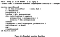
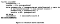
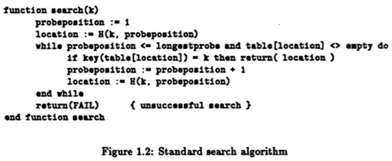

# 设计高效能的Hash Table（二）

这是Hash Table系列文章第二篇。其实这篇我想讲的内容原本预计是写再上一篇的，但上一篇稍微介绍一点背景知识篇幅就变得有点长了。相较起上篇的概论，这篇我会专注于探讨演算法的部分；预计下一篇则是写实作时如何在记忆体排列上增进最后数趴的效能。顺带一提我在上篇中补充了几个Hash Function的连结，有兴趣的使用者可以回上一篇看。

我这次实作的Hash Table核心演算法，是[Robin Hood Hashing](https://cs.uwaterloo.ca/research/tr/1986/CS-86-14.pdf)。会知道这演算法是因为在Hacker News上看到一篇很骚包的文章[I wrote the fastest hash table](https://probablydance.com/2017/02/26/i-wrote-the-fastest-hashtable/)。可惜的是他的实作目标是以POC为主，hash function的选择也很阳春。但正是因为看到了那篇文章，我才有机会深入研究Hash Table的各种眉角，以及设计出一些别出心裁的演算法。

Robin Hood Hashing是上篇提到Open Addressing Hash Table 的其中一种。在介绍Robin Hood Hashing的细节前，让我把Open Addressing稍微复习一遍：Open Addressing 是当两个键映到同一个槽时，不用linked list ，而是其中一个键要找另一个槽来用。找另一个槽的动作，在Open Addressing 术语中叫做probe (渣翻：探查)。直接找隔壁的位子叫做Linear Probing，但它在处理冲突时很容易挤在一块。稍微复杂一点的作法是采用probe的平方值来探查下个槽，称做Quadratic Probing。Quadratic Probing是当前最流行的探查选择，因为它可以兼顾快取优化以及处理冲突。我在撰写Hash Table时还实验了一个暂名为Rotate Probing的方法，它能给我相当好的随机性，但由于没有优化快取所以效能不如Quadratic Probing。

> Linear Probing (key, probe) = hash(key) + probe
> Quadratic Probing (key, probe) = hash(key) + probe²
> Rotate Probing (key, probe) = RotateRight(hash(key), probe)

虽然这些探查的技巧可以对付键值冲突，但它却无法解决「贫富不均」的问题。先插入Hash Table者有如先买房子的人，后到者只能换找下个位子；越是后面其探查数量就急遽增高，因为碰到位子先有人占的机率会愈来愈高。大部分的Hash Table应付此问题的方法是「让Hash Table不要太满」。例如[google dense hash map](https://github.com/sparsehash/sparsehash)预设的满度是25%-50%。但这样，嗯，真的蛮浪费记忆体空间的。

Robin Hood Hashing 就是为了要解决这个「贫富不均」的问题。探查次数愈少者愈「富」，碰到键值冲突时，不是后到者换位子，而是探查次数比较少的那个键得换位子。因为这劫富济贫的逻辑，所以命名为Robin Hood Hashing。

至于搜寻的方法就跟一般Linear/Quadratic Probing的方法一样，先找到键对映的槽，然后一路找到纪录中最长的探查数为止。若超过纪录中的探查数，则代表查无资料。

这样的演算法实在是说不上复杂，但很意外的沉睡了三十年还没有人把它实作成广泛通用的函示库…。不过连std::unordered_map 也是很晚近才加入C++ STL的，所以还是别太苛求好了。Robin Hood Hashing 那篇论文后面花很多力气证明探查的数目会收敛，而实际实验时也符合它的预测。可惜的是删除资料就无法让探查的数目收敛了。我设计了一套删除演算法能让探查量很缓慢的成长，但就是无法收敛。细节以后有机会再说明。

如果单单实作上述的演算法，不一定能比dense_ha s h_map还快。最大的瓶颈是Hash Table Size对hash function效能的影响。一般做完hash之后，我们需要取补数(mod)以映射到hash table的槽中。如果使用一般整数的补数，在x86系统上需要花28~90个cpu cycle。特例是二的次方，只需一个mask就能做完。写成C的话： hashed_key & ((1UL << n)-1)，约3 cycles (或更少，因为cpu有pipelining)。也因此几乎所有的Hash Table实作都只用二的次方来当作其大小。可是在资料量很大时，最糟情况是一半的记忆体闲置。例如资料4GB，却占用了8GB的记忆体，实在是相当的不理想。

有没有可能兼顾两边的好处，找出某些特别的Hash Table 大小，使得补数计算很快，但大小成长速度不像二的次方这么剧烈？我很幸运的想出了一个解决方案，命名为Fast mod and scale ，「取补数再压缩」。

首先，算出约略的Hash Table Size ，然后丢掉下面的位元，只取其最上面四个位元作为Hash Table的大小。只看最上面的位元，它的值就只能是8, 9, 10, 11, 12, 13, 14, 15。也就是说，Table大小只能是8 * 2^k, 9 * 2^k, etc.。计算补数时，以最大的位元的更大一个位元作为取补数的基准。由于是最上一个位元的大一号位元，对映起最上四个位元他们的大小差异就会是8/16, 9/16,…,15/16，因此只需要乘上这份差异即可。写成公式的话：

> ms4b = most significant 4 bits = 8, 9, …, 15
> TableSize(ms4b, k) = ms4b * 2^k = ms4b << k;
> ModAndScale(hashed_key, ms4b, k) = (hashed_key % 2^(k+4 )) * ms4b / 16
> = (hashed_key & ((1 << k+4)-1)) * ms4b >> 4;

由于整数乘法在x86上只需要3 cycle，因此速度远比算mod快上许多。唯一的缺点是hashed_key最下面的位元经过scale可能会消失。因为最后一步等同挤压至多到1/2倍的程度。如果照前面写的Linear/Quadratic Probing 的公式来写，有很高的机率是探查了却原地踏步。探查的公式改成hash(key) + probe*2, 以及hash(key) + probe² * 2 就能解决压缩失去资讯的问题。

取补数再压缩，虽然说概念很简单，但我却没找到其他类似的作法。如果有人找到相关的Reference，请通知我一下好让我标记原作者。

[Felix Chern](https://medium.com/@fchern?source=post_sidebar--------------------------post_sidebar-----------)

Follow

93

[Some rights reserved](https://creativecommons.org/licenses/by-nc/4.0/)

93 

- [Hash Table](https://medium.com/tag/hash-table)
- [Algorithms](https://medium.com/tag/algorithms)

## [More from Felix Chern](https://medium.com/@fchern?source=follow_footer-------------------------------------)

Follow

[Apr 18, 2017](https://medium.com/@fchern/設計高效能的hash-table-一-303d9713abab?source=follow_footer---------0----------------------------)

# [设计高效能的Hash Table（一）](https://medium.com/@fchern/設計高效能的hash-table-一-303d9713abab?source=follow_footer---------0----------------------------)

好久没有写部落格文章了。我今天打算分享自己这三个礼拜在Hash Table上做的一些小实验以及研究成果。很幸运的我居然可以做出相当好的Hash Table，在许多情境下比第二名好上非常多。这年头能在非常基本的资料结构上超越前代的巨人真的是无比幸运。这篇文章我只会讲大方向，详细的数据等我整合了更多的benchmark后再发布。

Hash Table大概是所有资料结构中应用最广泛的，没有之一；它同时也是常见的面试问题之一。Hash Table主要可以分作两大类：Separate Chaining以及Open Addressing。Separate Chaining是一般课堂上会提到的实作：Hash到array之后，如果多个key被映射到同个位置，就使用Linked List来装冲突的资料。Open Addressing处理冲突时，则是将其中一个key放到别的位置去。根据放的逻辑又分成两大流派：linear probing及quadratic probing两种。许多较快的Hash Table会采用Open Addressing这种实作，因为Linked List的指标会对记忆体快取不友善。稍后我们会看到影响效能的关键大都与CPU快取有关。

在探讨Hash Table资料结构细节的面貌前，我们先来看Hash Function，以及其相关的数学。在我实作Hash Table前，Hash Function对我来说一直是电脑科学中特别神秘的存在。因为大多数的Hash Function里面都有magic numbers。即使是比较简单的版本：`(v * 2654435761ULL) >> 32`在我看来也是像天书一样。不过这是有道理可循的。

在讲解Hash Function的magic number前，先讲一下CPU计算的背景知识。CPU做加减乘法很快，但是做除法非常慢。加、减、左右移(shift)、rotate等都是1 cycle。乘法稍微多一点，约3 cycles，至于除法在64 bit整数上要花28–90 cycles！如果在Hash Function当中误用了除法，那你的比较基准直接输人数十倍甚至到百倍。那些看起来怪异的magic number就是为了解决除法而发明出来的捷径。关于CPU可参阅[CPU指令的速度的数据](http://www.agner.org/optimize/instruction_tables.pdf)。

Magic number说穿了就是Fixed point arithmetic。[这篇文章](http://homepage.divms.uiowa.edu/~jones/bcd/divide.html)有蛮详细的说明。例如，你可以把0.1约略写成二进位的0x1999，小数点位在最右起向左算16个位元的位置。拿0x1999乘上任意的数字，再右移16位，就约等于除十的效果。使用这种方式只需要4 cycles就能达到「模拟」的除法。对于要求速度甚于准确度的Hash Function来说，是相当常见的一种技巧。以后看到别人的程式中有magic number，只要把之后右移的bit带入，并且重写成二进位模式，就可以知道它是用来当作什么样的除数。

说来惭愧，我对Hash Function的研究非常少。剩下的就是找一些现成的有名Hash Function实作来比较速度。榜上有名的实作有Murmurhash3, cityhash, XXHash, siphash, highwayhash等等。我最后选用的是Murmurhash3。我搜集了以下数种值得参考的Hash Function实作：

- [Murmurhash3](https://github.com/aappleby/smhasher/wiki/MurmurHash3) Murmurhash2是已经被大量使用的Hash function实作。Murmurhash3是其改进版。我选用这种因为它是public domain，一个档案就搞定，没有麻烦的套件相依或系统相依性问题。
- [Siphash/highwayhash](https://github.com/google/highwayhash)这是一个针对长度短的资料进行最佳化的hash function。据作者说还能有效的避免恶意造成的DDOS。它的进化型highwayhash使用AVX2的指令集来加速，相当有意思。
- [XXHash](https://github.com/Cyan4973/xxHash)比Murmurhash2/3都还要快的个人实作。是我未来要对hash function做最佳化时的热门候选人。Facebook RocksDB中有使用到XXHash。
- [CityHash](https://github.com/google/cityhash)出自Google的另一个快速Hash Function
- [FarmHash](https://github.com/google/farmhash)同样出自Google的Hash Function，是CityHash的进化版。针对不同平台使用不同的指令集优化。

Hash function除了比较速度外，还有几个重要的特性可以评量。

1. [Universality](https://en.wikipedia.org/wiki/Universal_hashing) : For all x, y in key space, Pr{h(x) = h(y)} ≤ 1/m。m是hash table size。以白话文来说，就是任意两个键冲突的机率小于1/m。
2. [K-wise independence](https://en.wikipedia.org/wiki/K-independent_hashing) : Pr{h(x_1) = y_1 && h(x_2) = y_2 && … h(x_k) = y_k} = 1/m^k。也就是K个键经过hash function映射后都对彼此独立。这是比Universality还要强得多的性质，可惜的是现有快速Hash function都没有经过K-wise independence的分析；而[经过K-wise independence分析过的Hash function又太过复杂笨重](https://en.wikipedia.org/wiki/Tabulation_hashing)不适合拿出来用。
3. [Minimal Perfect Hashing](http://cmph.sourceforge.net/) :将N个键映射到M个整数且不产生冲突，如果N=M，我们称之为最小完美Hash。

对以上主题有兴趣，可参阅[MIT Advanced Data Structure课程](https://youtu.be/892iMAE-y3M)。我下篇文章会写课程中没有涵盖到的一些演算法。