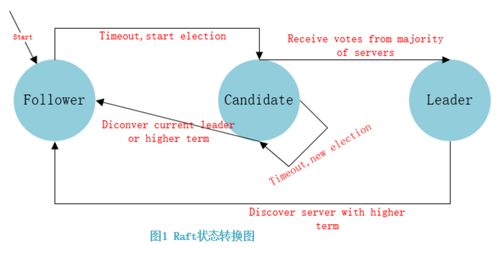

三个角色

### 1 选举

所有的节点都是以跟随者 follower 状态开始

如果跟随者没有收到领导者的来信，则他们成为候选者

然后候选者从其他节点请求投票

其他节点将以回复消息为投票信息

候选者如果获得 大于当前集群一般的其他节点投票，则成为领导者

这个过程就是Leader 选举过程

### 2 集群共识 *Log Replication*  日志复制

leader 

所有的更改都要通过leader 

所有的更改请求 都将添加为节点日志中的条目

该条目先不进行提交，因此不会更新节点中的值

要提交条目，需将其复制到跟随者节点  （将更改操作在下一个心跳发送给追随者）heart beat time out 

leader等待，知道大多数跟随者都写入了该条目

然后leader 更新节点值

Leader通知follower该条目已提交

follower提交该条目

集群达到共识

### 3 选举细节

1 election timeout选举超时 是指*followers*跟随者成为*candidates*候选者之前所等待的时间，被随机分配在150毫秒至300毫秒之间

选举超时后，跟随者成为候选者并开始新的election term选举任期, 成为候选人 为自己投票

- 为自己投票
- 并向其他节点发送 Request Vote 请求投票消息，
- 一旦候选人获得多数票，便成为领导者
- leader 向其追随者发送Append Entries.  这些消息以heartbeat timeout心跳超时指定的时间间隔发送
- 跟随者然后响应每个Append Entries 追加条目消息
- 此选举任期将持续到追随者停止接收心跳并成为候选人为止

### 4 leader down

1 leader 节点超过 election timeout 未响应

2 最早触发 election timeout 的 follower 先成为了候选者，为自己投票，进入选举过程

3 向其他follower 节点 请求投票

4 在 23 过程中，很可能其他follower 节点也进入了候选者状态，因为分布式网络原因，也进入了23流程

要获得多数票，可以确保每个任期只能选出一位领导者

5 选票最高为leader

6 append entries

....

- 异常 如果两个节点同时成为候选节点，则可能会发生分裂投票。

 