# [磁盘性能评价指标—IOPS和吞吐量](https://www.cnblogs.com/sddai/p/8647795.html)

# 一、磁盘 I/O 的概念

I/O 的概念，从字义来理解就是输入输出。操作系统从上层到底层，各个层次之间均存在 I/O。比如，CPU 有 I/O，内存有 I/O, VMM 有 I/O, 底层磁盘上也有 I/O，这是广义上的 I/O。通常来讲，一个上层的 I/O 可能会产生针对磁盘的多个 I/O，也就是说，上层的 I/O 是稀疏的，下层的 I/O 是密集的。

磁盘的 I/O，顾名思义就是磁盘的输入输出。输入指的是对磁盘写入数据，输出指的是从磁盘读出数据。我们常见的磁盘类型有 ATA、SATA、FC、SCSI、SAS，如图1所示。这几种磁盘中，服务器常用的是 SAS 和 FC 磁盘，一些高端存储也使用 SSD 盘。每一种磁盘的性能是不一样的。

##### 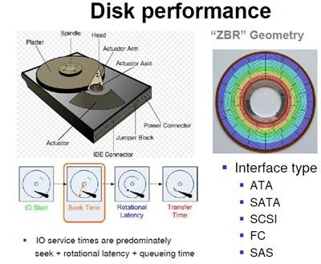

##### 图 1. 物理磁盘的架构以及常见磁盘类型

# 二、性能评价指标

SAN（Storage Area Network, 存储区域网络）和NAS存储（Network Attached Storage，网络附加存储)一般都具备2个评价指标：IOPS和带宽（throughput），两个指标互相独立又相互关联。体现存储系统性能的最主要指标是IOPS。下面，将介绍一下这两个参数的含义。

IOPS (Input/Output Per Second)即每秒的输入输出量(或读写次数)，是衡量磁盘性能的主要指标之一。IOPS是指单位时间内系统能处理的I/O请求数量，I/O请求通常为读或写数据操作请求。随机读写频繁的应用，如OLTP(Online Transaction Processing)，IOPS是关键衡量指标。另一个重要指标是数据吞吐量(Throughput)，指单位时间内可以成功传输的数据数量。对于大量顺序读写的应用，如VOD(Video On Demand)，则更关注吞吐量指标。

简而言之：

 

磁盘的 IOPS，也就是在一秒内，磁盘进行多少次 I/O 读写。

磁盘的吞吐量，也就是每秒磁盘 I/O 的流量，即磁盘写入加上读出的数据的大小。

### IOPS 与吞吐量的关系

每秒 I/O 吞吐量＝ IOPS* 平均 I/O SIZE。从公式可以看出： I/O SIZE 越大，IOPS 越高，那么每秒 I/O 的吞吐量就越高。因此，我们会认为 IOPS 和吞吐量的数值越高越好。实际上，对于一个磁盘来讲，这两个参数均有其最大值，而且这两个参数也存在着一定的关系。

IOPS可细分为如下几个指标：

1. Toatal IOPS，混合读写和顺序随机I/O负载情况下的磁盘IOPS，这个与实际I/O情况最为相符，大多数应用关注此指标。
2. Random Read IOPS，100%随机读负载情况下的IOPS。
3. Random Write IOPS，100%随机写负载情况下的IOPS。
4. Sequential Read IOPS，100%顺序读负载情况下的IOPS。
5. Sequential Write IOPS，100%顺序写负载情况下的IOPS。

下图为一个典型的NFS测试结果：

IOPS的测试benchmark工具主要有Iometer, IoZone, FIO等，可以综合用于测试磁盘在不同情形下的IOPS。对于应用系统，需要首先确定数据的负载特征，然后选择合理的IOPS指标进行测量和对比分析，据此选择合适的存储介质和软件系统。

 

#### IOPS计算公式

对于磁盘来说一个完整的IO操作是这样进行的：当控制器对磁盘发出一个IO操作命令的时候，磁盘的驱动臂(Actuator Arm)带读写磁头(Head)离开着陆区(Landing Zone，位于内圈没有数据的区域)，移动到要操作的初始数据块所在的磁道(Track)的正上方，这个过程被称为寻址(Seeking)，对应消耗的时间被称为寻址时间(Seek Time);但是找到对应磁道还不能马上读取数据，这时候磁头要等到磁盘盘片(Platter)旋转到初始数据块所在的扇区(Sector)落在读写磁头正上方的之后才能开始读取数据，在这个等待盘片旋转到可操作扇区的过程中消耗的时间称为旋转延时(Rotational Delay);接下来就随着盘片的旋转，磁头不断的读/写相应的数据块，直到完成这次IO所需要操作的全部数据，这个过程称为数据传送(Data Transfer)，对应的时间称为传送时间(Transfer Time)。完成这三个步骤之后一次IO操作也就完成了。

在我们看硬盘厂商的宣传单的时候我们经常能看到3个参数，分别是平均寻址时间、盘片旋转速度以及最大传送速度，这三个参数就可以提供给我们计算上述三个步骤的时间。

第一个寻址时间，考虑到被读写的数据可能在磁盘的任意一个磁道，既有可能在磁盘的最内圈(寻址时间最短)，也可能在磁盘的最外圈(寻址时间最长)，所以在计算中我们只考虑平均寻址时间，也就是磁盘参数中标明的那个平均寻址时间，这里就采用当前最多的10krmp硬盘的5ms。

第二个旋转延时，和寻址一样，当磁头定位到磁道之后有可能正好在要读写扇区之上，这时候是不需要额外额延时就可以立刻读写到数据，但是最坏的情况确实要磁盘旋转整整一圈之后磁头才能读取到数据，所以这里我们也考虑的是平均旋转延时，对于10krpm的磁盘就是(60s/10k)*(1/2) = 2ms。

第三个传送时间，磁盘参数提供我们的最大的传输速度，当然要达到这种速度是很有难度的，但是这个速度却是磁盘纯读写磁盘的速度，因此只要给定了单次 IO的大小，我们就知道磁盘需要花费多少时间在数据传送上，这个时间就是IO Chunk Size / Max Transfer Rate。

现在我们就可以得出这样的计算单次IO时间的公式。

　　IO Time = Seek Time + 60 sec/Rotational Speed/2 + IO Chunk Size/Transfer Rate

于是我们可以这样计算出IOPS。

　　IOPS = 1/IO Time = 1/(Seek Time + 60 sec/Rotational Speed/2 + IO Chunk Size/Transfer Rate)

对于给定不同的IO大小我们可以得出下面的一系列的数据

　　4K (1/7.1 ms = 140 IOPS)
　　5ms + (60sec/15000RPM/2) + 4K/40MB = 5 + 2 + 0.1 = 7.1
　　8k (1/7.2 ms = 139 IOPS)
　　5ms + (60sec/15000RPM/2) + 8K/40MB = 5 + 2 + 0.2 = 7.2
　　16K (1/7.4 ms = 135 IOPS)
　　5ms + (60sec/15000RPM/2) + 16K/40MB = 5 + 2 + 0.4 = 7.4
　　32K (1/7.8 ms = 128 IOPS)
　　5ms + (60sec/15000RPM/2) + 32K/40MB = 5 + 2 + 0.8 = 7.8
　　64K (1/8.6 ms = 116 IOPS)
　　5ms + (60sec/15000RPM/2) + 64K/40MB = 5 + 2 + 1.6 = 8.6

从上面的数据可以看出，当单次IO越小的时候，单次IO所耗费的时间也越少，相应的IOPS也就越大。

上面我们的数据都是在一个比较理想的假设下得出来的，这里的理想的情况就是磁盘要花费平均大小的寻址时间和平均的旋转延时，这个假设其实是比较符合我们实际情况中的随机读写，在随机读写中，每次IO操作的寻址时间和旋转延时都不能忽略不计，有了这两个时间的存在也就限制了IOPS的大小。现在我们考虑一种相对极端的顺序读写操作，比如说在读取一个很大的存储连续分布在磁盘的的文件，因为文件的存储的分布是连续的，磁头在完成一个读IO操作之后，不需要从新的寻址，也不需要旋转延时，在这种情况下我们能到一个很大的IOPS值，如下。

　　4K (1/0.1 ms = 10000 IOPS)
　　0ms + 0ms + 4K/40MB = 0.1
　　8k (1/0.2 ms = 5000 IOPS)
　　0ms + 0ms + 8K/40MB = 0.2
　　16K (1/0.4 ms = 2500 IOPS)
　　0ms + 0ms + 16K/40MB = 0.4
　　32K (1/0.8 ms = 1250 IOPS)
　　0ms + 0ms + 32K/40MB = 0.8
　　64K (1/1.6 ms = 625 IOPS)
　　0ms + 0ms + 64K/40MB = 1.6

相比第一组数据来说差距是非常的大的，因此当我们要用IOPS来衡量一个IO系统的系能的时候我们一定要说清楚是在什么情况的IOPS，也就是要说明读写的方式以及单次IO的大小，当然在实际当中，特别是在OLTP的系统的，随机的小IO的读写是最有说服力的。

## 另外，对于同一个磁盘（或者 LUN），随着每次 I/O 读写数据的大小不通，IOPS 的数值也不是固定不变的。例如，每次 I/O 写入或者读出的都是连续的大数据块，此时 IOPS 相对会低一些；在不频繁换道的情况下，每次写入或者读出的数据块小，相对来讲 IOPS 就会高一些。也就是说，IOPS 也取决与I/O块的大小，采用不同I/O块的大小测出的IOPS值是不同的。 对一个具体的IOPS, 可以了解它当时测试的I/O块的尺寸。并且IOPS都具有极限值，表1列出了各种磁盘的 IOPS 极限值。

##### 表 1. 常见磁盘类型及其 IOPS

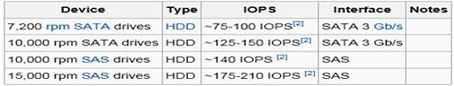

#####  

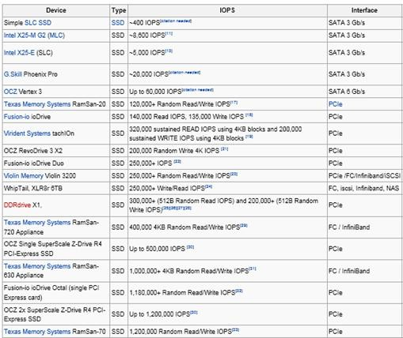

 

# 三、I/O 读写的类型

大体上讲，I/O 的类型可以分为：读 / 写 I/O、大 / 小块 I/O、连续 / 随机 I/O, 顺序 / 并发 I/O。在这几种类型中，我们主要讨论一下：大 / 小块 I/O、连续 / 随机 I/O, 顺序 / 并发 I/O。

### 大 / 小块 I/O

这个数值指的是控制器指令中给出的连续读出扇区数目的多少。如果数目较多，如 64，128 等，我们可以认为是大块 I/O；反之，如果很小，比如 4，8，我们就会认为是小块 I/O，实际上，在大块和小块 I/O 之间，没有明确的界限。

### 连续 / 随机 I/O

连续 I/O 指的是本次 I/O 给出的初始扇区地址和上一次 I/O 的结束扇区地址是完全连续或者相隔不多的。反之，如果相差很大，则算作一次随机 I/O

连续 I/O 比随机 I/O 效率高的原因是：在做连续 I/O 的时候，磁头几乎不用换道，或者换道的时间很短；而对于随机 I/O，如果这个 I/O 很多的话，会导致磁头不停地换道，造成效率的极大降低。

### 顺序 / 并发 I/O

从概念上讲，并发 I/O 就是指向一块磁盘发出一条 I/O 指令后，不必等待它回应，接着向另外一块磁盘发 I/O 指令。对于具有条带性的 RAID（LUN），对其进行的 I/O 操作是并发的，例如：raid 0+1(1+0),raid5 等。反之则为顺序 I/O。

 

# 四、磁盘 I/O 性能的监控

监控磁盘的 I/O 性能，我们可以使用 AIX 的系统命令，例如：sar -d, iostat, topas, nmon 等。下面，我将以 nmon 和 topas 为例，讲述在系统中如何观察磁盘 I/O 的性能。

### topas

登录 AIX 操作系统，输入 topas，然后按 D，会出现如下界面：

#####  

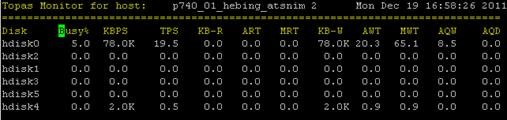

在上图中，TPS 即为磁盘的 IOPS，KBPS 即为磁盘每秒的吞吐量。由于服务器处于空闲的状态，我们可以看到 IOPS，KBPS 的数据都非常低。

我们使用 dd if 命令向磁盘 hdisk2 发读 I/O，block 大小为 1MB：

#####  

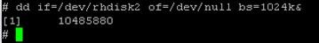

利用 topas 进行监控：

#####  

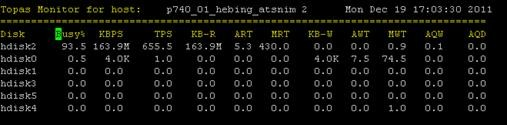

此时，hdisk2 的吞吐量为 163.9M，IOPS 为 655。

我们再启动一个 dd if，使 hdisk 的 busy 数值达到 100%：

##### 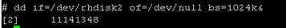

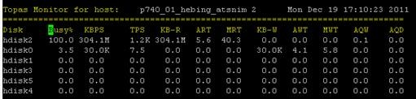
从上图可以看出，在磁盘 busy 达到 100% 的时候，其吞吐量为 304.1M，IOPS 为 1200。

hdisk2 是本地集成的 SAS 盘，我们可以查出本地集成 SAS 通道的带宽为 3Gb：

##### 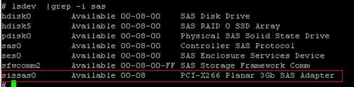

对于 3Gb 的 SAS 通道，304.1M 的磁盘吞吐量已经接近其 I/O 带宽的峰值了。

需要指出的是，使用 dd if 测量磁盘的带宽是可行的，但是由此来确定业务 I/O 的 IOPS 和吞吐量是不科学的。因为，dd if 所发起的读写仅为顺序 I/O 读写，在 OLTP 的业务中，这种读写是不常见的，而是随机小 I/O 比较多，因此，测量业务的磁盘 I/O 性能，需要在运行业务的时候进行监控。

### nmon

在系统中输入 nmon，按 d，可以得到如下界面 :

##### 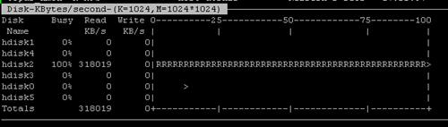

可以得到此时磁盘 hdisk2 吞吐量为 318M。

使用 nmon 收集一个时间段的数据，然后使用 nmon analyzer 进行分析，可以得出更为直接的图表：

##### 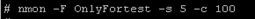

将收集好的 nmon 文件使用 nmon analyzer 进行分析，得出如下报表：

##### 图 2.nmon 图表显示磁盘性能

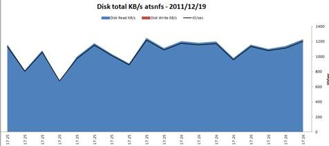

 

# 五、磁盘 I/O 性能调优

### 确认磁盘 I/O 存在性能问题

对于随机负载，当遇到余下情况时，我们那通常认为存在 I/O 性能问题：

\1. 平均读时间大于 15ms

\2. 在具有写 cache 的条件下，平均写时间大于 2.5ms

对于顺序负载，当遇到余下情况时，我们那通常认为存在 I/O 性能问题：

\1. 在一个磁盘上有两个连续的 I/O 流

\2. 吞吐量不足（即远远小于磁盘 I/O 带宽）

对于一块磁盘来讲，随着 IOPS 数量的增加，I/O service 也会增加，并且会有一个饱和点，即 IOPS 达到某个点以后，IOPS 再增加将会引起 I/O service time 的显著增加。

##### 图 3. 磁盘 IOPS 与 IO service time 关系图

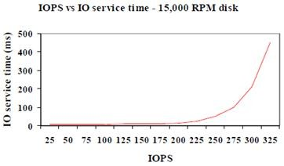

从经验上讲，我们在测试工作中，我们主要关注 IOPS 和吞吐量以及磁盘的 busy% 这三个数值。如果 IOPS 和吞吐量均很低，磁盘的 busy% 也很低，我们会认为磁盘压力过小，造成吞吐量和 IOPS 过低；只有在 IOPS 和吞吐量均很低，磁盘的 busy% 很高（接近 100%）的时候，我们才会从磁盘 I/O 方面分析 I/O 性能

 

# 介绍

 

   通常在讨论不同RAID保护类型的性能的时候，结论都会是RAID-1提供比较好的读写性能，RAID-5读性能不错，但是写入性能就不如RAID-1，RAID-6保护级别更高，但写性能相对更加差，RAID10是提供最好的性能和数据保护，不过成本最高等等。其实决定这些性能考虑的因素很简单，它就是RAID Write Penalty（写惩罚）。本文从原理上解释了不同RAID保护级别的写惩罚，以及通过写惩罚计算可用IOPS的方法。

# 更多信息

 

**RAID-5 Write Penalty的例子:**

 

   存储方案规划的过程中，最基本的考虑因素有两个，性能和容量。性能上的计算看可以分为IOPS和带宽需求。计算IOPS，抛开存储阵列的缓存和前端口不谈。计算后端物理磁盘的IOPS不能简单的把物理磁盘的最大IOPS相加而获得。原因是，对于不同的RAID级别，为了保证当有物理磁盘损坏的情况下可以恢复数据，数据写入的过程中都需要有一些特别的计算。比如对于RAID-5，条带上的任意磁盘上的数据改变，都会重新计算校验位。如下图所示，一个7+1的RAID-5的条带中，七个磁盘存储数据，最后一个磁盘存储校验位。

 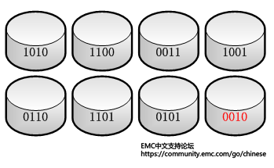

 

   对于一个数据的写入，我们假设在第五个磁盘上写入的数据为1111，如下图所示。那么整个RAID-5需要完成写入的过程分为以下几步：

 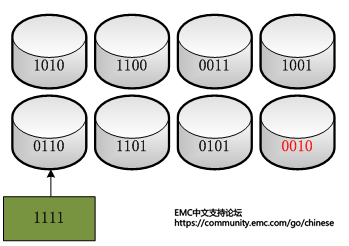

 

 

1. 读取原数据0110，然后与新的数据1111做XOR操作： 0110 XOR 1111 = 1001
2. 读取原有的校验位0010
3. 用第一步算出的数值与原校验位再做一次XOR操作： 0010 XOR 1001 = 1011
4. 然后将1111新数据写入到数据磁盘，将第三步计算出来的新的校验位写入校验盘。

 

   由上述几个步骤可见，对于任何一次写入，在存储端，需要分别进行两次读+两次写，所以说RAID-5的Write Penalty的值是4。

 

 

**不同RAID级别的Write Penalty：**

 

下表列出了各种RAID级别的Write Penalty值：

 

| **RAID** | **Write Penalty** |
| -------- | ----------------- |
| 0        | 1                 |
| 1        | 2                 |
| 5        | 4                 |
| 6        | 6                 |
| 10       | 2                 |

 

 

**RAID-0：**直接的条带，数据每次写入对应物理磁盘上的一次写入

**RAID-1和10**：RAID-1 和RAID-10的写惩罚很简单理解，因为数据的镜像存在的，所以一次写入会有两次。

**RAID-5：**RAID-5由于要计算校验位的机制存在，需要读数据、读校验位、写数据、写校验位四个步骤，所以RAID-5的写惩罚值是4。

**RAID-6：**RAID-6由于有两个校验位的存在，与RAID-5相比，需要读取两次校验位和写入两次校验位，所以RAID-6的写惩罚值是6。

 

 

**计算****IOPS:**

 

   根据上文的描述，在实际存储方案设计的过程中，计算实际可用IOPS的过程中必须纳入RAID的写惩罚计算。计算的公式如下：

 

**物理磁盘总的****IOPS = 物理磁盘的IOPS × 磁盘数目**

 

**可用的****IOPS = （物理磁盘总的IOPS × 写百分比 ÷ RAID写惩罚） + （物理磁盘总的IOPS × 读百分比）**

 

   假设组成RAID-5的物理磁盘总共可以提供500 IOPS，使用该存储的应用程序读写比例是50%/50%，那么对于前端主机而言，实际可用的IOPS是：

 

（500 ×50% **÷** 4）+ ( 500 * 50%) = 312.5 IOPS

 

具体不同应用程序的读写比例，可以参考：[关于不同应用程序存储IO类型的描述](https://community.emc.com/docs/DOC-26547)

===================================

机械硬盘的连续读写性很好， 但随机读写性能很差。这是因为磁头移动至正确的磁道上需要时间，随机读写时，磁头不停的移动，时间都花在了磁头寻道上，所以性能不高。 如下图：

在存储小文件(图片)、OLTP数据库应用时，随机读写性能（IOPS）是最重要指标。

学习它，有助于我们分析存储系统的性能互瓶颈。
下面我们来认识随机读写性能指标--IOPS（每秒的输入输出次数）。

 

磁盘性能指标--IOPS
\----------------------------------------------------------
    IOPS (Input/Output Per Second)即每秒的输入输出量(或读写次数)，是衡量磁盘性能的主要指标之一。IOPS是指单位时间内系统能处理的I/O请求数量，一般以每秒处理的I/O请求数量为单位，I/O请求通常为读或写数据操作请求。

  随机读写频繁的应用，如小文件存储(图片)、OLTP数据库、邮件服务器，关注随机读写性能，IOPS是关键衡量指标。

  顺序读写频繁的应用，传输大量连续数据，如电视台的视频编辑，视频点播VOD(Video On Demand)，关注连续读写性能。数据吞吐量是关键衡量指标。

IOPS和数据吞吐量适用于不同的场合：
读取10000个1KB文件，用时10秒 Throught(吞吐量)=1MB/s ，IOPS=1000 追求IOPS
读取1个10MB文件，用时0.2秒 Throught(吞吐量)=50MB/s, IOPS=5 追求吞吐量

磁盘服务时间
\--------------------------------------
传统磁盘本质上一种机械装置，如FC, SAS, SATA磁盘，转速通常为5400/7200/10K/15K rpm不等。影响磁盘的关键因素是磁盘服务时间，即磁盘完成一个I/O请求所花费的时间，它由寻道时间、旋转延迟和数据传输时间三部分构成。

**寻道时间** Tseek是指将读写磁头移动至正确的磁道上所需要的时间。寻道时间越短，I/O操作越快，目前磁盘的平均寻道时间一般在3－15ms。
**旋转延迟** Trotation是指盘片旋转将请求数据所在扇区移至读写磁头下方所需要的时间。旋转延迟取决于磁盘转速，通常使用磁盘旋转一周所需时间的1/2表示。比如，7200 rpm的磁盘平均旋转延迟大约为60*1000/7200/2 = 4.17ms，而转速为15000 rpm的磁盘其平均旋转延迟为2ms。
**数据传输时间** Ttransfer是指完成传输所请求的数据所需要的时间，它取决于数据传输率，其值等于数据大小除以数据传输率。目前IDE/ATA能达到133MB/s，SATA II可达到300MB/s的接口数据传输率，数据传输时间通常远小于前两部分消耗时间。简单计算时可忽略。

 

**常见磁盘平均物理寻道时间为：**
7200转/分的STAT硬盘平均物理寻道时间是9ms
10000转/分的STAT硬盘平均物理寻道时间是6ms
15000转/分的SAS硬盘平均物理寻道时间是4ms

 

常见硬盘的旋转延迟时间为：

7200  rpm的磁盘平均旋转延迟大约为60*1000/7200/2 = 4.17ms

10000 rpm的磁盘平均旋转延迟大约为60*1000/10000/2 = 3ms，

15000 rpm的磁盘其平均旋转延迟约为60*1000/15000/2 = 2ms。

最大IOPS的理论计算方法
\--------------------------------------
IOPS = 1000 ms/ (寻道时间 + 旋转延迟)。可以忽略数据传输时间。

7200  rpm的磁盘 IOPS = 1000 / (9 + 4.17) = 76 IOPS
10000 rpm的磁盘IOPS = 1000 / (6+ 3) = 111 IOPS
15000 rpm的磁盘IOPS = 1000 / (4 + 2) = 166 IOPS

影响测试的因素
\-----------------------------------------
实际测量中，IOPS数值会受到很多因素的影响，包括I/O负载特征(读写比例，顺序和随机，工作线程数，队列深度，数据记录大小)、系统配置、操作系统、磁盘驱动等等。因此对比测量磁盘IOPS时，必须在同样的测试基准下进行，即便如此也会产生一定的随机不确定性。

队列深度说明 
NCQ、SCSI TCQ、PATA TCQ和SATA TCQ技术解析 
\----------------------------------------
  是一种命令排序技术，一把喂给设备更多的IO请求，让电梯算法和设备有机会来安排合并以及内部并行处理，提高总体效率。
SCSI TCQ的队列深度支持256级
ATA TCQ的队列深度支持32级 （需要8M以上的缓存）
NCQ最高可以支持命令深度级数为32级，NCQ可以最多对32个命令指令进行排序。
  大多数的软件都是属于同步I/O软件，也就是说程序的一次I/O要等到上次I/O操作的完成后才进行，这样在硬盘中同时可能仅只有一个命令，也是无法发挥这个技术的优势，这时队列深度为1。
  随着Intel的超线程技术的普及和应用环境的多任务化，以及异步I/O软件的大量涌现。这项技术可以被应用到了，实际队列深度的增加代表着性能的提高。
在测试时，队列深度为1是主要指标，大多数时候都参考1就可以。实际运行时队列深度也一般不会超过4.

IOPS可细分为如下几个指标：
\-----------------------------------------
数据量为n字节，队列深度为k时，随机读取的IOPS
数据量为n字节，队列深度为k时，随机写入的IOPS

IOPS的测试benchmark工具
\------------------------------------------
     IOPS的测试benchmark工具主要有Iometer, IoZone, FIO等，可以综合用于测试磁盘在不同情形下的IOPS。对于应用系统，需要首先确定数据的负载特征，然后选择合理的IOPS指标进行测量和对比分析，据此选择合适的存储介质和软件系统。