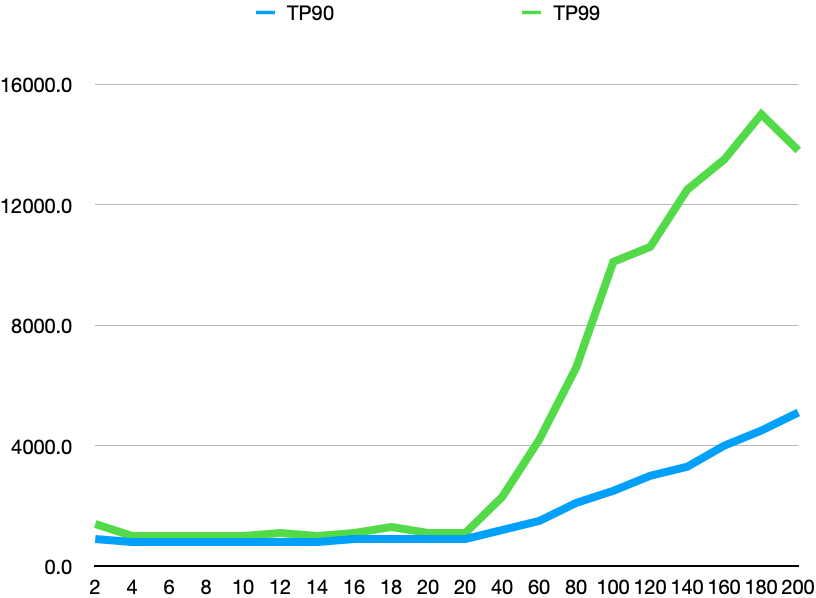
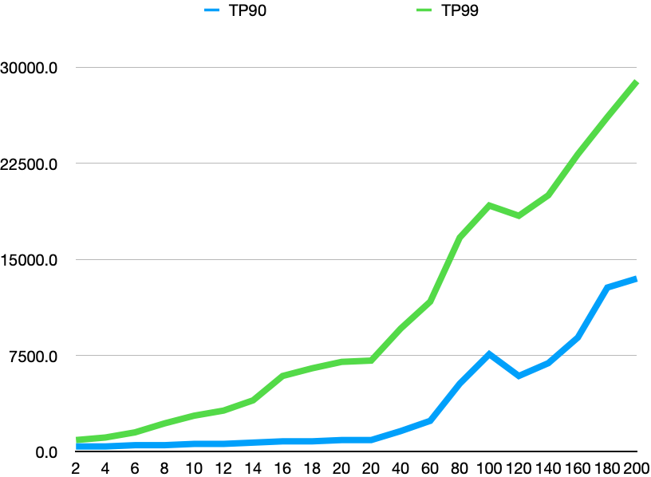

### **测试环境**

服务器：

​    压力机：Centos 7.2 32 cores 128G memory HDD disk；

​    服务机：Centos 7.2 32 cores 128G memory HDD disk；

zookeeper：

​    version 3.5.9

​    JDK8

​    client：zookeeper Java client

​    server：3 nodes

servicekeeper：

​    client：servicekeeper

​    server：3 nodes

Etcd:

​    version 3.4.15

​    go go1.12.17

​    server 3 nodes

zookeeper、servicekeeper的log和snapshot放在不同磁盘

测试用例：

​    key size 256 bytes

​    value size 1024 bytes

注意：

​    avgRT tp90 tp99的时间单位为微秒

​    纵坐标为压力机并发的线程数，每个线程对应一个连接

## **zookeeper集群（3节点）**

1. tps

   

2. latency

   

3. Tp99

   

## **Etcd集群（3节点）**

1. tps

   

2. latency

   

3. Tp99

   