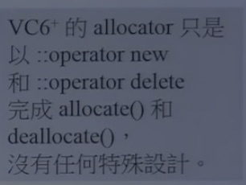
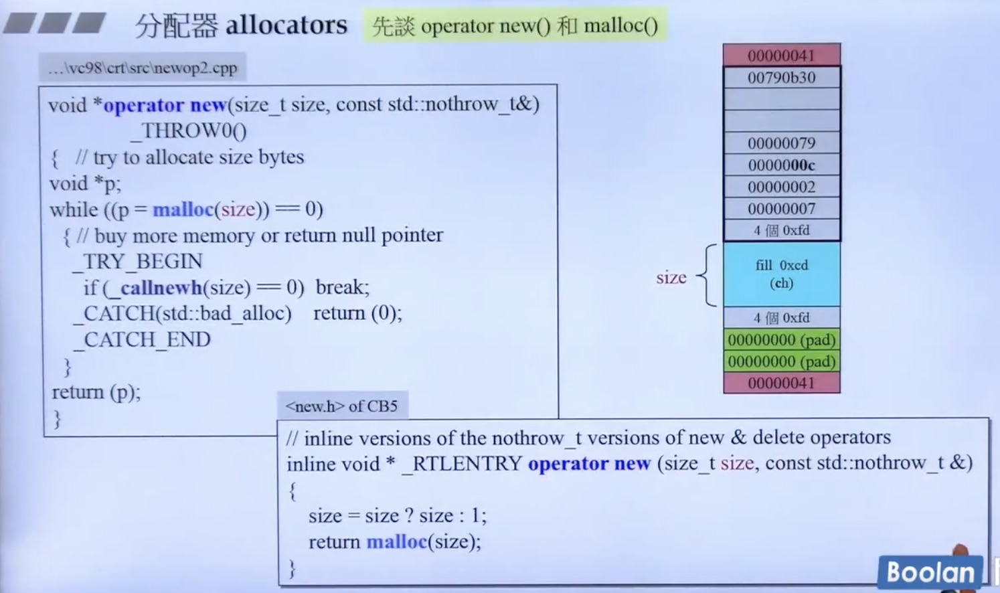
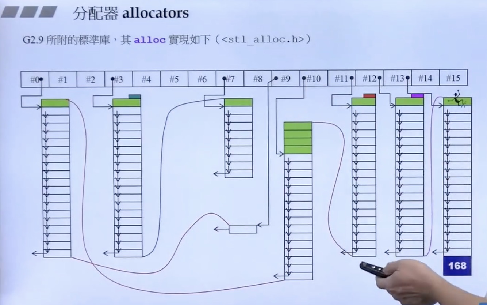

所有分配内存操作都是 malloc ,malloc 额外开销比较大




::oprater new 

::oprater delete


100万容器 每个8个字节，这个容器会有额外的修饰(cookie)，那么这个修饰对于100w相同的来说，不需要记录100w次,使用bucket 来放多个相同的容器，bucket 数量为8的倍数


GC allocator->alloc




g4.9 又回去了

```c++
G4.9  allocator - > std::

Allocator:public __allocator_base 

_allocator_base. __gnu_cxx::new_allocator <bits/new_allocator.h>
  
  
class new_allocator
{
  
  allocator(size) {
     ::operator new()
  }
  dealocate(){
      ::operator delete()
  }
}
```


所有操作放到了 extortion allocators

__pool_alloc 就是 GC.29的alloc

```c++
class _pool_allo_base {
  enum S_align=8
  max_bytes = 128;
  free_list_size = mx_bytes/S_align;
}

  
如何使用
 vector<string, _gnu_cxx::_poll_alloc<string>>vec
```


