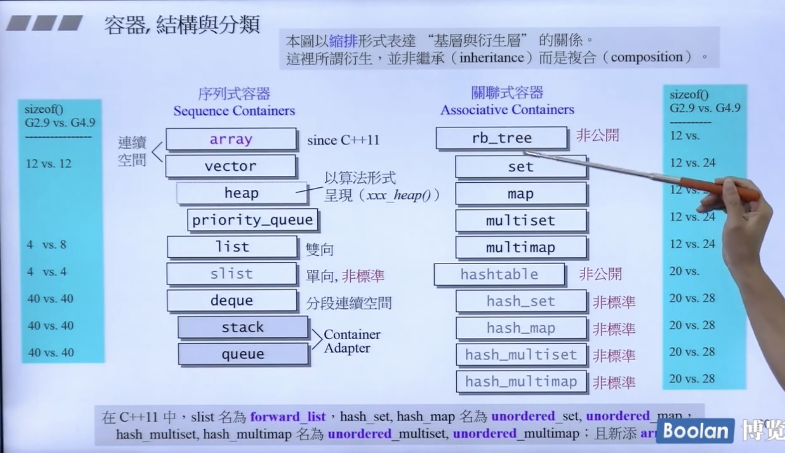
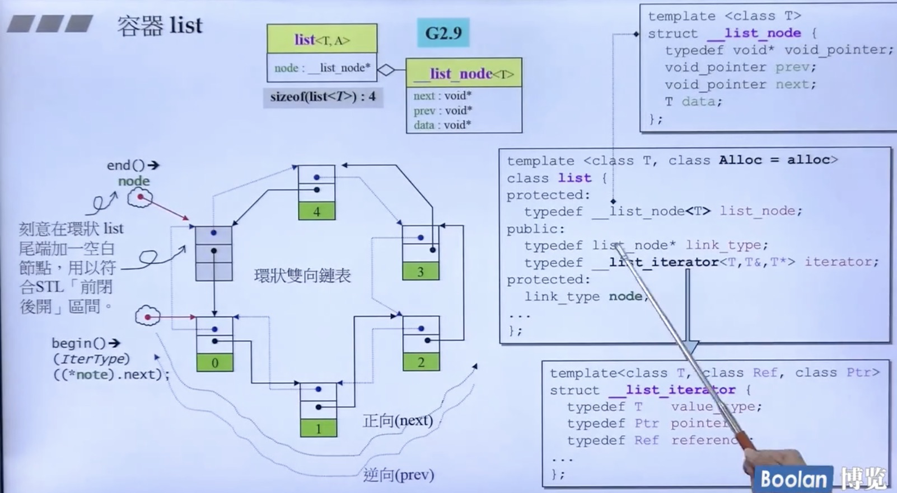
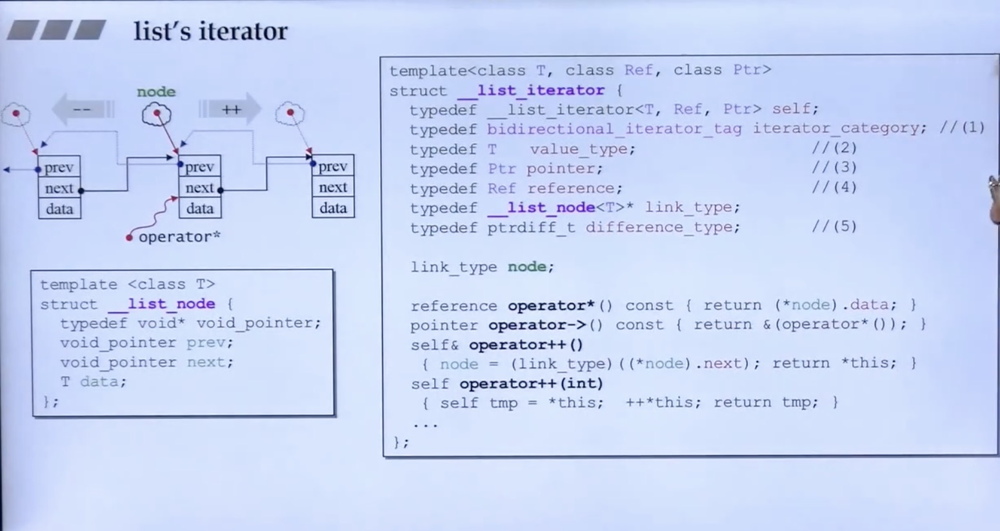
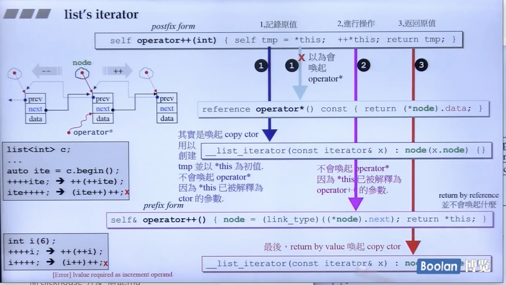
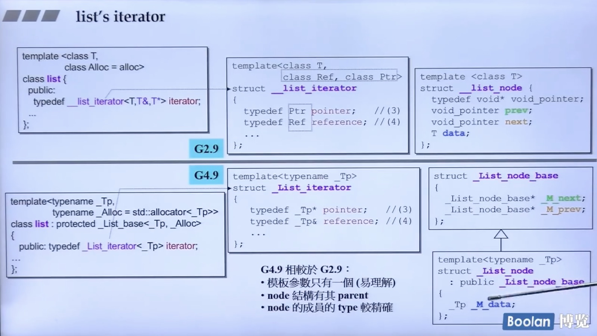
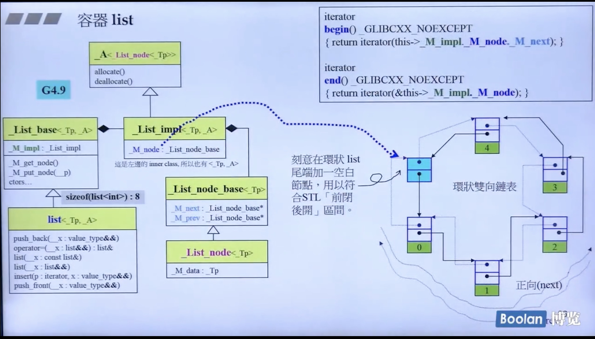

不同容器之间的关联性





缩排： 衍生关系 

非继承inheritance 。是符合关系 composition 


Set 里有一个rb_tree


Class A ClassB 

Class A 要用 B function

1. 继承

2. 拥有


除了 vector 和 array ,所有容器的 iterator 都是一个类，智能指针


list 2.9 



```c++
class list{
 typedef list_node* link_type; 是个指针  list_node 是啥不重要了
 link_type node;
}

如上图： list_node ,有data,和两个指针

所有 sizeof(list) 大小为4
```


左边 小圆圈 就是 iterator  bagin 有一个指向它的 end有一个


前闭后开


iterator ++ 

如果指向 begin 下一个的 也就是 iterator++ == node->next

这里使用了 typedef __list_iterator<T>...

```c++
template <class T, clss Alloc = alloc >
class list {
  typedef __list_node<T> list_node;
public:
  typedef list_node* link_type;
  typedef __list_iterator<T,T&,T> iterator;
protected:
  link_type node;
...
}

// 这里也比较扯淡
templiat<class T, class Ref, calss Ptr>
struct __list_iterator{
  typedef T value_type;
  typedef Ptr pointer;
  typedef Ref reference;
...
}
```




基本每个容器都有自己的iterator,执行指针的方法 operator

iterator++;




第一个传入 self operator++(int)

第二个传入 self & operator++()

是为了模拟 int ++++ 


reference 获取值 *  获取值的问题

```
referenec oprator*() const 
{
   rturn (*node).data;
}
pointer operator->() const
[
  return &(opert...)
]
```


G2.9 

G4.9






list 继承 list_base

List_base 内含 List_impl

List_impl 内涵了 list_node 和继承 -A(list_node)

list_node 有两个指针 M_next M_prex 所有是8的大小


