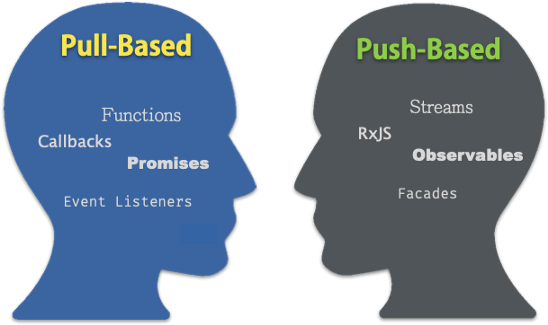
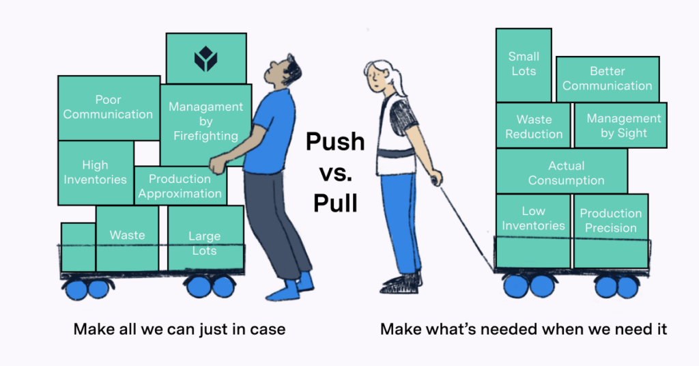
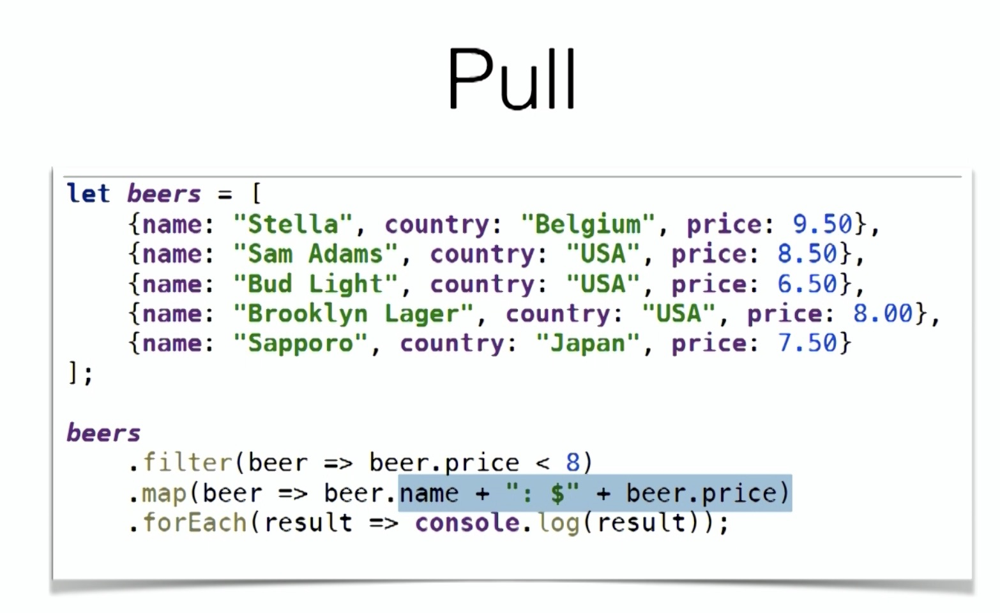

- Pull-based

java8 streams

```java
eg1
List<User> users = userRpcClient.findAllUsers();
for (String user : users) {
    // do something
}

eg2

Character.captainAmerica3().stream()
        .filter(Character::isPlay)
        .map(Character::getName)
        .forEach(System.out::println);
```




- Push-based 好的选择

Reactive Streams

```java
eg1 
userRpcPublisher.subscribe(new UserSubscriber() {
    public void onNext(User user) {
        // do something
    }
});

eg2 
Flux.fromIterable(Character.captainAmerica3())
        .filter(Character::isPlay)
        .map(Character::getName)
        .subscribe(System.out::println);
```


- eg:

Push-based   gossip spring mvc stream

Pull-based callback 


Pull 模式的代码的问题在于，如果 `userRpcClient.findAllUsers()` 表示的操作是一个很耗时的操作

那 Pull-based 的代码的并发能力将很成问题。这就是 Push 模式出现的原因。


Pull 模式对应的是同步的、命令式的程序，Push 模式对应的是异步的、非阻塞的、反应式的程序。


callback 就是 pull


What are the benefits of designing and using **Push-based** architectures?

- State Management
- Immutability
- Performance
- Reactive Views


https://cloud.google.com/pubsub/docs/subscriber

https://tulip.co/blog/manufacturing/push-vs-pull-system/

