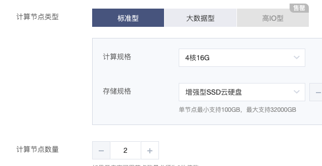
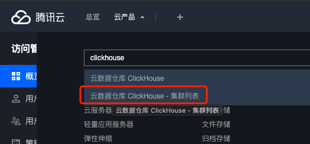
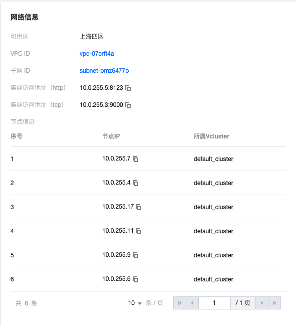
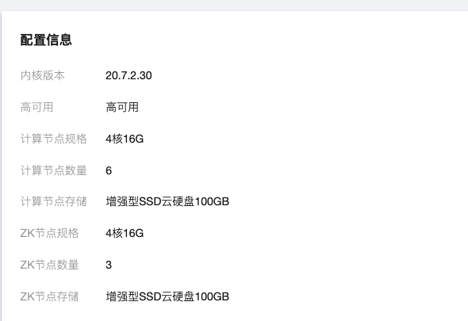
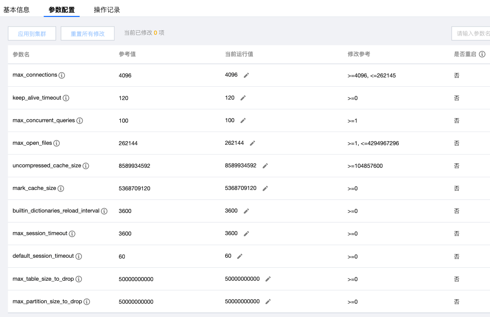
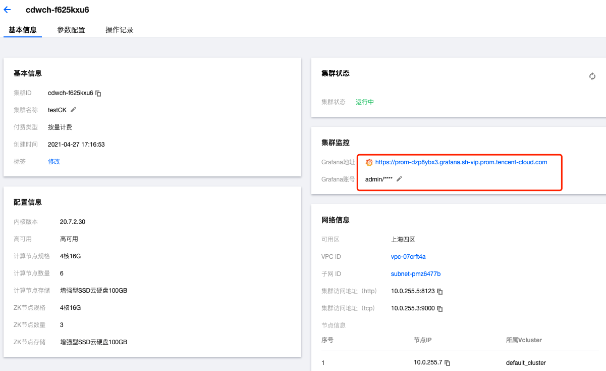
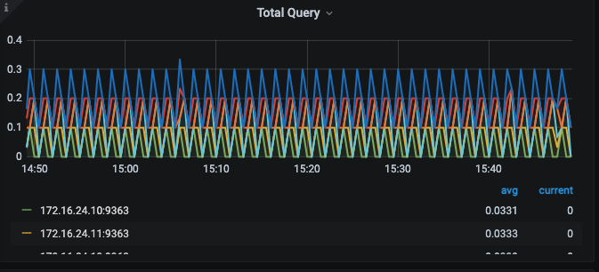
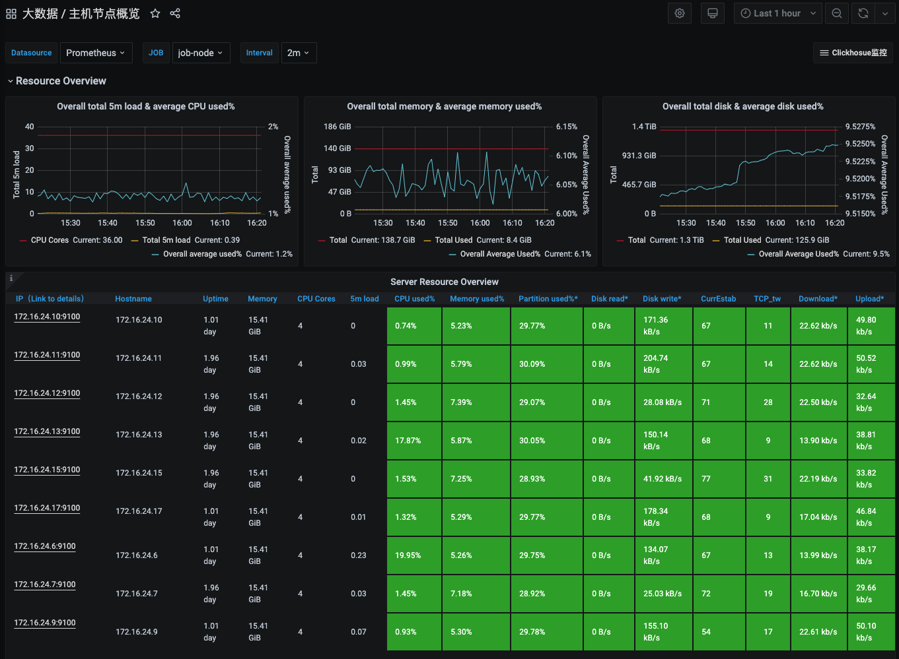

# CDW ClickHouse 体验报告                              

- Jasong(宋恩杰)

弹性 MapReduce（EMR）结合云技术和 Hadoop、Hive、Spark、Hbase、Presto、Flink、Druid、ClickHouse 等社区开源技术，提供安全、低成本、高可靠、可弹性伸缩的云端泛 Hadoop 大数据架构。您可以在数分钟内创建安全可靠的专属 Hadoop 集群，以分析位于集群内数据节点或对象存储 COS 上的 PB 级海量数据。


## 1 文档


### 1 EMR 概念


- 问题描述

MapReduce 引擎，我们这边包括了 Hadoop,Hive 等离线存储引擎，Flink、Druid、ClickHouse 等实时引擎。引擎而言也不完全都属于MapReduce引擎。

包含各种大数据组建，但是种类又很多，用Map Reduce直接笼统概括不是特别的恰当

- 改进建议

分开：Hadoop生态、OLTP、OLAP、...

按照组件服务特性分类


### 2 文档位置不一

- 问题描述

clickhouse 存放位置不一 1.存放于 [E-MapReduce ](https://cloud.tencent.com/document/product/589)2. 存放于 云原生数据库[Clickhouse](https://cloud.tencent.com/document/product/1299)

- 改进建议

文档统一存放、用户查看数据来源统一、也便于更新管理


### 3 文档特性化不足

- 问题描述

文章可以着重表达产品功能、使用方法、开发手册等功能

- 改进建议

丰富以上功能


### 4 无应用场景文档

- 问题描述

需要完善ClickHouse 可解决的一些典型场景的解决方案

- 改进建议

针对一些典型场景 如点击流、PV、UV、更新、增量、全量、人群圈选场景给出解决方案


### 5 文档不够完善

- 问题描述

用户使用手册、典型案例、查询时间、高可用、更新、注意事项.. 文档不够完善

- 改进建议

丰富以上文档


## 2 创建集群


### 1 节点定义问题

- 问题描述

clickhouse 计算节点数量 描述问题，clickhouse 节点不仅包含计算、包括存储、管理、查询...



- 改进建议

计算节点数量改为节点数量或者clickhouse 节点数量


### 2 集群版本较老

- 问题描述

目前集群版本在 20.7 ,社区最新版本在 21.3


- 解决方案

支持社区最新版本


### 3 节点数量、分布数量问题

- 问题描述

是否需要对客户提供 clickhouse分片、副本问题

副本固定的情况、用户的QPS还是有一定限制的


- 改进建议

需讨论是否需添加 分片、副本参数


### 4 用户选择集群配置

- 问题描述

用户集群创建可以为两阶段提交，客户在创建集群的时候，可能并不了了解自己需求、应该创建一个多大的集群，是用户的首要问题

- 改进建议

我们可以跟进用户的存储量、QPS、写入等等为用户提供一个合理的资源值供用户参考


### 5 Zookeeper

- 问题描述

集群创建时，zookeeper 节点是否展示


### 6 Grafana

- 问题描述

grafana 是否需要选择，是否应该自动添加

grafana 密码没有提示下划线不可用问题

grafana 密码是否需要提供

- 改进建议

grafana 自动提供监控视图

grafana 密码含有下划线创建失败问题

grafana 密码无需填写


## 3 用户操作

### 1 用户集群使用问题

- 问题描述

思考如何更方便快捷的使用和连接集群，目前用户需要自己安装clickhouse client 客户端

- 在集群所在网段内选择一台云服务器，在该云服务器内

   

  下载 ClickHouse-client

  ```
  wget https://repo.yandex.ru/clickhouse/rpm/stable/x86_64/clickhouse-client-20.7.2.30-2.noarch.rpm
  wget https://repo.yandex.ru/clickhouse/rpm/stable/x86_64/clickhouse-common-static-20.7.2.30-2.x86_64.rpm
  ```

- 安装客户端。

  ```
  rpm -ivh *.rpm
  ```

- 改进建议

体验感受、链接集群

需要用户自己创建和链接vpc、需要用户自己安装clickhouse client 客户端


### 2 数据安全问题

- 问题描述

客户端连接集群 没有用户名密码，这里是否涉及用户数据安全性问题

- 改进建议


### 3 集群问题

- 问题描述

集群名称固定为 default_cluster 、是否可以自定义、在哪里自定义

和可能用户创建了很多个集群、连接后不能及时发现自己链接是哪个集群、有误操作的可能

- 改进建议

根据集群名称创建集群 或者用户链接集群使用集群名称链接或固定的域名..


### 4 QUOTA 集群稳定性问题

- 问题描述

对集群来说，用户的写入、查询 并发类的控制并不是完全合理，很容造成集群直接崩溃、假死、CPU打满、甚至集群不可用的情况

如何在集群高负荷的情况保证集群能够work、quota ，memory 能参数控制是非常重要的

- 解决方案

需用户提供数据、根据用户和集群资源设置合理的阈值


### 5 辅助表

- 问题描述

集群初始化后、和用户自己创建的集群差别无二，没有一些分布式的辅助类表

- 解决方案

自动创建部分system distributed table 

可以将clickhouse 查询接入grafana 提供一些全局的dashboard


### 6 macros - 存算分离

```sql
select * from system.macros;

SELECT *
FROM system.macros

┌─macro───┬─substitution─┐
│ layer   │ default      │
│ replica │ 172.16.24.11 │
│ shard   │ 1            │
└─────────┴──────────────┘
```

- 问题描述

Replica 决定了副本表元数据在ZooKeeper的固定存储位置

如果后期进行存算分离、读写分离。固定的ip尽量不要出现在配置里面的

- 解决方案

shard、replica 用数字定义、起别名类似的情况


## 4 产品


### 1 无管控工具


### 2 集群列表

- 问题描述

用户集群列表 不太容易找到 不能在个人账号下查找到,需要搜索找到，这里可能是个人体验时没发现



- 解决方案

提供


### 3  chproxy



```sql
172.16.24.13 :) select * from system.clusters;

SELECT *
FROM system.clusters

┌─cluster─────────┬─shard_num─┬─shard_weight─┬─replica_num─┬─host_name────┬─host_address─┬─port─┬─is_local─┬─user────┬─default_database─┬─errors_count─┬─estimated_recovery_time─┐
│ default_cluster │         1 │            1 │           1 │ 172.16.24.13 │ 172.16.24.13 │ 9000 │        1 │ default │                  │            0 │                       0 │
│ default_cluster │         1 │            1 │           2 │ 172.16.24.11 │ 172.16.24.11 │ 9000 │        0 │ default │                  │            0 │                       0 │
│ default_cluster │         2 │            1 │           1 │ 172.16.24.9  │ 172.16.24.9  │ 9000 │        0 │ default │                  │            1 │                       0 │
│ default_cluster │         2 │            1 │           2 │ 172.16.24.17 │ 172.16.24.17 │ 9000 │        0 │ default │                  │            0 │                       0 │
│ default_cluster │         3 │            1 │           1 │ 172.16.24.10 │ 172.16.24.10 │ 9000 │        0 │ default │                  │            1 │                       0 │
│ default_cluster │         3 │            1 │           2 │ 172.16.24.6  │ 172.16.24.6  │ 9000 │        0 │ default │                  │            1 │                       0 │
└─────────────────┴───────────┴──────────────┴─────────────┴──────────────┴──────────────┴──────┴──────────┴─────────┴──────────────────┴──────────────┴─────────────────────────┘

6 rows in set. Elapsed: 0.002 sec.
```

- 问题

chproxy 配置貌似只配置了 shard1分片的节点，没有配置其他shard的配置

- 解决方案

添加


### 4 参数配置





```sql
SELECT
    name,
    value
FROM system.settings
WHERE name LIKE '%mem%'

┌─name───────────────────────────────────────┬─value───────┐
│ insert_in_memory_parts_timeout             │ 600000      │
│ distributed_aggregation_memory_efficient   │ 0           │
│ aggregation_memory_efficient_merge_threads │ 0           │
│ memory_tracker_fault_probability           │ 0           │
│ max_memory_usage                           │ 10000000000 │
│ max_memory_usage_for_user                  │ 0           │
│ max_untracked_memory                       │ 4194304     │
│ memory_profiler_step                       │ 0           │
│ memory_profiler_sample_probability         │ 0           │
│ max_memory_usage_for_all_queries           │ 0           │
└────────────────────────────────────────────┴─────────────┘

10 rows in set. Elapsed: 0.003 sec.
```


- 问题描述

参数未能按照集群资源 合理配置

- 解决方案

适配


## 5 监控


### 1 Grafana 



- 问题描述

单个用户可能有多个clickhouse集群，用户没有统一全局的grafana 看板

- 解决方案

从用户、用户组维度 设置grafana 看板权限


### 2 ip不统一




```sql
SELECT *
FROM system.clusters

┌─cluster─────────┬─shard_num─┬─shard_weight─┬─replica_num─┬─host_name────┬─host_address─┬─port─┬─is_local─┬─user────┬─default_database─┬─errors_count─┬─estimated_recovery_time─┐
│ default_cluster │         1 │            1 │           1 │ 172.16.24.13 │ 172.16.24.13 │ 9000 │        0 │ default │                  │            0 │                       0 │
│ default_cluster │         1 │            1 │           2 │ 172.16.24.11 │ 172.16.24.11 │ 9000 │        0 │ default │                  │            0 │                       0 │
│ default_cluster │         2 │            1 │           1 │ 172.16.24.9  │ 172.16.24.9  │ 9000 │        0 │ default │                  │            0 │                       0 │
│ default_cluster │         2 │            1 │           2 │ 172.16.24.17 │ 172.16.24.17 │ 9000 │        1 │ default │                  │            0 │                       0 │
│ default_cluster │         3 │            1 │           1 │ 172.16.24.10 │ 172.16.24.10 │ 9000 │        0 │ default │                  │            0 │                       0 │
│ default_cluster │         3 │            1 │           2 │ 172.16.24.6  │ 172.16.24.6  │ 9000 │        0 │ default │                  │            0 │                       0 │
└─────────────────┴───────────┴──────────────┴─────────────┴──────────────┴──────────────┴──────┴──────────┴─────────┴──────────────────┴──────────────┴─────────────────────────┘

6 rows in set. Elapsed: 0.002 sec.
```


- 问题描述

grafana 看板与产品看板节点ip显示不统一

集群名称单一

- 解决方案

对用户统一节点信息


### 3 指标

- 点赞 主机节点概览界面



- 改进

可以加入 读、写等关键信息

慢查询看板展示 ，便于用户排查问题


