**导读：**随着大数据的持续发展及数字化转型的兴起，大数据OLAP分析需求越来越迫切，不论是大型互联网企业，还是中小型传统企业，都在积极探索及实践OLAP引擎选型及平台架构建设，大数据技术的蓬勃发展过程中产生了大量优秀的OLAP引擎，其带来的好处是，大家在做OLAP架构是可以有多种选择，其带来的弊端是，如何在众多OLAP引擎中选择适合业务需求的现状及后续发展，成为解决这一行业性难题的关键能力。今天会和大家分享下贝壳OLAP平台架构及演进。

今天的分享会围绕下面三点展开：

- OLAP平台架构演化历程
- OLAP引擎选型
- 未来工作规划

**01**

**OLAP平台架构演化历程**

首先和大家分享OLAP平台架构演化历程，贝壳的OLAP平台架构发展历程大概可分成三个阶段。

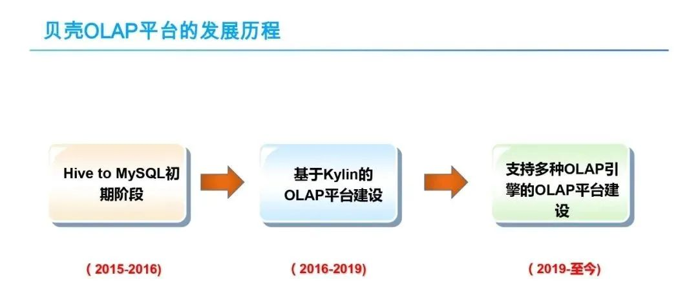

第一个阶段是2015年到2016年中期，我们称之Hive to MySQL初级阶段；第二个阶段是2016年到2019年初，基于Kylin的OLAP平台建设阶段，这个阶段OLAP平台建设是围绕Kylin引擎来进行的，Kylin是唯一支持的OLAP引擎；第三个阶段是2019到现在，支持多种OLAP引擎的平台建设阶段，该阶段是第二个阶段的增强与扩展，解耦了OLAP平台与Kylin引擎的强耦合，能够灵活支持除Kylin之外的其他OLAP引擎。

**1. 第0阶段-Hive2MySQL初级阶段**

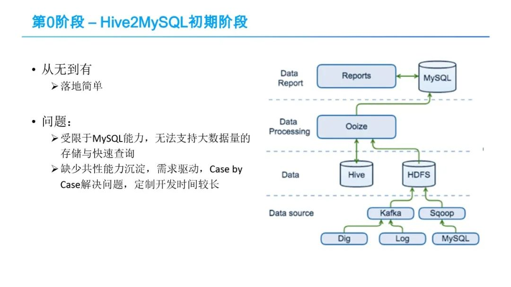Hive2MySQL初期阶段的数据流程很简单，在这个阶段，数据处理流程比较简单，数据包括日志、DB log等，经过Sqoop批量或Kafka实时接入大数据平台HDFS里，在大数据平台进行ETL处理后，通过大数据调度系统Ooize，每天定时写入到关系型数据库MySQL中，然后再以MySQL中的数据为基础产出各种报表。

该阶段是OLAP平台架构从无到有的一个过程，很多公司在初始的时候都是按该架构设计实现，该架构有很鲜明的几个特点：

① 架构简单，找几个初级甚至中级的工程师就能够搭建好，很快能够落地跑通。

② 报表查询性能较差，所有的结果数据都存储在OLTP型的MySQL数据库，MySQL无法支持大数据量的查询，百万级到千万级别数量下，MySQL性能就会明显下降，难以支撑。

③ 需求驱动、高层抽象不足，缺少共性能力的沉淀，case by case的开发模式，即按业务数据需求，从数据采集接入、数据处理、数据调度全流程“烟囱式”开发，没有将共性的数据处理方法或手段沉淀，导致每一个需求的开发时间都会比较长，存在大量重复工作。我们之所以称这个阶段是第0阶段。因为该阶段，没有沉淀共性的数据处理方法，还不具备平台化能力。

随着贝壳业务的迅速发展，数据应用需求的不断增加，数据分析的任务量也越来越重，Hive2MySQL的问题逐步暴露，对这种原始架构进行升级改造是一个必然的选择。改造的目标很直接，解决MySQL无法支持海量数据分析查询的问题；第二就是要平台化，沉淀共性能力。

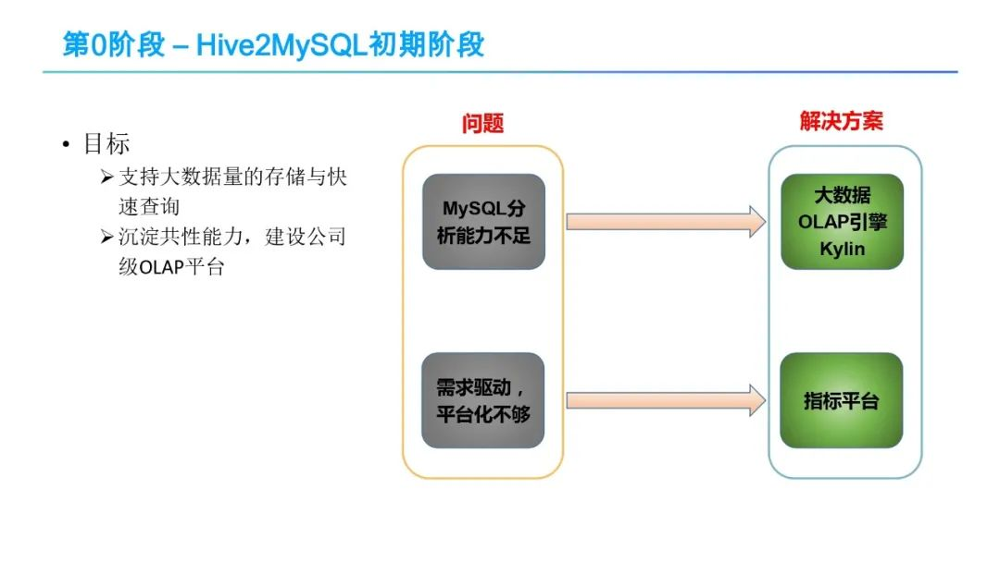对于第一个MySQL分析能力不足问题的问题，解决思路很直接，就是引入一个能够支持大数据量的OLAP引擎，这块经过一系列对比调研，我们选择了Kylin，后面会有介绍。

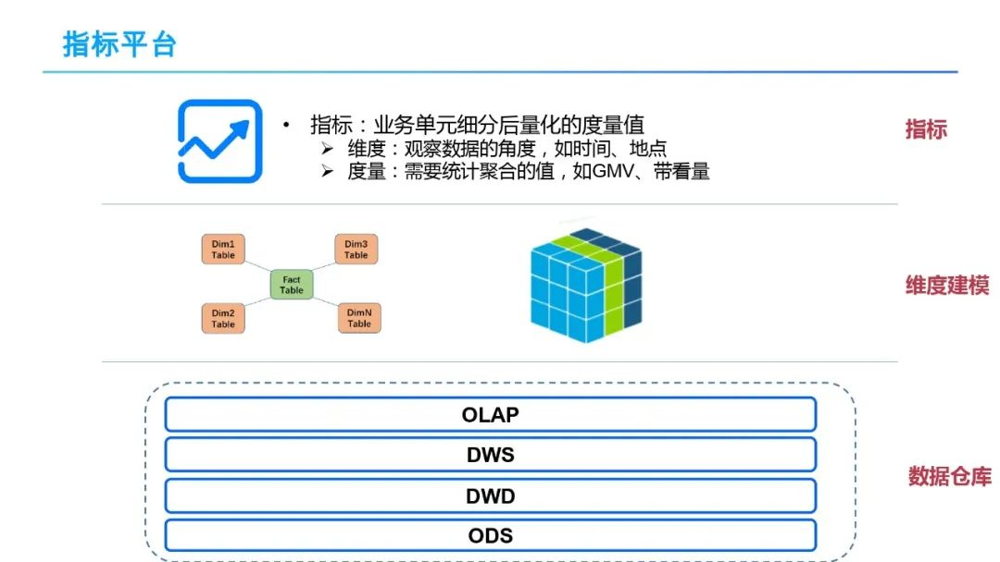

对于需求驱动、缺少共性沉淀，平台化不够的问题，我们一方面规范化数仓建模，沉淀一些可复用性的中间层表，即借鉴业界通用经验分为ODS、DWD、DWS、OLAP等层，鉴于时间关系，就不详细介绍每一层内容；另一方面引入了一个指标和指标平台，通过指标来向公司各业务线提供数据分析服务。指标是业务单元细分后量化的度量值，包括维度（即看数的角度）和度量（需要统计聚合的值）。指标平台将数仓开发人员的维度建模（星型或雪花模型）暴露成业务方容易理解的指标。

**2. 第1阶段-基于Kylin的OLAP平台架构**

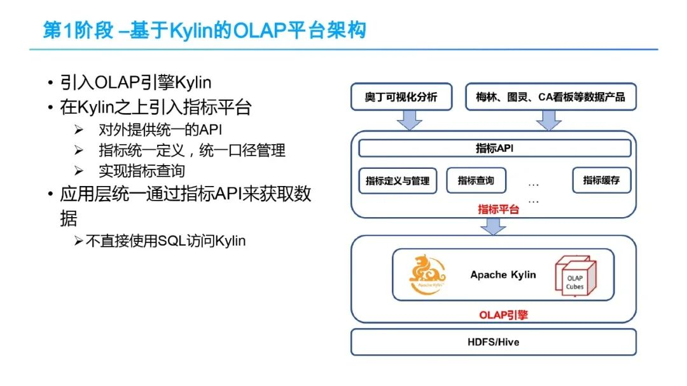

基于前面所述的思考，就有了我们第1阶段，基于Kylin的OLAP平台架构。OLAP平台的架构如上图所示，从底向上分为3层：1、 OLAP引擎层，这里就是Apache Kylin，只支持Apache Kylin引擎；2、在Kylin之上是指标平台，它对外提供统一API、指标统一定义和口径管理以，支持指标的高效查询；3、在最上面是应用层，就是奥丁（这是我们一个数据可视化产品）和各种数据应用产品，它们通过统一的指标API来获得数据，不直接使用SQL访问Kylin。另外，Kylin下面的Hive数据仓库层，里面有ODS、DWD、DWS、OLAP各层数仓表，这里就不仔细介绍了。

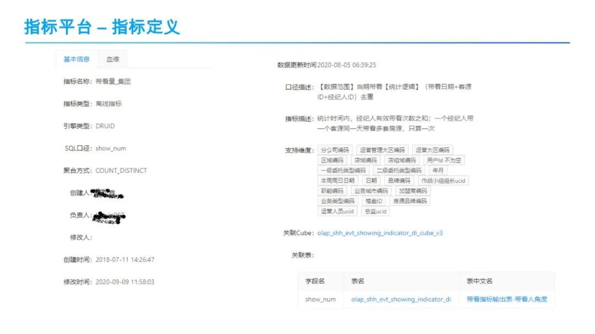

接下来，介绍指标平台中指标定义功能，每个指标通过很多维度去描述，上图展示了一个指标包含基本信息及血缘，基本信息包含指标名称，如带看量_集团？因为贝壳是一个房产相关的公司，就是卖房租房都要带客去看，所以这是一个很重要的一个指标。比较关键的信息是，关注指标的支持维度，就是说允许业务方从哪些维度去看数据，例如分公司编码维度，代表一个分公司的带看量，运营管理大区编码维度，代表运营管理大区的带看量，也可以查看区域的带看量，可以看某个具体人的带看量，可以看到20多个维度的带看量。另外比较关键的信息，指标的口径描述了指标计算方式。通过这个指标定义，可以方便的了解到指标信息及直观定义。

在前面提到，指标是指是对维度建模（星型或雪花模型）的抽象，指标包括维度和度量，分别对应维度建模中的度量和维度。在这里我们看一个指标的具体示例，例如，“带看量_集团”指标，可以看到它的度量是对show_num字段count distinct排重计数，支持的近20个维度，包括分公司编码维度， 运营管理大区编码等维度，支持从组织架构的不同层级查看集团带看量。另外还可以看到许多使用指标时需要了解的重要信息，例如指标的口径描述了指标计算方式。

指标定义中，指标可以分成三类，第一类是原子指标，即基础指标；第二类是派生指标，对于一个已有的指标，不管是原子还是派生的还是复合的，都可以对它进行再派生，加一些条件，就可以得到一个新的派生指标；第三类就是复合指标，通过指标四则运算生成新的指标。

上图中右侧部分，以“带看量_集团“指标为基础，在它之上定义了很多的派生指标，这图也是指标血缘关系的一个展示，比如说”德佑带看贝壳房源量“指标是对“带看量_集团“指标加上”经纪人是德佑“和”房源是贝壳“两个限制条件派生得到的。同样”链家带看贝壳房源量“也是一个类似的派生指标。上图中“二看占比_集团“，是一个复合指标，是”带看量_集团“与”二看量_集团指标“基础指标的求和。

所有的指标的定义和口径都是在指标平台进行管理的。各个业务方都主要通过在OLAP平台上定义和使用指标，来实现多维数据分析的。

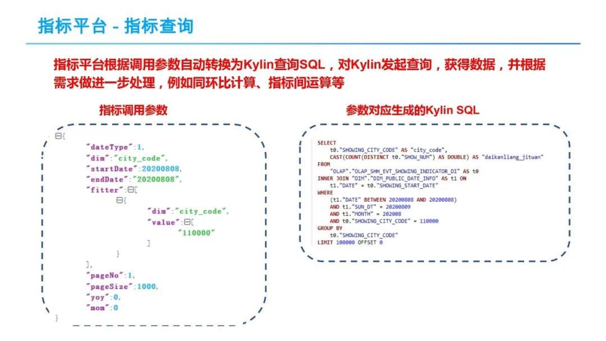

接下来我们看一下指标查询，前面有说过，指标平台对外提供统一的API来获取指标数据，上图就是一个指标调用参数示例，参数传到指标平台，指标平台会根据调用参数自动转换为Kylin查询SQL，对Kylin发起查询，获得数据，并根据需求做进一步处理，例如同环比计算、指标间运算等。左图中的示例调用参数，转化成对应的Kylin SQL如右图所示。

如图所示，左边的指标调用参数，通过Json的形式描述,阅读起来很直观。比如startDatae 为开始日期，endDate为截止日期，描述了需要查询哪个时间范围的指标数据；filter表示过滤条件，例如city_code等于11000，表示要查看北京的带看量。Json中还可以配置是否分页，是否需要计算同环比。Json查询参数传送到指标平台，指标平台负责将调用参数转换成对底层OLAP查询引擎Kylin的查询语句。从生成的Kylin SQL中可以看到，startDate及endDate被转换成了一个SQL中的过滤条件，dim描述的city_code转换为groupby聚合语句。参数与SQL的这类转换映射关系，在指标开发的时候，通过在Kylin的Cube模型里面定义的，调用人员就不需要显示指定。为了提高查询性能，Kylin也会做一些维度补全的工作，如示例中的sun_dt及month这类层级维度。

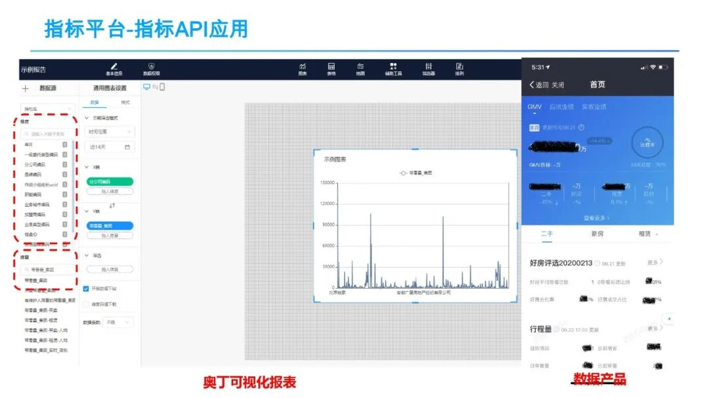

接下来看一下指标的应用，指标完成开发之后，就可以在奥丁可视化平台（贝壳内部的可视化平台）中利用指标配置各种报表，也可以自己开发数据应用产品，在产品里调用指标API获取数据。

上图展示了利用指标在奥丁可视化平台中配置报表的救命，通过在数据源中选择一个指标，指标对应的维度和度量呈现出来。通过拖拽维度、度量便能快速完成报表。另外贝壳内部也有大量的数据产品通过调用指标API来获取指标数据。

**3. Kylin选型及简介**

介绍指标之后，简单介绍贝壳第二阶段OLAP平台，为什么要选择Kylin？根据第一阶段的问题，我们的需求是：1）支持百亿级别大数据量，2）比较快的响应时间，3）能够支持较高的并发。通过选型测试Kylin正好满足我们的3个需求。Kylin的详细介绍见以下PPT。

Kylin的核心思想就是预计算，对多维分析可能用到度量进行预计算，把预计算的结果存在保存Cube中，供后续查询。Kylin的整体架构如上图所示，主要包括三个模块：

① Metadata管理模块：预算首先需要知道怎么去预计算，也就是需要知道有哪些维度和度量，Kylin 通过要求用户首先定义Cube来获得这些信息，Cube定义支持星型或雪花模型，由Metadata模块管理；

② Cube Build Engine：提供Cube构建引擎做预计算，支持MR引擎、Spark引擎、Flink引擎，将预计算的结果存储到HBase中；

③ 查询引擎（Query Engine）：用户可以通过REST API及JDBC/ODBC来查询Kylin，利用SQL来查询Cube数据，Kylin的Query Engine会把SQL等查询请示自动转化为对底层HBase的查询。

预计算的一个最大的问题就是“维度爆炸”，也就维度组合太多，计算量过大。Kylin提供了很多优化技巧来缓解这个问题。Kylin的大概原理就是这样，其实这种方法并不是Kylin发明了，只是Kylin基于大数据平台来实现了这一套，使得它可以支持海量的数据，而之前基于这种预计算方式的引擎支持的数据量很有限。

这样，在OLAP平台就建立了标准的指标开发流程。整个流程如上图所示。从上面的流程上看：有在Kylin中操作的部分，也有在指标平台操作的部分。这也是为什么说是围绕Kylin来构建的ＯＬＡＰ平台。

经过两三年推广，基于Kylin的OLAP平台在公司得到了较广泛的应用，基本上支撑整个公司指标体系的建立，覆盖了所有的业务线。目前，平台上有6000多个指标，日均的调用量大概2000万以上。99.5%的指标调用3内返回。

在Kylin使用过程中，为了保障Kylin的稳定性及提升Kylin构建和查询性能，贝壳也围绕Kylin做了很多工作，主要包括：

- Kylin监控管理平台建设
- Kylin优化与定制改造
- Kylin与公司内部大数据系统的整合

也有把相关的优化反馈给社区。

目前，Kylin在贝壳的应用现状如下：大概有800多个Cube，300多TB的存储量，总的数据量大约1600亿以上，单个Cube最大有60个亿以上；日查询2000万+。Kylin的实例大概在100以上，30个以上HBase节点。关于Kylin的介绍就简单介绍到这里，如果需要了解更多Kylin在贝壳的应用情况，可以参考我们公司张如松、冯亮等其他同事之前关于Kylin的分享内容。

**4. 面临新的问题**

那么到这里为止的话，是不是问题都解决了呢？不是。在指标大量推广使用后，业务方也反馈了许多的问题。简单总结一下，主要包括一下几个方面：

① 指标支持的维度数量有限，很多业务方的指标一般有30-40个维度；为了满足需求，数仓开发人员只能把一个指标拆成几个指标，限制每个指标的维度数量，导致指标维护和管理困难；

② Cube构建时间长，特别是数据规模增大以后，导致指标的产出时间较晚；

③ 灵活性不够，每次修改Cube（维度变更）需全量回刷Cube，耗时时间长；

④ 性能优化困难，Kylin基于HBase存储预计算结果，Rowkey的设计对性能影响很大，性能可以相差几十上百甚至上千倍。指标的开发人员往往是一些数仓人员，对HBase的理解不够深刻，难以进行性能优化；

⑤ 不支持实时指标，Kylin3.0引入了实时指标支持；

通过分析，我们总结出，问题的根源在于Kylin的预计算原理，全量预计算，一方面计算量大，耗时长；另外一方面如有部分变更就需要重算，如果只依赖Kylin是没法解决的。因此，我们认为单一Kylin引擎无法满足公司不同业务场景下的应用需求，OLAP平台需要能够针对不同的业务场景使用不同的OLAP引擎。

**5. 第3阶段-支持多种OLAP引擎的OLAP平台**

为了支持新的OLAP引擎，需要升级第2阶段OLAP平台架构，这样就到了第3阶段-支持多种OLAP引擎的OLAP平台，其架构如下图所示：

这个阶段OLAP平台将实现以下几个目标：

- 能够灵活支持各种引擎，可插拔OLAP引擎绑定；
- 指标平台与OLAP引擎解耦，支持动态切换OLAP引擎。

如架构图所示，引入了其他的引擎，如Druid、Clickhouse、Doris，中间增加查询引擎层，其中标红的是Cube管理负责管理Kylin中迁移过来的指标。统一指标API屏蔽了底层接口，保证兼容性，应用层保持不变。

新架构中，具体改动的几个关键点是：

① 统一Cube定义与管理，将Cube定义和管理从Kylin中解耦到指标平台中。为了兼容用户的使用习惯，指标平台设计中参考Kylin、Mondrian等Cube定义原理，在指标平台及底层OLAP引擎中引入抽象层，实现Cube动态绑定到不同的OLAP引擎。

② 查询引擎，在指标平台与底层OLAP引擎之间引入统一的查询接口，屏蔽不同引擎查询语言的差异，保证数据应用层，如奥丁可视化、图灵等数据应用产品也不受底层多引擎切换影响。查询引擎把统一的查询请求转换到特定的一个引擎，同时，提供路由、垄断能力。

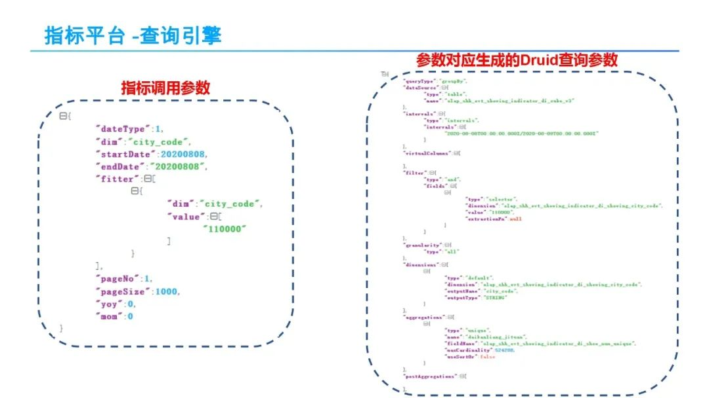

查询引擎会根据传入的指标调用参数自动生成不同引擎的查询语句，指标平台不用再承担这部分工作。

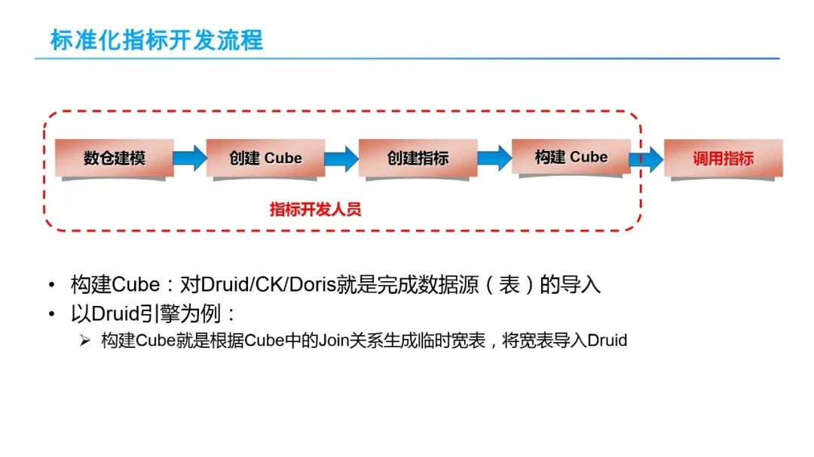

这样一来，指标开发流程变得更加通用，虽然各个节点都不变，但是所有的工作都是在我们指标平台上实现，不用强依赖Kylin。整个开发流程语义是有些变化，比如对于Kylin构建Cube语义，是真实的执行预计算。对于Druid/CK/Doris等构建Cube，就是一个数据源（表）导入。具体而言，Druid引擎构建Cube，就转换为根据Cube中的Join关系生成宽表，指标平台会把对指标的查询转换照宽表查询。针对Doris引擎，支持较好的关系关联Join查询，就不用转换为宽表，直接把几个维表和事实表都导入，直接执行Join查询。因此，不同的引擎有不同的语义。

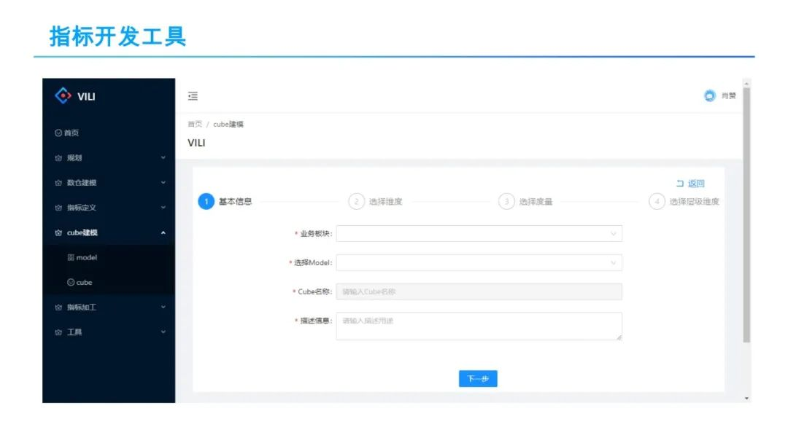

为了更好的实现指标开发，我们开发了一站式指标开发工具VILI，整个指标开发过程，包括数仓规划和建模，Cube建模，指标定义、指标加工，复合指标加工等都在该工具上实现。类似于实现阿里的OneData体系。

现在 OLAP 平台能够灵活地支持不同的 OLAP 引擎，那该选择哪些 OLAP 引擎？这就到了我们要分享的第 2 部分 OLAP 引擎选型与实践。

**02**

**OLAP平台架构演化历程**

OLAP 选型一般关注三个方面：

① 数据量：能支持多大量级的数据量，例如 TB 级甚至更大；

② 查询性能，一是响应时间快不快，是否支持亚秒级响应；二是支持的 QPS，在高 QPS 的情况下整体查询的性能怎么样；

③ 灵活性：灵活性没有具体的标准， OLAP 引擎是否支持 SQL、是否支持实时导入、是否支持实时更新、是否支持实时动态变更等等，这些都是灵活性的体现，具体要求是根据自己的应用需求来确定；

一般认为，目前没有一种开源 OLAP 引擎能够同时满足这三个方面，在 OLAP 引擎选型时，需要在这三个方面之间进行折衷，三选二。

上图中给出了一些常见的开源 OLAP 引擎。目前开源 OLAP 引擎数量比较多，往好的说是百花齐放，但其实也说明了这块很混乱。我们对它们进行了一个大概的分类，分类原则第一是看它的架构原理，MPP 或批处理等；第二看是否有自定义的存储格式，管理自己的数据，即是否存储与计算分离。首先是 SQL on Hadoop，它又可以分为两类：第一类是 SQL on Hadoop – MPP，基于 MPP 原理实现的引擎，像 Presto、Impala、Drill 等，这类引擎的特点是通过 MPP 的方式去执行 SQL，且不自己管理存储，一般是查 HDFS，支持 Parquet 或 ORC 通用列式存储格式；它可以支持较大的数据量，具有较快的响应时间，但是支持的 QPS 不高，往往具有较好的灵活性，支持 SQL、Join 等；第二类是 SQL on Hadoop – Batch，也就是 Spark SQL 或 Hive，其原理是把 SQL 转换成 MR 或 Spark 任务执行，可以支持非常大的数据量，灵活性强，对 SQL 支持度高，但是响应时间较长，无法支持亚秒级响应；另外一类是存储计算不分离，即引擎自己管理存储的，其架构可能基于 MPP 或 Scatter-Gatter 的或预计算的，这类 OLAP 引擎的特点是，可以支持较大的数据量，具有较快的响应时间和较高的 QPS，灵活性方面各 OLAP 不同，各有特点，例如，有些对 SQL 支持较好，有些支持 Join，有些 SQL 支持较差。

了解这些之后，再结合我们的业务需求进行权衡。公司业务方一般对响应时间和 QPS 要求均较高，所以基本只能在自带存储引擎里的类型中选择。Kylin 是已经在用，其他的我们主要关注了 Druid，Clickhouse 和 Doris，其比较如下图所示。

对于数据量和查询性能（包括响应时间和高并发），这几个引擎的支持都是不错的，可以满足公司 TB 级的需求。灵活性关注的几个方面主要包括对 SQL 的支持、实时数据导入、实时更新、Online Schema 变更等特性，这些是在业务需求处理中经常需要用到的特性。接下来我简单介绍一下这几个引擎以及其在贝壳的应用情况，由于时间有限，将主要介绍 Druid。

目前 Druid 主要用于离线指标，实时指标还在测试，大概承担了平台 50% 左右的流量，性能还不错，3s 的返回率大概在 99.7%。相比于 Kylin，Druid 引擎在 Cube 构建速度和存储空间使用方面均有较大的优势，能够有效解决 Cube 构建时间长，指标产出较晚，和指标变更耗时的问题。

下图给出了以目前在 Druid 平台上访问量 Top 12 的表（Datasource）为对象，对比分析它们在 Kylin 和 Druid 上的数据导入时长和数据膨胀率情况。

从上图可以看出，大部分表的 Cube 构建时长在 Druid 要比在 Kylin 上快 1 倍以上，而对一些维度多、基数大的表，Kylin 的预计算量巨大，Druid 上的导入时间要比 Kylin 上快 3、4 倍。

从上图可以看出，Kylin上数据的膨胀率远大于Druid，一般是几倍，十几倍，甚至几百倍，这也是由Kylin的原理（即用空间换时间）所决定的。

与 Kylin 类似，围绕 Druid 引擎我们做了很多工作，也主要包括以下 3 个方面：

lDruid 监控管理平台建设：及时发现和解决 Druid 各种线上问题，保障平台的稳定；

lDruid 优化与定制改造：增加精确去重功能支持、大查询监控与处理、数据导入优化、查询优化等；

lDruid 与公司内部大数据系统的整合：和公司大数据系统、元数据管理平台、调度系统等内部系统进行整合；

这方面工作，由于时间关系，此处不再详述。有机会可以单独交流讨论。

CK 和 Doris 就不过多介绍了，都是基于 MPP 的，有自定义的存储格式。目前主要用于实时指标和明细数据查询，承担了小部分流量，在 1%-2% 左右，现在还在进一步深度测试中。

**03**

**未来工作规划**

现在整个 OLAP 平台的基本架构已经确定了，能够支持 Druid、Clickhouse、Doris 等不同引擎，下一步工作将主要包括以下几个方面：

- 推广应用 Druid、Clickhouse、Doris 等不同引擎，进一步完善各 OLAP 引擎监控管理平台，优化和完善引擎能力；
- 实现多个 OLAP 引擎的智能路由，能够根据数据量、查询特征（例如 QPS 等）之间做自动/半自动的迁移和路由；
- 与 Adhoc 平台实现融合，对一些频率高查询慢的查询可以路由到 OLAP 平台上；
- 进一步完善和优化实时指标支持，目前实时指标只是基本上把整个流程走通了，引入多种 OLAP 引擎后将进一步考虑如何更好的支持实时指标。

**今天的分享就到这里，谢谢大家。**

------

在文末分享、点赞、在看，给个3连击呗~

------

**分享嘉宾：**

****

**肖赞**

贝壳 | 资深工程师

肖赞，贝壳找房数据智能中心资深研发工程师。毕业于北京大学，获得博士学位。在分布式系统、JavaEE中间件和大数据系统等方面有多年的研究和实践经验，拥有完整的大数据平台和基础架构研发经验，对分布式存储、数据平台架构、数据仓库等领域有深入的理解和丰富的实践经验。