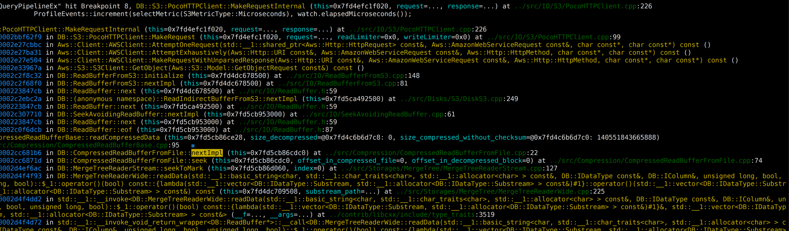

```c++
/// It's safe to access children without mutex as long as these methods are called before first call to `read()` or `readPrefix()`
Block IBlockInputStream::read();
  
Block readImpl() override;

void ISource::work();

std::optional<Chunk> ISource::tryGenerate();

Chunk MergeTreeBaseSelectProcessor::generate();

Chunk MergeTreeBaseSelectProcessor::readFromPart();

Chunk MergeTreeBaseSelectProcessor::readFromPartImpl();

MergeTreeRangeReader::ReadResult MergeTreeRangeReader::read(size_t max_rows, MarkRanges & ranges);

/// Returns the number of rows added to block.
size_t MergeTreeRangeReader::DelayedStream::read(Columns & columns, size_t from_mark, size_t offset, size_t num_rows);

size_t MergeTreeRangeReader::DelayedStream::finalize(Columns & columns);

size_t MergeTreeRangeReader::DelayedStream::readRows(Columns & columns, size_t num_rows);

/// Return the number of rows has been read or zero if there is no columns to read.
/// If continue_reading is true, continue reading from last state, otherwise seek to from_mark
size_t MergeTreeReaderWide::readRows(size_t from_mark, bool continue_reading, size_t max_rows_to_read, Columns & res_columns);

void MergeTreeReaderWide::readData(
    const NameAndTypePair & name_and_type, ColumnPtr & column,
    size_t from_mark, bool continue_reading, size_t max_rows_to_read,
    ISerialization::SubstreamsCache & cache);

void MergeTreeReaderStream::seekToMark(size_t index);

void CompressedReadBufferFromFile::seek(size_t offset_in_compressed_file, size_t offset_in_decompressed_block);

bool CompressedReadBufferFromFile::nextImpl();

/// Read compressed data into compressed_buffer. Get size of decompressed data from block header. Checksum if need.
/// Returns number of compressed bytes read.
size_t CompressedReadBufferBase::readCompressedData(size_t & size_decompressed, size_t & size_compressed_without_checksum, bool always_copy);

    /** Unlike std::istream, it returns true if all data was read
      *  (and not in case there was an attempt to read after the end).
      * If at the moment the position is at the end of the buffer, it calls the next() method.
      * That is, it has a side effect - if the buffer is over, then it updates it and set the position to the beginning.
      *
      * Try to read after the end should throw an exception.
      */
    bool ALWAYS_INLINE eof()
    {
        return !hasPendingData() && !next();
    }


    /** read next data and fill a buffer with it; set position to the beginning;
      * return `false` in case of end, `true` otherwise; throw an exception, if something is wrong
      */
    bool next()
    {
        assert(!hasPendingData());
        assert(position() <= working_buffer.end());

        bytes += offset();
        bool res = nextImpl();
        if (!res)
            working_buffer = Buffer(pos, pos);
        else
            pos = working_buffer.begin() + nextimpl_working_buffer_offset;
        nextimpl_working_buffer_offset = 0;

        assert(position() <= working_buffer.end());

        return res;
    }

```


