# ClickHouse Create Table


## clickhouse 可以怎么建表

```sql
1. create table 
2. create table as tableA
3. attach table 
4. create table to tableA
5. create table as select ... from table 
6. ...
```

- TCP Server 

ClickHouse 堆栈

```c++
DB::TCPHandler::runImpl() TCPHandler.cpp:189
DB::TCPHandler::run() TCPHandler.cpp:1624
Poco::Net::TCPServerConnection::start() TCPServerConnection.cpp:43
Poco::Net::TCPServerDispatcher::run() TCPServerDispatcher.cpp:115
Poco::PooledThread::run() ThreadPool.cpp:199
Poco::(anonymous namespace)::RunnableHolder::run() Thread.cpp:55
Poco::ThreadImpl::runnableEntry(void*) Thread_POSIX.cpp:345
_pthread_start 0x00007fff2037f950
thread_start 0x00007fff2037b47b
```


```c++
DB::ParserCreateViewQuery::parseImpl(DB::IParser::Pos&, std::__1::shared_ptr<DB::IAST>&, DB::Expected&) ParserCreateQuery.cpp:788
DB::IParserBase::parse(DB::IParser::Pos&, std::__1::shared_ptr<DB::IAST>&, DB::Expected&)::$_0::operator()() const IParserBase.cpp:13
bool DB::IParserBase::wrapParseImpl<DB::IParserBase::parse(DB::IParser::Pos&, std::__1::shared_ptr<DB::IAST>&, DB::Expected&)::$_0>(DB::IParser::Pos&, DB::IParserBase::IncreaseDepthTag, DB::IParserBase::parse(DB::IParser::Pos&, std::__1::shared_ptr<DB::IAST>&, DB::Expected&)::$_0 const&) IParserBase.h:31
DB::IParserBase::parse(DB::IParser::Pos&, std::__1::shared_ptr<DB::IAST>&, DB::Expected&) IParserBase.cpp:11
DB::ParserCreateQuery::parseImpl(DB::IParser::Pos&, std::__1::shared_ptr<DB::IAST>&, DB::Expected&) ParserCreateQuery.cpp:997
DB::IParserBase::parse(DB::IParser::Pos&, std::__1::shared_ptr<DB::IAST>&, DB::Expected&)::$_0::operator()() const IParserBase.cpp:13
bool DB::IParserBase::wrapParseImpl<DB::IParserBase::parse(DB::IParser::Pos&, std::__1::shared_ptr<DB::IAST>&, DB::Expected&)::$_0>(DB::IParser::Pos&, DB::IParserBase::IncreaseDepthTag, DB::IParserBase::parse(DB::IParser::Pos&, std::__1::shared_ptr<DB::IAST>&, DB::Expected&)::$_0 const&) IParserBase.h:31
DB::IParserBase::parse(DB::IParser::Pos&, std::__1::shared_ptr<DB::IAST>&, DB::Expected&) IParserBase.cpp:11
DB::ParserQueryWithOutput::parseImpl(DB::IParser::Pos&, std::__1::shared_ptr<DB::IAST>&, DB::Expected&) ParserQueryWithOutput.cpp:63
DB::IParserBase::parse(DB::IParser::Pos&, std::__1::shared_ptr<DB::IAST>&, DB::Expected&)::$_0::operator()() const IParserBase.cpp:13
bool DB::IParserBase::wrapParseImpl<DB::IParserBase::parse(DB::IParser::Pos&, std::__1::shared_ptr<DB::IAST>&, DB::Expected&)::$_0>(DB::IParser::Pos&, DB::IParserBase::IncreaseDepthTag, DB::IParserBase::parse(DB::IParser::Pos&, std::__1::shared_ptr<DB::IAST>&, DB::Expected&)::$_0 const&) IParserBase.h:31
DB::IParserBase::parse(DB::IParser::Pos&, std::__1::shared_ptr<DB::IAST>&, DB::Expected&) IParserBase.cpp:11
DB::ParserQuery::parseImpl(DB::IParser::Pos&, std::__1::shared_ptr<DB::IAST>&, DB::Expected&) ParserQuery.cpp:44
DB::IParserBase::parse(DB::IParser::Pos&, std::__1::shared_ptr<DB::IAST>&, DB::Expected&)::$_0::operator()() const IParserBase.cpp:13
bool DB::IParserBase::wrapParseImpl<DB::IParserBase::parse(DB::IParser::Pos&, std::__1::shared_ptr<DB::IAST>&, DB::Expected&)::$_0>(DB::IParser::Pos&, DB::IParserBase::IncreaseDepthTag, DB::IParserBase::parse(DB::IParser::Pos&, std::__1::shared_ptr<DB::IAST>&, DB::Expected&)::$_0 const&) IParserBase.h:31
DB::IParserBase::parse(DB::IParser::Pos&, std::__1::shared_ptr<DB::IAST>&, DB::Expected&) IParserBase.cpp:11
DB::tryParseQuery(DB::IParser&, char const*&, char const*, std::__1::basic_string<char, std::__1::char_traits<char>, std::__1::allocator<char> >&, bool, std::__1::basic_string<char, std::__1::char_traits<char>, std::__1::allocator<char> > const&, bool, unsigned long, unsigned long) parseQuery.cpp:259
DB::parseQueryAndMovePosition(DB::IParser&, char const*&, char const*, std::__1::basic_string<char, std::__1::char_traits<char>, std::__1::allocator<char> > const&, bool, unsigned long, unsigned long) parseQuery.cpp:343
DB::parseQuery(DB::IParser&, char const*, char const*, std::__1::basic_string<char, std::__1::char_traits<char>, std::__1::allocator<char> > const&, unsigned long, unsigned long) parseQuery.cpp:360
DB::executeQueryImpl(char const*, char const*, std::__1::shared_ptr<DB::Context>, bool, DB::QueryProcessingStage::Enum, bool, DB::ReadBuffer*) executeQuery.cpp:386
DB::executeQuery(std::__1::basic_string<char, std::__1::char_traits<char>, std::__1::allocator<char> > const&, std::__1::shared_ptr<DB::Context>, bool, DB::QueryProcessingStage::Enum, bool) executeQuery.cpp:919
DB::TCPHandler::runImpl() TCPHandler.cpp:312
DB::TCPHandler::run() TCPHandler.cpp:1624
Poco::Net::TCPServerConnection::start() TCPServerConnection.cpp:43
Poco::Net::TCPServerDispatcher::run() TCPServerDispatcher.cpp:115
Poco::PooledThread::run() ThreadPool.cpp:199
Poco::(anonymous namespace)::RunnableHolder::run() Thread.cpp:55
Poco::ThreadImpl::runnableEntry(void*) Thread_POSIX.cpp:345
_pthread_start 0x00007fff2037f950
thread_start 0x00007fff2037b47b
```


Server.cpp  createServer 

```c++
            /// TCP
            port_name = "tcp_port";
            createServer(listen_host, port_name, listen_try, [&](UInt16 port)
            {
                Poco::Net::ServerSocket socket;
                auto address = socketBindListen(socket, listen_host, port);
                socket.setReceiveTimeout(settings.receive_timeout);
                socket.setSendTimeout(settings.send_timeout);
                servers->emplace_back(port_name, std::make_unique<Poco::Net::TCPServer>(
                    new TCPHandlerFactory(*this, /* secure */ false, /* proxy protocol */ false),
                    server_pool,
                    socket,
                    new Poco::Net::TCPServerParams));

                LOG_INFO(log, "Listening for connections with native protocol (tcp): {}", address.toString());
            });


        for (auto & server : *servers)
            server.start();
        LOG_INFO(log, "Ready for connections.");
```


TCPHandler run 

```c++
void TCPHandler::run()
{
    try
    {
        runImpl();

        LOG_DEBUG(log, "Done processing connection.");
    }
    catch (Poco::Exception & e)
    {
        /// Timeout - not an error.
        if (!strcmp(e.what(), "Timeout"))
        {
            LOG_DEBUG(log, "Poco::Exception. Code: {}, e.code() = {}, e.displayText() = {}, e.what() = {}", ErrorCodes::POCO_EXCEPTION, e.code(), e.displayText(), e.what());
        }
        else
            throw;
    }
}
```

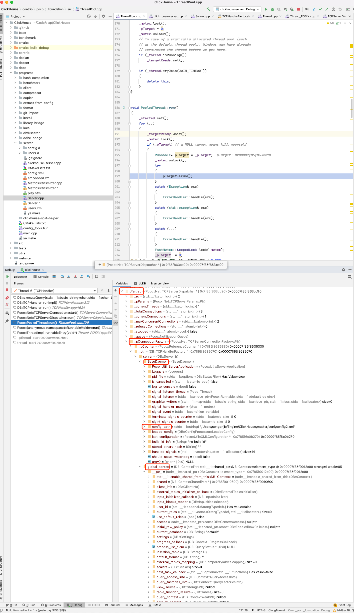


- excutequery 

TcpHandler

Query and Context

```c++
void TCPHandler::runImpl()
{
    setThreadName("TCPHandler");
    ThreadStatus thread_status;

    connection_context = Context::createCopy(server.context());
    connection_context->makeSessionContext();
    while (true)
    {

        /// Set context of request.
        query_context = Context::createCopy(connection_context);
        state.reset();
        try
        {
            /// If a user passed query-local timeouts, reset socket to initial state at the end of the query
            SCOPE_EXIT({state.timeout_setter.reset();});

            /** If Query - process it. If Ping or Cancel - go back to the beginning.
             *  There may come settings for a separate query that modify `query_context`.
             *  It's possible to receive part uuids packet before the query, so then receivePacket has to be called twice.
             */
            if (!receivePacket())
                continue;
            /// Processing Query
            state.io = executeQuery(state.query, query_context, false, state.stage, may_have_embedded_data);
....
            sendLogs();
            sendEndOfStream();

            /// QueryState should be cleared before QueryScope, since otherwise
            /// the MemoryTracker will be wrong for possible deallocations.
            /// (i.e. deallocations from the Aggregator with two-level aggregation)
            state.reset();
            query_scope.reset();
          
.... 
```

1. 这里default database 也是非常关键的
2. state 字段
3. query 建表语句

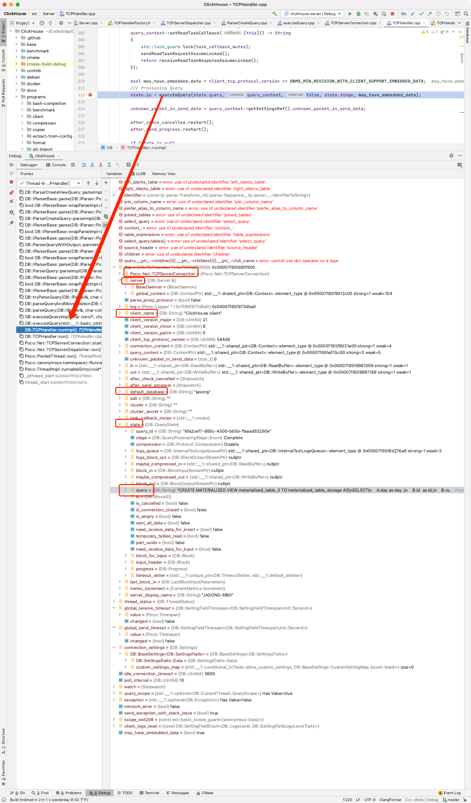


- 抽象语法树

定义 ASTPtr ast 抽象语法树 executeQueryImpl to ParserQuery

```c++
DB::ParserCreateViewQuery::parseImpl(DB::IParser::Pos&, std::__1::shared_ptr<DB::IAST>&, DB::Expected&) 
...
std::__1::shared_ptr<DB::IAST>&, DB::Expected&)::$_0 const&) IParserBase.h:31
DB::IParserBase::parse(DB::IParser::Pos&, std::__1::shared_ptr<DB::IAST>&, DB::Expected&) IParserBase.cpp:11
DB::tryParseQuery(DB::IParser&, char const*&, char const*, std::__1::basic_string<char, std::__1::char_traits<char>, std::__1::allocator<char> >&, bool, std::__1::basic_string<char, std::__1::char_traits<char>, std::__1::allocator<char> > const&, bool, unsigned long, unsigned long) parseQuery.cpp:259
DB::parseQueryAndMovePosition(DB::IParser&, char const*&, char const*, std::__1::basic_string<char, std::__1::char_traits<char>, std::__1::allocator<char> > const&, bool, unsigned long, unsigned long) parseQuery.cpp:343
DB::parseQuery(DB::IParser&, char const*, char const*, std::__1::basic_string<char, std::__1::char_traits<char>, std::__1::allocator<char> > const&, unsigned long, unsigned long) parseQuery.cpp:360
DB::executeQueryImpl(char const*, char const*, std::__1::shared_ptr<DB::Context>, bool, DB::QueryProcessingStage::Enum, bool, DB::ReadBuffer*) executeQuery.cpp:386
DB::executeQuery(std::__1::basic_string<char, std::__1::char_traits<char>, std::__1::allocator<char> > const&, std::__1::shared_ptr<DB::Context>, bool, DB::QueryProcessingStage::Enum, bool) executeQuery.cpp:919
DB::TCPHandler::runImpl() TCPHandler.cpp:312
DB::TCPHandler::run() TCPHandler.cpp:1624
Poco::Net::TCPServerConnection::start() TCPServerConnection.cpp:43
Poco::Net::TCPServerDispatcher::run() TCPServerDispatcher.cpp:115
Poco::PooledThread::run() ThreadPool.cpp:199
Poco::(anonymous namespace)::RunnableHolder::run() Thread.cpp:55
Poco::ThreadImpl::runnableEntry(void*) Thread_POSIX.cpp:345
_pthread_start 0x00007fff2037f950
thread_start 0x00007fff2037b47b
```


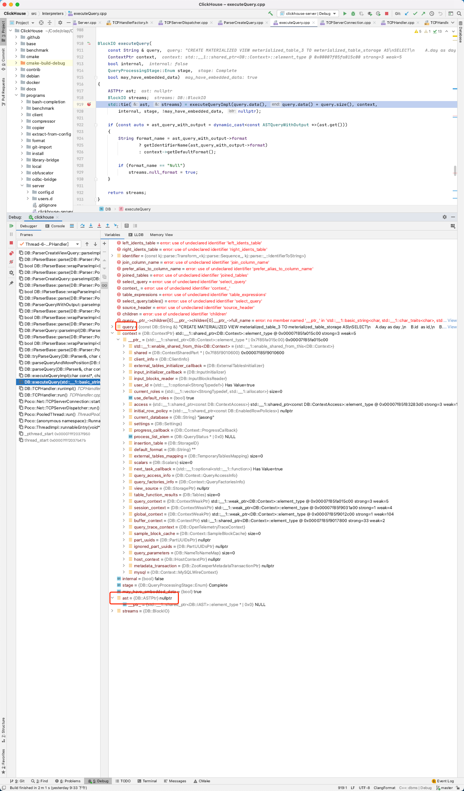


parse

```c++
bool IParserBase::parse(Pos & pos, ASTPtr & node, Expected & expected)
{
    expected.add(pos, getName());

    return wrapParseImpl(pos, IncreaseDepthTag{}, [&]
    {
        bool res = parseImpl(pos, node, expected);
        if (!res)
            node = nullptr;
        return res;
    });
}

bool ParserCreateViewQuery::parseImpl(Pos & pos, ASTPtr & node, Expected & expected)
{
    ParserKeyword s_create("CREATE");
    ParserKeyword s_attach("ATTACH");
    ParserKeyword s_if_not_exists("IF NOT EXISTS");
    ParserCompoundIdentifier table_name_p(true);
    ParserKeyword s_as("AS");
    ParserKeyword s_view("VIEW");
    ParserKeyword s_materialized("MATERIALIZED");
    ParserKeyword s_populate("POPULATE");
    ParserKeyword s_or_replace("OR REPLACE");
    ParserToken s_dot(TokenType::Dot);
    ParserToken s_lparen(TokenType::OpeningRoundBracket);
    ParserToken s_rparen(TokenType::ClosingRoundBracket);
    ParserStorage storage_p;
    ParserIdentifier name_p;
    ParserTablePropertiesDeclarationList table_properties_p;
    ParserSelectWithUnionQuery select_p;
    ParserNameList names_p;

    ASTPtr table;
    ASTPtr to_table;
    ASTPtr to_inner_uuid;
    ASTPtr columns_list;
    ASTPtr storage;
    ASTPtr as_database;
    ASTPtr as_table;
    ASTPtr select;

    String cluster_str;
    bool attach = false;
    bool if_not_exists = false;
    bool is_ordinary_view = false;
    bool is_materialized_view = false;
    bool is_populate = false;
    bool replace_view = false;

    //parse create table name 
    if (!table_name_p.parse(pos, table, expected))
        return false;
  
    //parse select ast
    if (!select_p.parse(pos, select, expected))
        return false;
    ...

    auto query = std::make_shared<ASTCreateQuery>();
    node = query;
```


select parse ParserSelectWithUnionQuery

我们的代码里 只有 list_of_selects

```c++

bool ParserSelectWithUnionQuery::parseImpl(Pos & pos, ASTPtr & node, Expected & expected)
{
    ASTPtr list_node;

    //ParserUnionList 关键字分析
    ParserUnionList parser(
        std::make_unique<ParserUnionQueryElement>(),
        std::make_unique<ParserKeyword>("UNION"),
        std::make_unique<ParserKeyword>("ALL"),
        std::make_unique<ParserKeyword>("DISTINCT"));

    if (!parser.parse(pos, list_node, expected))
        return false;

    /// NOTE: We can't simply flatten inner union query now, since we may have different union mode in query,
    /// so flatten may change it's semantics. For example:
    /// flatten `SELECT 1 UNION (SELECT 1 UNION ALL SELECT 1)` -> `SELECT 1 UNION SELECT 1 UNION ALL SELECT 1`

    /// If we got only one child which is ASTSelectWithUnionQuery, just lift it up
    auto & expr_list = list_node->as<ASTExpressionList &>();
    if (expr_list.children.size() == 1)
    {
        if (expr_list.children.at(0)->as<ASTSelectWithUnionQuery>())
        {
            node = std::move(expr_list.children.at(0));
            return true;
        }
    }

    auto select_with_union_query = std::make_shared<ASTSelectWithUnionQuery>();

    node = select_with_union_query;
    select_with_union_query->list_of_selects = list_node;
    select_with_union_query->children.push_back(select_with_union_query->list_of_selects);
    select_with_union_query->list_of_modes = parser.getUnionModes();

    return true;
}

```

和我们建表语句对比下

```sql
CREATE MATERIALIZED VIEW meterialized_table_3 TO meterialized_table_storage AS
SELECT
    A.day AS day,
    B.id AS id,
    B.number AS number
FROM LEFT_TABLE2 AS A
INNER JOIN RIGHT_TABLE2 AS B ON A.id = B.id
```

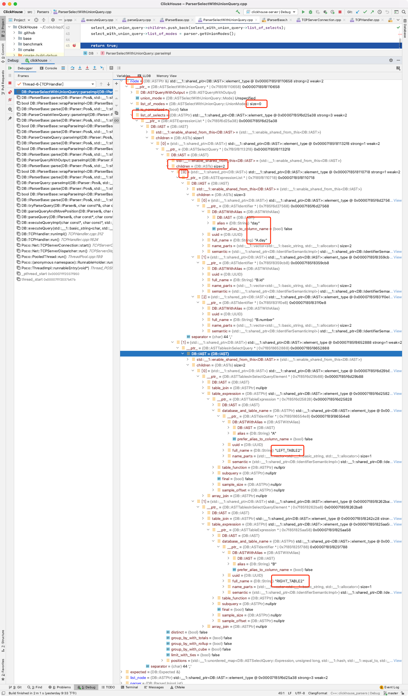


直接parse 完成后 query 的结果

```sql

bool ParserCreateViewQuery::parseImpl(Pos & pos, ASTPtr & node, Expected & expected)
{
    auto query = std::make_shared<ASTCreateQuery>();
    node = query;

    query->attach = attach;
    query->if_not_exists = if_not_exists;
    query->is_ordinary_view = is_ordinary_view;
    query->is_materialized_view = is_materialized_view;
    query->is_populate = is_populate;
    query->replace_view = replace_view;

    StorageID table_id = getTableIdentifier(table);
    query->database = table_id.database_name;
    query->table = table_id.table_name;
    query->uuid = table_id.uuid;
    query->cluster = cluster_str;

    if (to_table)
        query->to_table_id = getTableIdentifier(to_table);
    if (to_inner_uuid)
        query->to_inner_uuid = parseFromString<UUID>(to_inner_uuid->as<ASTLiteral>()->value.get<String>());

    query->set(query->columns_list, columns_list);
    query->set(query->storage, storage);

}
```


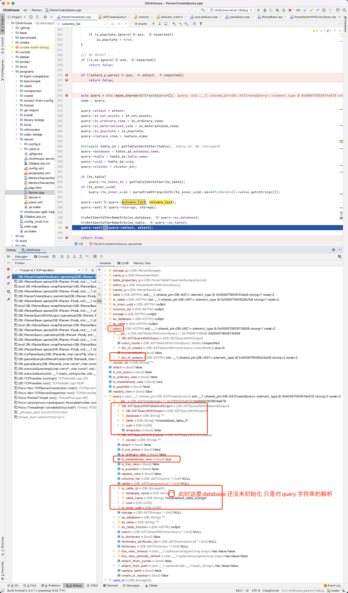

这里设置了 to_table_id 

Column_list 为null


生成 Interpreter 后，

Interpreter->executor

```c++
static std::tuple<ASTPtr, BlockIO> executeQueryImpl(
    const char * begin,
    const char * end,
    ContextPtr context,
    bool internal,
    QueryProcessingStage::Enum stage,
    bool has_query_tail,
    ReadBuffer * istr)
{
               auto interpreter = InterpreterFactory::get(ast, context, SelectQueryOptions(stage).setInternal(internal));

        {
            OpenTelemetrySpanHolder span("IInterpreter::execute()");
            res = interpreter->execute();
        }
}


execute->
  
```


物化视图 和 TO table 解析

```c++
AccessRightsElements InterpreterCreateQuery::getRequiredAccess() const
{
    /// Internal queries (initiated by the server itself) always have access to everything.
    if (internal)
        return {};

    AccessRightsElements required_access;
    const auto & create = query_ptr->as<const ASTCreateQuery &>();
    else if (create.isView())
    {
        assert(!create.temporary);
        if (create.replace_view)
            required_access.emplace_back(AccessType::DROP_VIEW | AccessType::CREATE_VIEW, create.database, create.table);
        else
            required_access.emplace_back(AccessType::CREATE_VIEW, create.database, create.table);
    }
    if (create.to_table_id)
        required_access.emplace_back(AccessType::SELECT | AccessType::INSERT, create.to_table_id.database_name, create.to_table_id.table_name);
    return required_access;
}
```

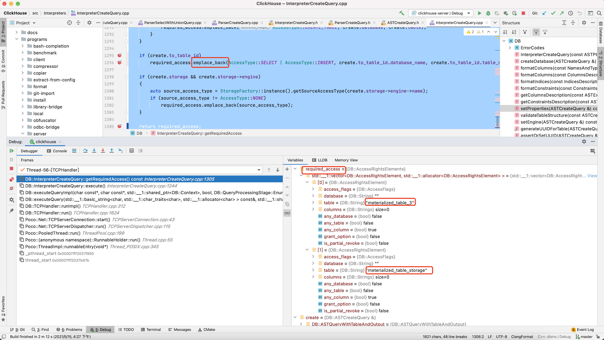


解析 interpreter

AddDefaultDatabaseVisitor  会讲上层定义 list_of_select 的结构 递归、循环、解析,如下为堆栈

 auto & create = query_ptr->as<ASTCreateQuery &>(); 

要明白 create 是有 query-ptr 转为为 ASTCreateQuery 而产生

1. 第一层 进行create table

```c++
DB::InterpreterCreateQuery::createTable(DB::ASTCreateQuery&) InterpreterCreateQuery.cpp:928
DB::InterpreterCreateQuery::execute() InterpreterCreateQuery.cpp:1274
DB::executeQueryImpl(char const*, char const*, std::__1::shared_ptr<DB::Context>, bool, DB::QueryProcessingStage::Enum, bool, DB::ReadBuffer*) executeQuery.cpp:561
DB::executeQuery(std::__1::basic_string<char, std::__1::char_traits<char>, std::__1::allocator<char> > const&, std::__1::shared_ptr<DB::Context>, bool, DB::QueryProcessingStage::Enum, bool) executeQuery.cpp:919
DB::TCPHandler::runImpl() TCPHandler.cpp:312
DB::TCPHandler::run() TCPHandler.cpp:1624
Poco::Net::TCPServerConnection::start() TCPServerConnection.cpp:43
Poco::Net::TCPServerDispatcher::run() TCPServerDispatcher.cpp:115
Poco::PooledThread::run() ThreadPool.cpp:199
Poco::(anonymous namespace)::RunnableHolder::run() Thread.cpp:55
Poco::ThreadImpl::runnableEntry(void*) Thread_POSIX.cpp:345
_pthread_start 0x00007fff2037f950
thread_start 0x00007fff2037b47b
```

```c++
BlockIO InterpreterCreateQuery::execute()
{
    FunctionNameNormalizer().visit(query_ptr.get());
    auto & create = query_ptr->as<ASTCreateQuery &>();
    if (!create.cluster.empty())
    {
        prepareOnClusterQuery(create, getContext(), create.cluster);
        return executeDDLQueryOnCluster(query_ptr, getContext(), getRequiredAccess());
    }

    getContext()->checkAccess(getRequiredAccess()); //上述带哦用

    ASTQueryWithOutput::resetOutputASTIfExist(create);

    /// CREATE|ATTACH DATABASE
    if (!create.database.empty() && create.table.empty())
        return createDatabase(create);
    else if (!create.is_dictionary)
        return createTable(create); 这里
    else
        return createDictionary(create);
}

Create table 四步走

1. database 补充
 
2. visitor.visit(create.select)
  
3. set properites
  
4. create table 
```

```c++
BlockIO InterpreterCreateQuery::createTable(ASTCreateQuery & create)
{
    /// Temporary tables are created out of databases.
    if (create.temporary && !create.database.empty())
        throw Exception("Temporary tables cannot be inside a database. You should not specify a database for a temporary table.",
            ErrorCodes::BAD_DATABASE_FOR_TEMPORARY_TABLE);

    String current_database = getContext()->getCurrentDatabase();
    auto database_name = create.database.empty() ? current_database : create.database;
  ....

    if (!create.temporary && create.database.empty())
        create.database = current_database;
    if (create.to_table_id && create.to_table_id.database_name.empty())
        create.to_table_id.database_name = current_database;

    if (create.select && create.isView())
    {
        // Expand CTE before filling default database
        ApplyWithSubqueryVisitor().visit(*create.select);
        AddDefaultDatabaseVisitor visitor(current_database);
      //vist 
        visitor.visit(*create.select);
    }

    /// Set and retrieve list of columns, indices and constraints. Set table engine if needed. Rewrite query in canonical way.
    TableProperties properties = setProperties(create);
  
  
    if (create.replace_table)
        return doCreateOrReplaceTable(create, properties);

    /// Actually creates table
    bool created = doCreateTable(create, properties);

    if (!created)   /// Table already exists
        return {};

    return fillTableIfNeeded(create);
}

```


这里主要把物化视图 物化视图TO的表 join表对应的 database 库字段使用 defaultdatabase 补充

因为一个建表语句是需要这些补齐字段信息的


- Visit 

这里是对 create select 的复杂翻译解析过程，但不是真正的校验过程，做一部分库表的校验

Visit 是一个递归处理解析的过程

比如表字段

表信息

库信息的补充啥的

```c++
    if (create.select && create.isView())
    {
        // Expand CTE before filling default database
        ApplyWithSubqueryVisitor().visit(*create.select);
        AddDefaultDatabaseVisitor visitor(current_database);
        visitor.visit(*create.select);
    }
```

我们来看下 create.select ASTSelectWithUnionQuery 

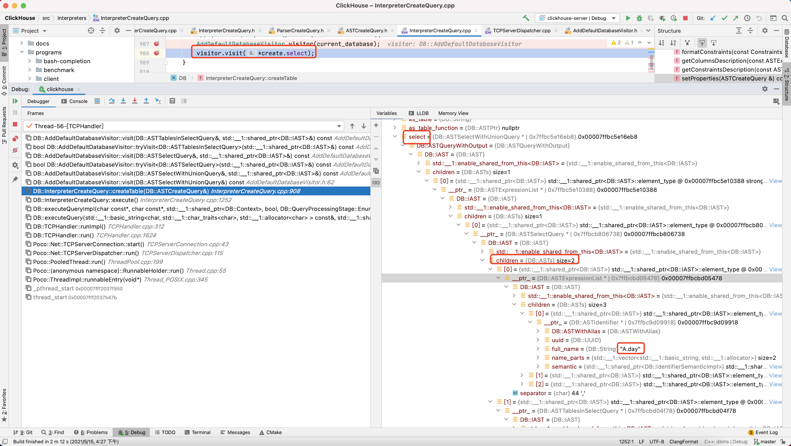


逐个解析

ASTIdentifier 两个join 表的对战解析

```c++
DB::AddDefaultDatabaseVisitor::visit(DB::ASTTableExpression&, std::__1::shared_ptr<DB::IAST>&) const AddDefaultDatabaseVisitor.h:100
bool DB::AddDefaultDatabaseVisitor::tryVisit<DB::ASTTableExpression>(std::__1::shared_ptr<DB::IAST>&) const AddDefaultDatabaseVisitor.h:166
DB::AddDefaultDatabaseVisitor::visit(DB::ASTTablesInSelectQueryElement&, std::__1::shared_ptr<DB::IAST>&) const AddDefaultDatabaseVisitor.h:94
bool DB::AddDefaultDatabaseVisitor::tryVisit<DB::ASTTablesInSelectQueryElement>(std::__1::shared_ptr<DB::IAST>&) const AddDefaultDatabaseVisitor.h:166
DB::AddDefaultDatabaseVisitor::visit(DB::ASTTablesInSelectQuery&, std::__1::shared_ptr<DB::IAST>&) const AddDefaultDatabaseVisitor.h:88
bool DB::AddDefaultDatabaseVisitor::tryVisit<DB::ASTTablesInSelectQuery>(std::__1::shared_ptr<DB::IAST>&) const AddDefaultDatabaseVisitor.h:166
DB::AddDefaultDatabaseVisitor::visit(DB::ASTSelectQuery&, std::__1::shared_ptr<DB::IAST>&) const AddDefaultDatabaseVisitor.h:80
bool DB::AddDefaultDatabaseVisitor::tryVisit<DB::ASTSelectQuery>(std::__1::shared_ptr<DB::IAST>&) const AddDefaultDatabaseVisitor.h:166
DB::AddDefaultDatabaseVisitor::visit(DB::ASTSelectWithUnionQuery&, std::__1::shared_ptr<DB::IAST>&) const AddDefaultDatabaseVisitor.h:74
DB::AddDefaultDatabaseVisitor::visit(DB::ASTSelectWithUnionQuery&) const AddDefaultDatabaseVisitor.h:62
DB::InterpreterCreateQuery::createTable(DB::ASTCreateQuery&) InterpreterCreateQuery.cpp:928
DB::InterpreterCreateQuery::execute() InterpreterCreateQuery.cpp:1274
DB::executeQueryImpl(char const*, char const*, std::__1::shared_ptr<DB::Context>, bool, DB::QueryProcessingStage::Enum, bool, DB::ReadBuffer*) executeQuery.cpp:561
DB::executeQuery(std::__1::basic_string<char, std::__1::char_traits<char>, std::__1::allocator<char> > const&, std::__1::shared_ptr<DB::Context>, bool, DB::QueryProcessingStage::Enum, bool) executeQuery.cpp:919
DB::TCPHandler::runImpl() TCPHandler.cpp:312
DB::TCPHandler::run() TCPHandler.cpp:1624
Poco::Net::TCPServerConnection::start() TCPServerConnection.cpp:43
Poco::Net::TCPServerDispatcher::run() TCPServerDispatcher.cpp:115
Poco::PooledThread::run() ThreadPool.cpp:199
Poco::(anonymous namespace)::RunnableHolder::run() Thread.cpp:55
Poco::ThreadImpl::runnableEntry(void*) Thread_POSIX.cpp:345
_pthread_start 0x00007fff2037f950
thread_start 0x00007fff2037b47b
```

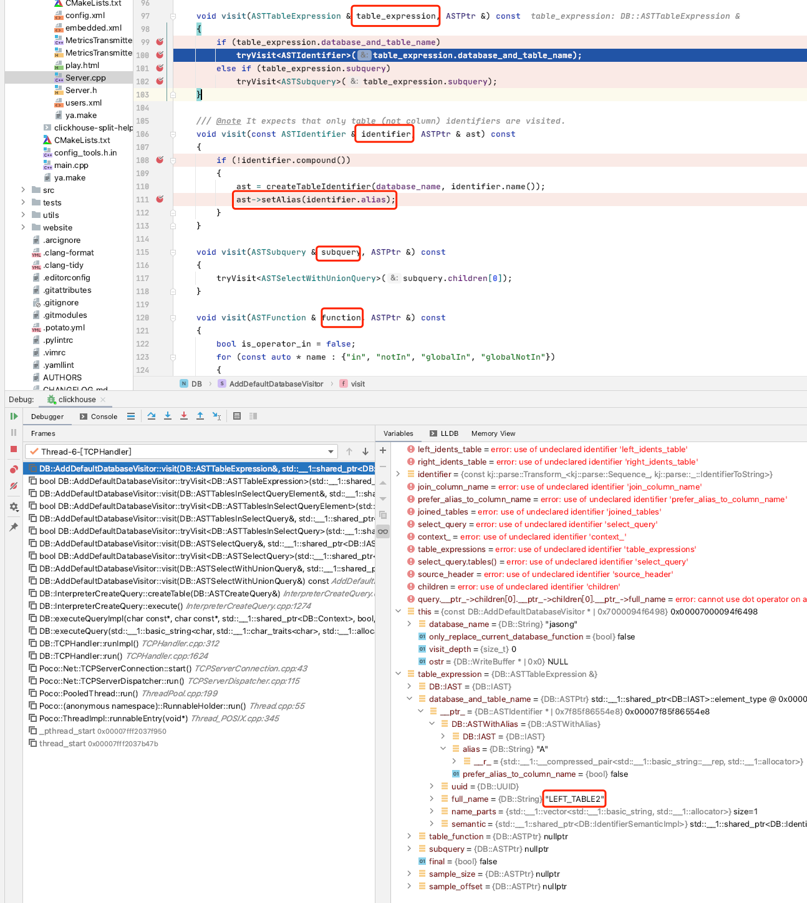


注意 这里也需要将两张join表的database 补齐，是官方的一个问题，我这里已经做了修改

```c++
void visit(const ASTIdentifier & identifier, ASTPtr & ast) const
{
    if (!identifier.compound())
    {
        ast = createTableIdentifier(database_name, identifier.name());
        ast->setAlias(identifier.alias);
    }
}
```


- 第三步

CreateTable -> setProperties 

建表语句中当前表 column_list 为null

所以调用之前 column_lists 为null

```c++
DB::InterpreterCreateQuery::setProperties(DB::ASTCreateQuery&) const InterpreterCreateQuery.cpp:573
DB::InterpreterCreateQuery::createTable(DB::ASTCreateQuery&) InterpreterCreateQuery.cpp:932
DB::InterpreterCreateQuery::execute() InterpreterCreateQuery.cpp:1274
  
DB::executeQueryImpl(char const*, char const*, std::__1::shared_ptr<DB::Context>, bool, DB::QueryProcessingStage::Enum, bool, DB::ReadBuffer*) executeQuery.cpp:561
DB::executeQuery(std::__1::basic_string<char, std::__1::char_traits<char>, std::__1::allocator<char> > const&, std::__1::shared_ptr<DB::Context>, bool, DB::QueryProcessingStage::Enum, bool) executeQuery.cpp:919
DB::TCPHandler::runImpl() TCPHandler.cpp:312
DB::TCPHandler::run() TCPHandler.cpp:1624
Poco::Net::TCPServerConnection::start() TCPServerConnection.cpp:43
Poco::Net::TCPServerDispatcher::run() TCPServerDispatcher.cpp:115
Poco::PooledThread::run() ThreadPool.cpp:199
Poco::(anonymous namespace)::RunnableHolder::run() Thread.cpp:55
Poco::ThreadImpl::runnableEntry(void*) Thread_POSIX.cpp:345
_pthread_start 0x00007fff2037f950
thread_start 0x00007fff2037b47b
```

这里就是建表语句的最后补充了

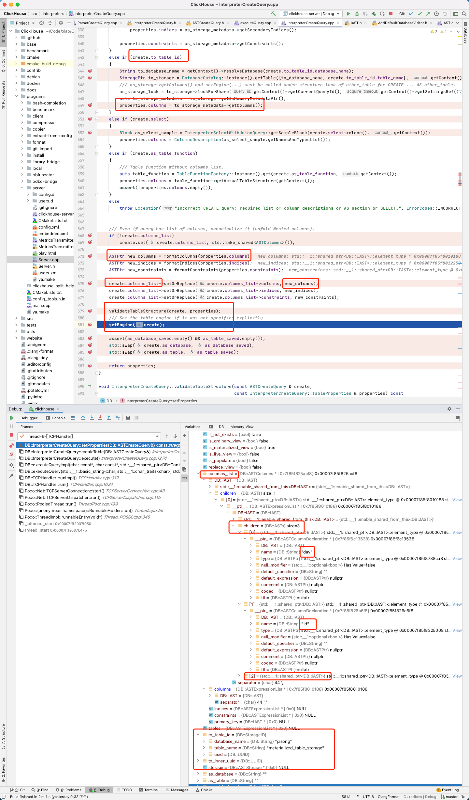

这里也是官方的一个bug

官方没有以下代码,代码 创建物化视图 To Table, 字段错误，查询物化视图失败，只能查询To Table 对应的表

```c++
    else if (create.select)
    {
        Block as_select_sample = InterpreterSelectWithUnionQuery::getSampleBlock(create.select->clone(), getContext());
        if (create.to_table_id)
        {
            String to_database_name = getContext()->resolveDatabase(create.to_table_id.database_name);
            StoragePtr to_storage = DatabaseCatalog::instance().getTable({to_database_name, create.to_table_id.table_name}, getContext());
            /// as_storage->getColumns() and setEngine(...) must be called under structure lock of other_table for CREATE ... AS other_table.
            as_storage_lock
                = to_storage->lockForShare(getContext()->getCurrentQueryId(), getContext()->getSettingsRef().lock_acquire_timeout);
            auto to_storage_metadata = to_storage->getInMemoryMetadataPtr();
            properties.columns = to_storage_metadata->getColumns();
        }
        else
            properties.columns = ColumnsDescription(as_select_sample.getNamesAndTypesList());
    }
```


set properties 还有一个关键的步骤

InterpreterSelectWithUnionQuery::getSampleBlock


getSampleBlock是对select 语句一个完整校验的过程


InterpreterSelectWithUnionQuery

这里是所有join ,多表查询的时候都会走的一个地方

我们来看下它的完整堆栈调用

```c++
DB::InterpreterSelectWithUnionQuery::InterpreterSelectWithUnionQuery(std::__1::shared_ptr<DB::IAST> const&, std::__1::shared_ptr<DB::Context>, DB::SelectQueryOptions const&, std::__1::vector<std::__1::basic_string<char, std::__1::char_traits<char>, std::__1::allocator<char> >, std::__1::allocator<std::__1::basic_string<char, std::__1::char_traits<char>, std::__1::allocator<char> > > > const&) InterpreterSelectWithUnionQuery.cpp:35
DB::InterpreterSelectWithUnionQuery::InterpreterSelectWithUnionQuery(std::__1::shared_ptr<DB::IAST> const&, std::__1::shared_ptr<DB::Context>, DB::SelectQueryOptions const&, std::__1::vector<std::__1::basic_string<char, std::__1::char_traits<char>, std::__1::allocator<char> >, std::__1::allocator<std::__1::basic_string<char, std::__1::char_traits<char>, std::__1::allocator<char> > > > const&) InterpreterSelectWithUnionQuery.cpp:34
DB::InterpreterSelectWithUnionQuery::getSampleBlock(std::__1::shared_ptr<DB::IAST> const&, std::__1::shared_ptr<DB::Context>, bool) InterpreterSelectWithUnionQuery.cpp:231
DB::InterpreterCreateQuery::setProperties(DB::ASTCreateQuery&) const InterpreterCreateQuery.cpp:544
DB::InterpreterCreateQuery::createTable(DB::ASTCreateQuery&) InterpreterCreateQuery.cpp:912
DB::InterpreterCreateQuery::execute() InterpreterCreateQuery.cpp:1252
DB::executeQueryImpl(char const*, char const*, std::__1::shared_ptr<DB::Context>, bool, DB::QueryProcessingStage::Enum, bool, DB::ReadBuffer*) executeQuery.cpp:561
DB::executeQuery(std::__1::basic_string<char, std::__1::char_traits<char>, std::__1::allocator<char> > const&, std::__1::shared_ptr<DB::Context>, bool, DB::QueryProcessingStage::Enum, bool) executeQuery.cpp:919
DB::TCPHandler::runImpl() TCPHandler.cpp:312
DB::TCPHandler::run() TCPHandler.cpp:1624
Poco::Net::TCPServerConnection::start() TCPServerConnection.cpp:43
Poco::Net::TCPServerDispatcher::run() TCPServerDispatcher.cpp:115
Poco::PooledThread::run() ThreadPool.cpp:199
Poco::(anonymous namespace)::RunnableHolder::run() Thread.cpp:55
Poco::ThreadImpl::runnableEntry(void*) Thread_POSIX.cpp:345
_pthread_start 0x00007fff2037f950
thread_start 0x00007fff2037b47b
```

```c++


InterpreterSelectWithUnionQuery::InterpreterSelectWithUnionQuery(
    const ASTPtr & query_ptr_, ContextPtr context_, const SelectQueryOptions & options_, const Names & required_result_column_names)
    : IInterpreterUnionOrSelectQuery(query_ptr_, context_, options_)
{
    ASTSelectWithUnionQuery * ast = query_ptr->as<ASTSelectWithUnionQuery>();

    const Settings & settings = context->getSettingsRef();
    if (options.subquery_depth == 0 && (settings.limit > 0 || settings.offset > 0))
        settings_limit_offset_needed = true;

    size_t num_children = ast->list_of_selects->children.size();
    for (size_t query_num = 0; query_num < num_children; ++query_num)
    {
        const Names & current_required_result_column_names
            = query_num == 0 ? required_result_column_names : required_result_column_names_for_other_selects[query_num];

        nested_interpreters.emplace_back(
            buildCurrentChildInterpreter(ast->list_of_selects->children.at(query_num), current_required_result_column_names));
    }
```

`


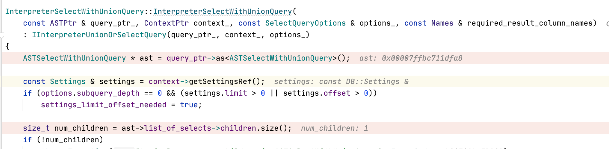


build child interpreter  InterpreterSelectQuery

```c++
std::unique_ptr<IInterpreterUnionOrSelectQuery>
InterpreterSelectWithUnionQuery::buildCurrentChildInterpreter(const ASTPtr & ast_ptr_, const Names & current_required_result_column_names)
{
    if (ast_ptr_->as<ASTSelectWithUnionQuery>())
        return std::make_unique<InterpreterSelectWithUnionQuery>(ast_ptr_, context, options, current_required_result_column_names);
    else
        return std::make_unique<InterpreterSelectQuery>(ast_ptr_, context, options, current_required_result_column_names);
}

```

InterpreterSelectQuery 解析校验开始

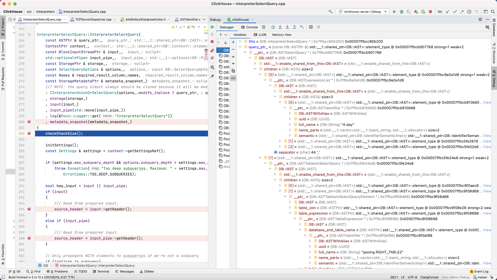


InterpreterSelectQuery 

1. setttins
2. subquery 
3. joined_tables
4. Rewrite join 
5. analyze

```c++
InterpreterSelectQuery::InterpreterSelectQuery(
    const ASTPtr & query_ptr_,
    ContextPtr context_,
    const BlockInputStreamPtr & input_,
    std::optional<Pipe> input_pipe_,
    const StoragePtr & storage_,
    const SelectQueryOptions & options_,
    const Names & required_result_column_names,
    const StorageMetadataPtr & metadata_snapshot_)
    /// NOTE: the query almost always should be cloned because it will be modified during analysis.
    : IInterpreterUnionOrSelectQuery(options_.modify_inplace ? query_ptr_ : query_ptr_->clone(), context_, options_)
    , storage(storage_)
    , input(input_)
    , input_pipe(std::move(input_pipe_))
    , log(&Poco::Logger::get("InterpreterSelectQuery"))
    , metadata_snapshot(metadata_snapshot_)
{
    checkStackSize();

    initSettings();
    const Settings & settings = context->getSettingsRef();

    if (settings.max_subquery_depth && options.subquery_depth > settings.max_subquery_depth)
        throw Exception("Too deep subqueries. Maximum: " + settings.max_subquery_depth.toString(),
            ErrorCodes::TOO_DEEP_SUBQUERIES);

    bool has_input = input || input_pipe;
    if (input)
    {
        /// Read from prepared input.
        source_header = input->getHeader();
    }
    else if (input_pipe)
    {
        /// Read from prepared input.
        source_header = input_pipe->getHeader();
    }

    // Only propagate WITH elements to subqueries if we're not a subquery
    if (!options.is_subquery)
    {
        if (context->getSettingsRef().enable_global_with_statement)
            ApplyWithAliasVisitor().visit(query_ptr);
        ApplyWithSubqueryVisitor().visit(query_ptr);
    }

    JoinedTables joined_tables(getSubqueryContext(context), getSelectQuery());

    bool got_storage_from_query = false;
    if (!has_input && !storage)
    {
        storage = joined_tables.getLeftTableStorage();
        got_storage_from_query = true;
    }

    if (storage)
    {
        table_lock = storage->lockForShare(context->getInitialQueryId(), context->getSettingsRef().lock_acquire_timeout);
        table_id = storage->getStorageID();
        if (!metadata_snapshot)
            metadata_snapshot = storage->getInMemoryMetadataPtr();
    }

    if (has_input || !joined_tables.resolveTables())
        joined_tables.makeFakeTable(storage, metadata_snapshot, source_header);

    /// Rewrite JOINs
    if (!has_input && joined_tables.tablesCount() > 1)
    {
        rewriteMultipleJoins(query_ptr, joined_tables.tablesWithColumns(), context->getCurrentDatabase(), context->getSettingsRef());

        joined_tables.reset(getSelectQuery());
        joined_tables.resolveTables();
         //这里重复调用了resolveTables ，虽然是重写的join ，应该可做优化的

        if (storage && joined_tables.isLeftTableSubquery())
        {
            /// Rewritten with subquery. Free storage locks here.
            storage = nullptr;
            table_lock.reset();
            table_id = StorageID::createEmpty();
            metadata_snapshot = nullptr;
        }
    }

    if (!has_input)
    {
        interpreter_subquery = joined_tables.makeLeftTableSubquery(options.subquery());
        if (interpreter_subquery)
            source_header = interpreter_subquery->getSampleBlock();
    }

    joined_tables.rewriteDistributedInAndJoins(query_ptr);

    max_streams = settings.max_threads;
    ASTSelectQuery & query = getSelectQuery();
    std::shared_ptr<TableJoin> table_join = joined_tables.makeTableJoin(query);

    if (storage)
        row_policy_filter = context->getRowPolicyCondition(table_id.getDatabaseName(), table_id.getTableName(), RowPolicy::SELECT_FILTER);

    StorageView * view = nullptr;
    if (storage)
        view = dynamic_cast<StorageView *>(storage.get());

    SubqueriesForSets subquery_for_sets;

    auto analyze = [&] (bool try_move_to_prewhere)
    {
        /// Allow push down and other optimizations for VIEW: replace with subquery and rewrite it.
        ASTPtr view_table;
        if (view)
            view->replaceWithSubquery(getSelectQuery(), view_table, metadata_snapshot);

        syntax_analyzer_result = TreeRewriter(context).analyzeSelect(
            query_ptr,
            TreeRewriterResult(source_header.getNamesAndTypesList(), storage, metadata_snapshot),
            options, joined_tables.tablesWithColumns(), required_result_column_names, table_join);

        /// Save scalar sub queries's results in the query context
        if (!options.only_analyze && context->hasQueryContext())
            for (const auto & it : syntax_analyzer_result->getScalars())
                context->getQueryContext()->addScalar(it.first, it.second);

        if (view)
        {
            /// Restore original view name. Save rewritten subquery for future usage in StorageView.
            query_info.view_query = view->restoreViewName(getSelectQuery(), view_table);
            view = nullptr;
        }

        if (try_move_to_prewhere && storage && query.where() && !query.prewhere())
        {
            /// PREWHERE optimization: transfer some condition from WHERE to PREWHERE if enabled and viable
            if (const auto & column_sizes = storage->getColumnSizes(); !column_sizes.empty())
            {
                /// Extract column compressed sizes.
                std::unordered_map<std::string, UInt64> column_compressed_sizes;
                for (const auto & [name, sizes] : column_sizes)
                    column_compressed_sizes[name] = sizes.data_compressed;

                SelectQueryInfo current_info;
                current_info.query = query_ptr;
                current_info.syntax_analyzer_result = syntax_analyzer_result;

                MergeTreeWhereOptimizer{
                    current_info,
                    context,
                    std::move(column_compressed_sizes),
                    metadata_snapshot,
                    syntax_analyzer_result->requiredSourceColumns(),
                    log};
            }
        }

        query_analyzer = std::make_unique<SelectQueryExpressionAnalyzer>(
                query_ptr, syntax_analyzer_result, context, metadata_snapshot,
                NameSet(required_result_column_names.begin(), required_result_column_names.end()),
                !options.only_analyze, options, std::move(subquery_for_sets));

        if (!options.only_analyze)
        {
            if (query.sampleSize() && (input || input_pipe || !storage || !storage->supportsSampling()))
                throw Exception("Illegal SAMPLE: table doesn't support sampling", ErrorCodes::SAMPLING_NOT_SUPPORTED);

            if (query.final() && (input || input_pipe || !storage || !storage->supportsFinal()))
                throw Exception((!input && !input_pipe && storage) ? "Storage " + storage->getName() + " doesn't support FINAL" : "Illegal FINAL", ErrorCodes::ILLEGAL_FINAL);

            if (query.prewhere() && (input || input_pipe || !storage || !storage->supportsPrewhere()))
                throw Exception((!input && !input_pipe && storage) ? "Storage " + storage->getName() + " doesn't support PREWHERE" : "Illegal PREWHERE", ErrorCodes::ILLEGAL_PREWHERE);

            /// Save the new temporary tables in the query context
            for (const auto & it : query_analyzer->getExternalTables())
                if (!context->tryResolveStorageID({"", it.first}, Context::ResolveExternal))
                    context->addExternalTable(it.first, std::move(*it.second));
        }

        if (!options.only_analyze || options.modify_inplace)
        {
            if (syntax_analyzer_result->rewrite_subqueries)
            {
                /// remake interpreter_subquery when PredicateOptimizer rewrites subqueries and main table is subquery
                interpreter_subquery = joined_tables.makeLeftTableSubquery(options.subquery());
            }
        }

        if (interpreter_subquery)
        {
            /// If there is an aggregation in the outer query, WITH TOTALS is ignored in the subquery.
            if (query_analyzer->hasAggregation())
                interpreter_subquery->ignoreWithTotals();
        }

        required_columns = syntax_analyzer_result->requiredSourceColumns();

        if (storage)
        {
            /// Fix source_header for filter actions.
            if (row_policy_filter)
            {
                filter_info = std::make_shared<FilterDAGInfo>();
                filter_info->column_name = generateFilterActions(filter_info->actions, required_columns);

                auto required_columns_from_filter = filter_info->actions->getRequiredColumns();

                for (const auto & column : required_columns_from_filter)
                {
                    if (required_columns.end() == std::find(required_columns.begin(), required_columns.end(), column.name))
                        required_columns.push_back(column.name);
                }
            }

            source_header = metadata_snapshot->getSampleBlockForColumns(required_columns, storage->getVirtuals(), storage->getStorageID());
        }

        /// Calculate structure of the result.
        result_header = getSampleBlockImpl();
    };

    analyze(settings.optimize_move_to_prewhere);

    bool need_analyze_again = false;
    if (analysis_result.prewhere_constant_filter_description.always_false || analysis_result.prewhere_constant_filter_description.always_true)
    {
        if (analysis_result.prewhere_constant_filter_description.always_true)
            query.setExpression(ASTSelectQuery::Expression::PREWHERE, {});
        else
            query.setExpression(ASTSelectQuery::Expression::PREWHERE, std::make_shared<ASTLiteral>(0u));
        need_analyze_again = true;
    }
    if (analysis_result.where_constant_filter_description.always_false || analysis_result.where_constant_filter_description.always_true)
    {
        if (analysis_result.where_constant_filter_description.always_true)
            query.setExpression(ASTSelectQuery::Expression::WHERE, {});
        else
            query.setExpression(ASTSelectQuery::Expression::WHERE, std::make_shared<ASTLiteral>(0u));
        need_analyze_again = true;
    }
    if (query.prewhere() && query.where())
    {
        /// Filter block in WHERE instead to get better performance
        query.setExpression(ASTSelectQuery::Expression::WHERE, makeASTFunction("and", query.prewhere()->clone(), query.where()->clone()));
        need_analyze_again = true;
    }

    if (need_analyze_again)
    {
        LOG_TRACE(log, "Running 'analyze' second time");
        query_analyzer->getSubqueriesForSets().clear();
        subquery_for_sets = SubqueriesForSets();

        /// Do not try move conditions to PREWHERE for the second time.
        /// Otherwise, we won't be able to fallback from inefficient PREWHERE to WHERE later.
        analyze(/* try_move_to_prewhere = */ false);
    }

    /// If there is no WHERE, filter blocks as usual
    if (query.prewhere() && !query.where())
        analysis_result.prewhere_info->need_filter = true;

    if (table_id && got_storage_from_query && !joined_tables.isLeftTableFunction())
    {
        /// The current user should have the SELECT privilege.
        /// If this table_id is for a table function we don't check access rights here because in this case they have been already checked in ITableFunction::execute().
        checkAccessRightsForSelect(context, table_id, metadata_snapshot, required_columns, *syntax_analyzer_result);

        /// Remove limits for some tables in the `system` database.
        if (shouldIgnoreQuotaAndLimits(table_id) && (joined_tables.tablesCount() <= 1))
        {
            options.ignore_quota = true;
            options.ignore_limits = true;
        }
    }

    /// Blocks used in expression analysis contains size 1 const columns for constant folding and
    ///  null non-const columns to avoid useless memory allocations. However, a valid block sample
    ///  requires all columns to be of size 0, thus we need to sanitize the block here.
    sanitizeBlock(result_header, true);
}
```


InterpreterSelectQuery

Joined_tables 初始化

resolveTables 使用 join_tables.table_expressions 初始化 table-with-columns 

resolveTables()->getDatabaseAndTablesWithColumns->getColumnsFromTableExpression
getDatabaseAndTablesWithColumns 会把表自带的隐藏字段加入

```c++
TablesWithColumns getDatabaseAndTablesWithColumns(const std::vector<const ASTTableExpression *> & table_expressions, ContextPtr context)
{
    TablesWithColumns tables_with_columns;
        for (const ASTTableExpression * table_expression : table_expressions)
        {
            NamesAndTypesList materialized;
            NamesAndTypesList aliases;
            NamesAndTypesList virtuals;
            NamesAndTypesList names_and_types = getColumnsFromTableExpression(*table_expression, context, materialized, aliases, virtuals);

            removeDuplicateColumns(names_and_types);

            tables_with_columns.emplace_back(
                DatabaseAndTableWithAlias(*table_expression, current_database), names_and_types);

            auto & table = tables_with_columns.back();
            table.addHiddenColumns(materialized);
            table.addHiddenColumns(aliases);
            table.addHiddenColumns(virtuals);


    return tables_with_columns;
}
```

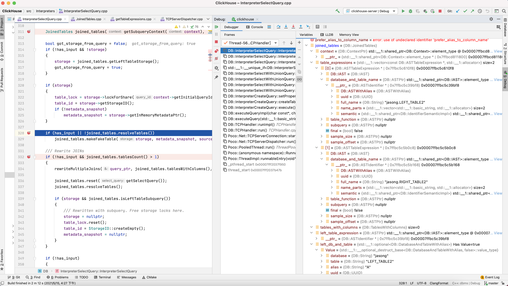


```c++
static NamesAndTypesList getColumnsFromTableExpression(
    const ASTTableExpression & table_expression,
    ContextPtr context,
    NamesAndTypesList & materialized,
    NamesAndTypesList & aliases,
    NamesAndTypesList & virtuals)
{
    NamesAndTypesList names_and_type_list;
    if (table_expression.subquery)
    {
        const auto & subquery = table_expression.subquery->children.at(0);
        names_and_type_list = InterpreterSelectWithUnionQuery::getSampleBlock(subquery, context, true).getNamesAndTypesList();
    }
    else if (table_expression.table_function)
    {
        const auto table_function = table_expression.table_function;
        auto query_context = context->getQueryContext();
        const auto & function_storage = query_context->executeTableFunction(table_function);
        auto function_metadata_snapshot = function_storage->getInMemoryMetadataPtr();
        const auto & columns = function_metadata_snapshot->getColumns();
        names_and_type_list = columns.getOrdinary();
        materialized = columns.getMaterialized();
        aliases = columns.getAliases();
        virtuals = function_storage->getVirtuals();
    }
    else if (table_expression.database_and_table_name)
    {
        auto table_id = context->resolveStorageID(table_expression.database_and_table_name);
        const auto & table = DatabaseCatalog::instance().getTable(table_id, context);
        auto table_metadata_snapshot = table->getInMemoryMetadataPtr();
        const auto & columns = table_metadata_snapshot->getColumns();
        names_and_type_list = columns.getOrdinary();
        materialized = columns.getMaterialized();
        aliases = columns.getAliases();
        virtuals = table->getVirtuals();
    }

    return names_and_type_list;
}
```

我们可以学习这个getColumnsFromTableExpression，首先会判断当前table_expression 是否存在子查询，如果有相当于会走一个递归出来

继续执行 InterpreterSelectWithUnionQuery::getSampleBlock 获取name_and_type_list 这个调用我们在初期 create.select 的时候执行过一次

回顾一下代码

```c++
    else if (create.select)
    {
        Block as_select_sample = InterpreterSelectWithUnionQuery::getSampleBlock(create.select->clone(), getContext());
        if (create.to_table_id)
        {
            String to_database_name = getContext()->resolveDatabase(create.to_table_id.database_name);
            StoragePtr to_storage = DatabaseCatalog::instance().getTable({to_database_name, create.to_table_id.table_name}, getContext());
            /// as_storage->getColumns() and setEngine(...) must be called under structure lock of other_table for CREATE ... AS other_table.
            as_storage_lock
                = to_storage->lockForShare(getContext()->getCurrentQueryId(), getContext()->getSettingsRef().lock_acquire_timeout);
            auto to_storage_metadata = to_storage->getInMemoryMetadataPtr();
            properties.columns = to_storage_metadata->getColumns();
        }
        else
            properties.columns = ColumnsDescription(as_select_sample.getNamesAndTypesList());
    }
```


这里按照我们的sql 走到了database_and_table_anme 

这里的代码我们也是似曾相识，当前这四个步骤，就是clickhouse 中通过 ASTPTR(database_and_table_name)

获取真实的一个表的元数据快照

通过源数据快照，我们可以获取表的coloumns

当前下面图中我们也列出了很多可以获取的表信息，如下

```c++
        auto table_id = context->resolveStorageID(table_expression.database_and_table_name);
        const auto & table = DatabaseCatalog::instance().getTable(table_id, context);
        auto table_metadata_snapshot = table->getInMemoryMetadataPtr();
        const auto & columns = table_metadata_snapshot->getColumns();
```

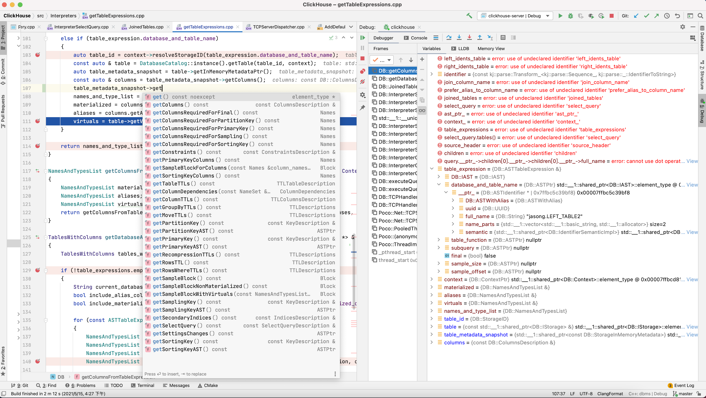

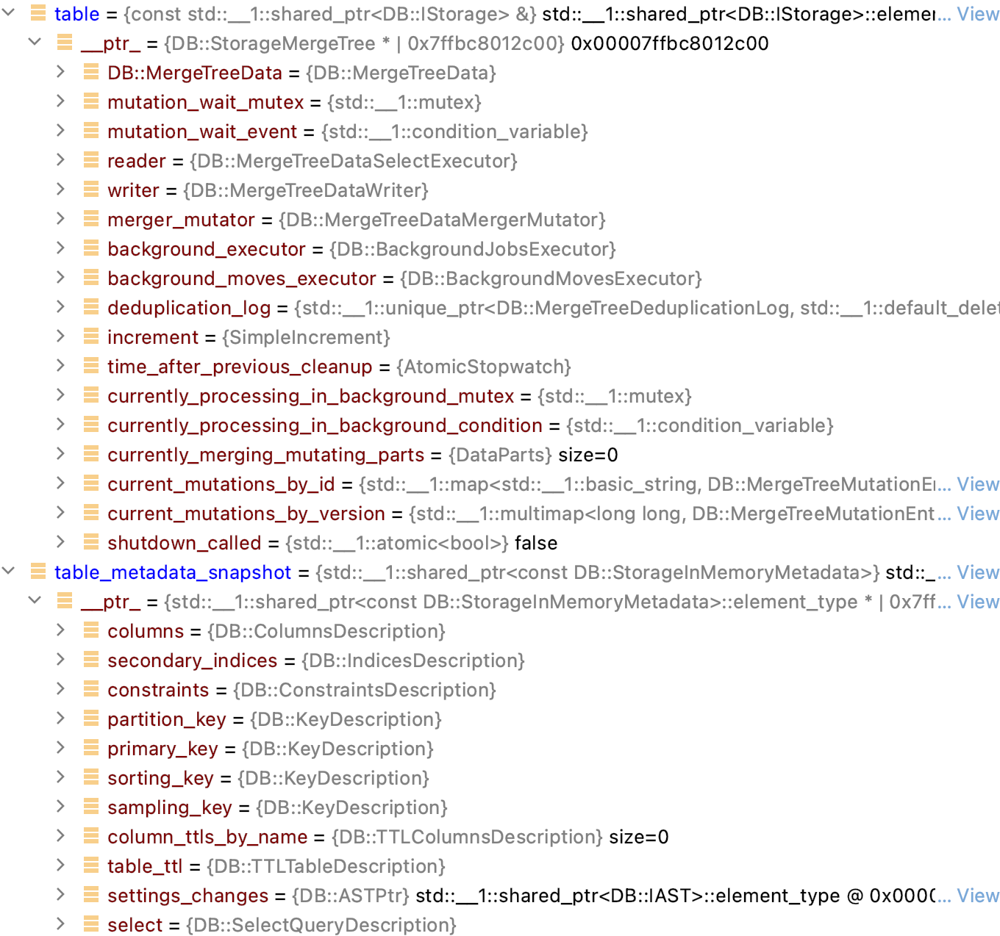


InterpreterSelectQuery

select query 

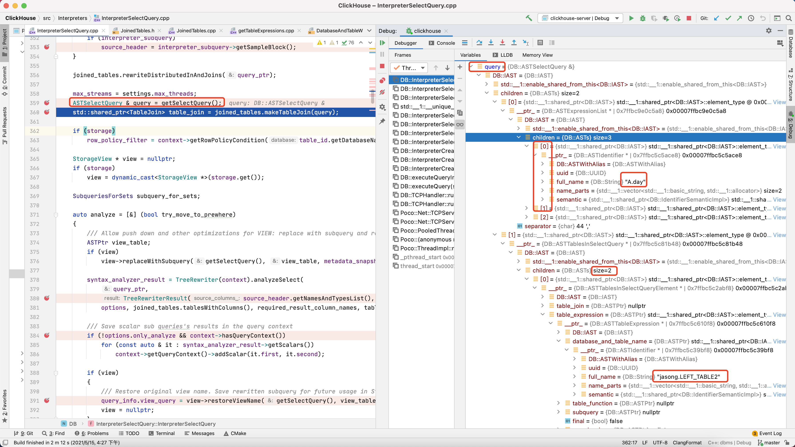


makejoins

```c++
DB::JoinedTables::makeTableJoin(DB::ASTSelectQuery const&) JoinedTables.cpp:263
DB::InterpreterSelectQuery::InterpreterSelectQuery(std::__1::shared_ptr<DB::IAST> const&, std::__1::shared_ptr<DB::Context>, std::__1::shared_ptr<DB::IBlockInputStream> const&, std::__1::optional<DB::Pipe>, std::__1::shared_ptr<DB::IStorage> const&, DB::SelectQueryOptions const&, std::__1::vector<std::__1::basic_string<char, std::__1::char_traits<char>, std::__1::allocator<char> >, std::__1::allocator<std::__1::basic_string<char, std::__1::char_traits<char>, std::__1::allocator<char> > > > const&, std::__1::shared_ptr<DB::StorageInMemoryMetadata const> const&) InterpreterSelectQuery.cpp:360
DB::InterpreterSelectQuery::InterpreterSelectQuery(std::__1::shared_ptr<DB::IAST> const&, std::__1::shared_ptr<DB::Context>, std::__1::shared_ptr<DB::IBlockInputStream> const&, std::__1::optional<DB::Pipe>, std::__1::shared_ptr<DB::IStorage> const&, DB::SelectQueryOptions const&, std::__1::vector<std::__1::basic_string<char, std::__1::char_traits<char>, std::__1::allocator<char> >, std::__1::allocator<std::__1::basic_string<char, std::__1::char_traits<char>, std::__1::allocator<char> > > > const&, std::__1::shared_ptr<DB::StorageInMemoryMetadata const> const&) InterpreterSelectQuery.cpp:281
DB::InterpreterSelectQuery::InterpreterSelectQuery(std::__1::shared_ptr<DB::IAST> const&, std::__1::shared_ptr<DB::Context>, DB::SelectQueryOptions const&, std::__1::vector<std::__1::basic_string<char, std::__1::char_traits<char>, std::__1::allocator<char> >, std::__1::allocator<std::__1::basic_string<char, std::__1::char_traits<char>, std::__1::allocator<char> > > > const&) InterpreterSelectQuery.cpp:159
std::__1::__unique_if<DB::InterpreterSelectQuery>::__unique_single std::__1::make_unique<DB::InterpreterSelectQuery, std::__1::shared_ptr<DB::IAST> const&, std::__1::shared_ptr<DB::Context>&, DB::SelectQueryOptions&, std::__1::vector<std::__1::basic_string<char, std::__1::char_traits<char>, std::__1::allocator<char> >, std::__1::allocator<std::__1::basic_string<char, std::__1::char_traits<char>, std::__1::allocator<char> > > > const&>(std::__1::shared_ptr<DB::IAST> const&, std::__1::shared_ptr<DB::Context>&, DB::SelectQueryOptions&, std::__1::vector<std::__1::basic_string<char, std::__1::char_traits<char>, std::__1::allocator<char> >, std::__1::allocator<std::__1::basic_string<char, std::__1::char_traits<char>, std::__1::allocator<char> > > > const&) memory:2068
DB::InterpreterSelectWithUnionQuery::buildCurrentChildInterpreter(std::__1::shared_ptr<DB::IAST> const&, std::__1::vector<std::__1::basic_string<char, std::__1::char_traits<char>, std::__1::allocator<char> >, std::__1::allocator<std::__1::basic_string<char, std::__1::char_traits<char>, std::__1::allocator<char> > > > const&) InterpreterSelectWithUnionQuery.cpp:212
DB::InterpreterSelectWithUnionQuery::InterpreterSelectWithUnionQuery(std::__1::shared_ptr<DB::IAST> const&, std::__1::shared_ptr<DB::Context>, DB::SelectQueryOptions const&, std::__1::vector<std::__1::basic_string<char, std::__1::char_traits<char>, std::__1::allocator<char> >, std::__1::allocator<std::__1::basic_string<char, std::__1::char_traits<char>, std::__1::allocator<char> > > > const&) InterpreterSelectWithUnionQuery.cpp:134
DB::InterpreterSelectWithUnionQuery::InterpreterSelectWithUnionQuery(std::__1::shared_ptr<DB::IAST> const&, std::__1::shared_ptr<DB::Context>, DB::SelectQueryOptions const&, std::__1::vector<std::__1::basic_string<char, std::__1::char_traits<char>, std::__1::allocator<char> >, std::__1::allocator<std::__1::basic_string<char, std::__1::char_traits<char>, std::__1::allocator<char> > > > const&) InterpreterSelectWithUnionQuery.cpp:34
DB::InterpreterSelectWithUnionQuery::getSampleBlock(std::__1::shared_ptr<DB::IAST> const&, std::__1::shared_ptr<DB::Context>, bool) InterpreterSelectWithUnionQuery.cpp:231
DB::InterpreterCreateQuery::setProperties(DB::ASTCreateQuery&) const InterpreterCreateQuery.cpp:544
DB::InterpreterCreateQuery::createTable(DB::ASTCreateQuery&) InterpreterCreateQuery.cpp:912
DB::InterpreterCreateQuery::execute() InterpreterCreateQuery.cpp:1252
DB::executeQueryImpl(char const*, char const*, std::__1::shared_ptr<DB::Context>, bool, DB::QueryProcessingStage::Enum, bool, DB::ReadBuffer*) executeQuery.cpp:561
DB::executeQuery(std::__1::basic_string<char, std::__1::char_traits<char>, std::__1::allocator<char> > const&, std::__1::shared_ptr<DB::Context>, bool, DB::QueryProcessingStage::Enum, bool) executeQuery.cpp:919
DB::TCPHandler::runImpl() TCPHandler.cpp:312
DB::TCPHandler::run() TCPHandler.cpp:1624
Poco::Net::TCPServerConnection::start() TCPServerConnection.cpp:43
Poco::Net::TCPServerDispatcher::run() TCPServerDispatcher.cpp:115
Poco::PooledThread::run() ThreadPool.cpp:199
Poco::(anonymous namespace)::RunnableHolder::run() Thread.cpp:55
Poco::ThreadImpl::runnableEntry(void*) Thread_POSIX.cpp:345
_pthread_start 0x00007fff2037f950
thread_start 0x00007fff2037b47b
```

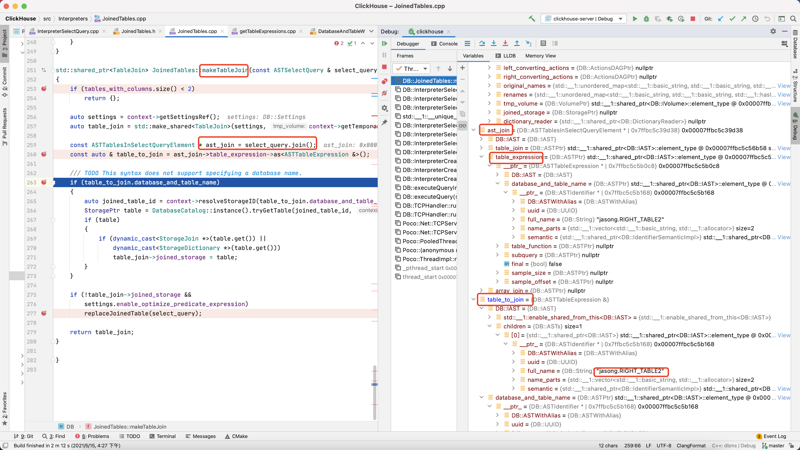


replicaJoinedtables

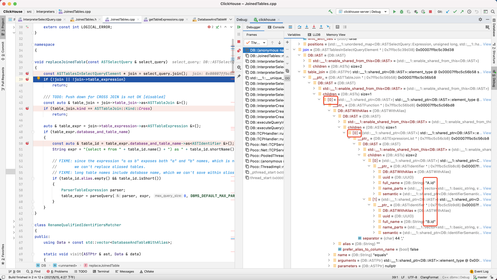


analyze

TreeRewriterResult 设置了source columns

```c++
TreeRewriterResult::TreeRewriterResult(
    const NamesAndTypesList & source_columns_,
    ConstStoragePtr storage_,
    const StorageMetadataPtr & metadata_snapshot_,
    bool add_special)
    : storage(storage_)
    , metadata_snapshot(metadata_snapshot_)
    , source_columns(source_columns_)
{
    collectSourceColumns(add_special);
    is_remote_storage = storage && storage->isRemote();
}

/// Add columns from storage to source_columns list. Deduplicate resulted list.
/// Special columns are non physical columns, for example ALIAS
void TreeRewriterResult::collectSourceColumns(bool add_special)
{
    if (storage)
    {
        const ColumnsDescription & columns = metadata_snapshot->getColumns();

        NamesAndTypesList columns_from_storage;
        if (storage->supportsSubcolumns())
            columns_from_storage = add_special ? columns.getAllWithSubcolumns() : columns.getAllPhysicalWithSubcolumns();
        else
            columns_from_storage = add_special ? columns.getAll() : columns.getAllPhysical();

        if (source_columns.empty())
            source_columns.swap(columns_from_storage);
        else
            source_columns.insert(source_columns.end(), columns_from_storage.begin(), columns_from_storage.end());
    }

    source_columns_set = removeDuplicateColumns(source_columns);
}
```


```c++
TreeRewriterResultPtr TreeRewriter::analyzeSelect(
    ASTPtr & query,
    TreeRewriterResult && result,
    const SelectQueryOptions & select_options,
    const std::vector<TableWithColumnNamesAndTypes> & tables_with_columns,
    const Names & required_result_columns,
    std::shared_ptr<TableJoin> table_join) const
{
    auto * select_query = query->as<ASTSelectQuery>();
    if (!select_query)
        throw Exception("Select analyze for not select asts.", ErrorCodes::LOGICAL_ERROR);

    size_t subquery_depth = select_options.subquery_depth;
    bool remove_duplicates = select_options.remove_duplicates;

    const auto & settings = getContext()->getSettingsRef();

    const NameSet & source_columns_set = result.source_columns_set;

    if (table_join)
    {
        result.analyzed_join = table_join;
        result.analyzed_join->resetCollected();
    }
    else /// TODO: remove. For now ExpressionAnalyzer expects some not empty object here
        result.analyzed_join = std::make_shared<TableJoin>();

    if (remove_duplicates)
        renameDuplicatedColumns(select_query);

    if (tables_with_columns.size() > 1)
    {
        //从第二章表RIGHT_LABLE 获取 columns 也就是 id number
        result.analyzed_join->columns_from_joined_table = tables_with_columns[1].columns;
      //////
        result.analyzed_join->deduplicateAndQualifyColumnNames(
            source_columns_set, tables_with_columns[1].table.getQualifiedNamePrefix());
    
    }

    translateQualifiedNames(query, *select_query, source_columns_set, tables_with_columns);

    /// Optimizes logical expressions.
    LogicalExpressionsOptimizer(select_query, settings.optimize_min_equality_disjunction_chain_length.value).perform();

    NameSet all_source_columns_set = source_columns_set;
    if (table_join)
    {
        for (const auto & [name, _] : table_join->columns_from_joined_table)
            all_source_columns_set.insert(name);
    }

    normalize(query, result.aliases, all_source_columns_set, settings);

    /// Remove unneeded columns according to 'required_result_columns'.
    /// Leave all selected columns in case of DISTINCT; columns that contain arrayJoin function inside.
    /// Must be after 'normalizeTree' (after expanding aliases, for aliases not get lost)
    ///  and before 'executeScalarSubqueries', 'analyzeAggregation', etc. to avoid excessive calculations.
    removeUnneededColumnsFromSelectClause(select_query, required_result_columns, remove_duplicates);

    /// Executing scalar subqueries - replacing them with constant values.
    executeScalarSubqueries(query, getContext(), subquery_depth, result.scalars, select_options.only_analyze);

    TreeOptimizer::apply(
        query, result.aliases, source_columns_set, tables_with_columns, getContext(), result.metadata_snapshot, result.rewrite_subqueries);

    /// array_join_alias_to_name, array_join_result_to_source.
    getArrayJoinedColumns(query, result, select_query, result.source_columns, source_columns_set);

    setJoinStrictness(*select_query, settings.join_default_strictness, settings.any_join_distinct_right_table_keys,
                        result.analyzed_join->table_join);
    collectJoinedColumns(*result.analyzed_join, *select_query, tables_with_columns, result.aliases);

    /// rewrite filters for select query, must go after getArrayJoinedColumns
    if (settings.optimize_respect_aliases && result.metadata_snapshot)
    {
        replaceAliasColumnsInQuery(query, result.metadata_snapshot->getColumns(), result.getArrayJoinSourceNameSet(), getContext());
    }

    result.aggregates = getAggregates(query, *select_query);
    result.window_function_asts = getWindowFunctions(query, *select_query);
    result.collectUsedColumns(query, true);
    result.ast_join = select_query->join();

    if (result.optimize_trivial_count)
        result.optimize_trivial_count = settings.optimize_trivial_count_query &&
            !select_query->groupBy() && !select_query->having() &&
            !select_query->sampleSize() && !select_query->sampleOffset() && !select_query->final() &&
            (tables_with_columns.size() < 2 || isLeft(result.analyzed_join->kind()));

    return std::make_shared<const TreeRewriterResult>(result);
}
```


Table join 

result 即为左表

tables_with_columns 位右侧的表

```
deduplicateAndQualifyColumnNames
```

original_name 和 renames 存储了映射关系

他们两个 k v正好相反

我理解这里会在collectJoinedColumns用到 设置原声columns

Result.columns 是最终会使用的 当前建表的columns

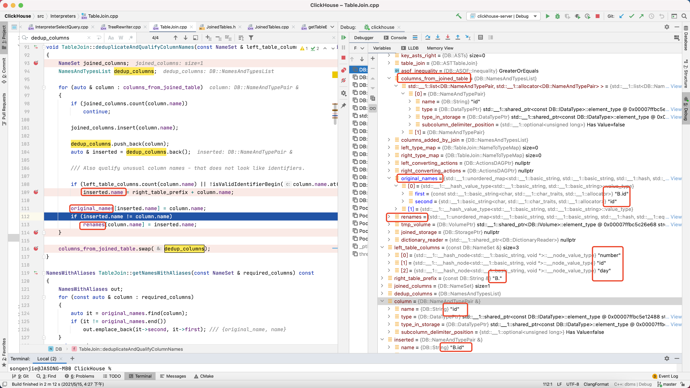

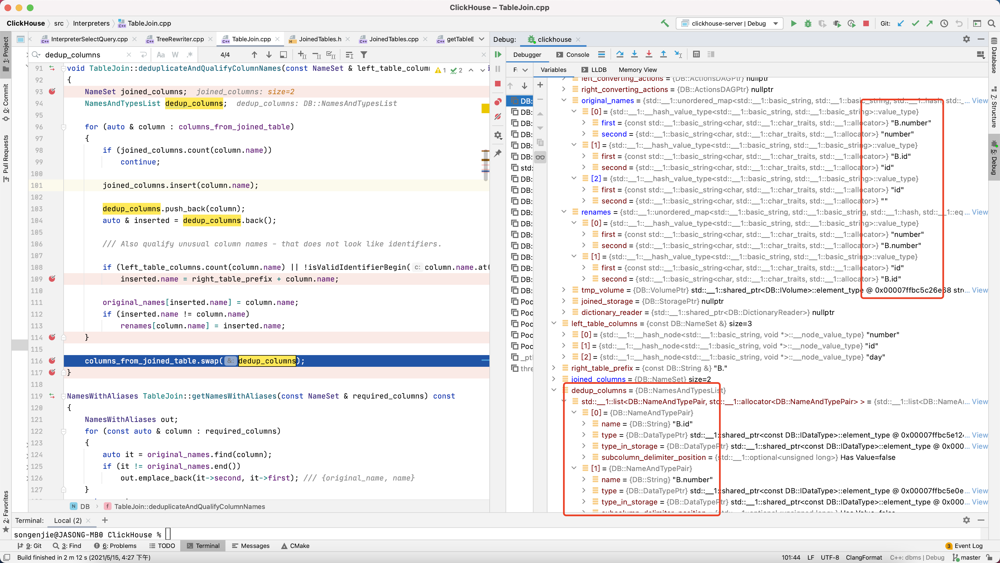


NameSet source_colum_set 这里不保证顺序

```c++
using NameSet = std::unordered_set<std::string>;
```


```
translateQualifiedNames(query, *select_query, source_columns_set, tables_with_columns);
```

Query,select_query 理论上是相同的


这个时候 表已经返回创建成功


后台线程：

Global  Pool

```c++
DB::TreeRewriterResult::collectSourceColumns(bool) TreeRewriter.cpp:650
DB::TreeRewriterResult::TreeRewriterResult(DB::NamesAndTypesList const&, std::__1::shared_ptr<DB::IStorage const>, std::__1::shared_ptr<DB::StorageInMemoryMetadata const> const&, bool) TreeRewriter.cpp:626
DB::TreeRewriterResult::TreeRewriterResult(DB::NamesAndTypesList const&, std::__1::shared_ptr<DB::IStorage const>, std::__1::shared_ptr<DB::StorageInMemoryMetadata const> const&, bool) TreeRewriter.cpp:625
DB::TreeRewriter::analyze(std::__1::shared_ptr<DB::IAST>&, DB::NamesAndTypesList const&, std::__1::shared_ptr<DB::IStorage const>, std::__1::shared_ptr<DB::StorageInMemoryMetadata const> const&, bool) const TreeRewriter.cpp:968
DB::(anonymous namespace)::getCombinedIndicesExpression(DB::KeyDescription const&, DB::IndicesDescription const&, DB::ColumnsDescription const&, std::__1::shared_ptr<DB::Context>) MergeTreeData.cpp:425
DB::MergeTreeData::getSortingKeyAndSkipIndicesExpression(std::__1::shared_ptr<DB::StorageInMemoryMetadata const> const&) const MergeTreeData.cpp:461
DB::MergeTreeDataWriter::writeTempPart(DB::BlockWithPartition&, std::__1::shared_ptr<DB::StorageInMemoryMetadata const> const&, bool) MergeTreeDataWriter.cpp:297
DB::MergeTreeBlockOutputStream::write(DB::Block const&) MergeTreeBlockOutputStream.cpp:31
DB::PushingToViewsBlockOutputStream::write(DB::Block const&) PushingToViewsBlockOutputStream.cpp:165
DB::AddingDefaultBlockOutputStream::write(DB::Block const&) AddingDefaultBlockOutputStream.cpp:25
DB::SquashingBlockOutputStream::finalize() SquashingBlockOutputStream.cpp:30
DB::SquashingBlockOutputStream::writeSuffix() SquashingBlockOutputStream.cpp:50
DB::CountingBlockOutputStream::writeSuffix() CountingBlockOutputStream.h:37
DB::SystemLog<DB::QueryThreadLogElement>::flushImpl(std::__1::vector<DB::QueryThreadLogElement, std::__1::allocator<DB::QueryThreadLogElement> > const&, unsigned long long) SystemLog.h:476
DB::SystemLog<DB::QueryThreadLogElement>::savingThreadFunction() SystemLog.h:428
DB::SystemLog<DB::QueryThreadLogElement>::startup()::'lambda'()::operator()() const SystemLog.h:232
decltype(std::__1::forward<DB::SystemLog<DB::QueryThreadLogElement>::startup()::'lambda'()&>(fp)()) std::__1::__invoke_constexpr<DB::SystemLog<DB::QueryThreadLogElement>::startup()::'lambda'()&>(DB::SystemLog<DB::QueryThreadLogElement>::startup()::'lambda'()&) type_traits:3682
decltype(auto) std::__1::__apply_tuple_impl<DB::SystemLog<DB::QueryThreadLogElement>::startup()::'lambda'()&, std::__1::tuple<>&>(DB::SystemLog<DB::QueryThreadLogElement>::startup()::'lambda'()&, std::__1::tuple<>&, std::__1::__tuple_indices<>) tuple:1415
decltype(auto) std::__1::apply<DB::SystemLog<DB::QueryThreadLogElement>::startup()::'lambda'()&, std::__1::tuple<>&>(DB::SystemLog<DB::QueryThreadLogElement>::startup()::'lambda'()&, std::__1::tuple<>&) tuple:1424
ThreadFromGlobalPool::ThreadFromGlobalPool<DB::SystemLog<DB::QueryThreadLogElement>::startup()::'lambda'()>(DB::SystemLog<DB::QueryThreadLogElement>::startup()::'lambda'()&&)::'lambda'()::operator()() ThreadPool.h:178
decltype(std::__1::forward<DB::SystemLog<DB::QueryThreadLogElement>::startup()::'lambda'()>(fp)()) std::__1::__invoke<ThreadFromGlobalPool::ThreadFromGlobalPool<DB::SystemLog<DB::QueryThreadLogElement>::startup()::'lambda'()>(DB::SystemLog<DB::QueryThreadLogElement>::startup()::'lambda'()&&)::'lambda'()&>(DB::SystemLog<DB::QueryThreadLogElement>::startup()::'lambda'()&&) type_traits:3676
void std::__1::__invoke_void_return_wrapper<void>::__call<ThreadFromGlobalPool::ThreadFromGlobalPool<DB::SystemLog<DB::QueryThreadLogElement>::startup()::'lambda'()>(DB::SystemLog<DB::QueryThreadLogElement>::startup()::'lambda'()&&)::'lambda'()&>(ThreadFromGlobalPool::ThreadFromGlobalPool<DB::SystemLog<DB::QueryThreadLogElement>::startup()::'lambda'()>(DB::SystemLog<DB::QueryThreadLogElement>::startup()::'lambda'()&&)::'lambda'()&) __functional_base:348
std::__1::__function::__default_alloc_func<ThreadFromGlobalPool::ThreadFromGlobalPool<DB::SystemLog<DB::QueryThreadLogElement>::startup()::'lambda'()>(DB::SystemLog<DB::QueryThreadLogElement>::startup()::'lambda'()&&)::'lambda'(), void ()>::operator()() functional:1608
void std::__1::__function::__policy_invoker<void ()>::__call_impl<std::__1::__function::__default_alloc_func<ThreadFromGlobalPool::ThreadFromGlobalPool<DB::SystemLog<DB::QueryThreadLogElement>::startup()::'lambda'()>(DB::SystemLog<DB::QueryThreadLogElement>::startup()::'lambda'()&&)::'lambda'(), void ()> >(std::__1::__function::__policy_storage const*) functional:2089
std::__1::__function::__policy_func<void ()>::operator()() const functional:2221
std::__1::function<void ()>::operator()() const functional:2560
ThreadPoolImpl<std::__1::thread>::worker(std::__1::__list_iterator<std::__1::thread, void*>) ThreadPool.cpp:247
void ThreadPoolImpl<std::__1::thread>::scheduleImpl<void>(std::__1::function<void ()>, int, std::__1::optional<unsigned long long>)::'lambda1'()::operator()() const ThreadPool.cpp:124
decltype(std::__1::forward<void>(fp)()) std::__1::__invoke<void ThreadPoolImpl<std::__1::thread>::scheduleImpl<void>(std::__1::function<void ()>, int, std::__1::optional<unsigned long long>)::'lambda1'()>(void&&) type_traits:3676
void std::__1::__thread_execute<std::__1::unique_ptr<std::__1::__thread_struct, std::__1::default_delete<std::__1::__thread_struct> >, void ThreadPoolImpl<std::__1::thread>::scheduleImpl<void>(std::__1::function<void ()>, int, std::__1::optional<unsigned long long>)::'lambda1'()>(std::__1::tuple<void, void ThreadPoolImpl<std::__1::thread>::scheduleImpl<void>(std::__1::function<void ()>, int, std::__1::optional<unsigned long long>)::'lambda1'()>&, std::__1::__tuple_indices<>) thread:280
void* std::__1::__thread_proxy<std::__1::tuple<std::__1::unique_ptr<std::__1::__thread_struct, std::__1::default_delete<std::__1::__thread_struct> >, void ThreadPoolImpl<std::__1::thread>::scheduleImpl<void>(std::__1::function<void ()>, int, std::__1::optional<unsigned long long>)::'lambda1'()> >(void*) thread:291
_pthread_start 0x00007fff2037f950
thread_start 0x00007fff2037b47b
```


```c++
class ThreadFromGlobalPool
{
public:
    ThreadFromGlobalPool() {}

    template <typename Function, typename... Args>
    explicit ThreadFromGlobalPool(Function && func, Args &&... args)
        : state(std::make_shared<Poco::Event>())
    {
        /// NOTE: If this will throw an exception, the destructor won't be called.
        GlobalThreadPool::instance().scheduleOrThrow([
            state = state,
            func = std::forward<Function>(func),
            args = std::make_tuple(std::forward<Args>(args)...)]() mutable /// mutable is needed to destroy capture
        {
            auto event = std::move(state);
            SCOPE_EXIT(event->set());

            /// This moves are needed to destroy function and arguments before exit.
            /// It will guarantee that after ThreadFromGlobalPool::join all captured params are destroyed.
            auto function = std::move(func);
            auto arguments = std::move(args);

            /// Thread status holds raw pointer on query context, thus it always must be destroyed
            /// before sending signal that permits to join this thread.
            DB::ThreadStatus thread_status;
            std::apply(function, arguments);
        });
    }
```

