```sql
EXPLAIN AST
CREATE MATERIALIZED VIEW meterialized_table_3 TO meterialized_table_storage AS
SELECT
    A.day AS day,
    B.number AS number,
    B.id AS id
FROM LEFT_TABLE2 AS A
INNER JOIN RIGHT_TABLE2 AS B ON A.id = B.id

Query id: 1e42e894-f6ed-4292-871a-2c1eddf11b4d

┌─explain────────────────────────────────────────┐
│ CreateQuery  meterialized_table_3 (children 1) │
│  SelectWithUnionQuery (children 1)             │
│   ExpressionList (children 1)                  │
│    SelectQuery (children 2)                    │
│     ExpressionList (children 3)                │
│      Identifier A.day (alias day)              │
│      Identifier B.number (alias number)        │
│      Identifier B.id (alias id)                │
│     TablesInSelectQuery (children 2)           │
│      TablesInSelectQueryElement (children 1)   │
│       TableExpression (children 1)             │
│        Identifier LEFT_TABLE2 (alias A)        │
│      TablesInSelectQueryElement (children 2)   │
│       TableExpression (children 1)             │
│        Identifier RIGHT_TABLE2 (alias B)       │
│       TableJoin (children 1)                   │
│        Function equals (children 1)            │
│         ExpressionList (children 2)            │
│          Identifier A.id                       │
│          Identifier B.id                       │
└────────────────────────────────────────────────┘

20 rows in set. Elapsed: 0.002 sec. 

VM-0-130-centos :) explain ast  SELECT　    A.day AS day,　    B.id AS id,　    B.number AS number　FROM LEFT_TABLE2 AS A　INNER JOIN RIGHT_TABLE2 AS B ON A.id = B.id;

EXPLAIN AST
SELECT
    A.day AS day,
    B.id AS id,
    B.number AS number
FROM LEFT_TABLE2 AS A
INNER JOIN RIGHT_TABLE2 AS B ON A.id = B.id

Query id: 66dec5f9-07c8-48b9-bc56-a8e76b6548f0

┌─explain─────────────────────────────────────┐
│ SelectWithUnionQuery (children 1)           │
│  ExpressionList (children 1)                │
│   SelectQuery (children 2)                  │
│    ExpressionList (children 3)              │
│     Identifier A.day (alias day)            │
│     Identifier B.id (alias id)              │
│     Identifier B.number (alias number)      │
│    TablesInSelectQuery (children 2)         │
│     TablesInSelectQueryElement (children 1) │
│      TableExpression (children 1)           │
│       Identifier LEFT_TABLE2 (alias A)      │
│     TablesInSelectQueryElement (children 2) │
│      TableExpression (children 1)           │
│       Identifier RIGHT_TABLE2 (alias B)     │
│      TableJoin (children 1)                 │
│       Function equals (children 1)          │
│        ExpressionList (children 2)          │
│         Identifier A.id                     │
│         Identifier B.id                     │
└─────────────────────────────────────────────┘

19 rows in set. Elapsed: 0.002 sec. 


EXPLAIN AST
CREATE TABLE RIGHT_TABLE2
(
    `id` UInt32,
    `number` UInt32
)
ENGINE = MergeTree
PARTITION BY tuple()
ORDER BY id

Query id: 3477f0c7-b77c-434d-9e95-cc0230469c58

┌─explain──────────────────────────────────┐
│ CreateQuery  RIGHT_TABLE2 (children 2)   │
│  Columns definition (children 1)         │
│   ExpressionList (children 2)            │
│    ColumnDeclaration id (children 1)     │
│     Function UInt32                      │
│    ColumnDeclaration number (children 1) │
│     Function UInt32                      │
│  Storage definition (children 3)         │
│   Function MergeTree                     │
│   Function tuple (children 1)            │
│    ExpressionList                        │
│   Identifier id                          │
└──────────────────────────────────────────┘

12 rows in set. Elapsed: 0.002 sec.
```


跟传统数据的，ClickHouse AST 语法数的生成也是非常的抽象

创建物化视图实际是包含了 创建一个MergeTree Table ast 和 SELECT ast 的

所以我们这里统一用 创建一个物化视图的代码跟踪来跟大家分享一个ClickHouse AST 是如何构造的


```
translateQualifiedNames(query, *select_query, source_columns_set, tables_with_columns);
```

Query,select_query 理论上是相同的

Source_column_set 是物化视图的column 

Table_with_columns 是两个join表的信息

改方法主要讲一写colums 优化名称 比如，补全，剪短

将诸如db.table.column，table.column，table_alias.column之类的合格名称转换为名称的普通格式。用列名扩展星号和合格的星号。转换后会有普通格式的列和列别名。 列和列别名将在QueryNormalizer中标准化。

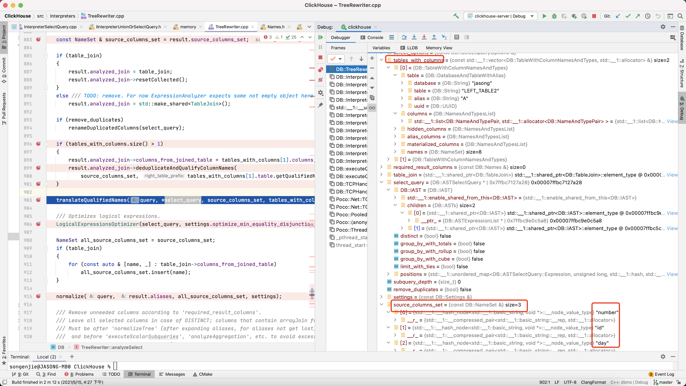


TranslateQualifiedNamesVisitor（TranslateQualifiedNamesVisitor::data,

```c++
void translateQualifiedNames(ASTPtr & query, const ASTSelectQuery & select_query, const NameSet & source_columns_set,
                             const TablesWithColumns & tables_with_columns)
{
    LogAST log;
    TranslateQualifiedNamesVisitor::Data visitor_data(source_columns_set, tables_with_columns);
    TranslateQualifiedNamesVisitor visitor(visitor_data, log.stream());
    visitor.visit(query);

    /// This may happen after expansion of COLUMNS('regexp').
    if (select_query.select()->children.empty())
        throw Exception("Empty list of columns in SELECT query", ErrorCodes::EMPTY_LIST_OF_COLUMNS_QUERIED);
}
```


TranslateQualifiedNamesMatcher 

分为了 

ASTIdentifier、ASTTableJoin、ASTSelectQuery、ASTExpressionList、ASTFunction

identifier 是一个可识别的最小抽象字段（或者是一个表应该）

```c++
void TranslateQualifiedNamesMatcher::visit(ASTPtr & ast, Data & data)
{
    if (auto * t = ast->as<ASTIdentifier>())
        visit(*t, ast, data);
    if (auto * t = ast->as<ASTTableJoin>())
        visit(*t, ast, data);
    if (auto * t = ast->as<ASTSelectQuery>())
        visit(*t, ast, data);
    if (auto * node = ast->as<ASTExpressionList>())
        visit(*node, ast, data);
    if (auto * node = ast->as<ASTFunction>())
        visit(*node, ast, data);
}

void TranslateQualifiedNamesMatcher::visit(ASTIdentifier & identifier, ASTPtr &, Data & data)
{
    if (IdentifierSemantic::getColumnName(identifier))
    {
        String short_name = identifier.shortName();
        bool allow_ambiguous = data.join_using_columns.count(short_name);
      
      
        if (auto best_pos = IdentifierSemantic::chooseTable(identifier, data.tables, allow_ambiguous))
        {
            size_t table_pos = *best_pos;
            if (data.unknownColumn(table_pos, identifier))
            {
                String table_name = data.tables[table_pos].table.getQualifiedNamePrefix(false);
                throw Exception("There's no column '" + identifier.name() + "' in table '" + table_name + "'",
                                ErrorCodes::UNKNOWN_IDENTIFIER);
            }

            IdentifierSemantic::setMembership(identifier, table_pos);

            /// In case if column from the joined table are in source columns, change it's name to qualified.
            /// Also always leave unusual identifiers qualified.
            const auto & table = data.tables[table_pos].table;
          
            //这里的table_pos 是一个比较关键的判断条件
            if (table_pos && (data.hasColumn(short_name) || !isValidIdentifierBegin(short_name.at(0))))
                IdentifierSemantic::setColumnLongName(identifier, table);
            else
                IdentifierSemantic::setColumnShortName(identifier, table);
        }
    }
}
std::optional<size_t> IdentifierSemantic::chooseTable(const ASTIdentifier & identifier, const TablesWithColumns & tables, bool ambiguous)
{
    return tryChooseTable<TableWithColumnNamesAndTypes>(identifier, tables, ambiguous);
}

```

```
DB::IdentifierSemantic::canReferColumnToTable(DB::ASTIdentifier const&, DB::TableWithColumnNamesAndTypes const&) IdentifierSemantic.cpp:211
std::__1::optional<unsigned long> DB::(anonymous namespace)::tryChooseTable<DB::TableWithColumnNamesAndTypes>(DB::ASTIdentifier const&, std::__1::vector<DB::TableWithColumnNamesAndTypes, std::__1::allocator<DB::TableWithColumnNamesAndTypes> > const&, bool, bool) IdentifierSemantic.cpp:32
DB::IdentifierSemantic::chooseTable(DB::ASTIdentifier const&, std::__1::vector<DB::TableWithColumnNamesAndTypes, std::__1::allocator<DB::TableWithColumnNamesAndTypes> > const&, bool) IdentifierSemantic.cpp:140
DB::TranslateQualifiedNamesMatcher::visit(DB::ASTIdentifier&, std::__1::shared_ptr<DB::IAST>&, DB::TranslateQualifiedNamesMatcher::Data&) TranslateQualifiedNamesVisitor.cpp:101
DB::TranslateQualifiedNamesMatcher::visit(std::__1::shared_ptr<DB::IAST>&, DB::TranslateQualifiedNamesMatcher::Data&) TranslateQualifiedNamesVisitor.cpp:84
DB::InDepthNodeVisitor<DB::TranslateQualifiedNamesMatcher, true, std::__1::shared_ptr<DB::IAST>
```

这里会查找到最佳的column 对应一张表信息

可以看下这里判断是否命中当前表的 一个不错的代码

```c++
IdentifierSemantic::ColumnMatch IdentifierSemantic::canReferColumnToTable(const ASTIdentifier & identifier,
                                                                          const DatabaseAndTableWithAlias & db_and_table)
{
    /// database.table.column
    if (doesIdentifierBelongTo(identifier, db_and_table.database, db_and_table.table))
        return ColumnMatch::DbAndTable;

    /// alias.column
    if (doesIdentifierBelongTo(identifier, db_and_table.alias))
        return ColumnMatch::TableAlias;

    /// table.column
    if (doesIdentifierBelongTo(identifier, db_and_table.table))
    {
        if (!db_and_table.alias.empty())
            return ColumnMatch::AliasedTableName;
        else
            return ColumnMatch::TableName;
    }

    return ColumnMatch::NoMatch;
}
```


table_pos

使用IdentifierSemantic做裁剪

data.tables 即为 tables_with_columns

非第0个表的所有match 中的表都要设置为 setColumnLongName 即为：A.id

setColumnShortName 即为 id ，默认为第0个表的字段信息

Has columns

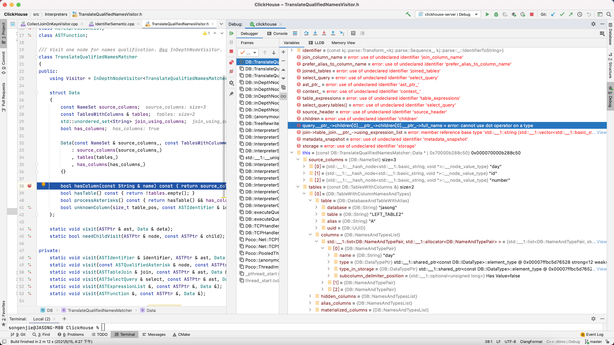


columns 被改写

左表字段short

右表字段long

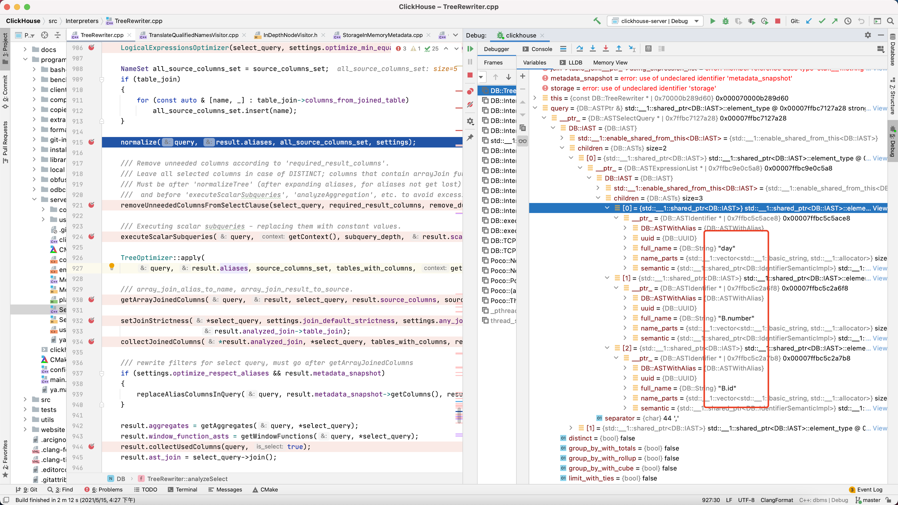


Visit join 

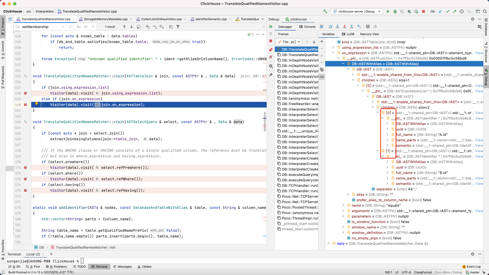

translateQualifiedNames 完成


Source_columns 可以保证顺序 std::list

Source_columns_set 不保证顺序  std::undoredset 

columns_from_joined_table 就是非第一张表中的column 字段

```
    NameSet all_source_columns_set = source_columns_set;
    if (table_join)
    {
        for (const auto & [name, _] : table_join->columns_from_joined_table)
            all_source_columns_set.insert(name);
    }
```


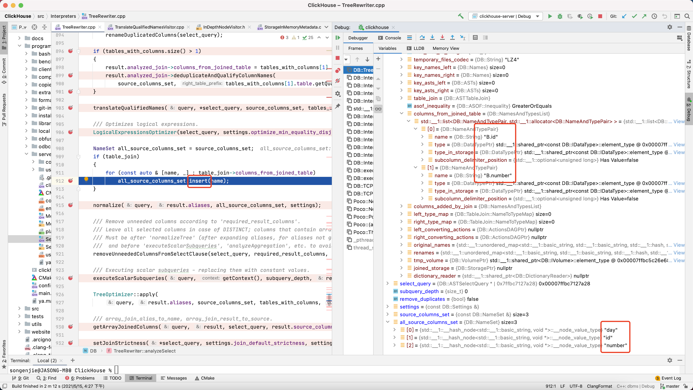

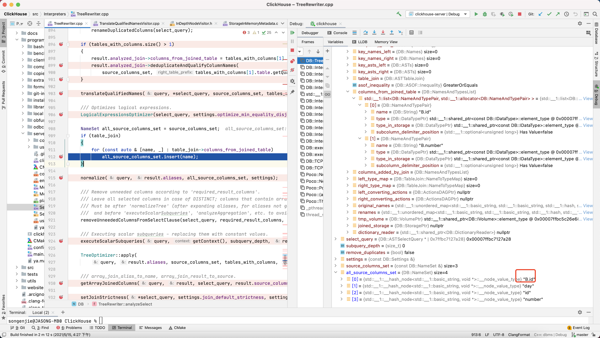


CollectJoinOnKeysMatcher

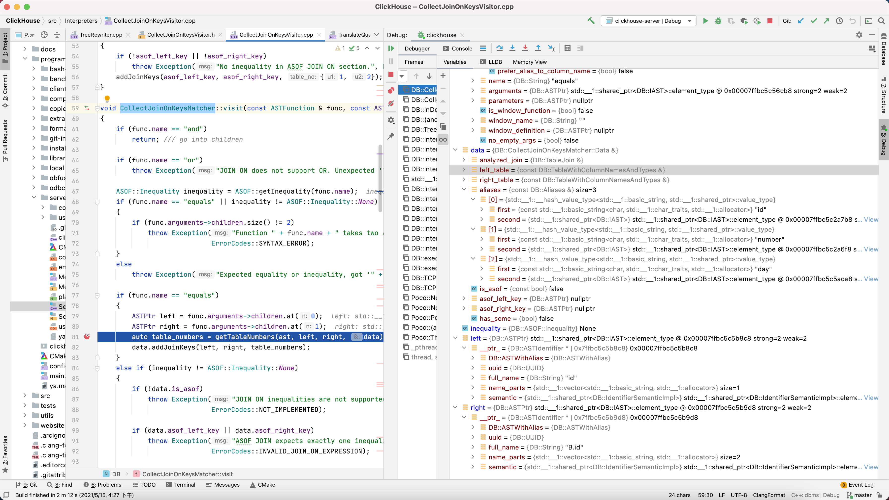


collect join 

getTableForIdentifiers

选择join column 对应的表的一个过程

一个identifiers 是一个join 的一个字段部分

主要getmember 通过 identifier semantic 获取属于哪个membership

左表为1 

右表为2

```c++
DB::CollectJoinOnKeysMatcher::getTableForIdentifiers(std::__1::vector<DB::ASTIdentifier const*, std::__1::allocator<DB::ASTIdentifier const*> >&, DB::CollectJoinOnKeysMatcher::Data const&) CollectJoinOnKeysVisitor.cpp:193
DB::CollectJoinOnKeysMatcher::getTableNumbers(std::__1::shared_ptr<DB::IAST> const&, std::__1::shared_ptr<DB::IAST> const&, std::__1::shared_ptr<DB::IAST> const&, DB::CollectJoinOnKeysMatcher::Data&) CollectJoinOnKeysVisitor.cpp:136
DB::CollectJoinOnKeysMatcher::visit(DB::ASTFunction const&, std::__1::shared_ptr<DB::IAST> const&, DB::CollectJoinOnKeysMatcher::Data&) CollectJoinOnKeysVisitor.cpp:81
DB::CollectJoinOnKeysMatcher::visit(std::__1::shared_ptr<DB::IAST> const&, DB::CollectJoinOnKeysMatcher::Data&) CollectJoinOnKeysVisitor.h:46
DB::InDepthNodeVisitor<DB::CollectJoinOnKeysMatcher, true, std::__1::shared_ptr<DB::IAST> const>::visit(std::__1::shared_ptr<DB::IAST> const&) InDepthNodeVisitor.h:34
DB::(anonymous namespace)::collectJoinedColumns(DB::TableJoin&, DB::ASTSelectQuery const&, std::__1::vector<DB::TableWithColumnNamesAndTypes, std::__1::allocator<DB::TableWithColumnNamesAndTypes> > const&, std::__1::unordered_map<std::__1::basic_string<char, std::__1::char_traits<char>, std::__1::allocator<char> >, std::__1::shared_ptr<DB::IAST>, std::__1::hash<std::__1::basic_string<char, std::__1::char_traits<char>, std::__1::allocator<char> > >, std::__1::equal_to<std::__1::basic_string<char, std::__1::char_traits<char>, std::__1::allocator<char> > >, std::__1::allocator<std::__1::pair<std::__1::basic_string<char, std::__1::char_traits<char>, std::__1::allocator<char> > const, std::__1::shared_ptr<DB::IAST> > > > const&) TreeRewriter.cpp:540
DB::TreeRewriter::analyzeSelect(std::__1::shared_ptr<DB::IAST>&, DB::TreeRewriterResult&&, DB::SelectQueryOptions 
```

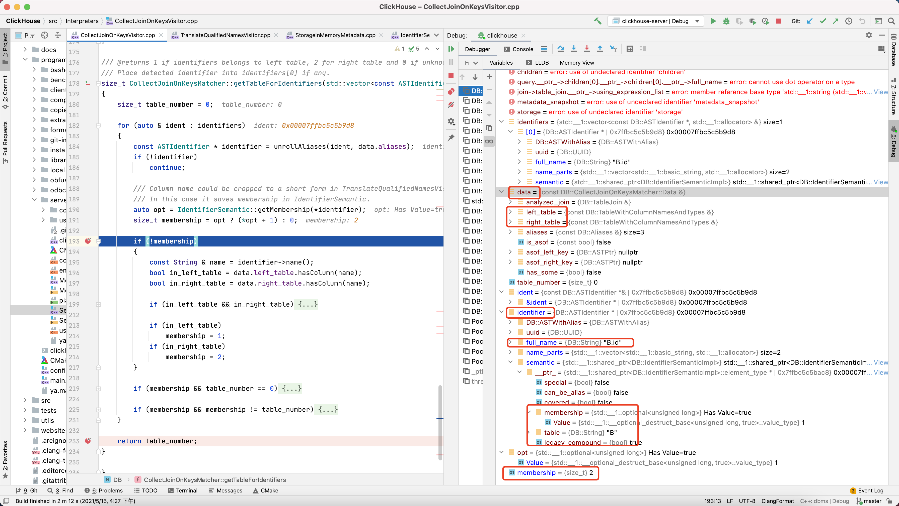

这里 identifier->name() 实际上是有问题

主要因为if内部理论上是不会走进去的

Indetifier->name() 获取到的nameparts 一个longtime 即table.columns全名可能是

所有这里应该修改为 identifier->short name();

返回一个std::pairs<1,2> 表示左1 右2

```sql
CREATE MATERIALIZED VIEW meterialized_table_3 TO meterialized_table_storage AS
SELECT
    A.day AS day,
    B.number AS number,
    B.id AS id
FROM LEFT_TABLE2 AS A
INNER JOIN RIGHT_TABLE2 AS B ON A.id = B.id;
```

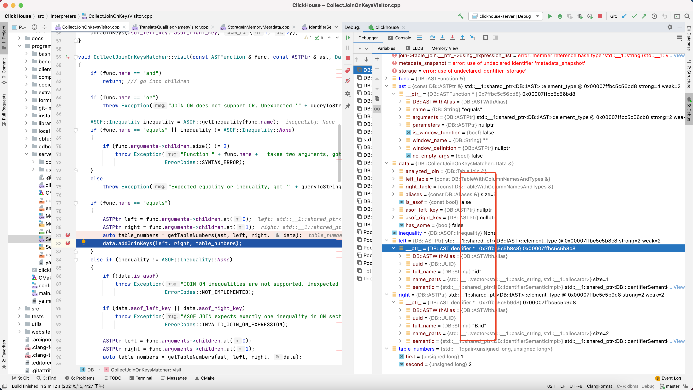

join 完成


collectUsedColumns

```
///计算执行表达式所需的列。
///然后，从可用列列表中删除所有其他列。
///执行后，列将仅包含从表中读取所需的列的列表。
```

analyzeSelect 完成


统计当前表需要查询的字段

左表

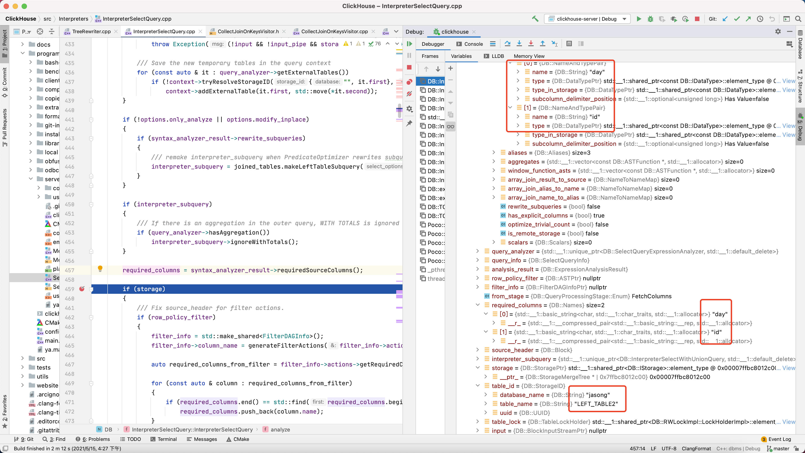

右表

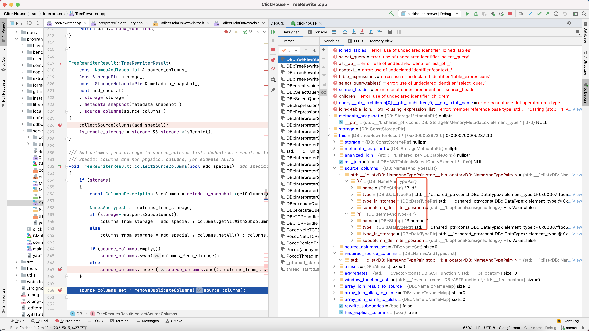


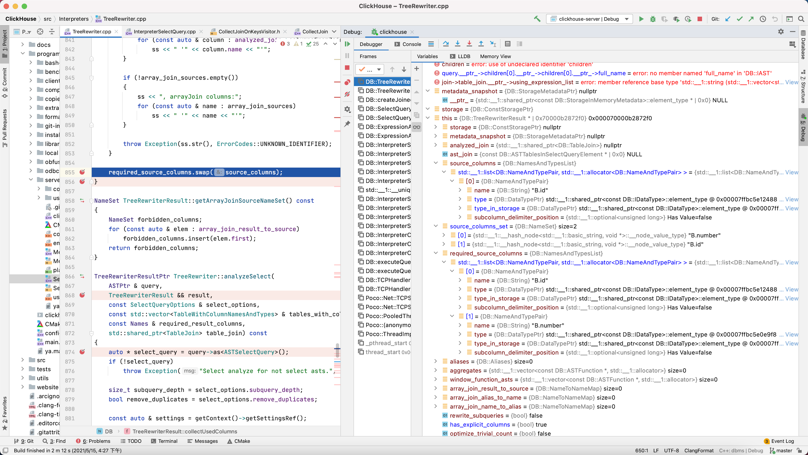


getsampleBlockImpl 暂时没理解他是要干啥 ，以上selectquery 重新来一遍

```c++
DB::InterpreterSelectQuery::InterpreterSelectQuery(std::__1::shared_ptr<DB::IAST> const&, std::__1::shared_ptr<DB::Context>, std::__1::shared_ptr<DB::IBlockInputStream> const&, std::__1::optional<DB::Pipe>, std::__1::shared_ptr<DB::IStorage> const&, DB::SelectQueryOptions const&, std::__1::vector<std::__1::basic_string<char, std::__1::char_traits<char>, std::__1::allocator<char> >, std::__1::allocator<std::__1::basic_string<char, std::__1::char_traits<char>, std::__1::allocator<char> > > > const&, std::__1::shared_ptr<DB::StorageInMemoryMetadata const> const&) InterpreterSelectQuery.cpp:311
DB::InterpreterSelectQuery::InterpreterSelectQuery(std::__1::shared_ptr<DB::IAST> const&, std::__1::shared_ptr<DB::Context>, std::__1::shared_ptr<DB::IBlockInputStream> const&, std::__1::optional<DB::Pipe>, std::__1::shared_ptr<DB::IStorage> const&, DB::SelectQueryOptions const&, std::__1::vector<std::__1::basic_string<char, std::__1::char_traits<char>, std::__1::allocator<char> >, std::__1::allocator<std::__1::basic_string<char, std::__1::char_traits<char>, std::__1::allocator<char> > > > const&, std::__1::shared_ptr<DB::StorageInMemoryMetadata const> const&) InterpreterSelectQuery.cpp:281
DB::InterpreterSelectQuery::InterpreterSelectQuery(std::__1::shared_ptr<DB::IAST> const&, std::__1::shared_ptr<DB::Context>, DB::SelectQueryOptions const&, std::__1::vector<std::__1::basic_string<char, std::__1::char_traits<char>, std::__1::allocator<char> >, std::__1::allocator<std::__1::basic_string<char, std::__1::char_traits<char>, std::__1::allocator<char> > > > const&) InterpreterSelectQuery.cpp:159
std::__1::__unique_if<DB::InterpreterSelectQuery>::__unique_single std::__1::make_unique<DB::InterpreterSelectQuery, std::__1::shared_ptr<DB::IAST> const&, std::__1::shared_ptr<DB::Context>&, DB::SelectQueryOptions&, std::__1::vector<std::__1::basic_string<char, std::__1::char_traits<char>, std::__1::allocator<char> >, std::__1::allocator<std::__1::basic_string<char, std::__1::char_traits<char>, std::__1::allocator<char> > > > const&>(std::__1::shared_ptr<DB::IAST> const&, std::__1::shared_ptr<DB::Context>&, DB::SelectQueryOptions&, std::__1::vector<std::__1::basic_string<char, std::__1::char_traits<char>, std::__1::allocator<char> >, std::__1::allocator<std::__1::basic_string<char, std::__1::char_traits<char>, std::__1::allocator<char> > > > const&) memory:2068
DB::InterpreterSelectWithUnionQuery::buildCurrentChildInterpreter(std::__1::shared_ptr<DB::IAST> const&, std::__1::vector<std::__1::basic_string<char, std::__1::char_traits<char>, std::__1::allocator<char> >, std::__1::allocator<std::__1::basic_string<char, std::__1::char_traits<char>, std::__1::allocator<char> > > > const&) InterpreterSelectWithUnionQuery.cpp:212
DB::InterpreterSelectWithUnionQuery::InterpreterSelectWithUnionQuery(std::__1::shared_ptr<DB::IAST> const&, std::__1::shared_ptr<DB::Context>, DB::SelectQueryOptions const&, std::__1::vector<std::__1::basic_string<char, std::__1::char_traits<char>, std::__1::allocator<char> >, std::__1::allocator<std::__1::basic_string<char, std::__1::char_traits<char>, std::__1::allocator<char> > > > const&) InterpreterSelectWithUnionQuery.cpp:134
DB::InterpreterSelectWithUnionQuery::InterpreterSelectWithUnionQuery(std::__1::shared_ptr<DB::IAST> const&, std::__1::shared_ptr<DB::Context>, DB::SelectQueryOptions const&, std::__1::vector<std::__1::basic_string<char, std::__1::char_traits<char>, std::__1::allocator<char> >, std::__1::allocator<std::__1::basic_string<char, std::__1::char_traits<char>, std::__1::allocator<char> > > > const&) InterpreterSelectWithUnionQuery.cpp:34
void std::__1::allocator<DB::InterpreterSelectWithUnionQuery>::construct<DB::InterpreterSelectWithUnionQuery, std::__1::shared_ptr<DB::IAST>&, std::__1::shared_ptr<DB::Context>&, DB::SelectQueryOptions&, std::__1::vector<std::__1::basic_string<char, std::__1::char_traits<char>, std::__1::allocator<char> >, std::__1::allocator<std::__1::basic_string<char, std::__1::char_traits<char>, std::__1::allocator<char> > > > const&>(DB::InterpreterSelectWithUnionQuery*, std::__1::shared_ptr<DB::IAST>&, std::__1::shared_ptr<DB::Context>&, DB::SelectQueryOptions&, std::__1::vector<std::__1::basic_string<char, std::__1::char_traits<char>, std::__1::allocator<char> >, std::__1::allocator<std::__1::basic_string<char, std::__1::char_traits<char>, std::__1::allocator<char> > > > const&) memory:886
void std::__1::allocator_traits<std::__1::allocator<DB::InterpreterSelectWithUnionQuery> >::__construct<DB::InterpreterSelectWithUnionQuery, std::__1::shared_ptr<DB::IAST>&, std::__1::shared_ptr<DB::Context>&, DB::SelectQueryOptions&, std::__1::vector<std::__1::basic_string<char, std::__1::char_traits<char>, std::__1::allocator<char> >, std::__1::allocator<std::__1::basic_string<char, std::__1::char_traits<char>, std::__1::allocator<char> > > > const&>(std::__1::integral_constant<bool, true>, std::__1::allocator<DB::InterpreterSelectWithUnionQuery>&, DB::InterpreterSelectWithUnionQuery*, std::__1::shared_ptr<DB::IAST>&, std::__1::shared_ptr<DB::Context>&, DB::SelectQueryOptions&, std::__1::vector<std::__1::basic_string<char, std::__1::char_traits<char>, std::__1::allocator<char> >, std::__1::allocator<std::__1::basic_string<char, std::__1::char_traits<char>, std::__1::allocator<char> > > > const&) allocator_traits.h:519
void std::__1::allocator_traits<std::__1::allocator<DB::InterpreterSelectWithUnionQuery> >::construct<DB::InterpreterSelectWithUnionQuery, std::__1::shared_ptr<DB::IAST>&, std::__1::shared_ptr<DB::Context>&, DB::SelectQueryOptions&, std::__1::vector<std::__1::basic_string<char, std::__1::char_traits<char>, std::__1::allocator<char> >, std::__1::allocator<std::__1::basic_string<char, std::__1::char_traits<char>, std::__1::allocator<char> > > > const&>(std::__1::allocator<DB::InterpreterSelectWithUnionQuery>&, DB::InterpreterSelectWithUnionQuery*, std::__1::shared_ptr<DB::IAST>&, std::__1::shared_ptr<DB::Context>&, DB::SelectQueryOptions&, std::__1::vector<std::__1::basic_string<char, std::__1::char_traits<char>, std::__1::allocator<char> >, std::__1::allocator<std::__1::basic_string<char, std::__1::char_traits<char>, std::__1::allocator<char> > > > const&) allocator_traits.h:481
std::__1::__shared_ptr_emplace<DB::InterpreterSelectWithUnionQuery, std::__1::allocator<DB::InterpreterSelectWithUnionQuery> >::__shared_ptr_emplace<std::__1::shared_ptr<DB::IAST>&, std::__1::shared_ptr<DB::Context>&, DB::SelectQueryOptions&, std::__1::vector<std::__1::basic_string<char, std::__1::char_traits<char>, std::__1::allocator<char> >, std::__1::allocator<std::__1::basic_string<char, std::__1::char_traits<char>, std::__1::allocator<char> > > > const&>(std::__1::allocator<DB::InterpreterSelectWithUnionQuery>, std::__1::shared_ptr<DB::IAST>&, std::__1::shared_ptr<DB::Context>&, DB::SelectQueryOptions&, std::__1::vector<std::__1::basic_string<char, std::__1::char_traits<char>, std::__1::allocator<char> >, std::__1::allocator<std::__1::basic_string<char, std::__1::char_traits<char>, std::__1::allocator<char> > > > const&) memory:2594
std::__1::__shared_ptr_emplace<DB::InterpreterSelectWithUnionQuery, std::__1::allocator<DB::InterpreterSelectWithUnionQuery> >::__shared_ptr_emplace<std::__1::shared_ptr<DB::IAST>&, std::__1::shared_ptr<DB::Context>&, DB::SelectQueryOptions&, std::__1::vector<std::__1::basic_string<char, std::__1::char_traits<char>, std::__1::allocator<char> >, std::__1::allocator<std::__1::basic_string<char, std::__1::char_traits<char>, std::__1::allocator<char> > > > const&>(std::__1::allocator<DB::InterpreterSelectWithUnionQuery>, std::__1::shared_ptr<DB::IAST>&, std::__1::shared_ptr<DB::Context>&, DB::SelectQueryOptions&, std::__1::vector<std::__1::basic_string<char, std::__1::char_traits<char>, std::__1::allocator<char> >, std::__1::allocator<std::__1::basic_string<char, std::__1::char_traits<char>, std::__1::allocator<char> > > > const&) memory:2590
std::__1::shared_ptr<DB::InterpreterSelectWithUnionQuery> std::__1::allocate_shared<DB::InterpreterSelectWithUnionQuery, std::__1::allocator<DB::InterpreterSelectWithUnionQuery>, std::__1::shared_ptr<DB::IAST>&, std::__1::shared_ptr<DB::Context>&, DB::SelectQueryOptions&, std::__1::vector<std::__1::basic_string<char, std::__1::char_traits<char>, std::__1::allocator<char> >, std::__1::allocator<std::__1::basic_string<char, std::__1::char_traits<char>, std::__1::allocator<char> > > > const&, void>(std::__1::allocator<DB::InterpreterSelectWithUnionQuery> const&, std::__1::shared_ptr<DB::IAST>&, std::__1::shared_ptr<DB::Context>&, DB::SelectQueryOptions&, std::__1::vector<std::__1::basic_string<char, std::__1::char_traits<char>, std::__1::allocator<char> >, std::__1::allocator<std::__1::basic_string<char, std::__1::char_traits<char>, std::__1::allocator<char> > > > const&) memory:3360
std::__1::shared_ptr<DB::InterpreterSelectWithUnionQuery> std::__1::make_shared<DB::InterpreterSelectWithUnionQuery, std::__1::shared_ptr<DB::IAST>&, std::__1::shared_ptr<DB::Context>&, DB::SelectQueryOptions&, std::__1::vector<std::__1::basic_string<char, std::__1::char_traits<char>, std::__1::allocator<char> >, std::__1::allocator<std::__1::basic_string<char, std::__1::char_traits<char>, std::__1::allocator<char> > > > const&, void>(std::__1::shared_ptr<DB::IAST>&, std::__1::shared_ptr<DB::Context>&, DB::SelectQueryOptions&, std::__1::vector<std::__1::basic_string<char, std::__1::char_traits<char>, std::__1::allocator<char> >, std::__1::allocator<std::__1::basic_string<char, std::__1::char_traits<char>, std::__1::allocator<char> > > > const&) memory:3369
DB::interpretSubquery(std::__1::shared_ptr<DB::IAST> const&, std::__1::shared_ptr<DB::Context>, std::__1::vector<std::__1::basic_string<char, std::__1::char_traits<char>, std::__1::allocator<char> >, std::__1::allocator<std::__1::basic_string<char, std::__1::char_traits<char>, std::__1::allocator<char> > > > const&, DB::SelectQueryOptions const&) interpretSubquery.cpp:115
DB::interpretSubquery(std::__1::shared_ptr<DB::IAST> const&, std::__1::shared_ptr<DB::Context>, std::__1::vector<std::__1::basic_string<char, std::__1::char_traits<char>, std::__1::allocator<char> >, std::__1::allocator<std::__1::basic_string<char, std::__1::char_traits<char>, std::__1::allocator<char> > > > const&, DB::SelectQueryOptions const&) interpretSubquery.cpp:44
DB::SelectQueryExpressionAnalyzer::makeTableJoin(DB::ASTTablesInSelectQueryElement const&, std::__1::vector<DB::ColumnWithTypeAndName, std::__1::allocator<DB::ColumnWithTypeAndName> > const&) ExpressionAnalyzer.cpp:832
DB::SelectQueryExpressionAnalyzer::appendJoin(DB::ExpressionActionsChain&) ExpressionAnalyzer.cpp:727
DB::ExpressionAnalysisResult::ExpressionAnalysisResult(DB::SelectQueryExpressionAnalyzer&, std::__1::shared_ptr<DB::StorageInMemoryMetadata const> const&, bool, bool, bool, std::__1::shared_ptr<DB::FilterDAGInfo> const&, DB::Block const&) ExpressionAnalyzer.cpp:1453
DB::ExpressionAnalysisResult::ExpressionAnalysisResult(DB::SelectQueryExpressionAnalyzer&, std::__1::shared_ptr<DB::StorageInMemoryMetadata const> const&, bool, bool, bool, std::__1::shared_ptr<DB::FilterDAGInfo> const&, DB::Block const&) ExpressionAnalyzer.cpp:1367
DB::InterpreterSelectQuery::getSampleBlockImpl() InterpreterSelectQuery.cpp:601
DB::InterpreterSelectQuery::InterpreterSelectQuery(std::__1::shared_ptr<DB::IAST> const&, std::__1::shared_ptr<DB::Context>, std::__1::shared_ptr<DB::IBlockInputStream> const&, std::__1::optional<DB::Pipe>, std::__1::shared_ptr<DB::IStorage> const&, DB::SelectQueryOptions const&, std::__1::vector<std::__1::basic_string<char, std::__1::char_traits<char>, std::__1::allocator<char> >, std::__1::allocator<std::__1::basic_string<char, std::__1::char_traits<char>, std::__1::allocator<char> > > > const&, std::__1::shared_ptr<DB::StorageInMemoryMetadata const> const&)::$_2::operator()(bool) const InterpreterSelectQuery.cpp:480
DB::InterpreterSelectQuery::InterpreterSelectQuery(std::__1::shared_ptr<DB::IAST> const&, std::__1::shared_ptr<DB::Context>, std::__1::shared_ptr<DB::IBlockInputStream> const&, std::__1::optional<DB::Pipe>, std::__1::shared_ptr<DB::IStorage> const&, DB::SelectQueryOptions const&, std::__1::vector<std::__1::basic_string<char, std::__1::char_traits<char>, std::__1::allocator<char> >, std::__1::allocator<std::__1::basic_string<char, std::__1::char_traits<char>, std::__1::allocator<char> > > > const&, std::__1::shared_ptr<DB::StorageInMemoryMetadata const> const&) InterpreterSelectQuery.cpp:483
DB::InterpreterSelectQuery::InterpreterSelectQuery(std::__1::shared_ptr<DB::IAST> const&, std::__1::shared_ptr<DB::Context>, std::__1::shared_ptr<DB::IBlockInputStream> const&, std::__1::optional<DB::Pipe>, std::__1::shared_ptr<DB::IStorage> const&, DB::SelectQueryOptions const&, std::__1::vector<std::__1::basic_string<char, std::__1::char_traits<char>, std::__1::allocator<char> >, std::__1::allocator<std::__1::basic_string<char, std::__1::char_traits<char>, std::__1::allocator<char> > > > const&, std::__1::shared_ptr<DB::StorageInMemoryMetadata const> const&) InterpreterSelectQuery.cpp:281
DB::InterpreterSelectQuery::InterpreterSelectQuery(std::__1::shared_ptr<DB::IAST> const&, std::__1::shared_ptr<DB::Context>, DB::SelectQueryOptions const&, std::__1::vector<std::__1::basic_string<char, std::__1::char_traits<char>, std::__1::allocator<char> >, std::__1::allocator<std::__1::basic_string<char, std::__1::char_traits<char>, std::__1::allocator<char> > > > const&) InterpreterSelectQuery.cpp:159
std::__1::__unique_if<DB::InterpreterSelectQuery>::__unique_single std::__1::make_unique<DB::InterpreterSelectQuery, std::__1::shared_ptr<DB::IAST> const&, std::__1::shared_ptr<DB::Context>&, DB::SelectQueryOptions&, std::__1::vector<std::__1::basic_string<char, std::__1::char_traits<char>, std::__1::allocator<char> >, std::__1::allocator<std::__1::basic_string<char, std::__1::char_traits<char>, std::__1::allocator<char> > > > const&>(std::__1::shared_ptr<DB::IAST> const&, std::__1::shared_ptr<DB::Context>&, DB::SelectQueryOptions&, std::__1::vector<std::__1::basic_string<char, std::__1::char_traits<char>, std::__1::allocator<char> >, std::__1::allocator<std::__1::basic_string<char, std::__1::char_traits<char>, std::__1::allocator<char> > > > const&) memory:2068
DB::InterpreterSelectWithUnionQuery::buildCurrentChildInterpreter(std::__1::shared_ptr<DB::IAST> const&, std::__1::vector<std::__1::basic_string<char, std::__1::char_traits<char>, std::__1::allocator<char> >, std::__1::allocator<std::__1::basic_string<char, std::__1::char_traits<char>, std::__1::allocator<char> > > > const&) InterpreterSelectWithUnionQuery.cpp:212
DB::InterpreterSelectWithUnionQuery::InterpreterSelectWithUnionQuery(std::__1::shared_ptr<DB::IAST> const&,
```

