```
hasColumn

判断 alias name 是否包含了column name, alias name 是否包含了字段的别名

bool hasColumn(const String & name) const { return names.count(name); 


因为是两个表的join 所以需要 data.left-table data.right_table 都判断
            const String & name = identifier->name();
            bool in_left_table = data.left_table.hasColumn(name);
            bool in_right_table = data.right_table.hasColumn(name);
```

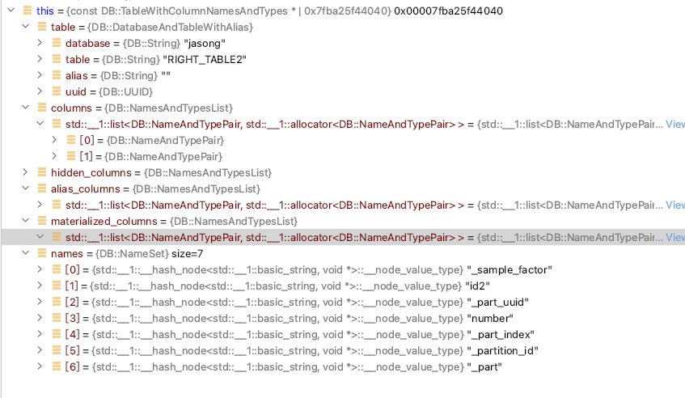


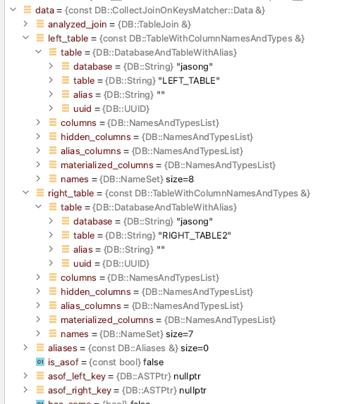


- Column match 

```
struct IdentifierSemantic
{
    enum class ColumnMatch
    {
        NoMatch,
        ColumnName,       /// column qualified with column names list
        AliasedTableName, /// column qualified with table name (but table has an alias so its priority is lower than TableName)
        TableName,        /// column qualified with table name
        DbAndTable,       /// column qualified with database and table name
        TableAlias,       /// column qualified with table alias
        Ambiguous,
    };
```

```c++
bool IdentifierSemantic::doesIdentifierBelongTo(const ASTIdentifier & identifier, const String & database, const String & table)
{
    size_t num_components = identifier.name_parts.size();
    if (num_components >= 3)
        return identifier.name_parts[0] == database &&
               identifier.name_parts[1] == table;
    return false;
}


//alias 
bool IdentifierSemantic::doesIdentifierBelongTo(const ASTIdentifier & identifier, const String & table)
{
    size_t num_components = identifier.name_parts.size();
    if (num_components >= 2)
        return identifier.name_parts[0] == table;
    return false;
}


//这里会把 alias table name 去掉
/// Strip qualifications from left side of column name.
/// Example: 'database.table.name' -> 'name'.
void IdentifierSemantic::setColumnShortName(ASTIdentifier & identifier, const DatabaseAndTableWithAlias & db_and_table)
{
    auto match = IdentifierSemantic::canReferColumnToTable(identifier, db_and_table);
    size_t to_strip = 0;
    switch (match)
    {
        case ColumnMatch::TableName:
        case ColumnMatch::AliasedTableName:
        case ColumnMatch::TableAlias:
            to_strip = 1;
            break;
        case ColumnMatch::DbAndTable:
            to_strip = 2;
            break;
        default:
            break;
    }

    if (!to_strip)
        return;

    identifier.name_parts = std::vector<String>(identifier.name_parts.begin() + to_strip, identifier.name_parts.end());
    //这里去掉column name 之前的所有
    identifier.resetFullName();
}

identifier.name_parts = std::vector<String>(identifier.name_parts.begin() + to_strip, identifier.name_parts.end());
```


```
void IdentifierSemantic::setMembership(ASTIdentifier & identifier, size_t table_pos)
{
    identifier.semantic->membership = table_pos;
    identifier.semantic->can_be_alias = false;
}
```


```c++
std::__1::optional<unsigned long> DB::(anonymous namespace)::tryChooseTable<DB::TableWithColumnNamesAndTypes>(DB::ASTIdentifier const&, std::__1::vector<DB::TableWithColumnNamesAndTypes, std::__1::allocator<DB::TableWithColumnNamesAndTypes> > const&, bool, bool) IdentifierSemantic.cpp:30
DB::IdentifierSemantic::chooseTable(DB::ASTIdentifier const&, std::__1::vector<DB::TableWithColumnNamesAndTypes, std::__1::allocator<DB::TableWithColumnNamesAndTypes> > const&, bool) IdentifierSemantic.cpp:140
DB::TranslateQualifiedNamesMatcher::visit(DB::ASTIdentifier&, std::__1::shared_ptr<DB::IAST>&, DB::TranslateQualifiedNamesMatcher::Data&) TranslateQualifiedNamesVisitor.cpp:101
DB::TranslateQualifiedNamesMatcher::visit(std::__1::shared_ptr<DB::IAST>&, DB::TranslateQualifiedNamesMatcher::Data&) TranslateQualifiedNamesVisitor.cpp:84
DB::InDepthNodeVisitor<DB::TranslateQualifiedNamesMatcher, true, std::__1::shared_ptr<DB::IAST> >::visit(std::__1::shared_ptr<DB::IAST>&) InDepthNodeVisitor.h:34
DB::InDepthNodeVisitor<DB::TranslateQualifiedNamesMatcher, true, std::__1::shared_ptr<DB::IAST> >::visitChildren(std::__1::shared_ptr<DB::IAST>&) InDepthNodeVisitor.h:55
DB::InDepthNodeVisitor<DB::TranslateQualifiedNamesMatcher, true, std::__1::shared_ptr<DB::IAST> >::visit(std::__1::shared_ptr<DB::IAST>&) InDepthNodeVisitor.h:43
DB::InDepthNodeVisitor<DB::TranslateQualifiedNamesMatcher, true, std::__1::shared_ptr<DB::IAST> >::visitChildren(std::__1::shared_ptr<DB::IAST>&) InDepthNodeVisitor.h:55
DB::InDepthNodeVisitor<DB::TranslateQualifiedNamesMatcher, true, std::__1::shared_ptr<DB::IAST> >::visit(std::__1::shared_ptr<DB::IAST>&) InDepthNodeVisitor.h:43
DB::TranslateQualifiedNamesMatcher::visit(DB::ASTTableJoin&, std::__1::shared_ptr<DB::IAST> const&, DB::TranslateQualifiedNamesMatcher::Data&) TranslateQualifiedNamesVisitor.cpp:160
DB::TranslateQualifiedNamesMatcher::visit(std::__1::shared_ptr<DB::IAST>&, DB::TranslateQualifiedNamesMatcher::Data&) TranslateQualifiedNamesVisitor.cpp:86
DB::InDepthNodeVisitor<DB::TranslateQualifiedNamesMatcher, true, std::__1::shared_ptr<DB::IAST> >::visit(std::__1::shared_ptr<DB::IAST>&) InDepthNodeVisitor.h:34
DB::InDepthNodeVisitor<DB::TranslateQualifiedNamesMatcher, true, std::__1::shared_ptr<DB::IAST> >::visitChildren(std::__1::shared_ptr<DB::IAST>&) InDepthNodeVisitor.h:55
DB::InDepthNodeVisitor<DB::TranslateQualifiedNamesMatcher, true, std::__1::shared_ptr<DB::IAST> >::visit(std::__1::shared_ptr<DB::IAST>&) InDepthNodeVisitor.h:43
DB::InDepthNodeVisitor<DB::TranslateQualifiedNamesMatcher, true, std::__1::shared_ptr<DB::IAST> >::visitChildren(std::__1::shared_ptr<DB::IAST>&) InDepthNodeVisitor.h:55
DB::InDepthNodeVisitor<DB::TranslateQualifiedNamesMatcher, true, std::__1::shared_ptr<DB::IAST> >::visit(std::__1::shared_ptr<DB::IAST>&) InDepthNodeVisitor.h:43
DB::InDepthNodeVisitor<DB::TranslateQualifiedNamesMatcher, true, std::__1::shared_ptr<DB::IAST> >::visitChildren(std::__1::shared_ptr<DB::IAST>&) InDepthNodeVisitor.h:55
DB::InDepthNodeVisitor<DB::TranslateQualifiedNamesMatcher, true, std::__1::shared_ptr<DB::IAST> >::visit(std::__1::shared_ptr<DB::IAST>&) InDepthNodeVisitor.h:43
DB::(anonymous namespace)::translateQualifiedNames(std::__1::shared_ptr<DB::IAST>&, DB::ASTSelectQuery const&, std::__1::unordered_set<std::__1::basic_string<char, std::__1::char_traits<char>, std::__1::allocator<char> >, std::__1::hash<std::__1::basic_string<char, std::__1::char_traits<char>, std::__1::allocator<char> > >, std::__1::equal_to<std::__1::basic_string<char, std::__1::char_traits<char>, std::__1::allocator<char> > >, std::__1::allocator<std::__1::basic_string<char, std::__1::char_traits<char>, std::__1::allocator<char> > > > const&, std::__1::vector<DB::TableWithColumnNamesAndTypes, std::__1::allocator<DB::TableWithColumnNamesAndTypes> > const&) TreeRewriter.cpp:261
DB::TreeRewriter::analyzeSelect(std::__1::shared_ptr<DB::IAST>&, DB::TreeRewriterResult&&, DB::SelectQueryOptions const&, std::__1::vector<DB::TableWithColumnNamesAndTypes, std::__1::allocator<DB::TableWithColumnNamesAndTypes> > const&, std::__1::vector<std::__1::basic_string<char, std::__1::char_traits<char>, std::__1::allocator<char> >, std::__1::allocator<std::__1::basic_string<char, std::__1::char_traits<char>, std::__1::allocator<char> > > > const&, std::__1::shared_ptr<DB::TableJoin>) const TreeRewriter.cpp:903
DB::InterpreterSelectQuery::InterpreterSelectQuery(std::__1::shared_ptr<DB::IAST> const&, std::__1::shared_ptr<DB::Context>, std::__1::shared_ptr<DB::IBlockInputStream> const&, std::__1::optional<DB::Pipe>, std::__1::shared_ptr<DB::IStorage> const&, DB::SelectQueryOptions const&, std::__1::vector<std::__1::basic_string<char, std::__1::char_traits<char>, std::__1::allocator<char> >, std::__1::allocator<std::__1::basic_string<char, std::__1::char_traits<char>, std::__1::allocator<char> > > > const&, std::__1::shared_ptr<DB::StorageInMemoryMetadata const> const&)::$_2::operator()(bool) const InterpreterSelectQuery.cpp:378
DB::InterpreterSelectQuery::InterpreterSelectQuery(std::__1::shared_ptr<DB::IAST> const&, std::__1::shared_ptr<DB::Context>, std::__1::shared_ptr<DB::IBlockInputStream> const&, std::__1::optional<DB::Pipe>, std::__1::shared_ptr<DB::IStorage> const&, DB::SelectQueryOptions const&, std::__1::vector<std::__1::basic_string<char, std::__1::char_traits<char>, std::__1::allocator<char> >, std::__1::allocator<std::__1::basic_string<char, std::__1::char_traits<char>, std::__1::allocator<char> > > > const&, std::__1::shared_ptr<DB::StorageInMemoryMetadata const> const&) InterpreterSelectQuery.cpp:483
DB::InterpreterSelectQuery::InterpreterSelectQuery(std::__1::shared_ptr<DB::IAST> const&, std::__1::shared_ptr<DB::Context>, std::__1::shared_ptr<DB::IBlockInputStream> const&, std::__1::optional<DB::Pipe>, std::__1::shared_ptr<DB::IStorage> const&, DB::SelectQueryOptions const&, std::__1::vector<std::__1::basic_string<char, std::__1::char_traits<char>, std::__1::allocator<char> >, std::__1::allocator<std::__1::basic_string<char, std::__1::char_traits<char>, std::__1::allocator<char> > > > const&, std::__1::shared_ptr<DB::StorageInMemoryMetadata const> const&) InterpreterSelectQuery.cpp:281
DB::InterpreterSelectQuery::InterpreterSelectQuery(std::__1::shared_ptr<DB::IAST> const&, std::__1::shared_ptr<DB::Context>, DB::SelectQueryOptions const&, std::__1::vector<std::__1::basic_string<char, std::__1::char_traits<char>, std::__1::allocator<char> >, std::__1::allocator<std::__1::basic_string<char, std::__1::char_traits<char>, std::__1::allocator<char> > > > const&) InterpreterSelectQuery.cpp:159
std::__1::__unique_if<DB::InterpreterSelectQuery>::__unique_single std::__1::make_unique<DB::InterpreterSelectQuery, std::__1::shared_ptr<DB::IAST> const&, std::__1::shared_ptr<DB::Context>&, DB::SelectQueryOptions&, std::__1::vector<std::__1::basic_string<char, std::__1::char_traits<char>, std::__1::allocator<char> >, std::__1::allocator<std::__1::basic_string<char, std::__1::char_traits<char>, std::__1::allocator<char> > > > const&>(std::__1::shared_ptr<DB::IAST> const&, std::__1::shared_ptr<DB::Context>&, DB::SelectQueryOptions&, std::__1::vector<std::__1::basic_string<char, std::__1::char_traits<char>, std::__1::allocator<char> >, std::__1::allocator<std::__1::basic_string<char, std::__1::char_traits<char>, std::__1::allocator<char> > > > const&) memory:2068
DB::InterpreterSelectWithUnionQuery::buildCurrentChildInterpreter(std::__1::shared_ptr<DB::IAST> const&, std::__1::vector<std::__1::basic_string<char, std::__1::char_traits<char>, std::__1::allocator<char> >, std::__1::allocator<std::__1::basic_string<char, std::__1::char_traits<char>, std::__1::allocator<char> > > > const&) InterpreterSelectWithUnionQuery.cpp:212
DB::InterpreterSelectWithUnionQuery::InterpreterSelectWithUnionQuery(std::__1::shared_ptr<DB::IAST> const&, std::__1::shared_ptr<DB::Context>, DB::SelectQueryOptions const&, std::__1::vector<std::__1::basic_string<char, std::__1::char_traits<char>, std::__1::allo
```


select inner join 

```
DB::ASTTablesInSelectQuery::clone() const ASTTablesInSelectQuery.cpp:99
DB::ASTSelectQuery::getExpression(DB::ASTSelectQuery::Expression, bool) const ASTSelectQuery.h:78
DB::ASTSelectQuery::clone() const ASTSelectQuery.cpp:42
DB::InterpreterSelectQuery::InterpreterSelectQuery(std::__1::shared_ptr<DB::IAST> const&, std::__1::shared_ptr<DB::Context>, std::__1::shared_ptr<DB::IBlockInputStream> const&, std::__1::optional<DB::Pipe>, std::__1::shared_ptr<DB::IStorage> const&, DB::SelectQueryOptions const&, std::__1::vector<std::__1::basic_string<char, std::__1::char_traits<char>, std::__1::allocator<char> >, std::__1::allocator<std::__1::basic_string<char, std::__1::char_traits<char>, std::__1::allocator<char> > > > const&, std::__1::shared_ptr<DB::StorageInMemoryMetadata const> const&) InterpreterSelectQuery.cpp:275
DB::InterpreterSelectQuery::InterpreterSelectQuery(std::__1::shared_ptr<DB::IAST> const&, std::__1::shared_ptr<DB::Context>, std::__1::shared_ptr<DB::IBlockInputStream> const&, std::__1::optional<DB::Pipe>, std::__1::shared_ptr<DB::IStorage> const&, DB::SelectQueryOptions const&, std::__1::vector<std::__1::basic_string<char, std::__1::char_traits<char>, std::__1::allocator<char> >, std::__1::allocator<std::__1::basic_string<char, std::__1::char_traits<char>, std::__1::allocator<char> > > > const&, std::__1::shared_ptr<DB::StorageInMemoryMetadata const> const&) InterpreterSelectQuery.cpp:281
DB::InterpreterSelectQuery::InterpreterSelectQuery(std::__1::shared_ptr<DB::IAST> const&, std::__1::shared_ptr<DB::Context>, DB::SelectQueryOptions const&, std::__1::vector<std::__1::basic_string<char, std::__1::char_traits<char>, std::__1::allocator<char> >, std::__1::allocator<std::__1::basic_string<char, std::__1::char_traits<char>, std::__1::allocator<char> > > > const&) InterpreterSelectQuery.cpp:159
std::__1::__unique_if<DB::InterpreterSelectQuery>::__unique_single std::__1::make_unique<DB::InterpreterSelectQuery, std::__1::shared_ptr<DB::IAST> const&, std::__1::shared_ptr<DB::Context>&, DB::SelectQueryOptions&, std::__1::vector<std::__1::basic_string<char, std::__1::char_traits<char>, std::__1::allocator<char> >, std::__1::allocator<std::__1::basic_string<char, std::__1::char_traits<char>, std::__1::allocator<char> > > > const&>(std::__1::shared_ptr<DB::IAST> const&, std::__1::shared_ptr<DB::Context>&, DB::SelectQueryOptions&, std::__1::vector<std::__1::basic_string<char, std::__1::char_traits<char>, std::__1::allocator<char> >, std::__1::allocator<std::__1::basic_string<char, std::__1::char_traits<char>, std::__1::allocator<char> > > > const&) memory:2068
DB::InterpreterSelectWithUnionQuery::buildCurrentChildInterpreter(std::__1::shared_ptr<DB::IAST> const&, std::__1::vector<std::__1::basic_string<char, std::__1::char_traits<char>, std::__1::allocator<char> >, std::__1::allocator<std::__1::basic_string<char, std::__1::char_traits<char>, std::__1::allocator<char> > > > const&) InterpreterSelectWithUnionQuery.cpp:212
DB::InterpreterSelectWithUnionQuery::InterpreterSelectWithUnionQuery(std::__1::shared_ptr<DB::IAST> const&, std::__1::shared_ptr<DB::Context>, DB::SelectQueryOptions const&, std::__1::vector<std::__1::basic_string<char, std::__1::char_traits<char>, std::__1::allocator<char> >, std::__1::allocator<std::__1::basic_string<char, std::__1::char_traits<char>, std::__1::allocator<char> > > > const&) InterpreterSelectWithUnionQuery.cpp:134
DB::InterpreterSelectWithUnionQuery::InterpreterSelectWithUnionQuery(std::__1::shared_ptr<DB::IAST> const&, std::__1::shared_ptr<DB::Context>, DB::SelectQueryOptions const&, std::__1::vector<std::__1::basic_string<char, std::__1::char_traits<char>, std::__1::allocator<char> >, std::__1::allocator<std::__1::basic_string<char, std::__1::char_traits<char>, std::__1::allocator<char> > > > const&) InterpreterSelectWithUnionQuery.cpp:34
std::__1::__unique_if<DB::InterpreterSelectWithUnionQuery>::__unique_single std::__1::make_unique<DB::InterpreterSelectWithUnionQuery, std::__1::shared_ptr<DB::IAST>&, std::__1::shared_ptr<DB::Context>&, DB::SelectQueryOptions const&>(std::__1::shared_ptr<DB::IAST>&, std::__1::shared_ptr<DB::Context>&, DB::SelectQueryOptions const&) memory:2068
DB::InterpreterFactory::get(std::__1::shared_ptr<DB::IAST>&, std::__1::shared_ptr<DB::Context>, DB::SelectQueryOptions const&) InterpreterFactory.cpp:110
DB::executeQueryImpl(char const*, char const*, std::__1::shared_ptr<DB::Context>, bool, DB::QueryProcessingStage::Enum, bool, DB::ReadBuffer*) executeQuery.cpp:531
DB::executeQuery(std::__1::basic_string<char, std::__1::char_traits<char>, std::__1::allocator<char> > const&, std::__1::shared_ptr<DB::Context>, bool, DB::QueryProcessingStage::Enum, bool) executeQuery.cpp:919
DB::TCPHandler::runImpl() TCPHandler.cpp:312
DB::TCPHandler::run() TCPHandler.cpp:1624
Poco::Net::TCPServerConnection::start() TCPServerConnection.cpp:43
Poco::Net::TCPServerDispatcher::run() TCPServerDispatcher.cpp:115
Poco::PooledThread::run() ThreadPool.cpp:199
Poco::(anonymous namespace)::RunnableHolder::run() Thread.cpp:55
Poco::ThreadImpl::runnableEntry(void*) Thread_POSIX.cpp:345
_pthread_start 0x00007fff2037f950
thread_start 0x00007fff2037b47b
```

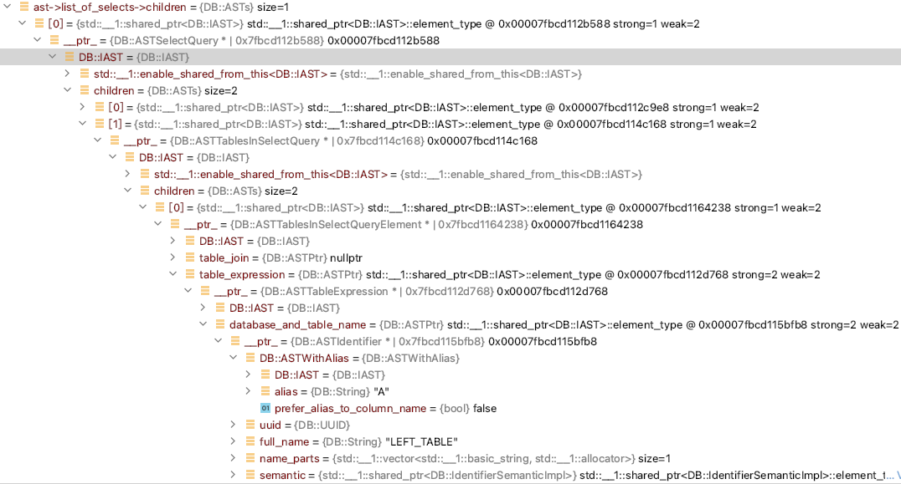


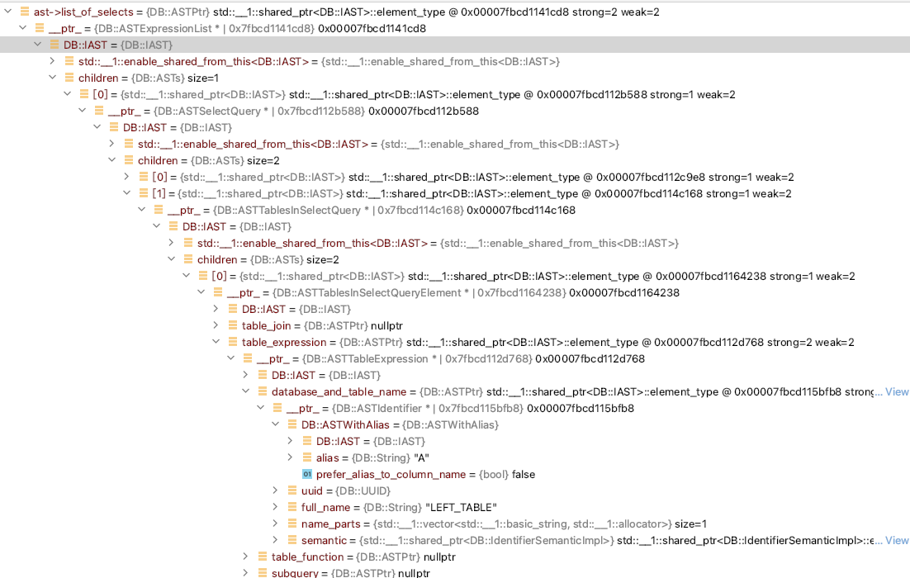


interpreterFactory.cpp

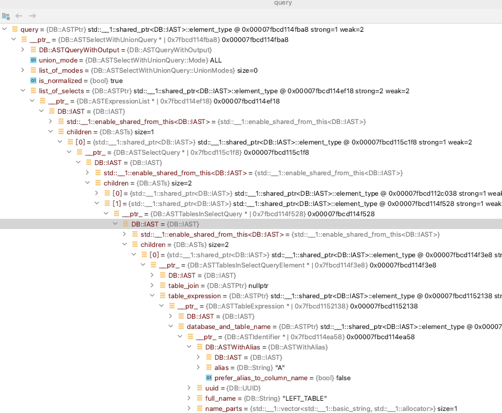


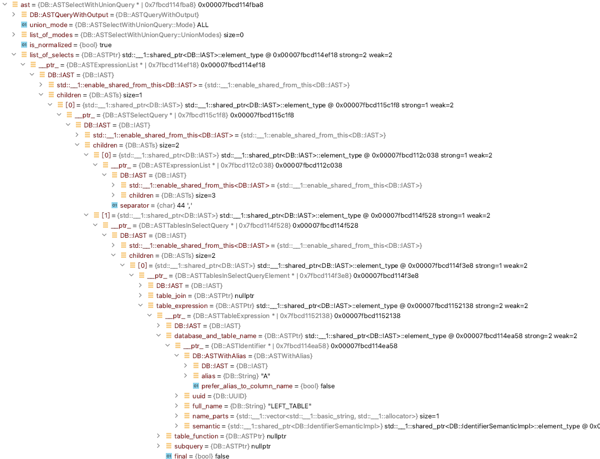


create view

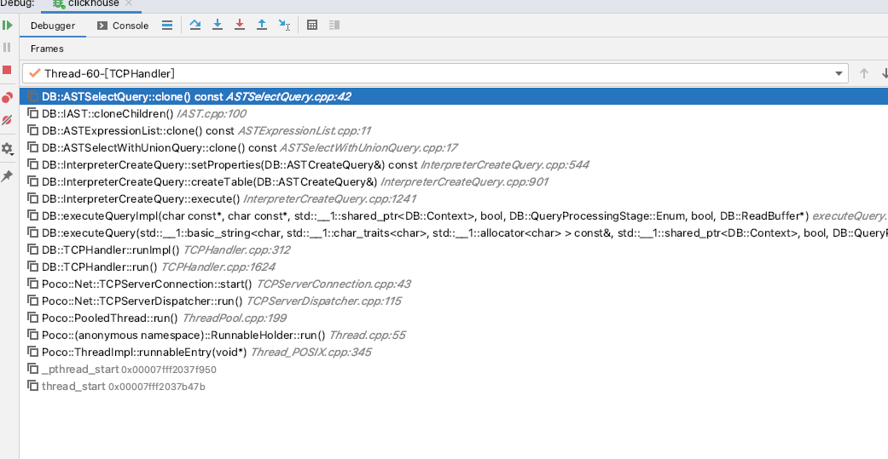

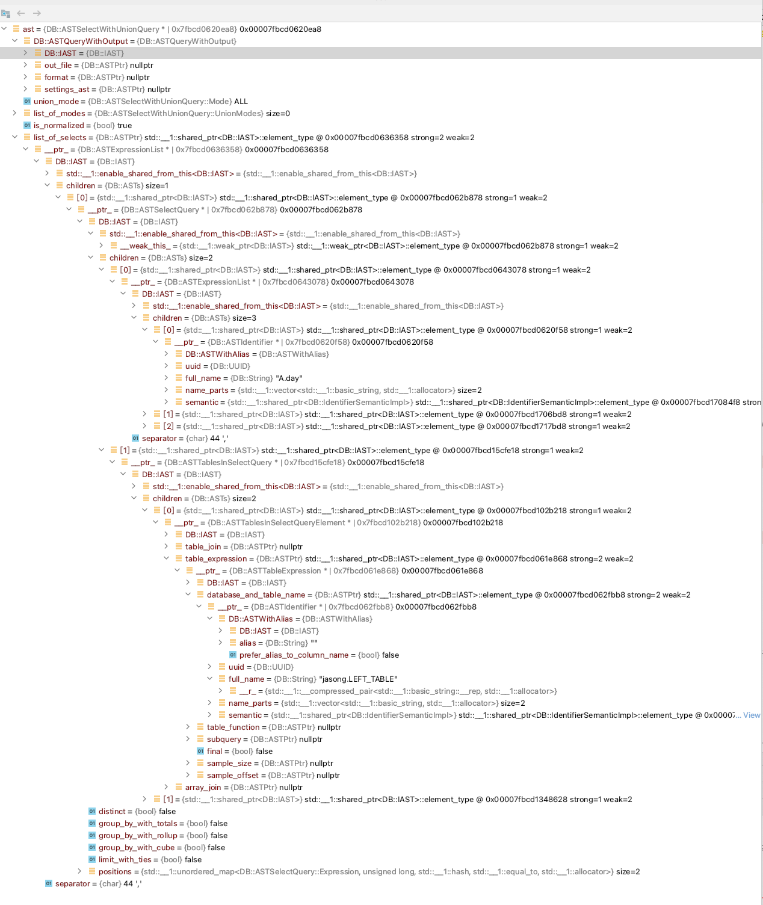


```sql

CREATE MATERIALIZED VIEW meterialized_table_2 TO meterialized_table_2_storage AS
SELECT
    A.day,
    A.id,
    RIGHT_TABLE2.number
FROM LEFT_TABLE AS A
INNER JOIN RIGHT_TABLE2 ON A.id = RIGHT_TABLE2.id2
```


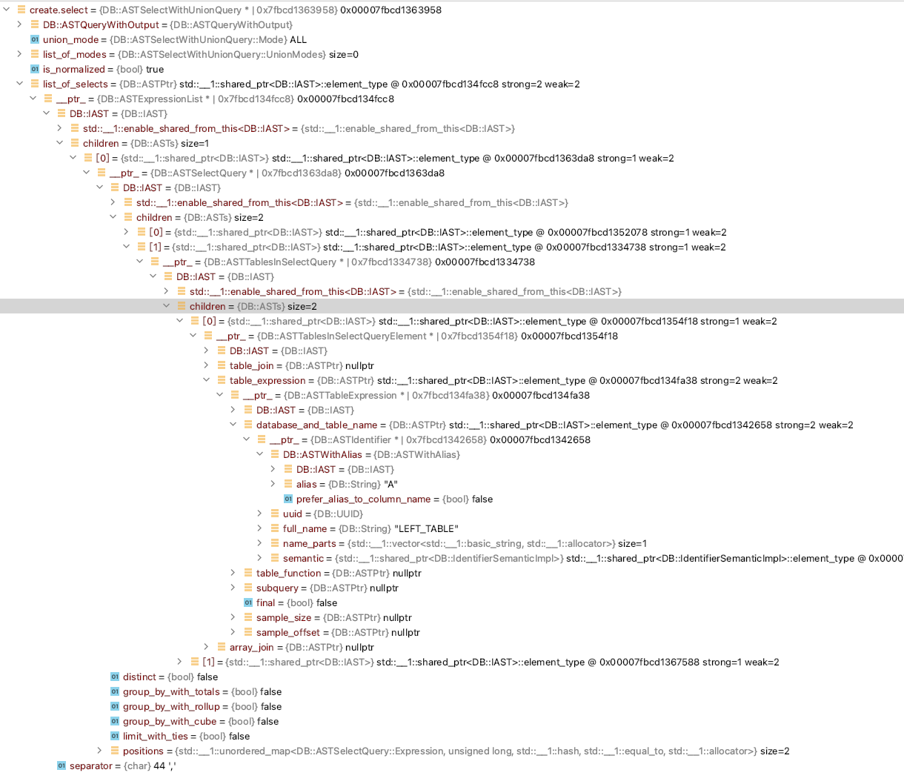


ast d


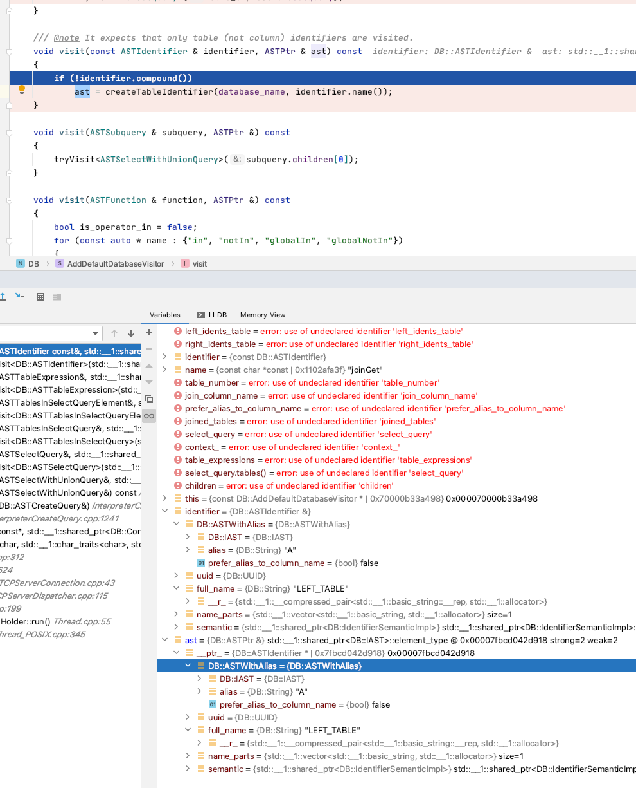


```sql


CREATE MATERIALIZED VIEW jasong.meterialized_table_5 TO jasong.meterialized_table_3_storage
(
    `day` Date,
    `id` UInt32,
    `number` UInt32
) AS
SELECT
    LEFT_TABLE.day,
    LEFT_TABLE.id,
    RIGHT_TABLE2.number
FROM jasong.LEFT_TABLE
INNER JOIN jasong.RIGHT_TABLE2 ON LEFT_TABLE.id = RIGHT_TABLE2.id2
```


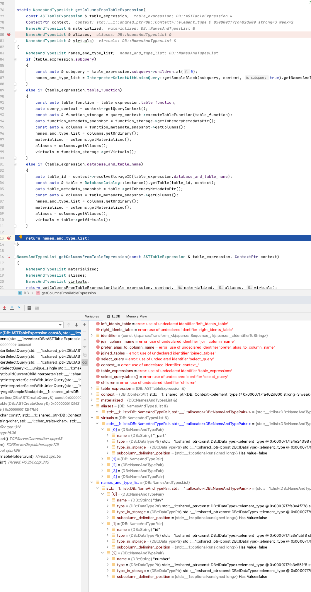


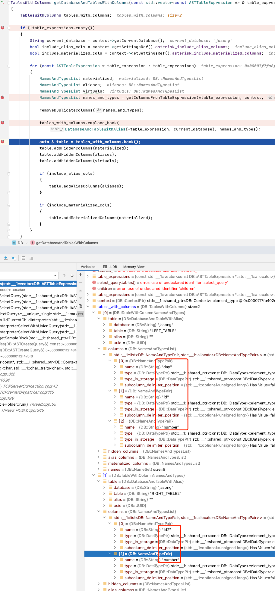


在这之前了就

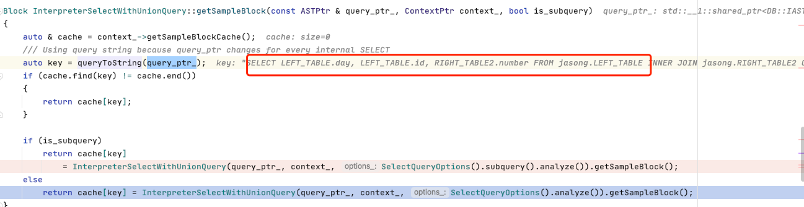


tables_expression


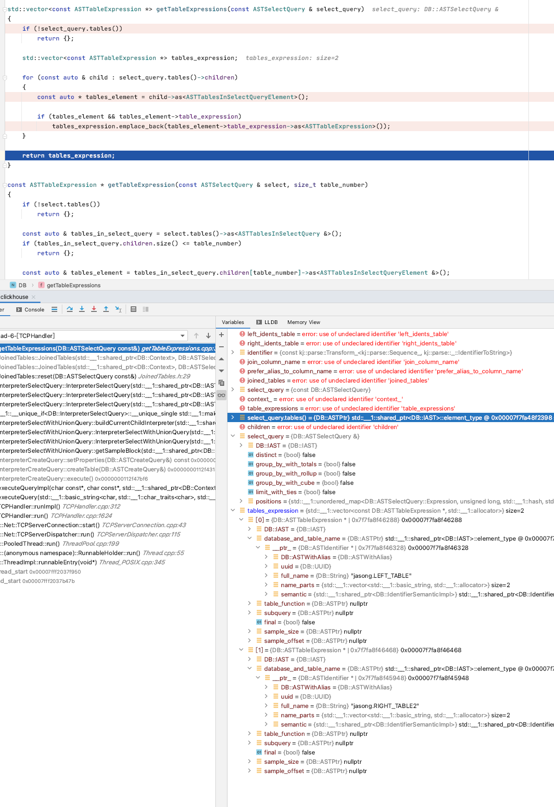


Tables_witch_columns

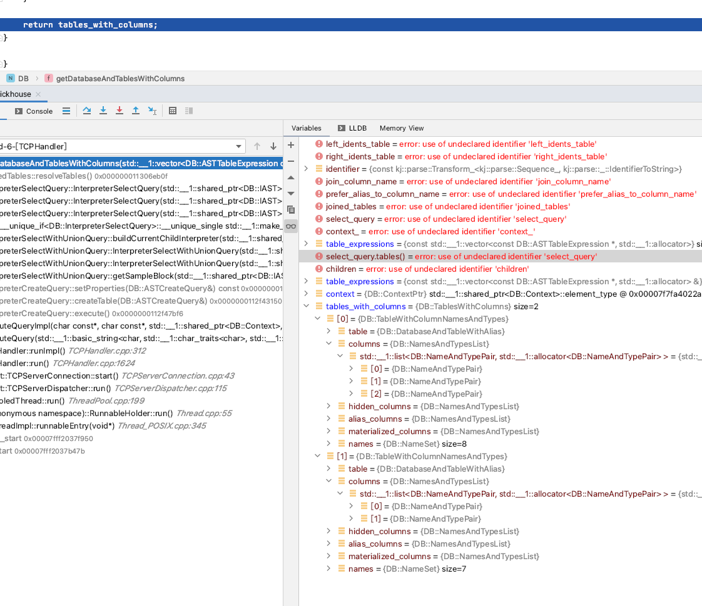


visit data

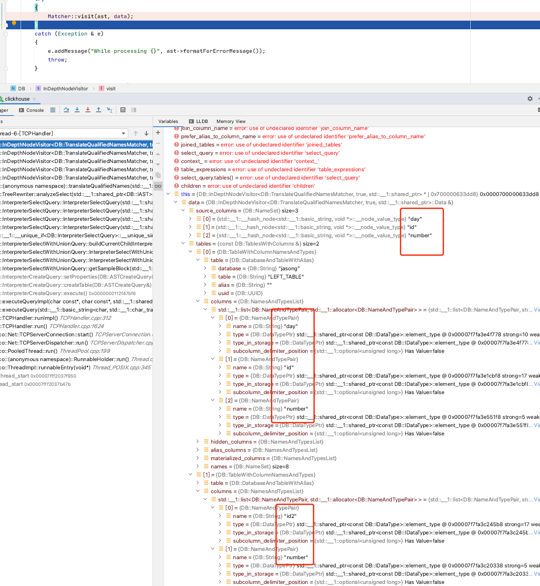


error 


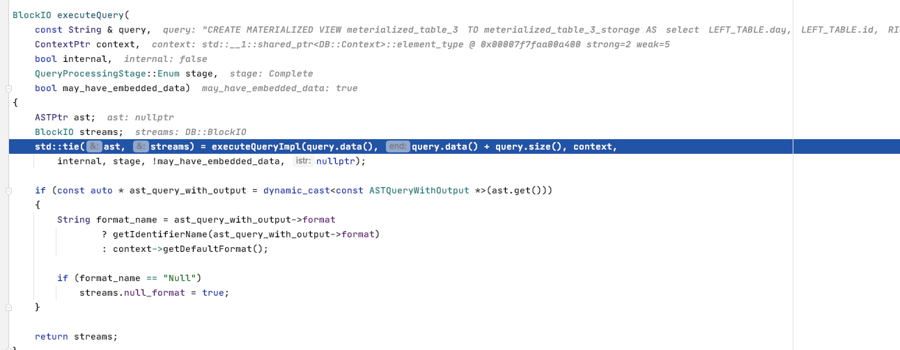


没有相同列名的情况下，是可以正确创建使用的

```sql
CREATE MATERIALIZED VIEW meterialized_table_3 TO meterialized_table_3_storage AS
SELECT
    LEFT_TABLE2.day,
    RIGHT_TABLE2.id2,
    RIGHT_TABLE2.number
FROM LEFT_TABLE2
INNER JOIN RIGHT_TABLE2 ON LEFT_TABLE2.id = RIGHT_TABLE2.id2

Query id: 7bcbcd2b-2588-49f4-b92e-6ab9fa6c2b6c

Ok.

0 rows in set. Elapsed: 0.007 sec.

JASONG-MB0 :) show create table meterialized_table_3;

SHOW CREATE TABLE meterialized_table_3

Query id: a7a34391-c280-4a52-a3a9-8618c816db66

┌─statement──────────────────────────────────────────────────────────────────────────────────────────────────────────────────────────────────────────────────────────────────────────────────────────────────────────────────────────────────────────────────┐
│ CREATE MATERIALIZED VIEW jasong.meterialized_table_3 TO jasong.meterialized_table_3_storage
(
    `day` Date,
    `id2` UInt32,
    `number` UInt32
) AS
SELECT
    LEFT_TABLE2.day,
    RIGHT_TABLE2.id2,
    RIGHT_TABLE2.number
FROM jasong.LEFT_TABLE2
INNER JOIN jasong.RIGHT_TABLE2 ON LEFT_TABLE2.id = RIGHT_TABLE2.id2 │
└────────────────────────────────────────────────────────────────────────────────────────────────────────────────────────────────────────────────────────────────────────────────────────────────────────────────────────────────────────────────────────────┘

1 rows in set. Elapsed: 0.004 sec.


CREATE TABLE jasong.meterialized_table_storage
(
    `day` Date,
    `id` UInt32,
    `number` UInt32
)
ENGINE = MergeTree
PARTITION BY toYYYYMM(day)
ORDER BY id
SETTINGS index_granularity = 8192


2 same two 
use right one 
use right two


3 no same 

use right one 
use right two 
```


```sql
1 same one 
CREATE TABLE jasong.LEFT_TABLE1
(
    `day` Date,
    `id` UInt32,
    `number` UInt32
)
ENGINE = MergeTree
PARTITION BY toYYYYMM(day)
ORDER BY id;


CREATE TABLE jasong.RIGHT_TABLE1
(
    `id2` UInt32,
    `number` UInt32
)
ENGINE = MergeTree
PARTITION BY tuple()
ORDER BY id2;


use right 

CREATE MATERIALIZED VIEW meterialized_table_1_1 TO meterialized_table_storage AS
SELECT
    LEFT_TABLE1.day,
    LEFT_TABLE1.id,
    RIGHT_TABLE1.number
FROM LEFT_TABLE1
INNER JOIN RIGHT_TABLE1 ON LEFT_TABLE1.id = RIGHT_TABLE1.id2

show create table meterialized_table_1_1;
CREATE MATERIALIZED VIEW jasong.meterialized_table_1_1 TO jasong.meterialized_table_storage
(
    `day` Date,
    `id` UInt32,
    `RIGHT_TABLE1.number` UInt32
) AS
SELECT
    LEFT_TABLE1.day,
    LEFT_TABLE1.id,
    RIGHT_TABLE1.number
FROM jasong.LEFT_TABLE1
INNER JOIN jasong.RIGHT_TABLE1 ON LEFT_TABLE1.id = RIGHT_TABLE1.id2


CREATE MATERIALIZED VIEW meterialized_table_1_3 TO meterialized_table_storage AS
SELECT
    LEFT_TABLE1.day,
    LEFT_TABLE1.id,
    RIGHT_TABLE1.id2
FROM LEFT_TABLE1
INNER JOIN RIGHT_TABLE1 ON LEFT_TABLE1.id = RIGHT_TABLE1.id2

show create table meterialized_table_1_3;
CREATE MATERIALIZED VIEW jasong.meterialized_table_1_3 TO jasong.meterialized_table_storage
(
    `day` Date,
    `id` UInt32,
    `id2` UInt32
) AS
SELECT
    LEFT_TABLE1.day,
    LEFT_TABLE1.id,
    RIGHT_TABLE1.id2
FROM jasong.LEFT_TABLE1
INNER JOIN jasong.RIGHT_TABLE1 ON LEFT_TABLE1.id = RIGHT_TABLE1.id2


use different one 

CREATE MATERIALIZED VIEW meterialized_table_1_4 TO meterialized_table_storage AS
SELECT
    LEFT_TABLE1.day,
    RIGHT_TABLE1.id2,
    RIGHT_TABLE1.number
FROM LEFT_TABLE1
INNER JOIN RIGHT_TABLE1 ON LEFT_TABLE1.id = RIGHT_TABLE1.id2
show create table meterialized_table_1_4;
CREATE MATERIALIZED VIEW jasong.meterialized_table_1_4 TO jasong.meterialized_table_storage
(
    `day` Date,
    `id2` UInt32,
    `RIGHT_TABLE1.number` UInt32
) AS
SELECT
    LEFT_TABLE1.day,
    RIGHT_TABLE1.id2,
    RIGHT_TABLE1.number
FROM jasong.LEFT_TABLE1
INNER JOIN jasong.RIGHT_TABLE1 ON LEFT_TABLE1.id = RIGHT_TABLE1.id2


use left 
CREATE MATERIALIZED VIEW meterialized_table_1_2 TO meterialized_table_storage AS
SELECT
    LEFT_TABLE1.day,
    LEFT_TABLE1.id,
    LEFT_TABLE1.number
FROM LEFT_TABLE1
INNER JOIN RIGHT_TABLE1 ON LEFT_TABLE1.id = RIGHT_TABLE1.id2

show create table meterialized_table_1_2;
CREATE MATERIALIZED VIEW jasong.meterialized_table_1_2 TO jasong.meterialized_table_storage
(
    `day` Date,
    `id` UInt32,
    `number` UInt32
) AS
SELECT
    LEFT_TABLE1.day,
    LEFT_TABLE1.id,
    LEFT_TABLE1.number
FROM jasong.LEFT_TABLE1
INNER JOIN jasong.RIGHT_TABLE1 ON LEFT_TABLE1.id = RIGHT_TABLE1.id2
```


Two

```sql
1 same one 
CREATE TABLE jasong.LEFT_TABLE2
(
    `day` Date,
    `id` UInt32,
    `number` UInt32
)
ENGINE = MergeTree
PARTITION BY toYYYYMM(day)
ORDER BY id;


CREATE TABLE jasong.RIGHT_TABLE2
(
    `id` UInt32,
    `number` UInt32
)
ENGINE = MergeTree
PARTITION BY tuple()
ORDER BY id;


right 


CREATE MATERIALIZED VIEW meterialized_table_2_1 TO meterialized_table_storage AS
SELECT
    LEFT_TABLE2.day,
    LEFT_TABLE2.id,
    RIGHT_TABLE2.number
FROM LEFT_TABLE2
INNER JOIN RIGHT_TABLE2 ON LEFT_TABLE2.id = RIGHT_TABLE2.id

show create table meterialized_table_2_1;
CREATE MATERIALIZED VIEW jasong.meterialized_table_2_1 TO jasong.meterialized_table_storage
(
    `day` Date,
    `id` UInt32,
    `RIGHT_TABLE2.number` UInt32
) AS
SELECT
    LEFT_TABLE2.day,
    LEFT_TABLE2.id,
    RIGHT_TABLE2.number
FROM jasong.LEFT_TABLE2
INNER JOIN jasong.RIGHT_TABLE2 ON LEFT_TABLE2.id = RIGHT_TABLE2.id


use two 
CREATE MATERIALIZED VIEW meterialized_table_3_3 TO meterialized_table_storage AS
SELECT
    LEFT_TABLE2.day,
    RIGHT_TABLE2.id,
    RIGHT_TABLE2.number
FROM LEFT_TABLE2
INNER JOIN RIGHT_TABLE2 ON LEFT_TABLE2.id = RIGHT_TABLE2.id


show create table meterialized_table_2_3;
CREATE MATERIALIZED VIEW jasong.meterialized_table_2_3 TO jasong.meterialized_table_storage
(
    `day` Date,
    `RIGHT_TABLE2.id` UInt32,
    `RIGHT_TABLE2.number` UInt32
) AS
SELECT
    LEFT_TABLE2.day,
    RIGHT_TABLE2.id,
    RIGHT_TABLE2.number
FROM jasong.LEFT_TABLE2
INNER JOIN jasong.RIGHT_TABLE2 ON LEFT_TABLE2.id = RIGHT_TABLE2.id


no use right 

CREATE MATERIALIZED VIEW meterialized_table_2_2 TO meterialized_table_storage AS
SELECT
    LEFT_TABLE2.day,
    LEFT_TABLE2.id,
    LEFT_TABLE2.number
FROM LEFT_TABLE2
INNER JOIN RIGHT_TABLE2 ON LEFT_TABLE2.id = RIGHT_TABLE2.id

show create table meterialized_table_2_2;
CREATE MATERIALIZED VIEW jasong.meterialized_table_2_2 TO jasong.meterialized_table_storage
(
    `day` Date,
    `id` UInt32,
    `number` UInt32
) AS
SELECT
    LEFT_TABLE2.day,
    LEFT_TABLE2.id,
    LEFT_TABLE2.number
FROM jasong.LEFT_TABLE2
INNER JOIN jasong.RIGHT_TABLE2 ON LEFT_TABLE2.id = RIGHT_TABLE2.id
```


只要左右表中有相同的column 名字

select 查询用到右边表对应的字段的时候，就会保留库名


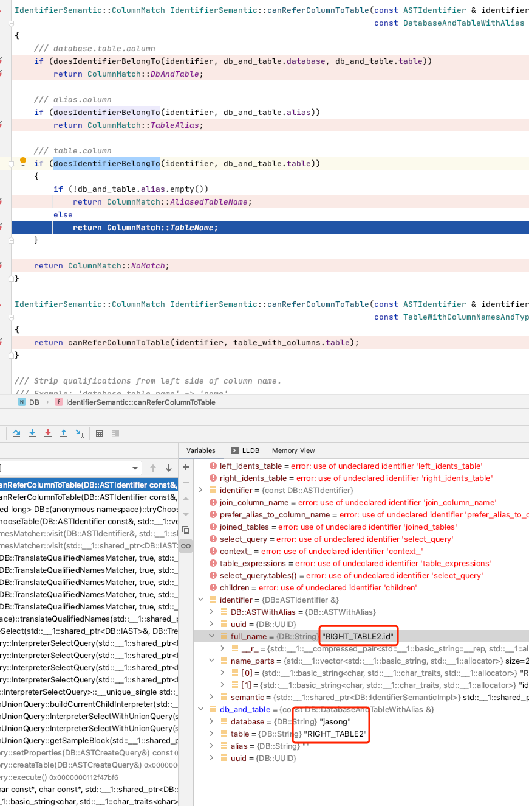


Long column name 

```
DB::IdentifierSemantic::setColumnLongName(DB::ASTIdentifier&, DB::DatabaseAndTableWithAlias const&) IdentifierSemantic.cpp:244
DB::TranslateQualifiedNamesMatcher::visit(DB::ASTIdentifier&, std::__1::shared_ptr<DB::IAST>&, DB::TranslateQualifiedNamesMatcher::Data&) 0x0000000113224c80
DB::TranslateQualifiedNamesMatcher::visit(std::__1::shared_ptr<DB::IAST>&, DB::TranslateQualifiedNamesMatcher::Data&) 0x00000001132247e1
DB::InDepthNodeVisitor<DB::TranslateQualifiedNamesMatcher, true, std::__1::shared_ptr<DB::IAST> >::visit(std::__1::shared_ptr<DB::IAST>&) InDepthNodeVisitor.h:34
DB::InDepthNodeVisitor<DB::TranslateQualifiedNamesMatcher, true, std::__1::shared_ptr<DB::IAST> >::visitChildren(std::__1::shared_ptr<DB::IAST>&) InDepthNodeVisitor.h:55
DB::InDepthNodeVisitor<DB::TranslateQualifiedNamesMatcher, true, std::__1::shared_ptr<DB::IAST> >::visit(std::__1::shared_ptr<DB::IAST>&) InDepthNodeVisitor.h:43
DB::InDepthNodeVisitor<DB::TranslateQualifiedNamesMatcher, true, std::__1::shared_ptr<DB::IAST> >::visitChildren(std::__1::shared_ptr<DB::IAST>&) InDepthNodeVisitor.h:55
DB::InDepthNodeVisitor<DB::TranslateQualifiedNamesMatcher, true, std::__1::shared_ptr<DB::IAST> >::visit(std::__1::shared_ptr<DB::IAST>&) InDepthNodeVisitor.h:43
DB::TranslateQualifiedNamesMatcher::visit(DB::ASTTableJoin&, std::__1::shared_ptr<DB::IAST> const&, DB::TranslateQualifiedNamesMatcher::Data&) 0x0000000113224d87
DB::TranslateQualifiedNamesMatcher::visit(std::__1::shared_ptr<DB::IAST>&, DB::TranslateQualifiedNamesMatcher::Data&) 0x0000000113224812
DB::InDepthNodeVisitor<DB::TranslateQualifiedNamesMatcher, true, std::__1::shared_ptr<DB::IAST> >::visit(std::__1::shared_ptr<DB::IAST>&) InDepthNodeVisitor.h:34
DB::InDepthNodeVisitor<DB::TranslateQualifiedNamesMatcher, true, std::__1::shared_ptr<DB::IAST> >::visitChildren(std::__1::shared_ptr<DB::IAST>&) InDepthNodeVisitor.h:55
DB::InDepthNodeVisitor<DB::TranslateQualifiedNamesMatcher, true, std::__1::shared_ptr<DB::IAST> >::visit(std::__1::shared_ptr<DB::IAST>&) InDepthNodeVisitor.h:43
DB::InDepthNodeVisitor<DB::TranslateQualifiedNamesMatcher, true, std::__1::shared_ptr<DB::IAST> >::visitChildren(std::__1::shared_ptr<DB::IAST>&) InDepthNodeVisitor.h:55
DB::InDepthNodeVisitor<DB::TranslateQualifiedNamesMatcher, true, std::__1::shared_ptr<DB::IAST> >::visit(std::__1::shared_ptr<DB::IAST>&) InDepthNodeVisitor.h:43
DB::InDepthNodeVisitor<DB::TranslateQualifiedNamesMatcher, true, std::__1::shared_ptr<DB::IAST> >::visitChildren(std::__1::shared_ptr<DB::IAST>&) InDepthNodeVisitor.h:55
DB::InDepthNodeVisitor<DB::TranslateQualifiedNamesMatcher, true, std::__1::shared_ptr<DB::IAST> >::visit(std::__1::shared_ptr<DB::IAST>&) InDepthNodeVisitor.h:43
DB::(anonymous namespace)::translateQualifiedNames(std::__1::shared_ptr<DB::IAST>&, DB::ASTSelectQuery const&, std::__1::unordered_set<std::__1::basic_string<char, std::__1::char_traits<char>, std::__1::allocator<char> >, std::__1::hash<std::__1::basic_string<char, std::__1::char_traits<char>, std::__1::allocator<char> > >, std::__1::equal_to<std::__1::basic_string<char, std::__1::char_traits<char>, std::__1::allocator<char> > >, std::__1::allocator<std::__1::basic_string<char, std::__1::char_traits<char>, std::__1::allocator<char> > > > const&, std::__1::vector<DB::TableWithColumnNamesAndTypes, std::__1::allocator<DB::TableWithColumnNamesAndTypes> > const&) TreeRewriter.cpp:261
DB::TreeRewriter::analyzeSelect(std::__1::shared_ptr<DB::IAST>&, DB::TreeRewriterResult&&, DB::SelectQueryOptions const&, std::__1::vector<DB::TableWithColumnNamesAndTypes, std::__1::allocator<DB::TableWithColumnNamesAndTypes> > const&, std::__1::vector<std::__1::basic_string<char, std::__1::char_traits<char>, std::__1::allocator<char> >, std::__1::allocator<std::__1::basic_string<char, std::__1::char_traits<char>, std::__1::allocator<char> > > > const&, std::__1::shared_ptr<DB::TableJoin>) const TreeRewriter.cpp:903
DB::InterpreterSelectQuery::InterpreterSelectQuery(std::__1::shared_ptr<DB::IAST> const&, std::__1::shared_ptr<DB::Context>, std::__1::shared_ptr<DB::IBlockInputStream> const&, std::__1::optional<DB::Pipe>, std::__1::shared_ptr<DB::IStorage> const&, DB::SelectQueryOptions const&, std::__1::vector<std::__1::basic_string<char, std::__1::char_traits<char>, std::__1::allocator<char> >, std::__1::allocator<std::__1::basic_string<char, std::__1::char_traits<char>, std::__1::allocator<char> > > > const&, std::__1::shared_ptr<DB::StorageInMemoryMetadata const> const&)::$_2::operator()(bool) const InterpreterSelectQuery.cpp:378
DB::InterpreterSelectQuery::InterpreterSelectQuery(std::__1::shared_ptr<DB::IAST> const&, std::__1::shared_ptr<DB::Context>, std::__1::shared_ptr<DB::IBlockInputStream> const&, std::__1::optional<DB::Pipe>, std::__1::shared_ptr<DB::IStorage> const&, DB::SelectQueryOptions const&, std::__1::vector<std::__1::basic_string<char, std::__1::char_traits<char>, std::__1::allocator<char> >, std::__1::allocator<std::__1::basic_string<char, std::__1::char_traits<char>, std::__1::allocator<char> > > > const&, std::__1::shared_ptr<DB::StorageInMemoryMetadata const> const&) InterpreterSelectQuery.cpp:483
DB::InterpreterSelectQuery::InterpreterSelectQuery(std::__1::shared_ptr<DB::IAST> const&, std::__1::shared_ptr<DB::Context>, std::__1::shared_ptr<DB::IBlockInputStream> const&, std::__1::optional<DB::Pipe>, std::__1::shared_ptr<DB::IStorage> const&, DB::SelectQueryOptions const&, std::__1::vector<std::__1::basic_string<char, std::__1::char_traits<char>, std::__1::allocator<char> >, std::__1::allocator<std::__1::basic_string<char, std::__1::char_traits<char>, std::__1::allocator<char> > > > const&, std::__1::shared_ptr<DB::StorageInMemoryMetadata const> const&) InterpreterSelectQuery.cpp:281
DB::InterpreterSelectQuery::InterpreterSelectQuery(std::__1::shared_ptr<DB::IAST> const&, std::__1::shared_ptr<DB::Context>, DB::SelectQueryOptions const&, std::__1::vector<std::__1::basic_string<char, std::__1::char_traits<char>, std::__1::allocator<char> >, std::__1::allocator<std::__1::basic_string<char, std::__1::char_traits<char>, std::__1::allocator<char> > > > const&) InterpreterSelectQuery.cpp:159
std::__1::__unique_if<DB::InterpreterSelectQuery>::__unique_single std::__1::make_unique<DB::InterpreterSelectQuery, std::__1::shared_ptr<DB::IAST> const&, std::__1::shared_ptr<DB::Context>&, DB::SelectQueryOptions&, std::__1::vector<std::__1::basic_string<char, std::__1::char_traits<char>, std::__1::allocator<char> >, std::__1::allocator<std::__1::basic_string<char, std::__1::char_traits<char>, std::__1::allocator<char> > > > const&>(std::__1::shared_ptr<DB::IAST> const&, std::__1::shared_ptr<DB::Context>&, DB::SelectQueryOptions&, std::__1::vector<std::__1::basic_string<char, std::__1::char_traits<char>, std::__1::allocator<char> >, std::__1::allocator<std::__1::basic_string<char, std::__1::char_traits<char>, std::__1::allocator<char> > > > const&) memory:2068
DB::InterpreterSelectWithUnionQuery::buildCurrentChildInterpreter(std::__1::shared_ptr<DB::IAST> const&, std::__1::vector<std::__1::basic_string<char, std::__1::char_traits<char>, std::__1::allocator<char> >, std::__1::allocator<std::__1::basic_string<char, std::__1::char_traits<char>, std::__1::allocator<char> > > > const&) InterpreterSelectWithUnionQuery.cpp:212
DB::InterpreterSelectWithUnionQuery::InterpreterSelectWithUnionQuery(std::__1::shared_ptr<DB::IAST> const&, std::__1::shared_ptr<DB::Context>, DB::SelectQueryOptions const&, std::__1::vector<std::__1::basic_string<char, std::__1::char_traits<char>, std::__1::allocator<char> >, std::__1::allocator<std::__1::basic_string<char, std::__1::char_traits<char>, std::__1::allocator<char> > > > const&) InterpreterSelectWithUnionQuery.cpp:134
DB::InterpreterSelectWithUnionQuery::InterpreterSelectWithUnionQuery(std::__1::shared_ptr<DB::IAST> const&, std::__1::shared_ptr<DB::Context>, DB::SelectQueryOptions const&, std::__1::vector<std::__1::basic_string<char, std::__1::char_traits<char>, std::__1::allocator<char> >, std::__1::allocator<std::__1::basic_string<char, std::__1::char_traits<char>, std::__1::allocator<char> > > > const&) InterpreterSelectWithUnionQuery.cpp:34
DB::InterpreterSelectWithUnionQuery::getSampleBlock(std::__1::shared_ptr<DB::IAST> const&, std::__1::shared_ptr<DB::Context>, bool) InterpreterSelectWithUnionQuery.cpp:231
DB::InterpreterCreateQuery::setProperties(DB::ASTCreateQuery&) const 0x0000000112f3d789
DB::InterpreterCreateQuery::createTable(DB::ASTCreateQuery&) 0x0000000112f43150
DB::InterpreterCreateQuery::execute() 0x0000000112f47bf6
DB::executeQueryImpl(char const*, char const*, std::__1::shared_ptr<DB::Context>, bool, DB::QueryProcessingStage::Enum, bool, DB::ReadBuffer*) executeQuery.cpp:561
DB::executeQuery(std::__1::basic_string<char, std::__1::char_traits<char>, std::__1::allocator<char> > const&, std::__1::shared_ptr<DB::Context>, bool, DB::QueryProcessingStage::Enum, bool) executeQuery.cpp:919
DB::TCPHandler::runImpl() TCPHandler.cpp:312
DB::TCPHandler::run() TCPHandler.cpp:1624
Poco::Net::TCPServerConnection::start() TCPServerConnection.cpp:43
Poco::Net::TCPServerDispatcher::run() TCPServerDispatcher.cpp:115
Poco::PooledThread::run() ThreadPool.cpp:199
Poco::(anonymous namespace)::RunnableHolder::run() Thread.cpp:55
Poco::ThreadImpl::runnableEntry(void*) Thread_POSIX.cpp:345
_pthread_start 0x00007fff2037f950
thread_start 0x00007fff2037b47b
```

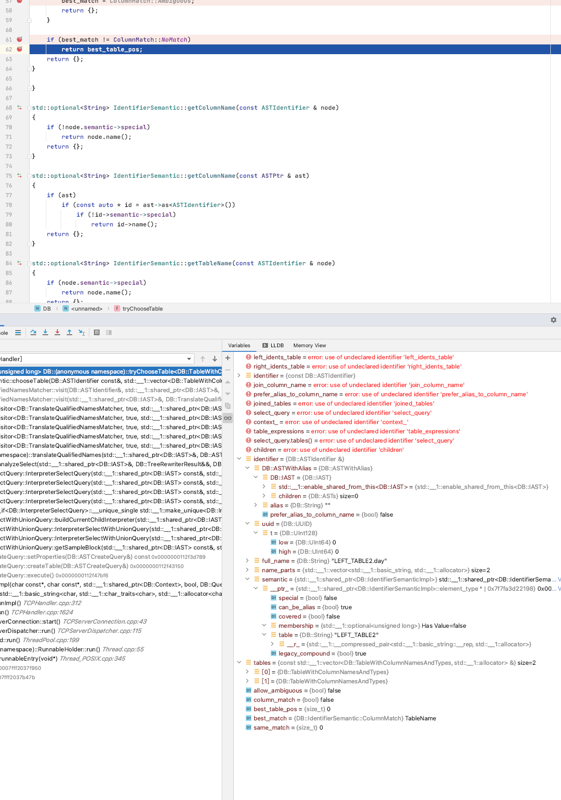


Short column name 

```
```


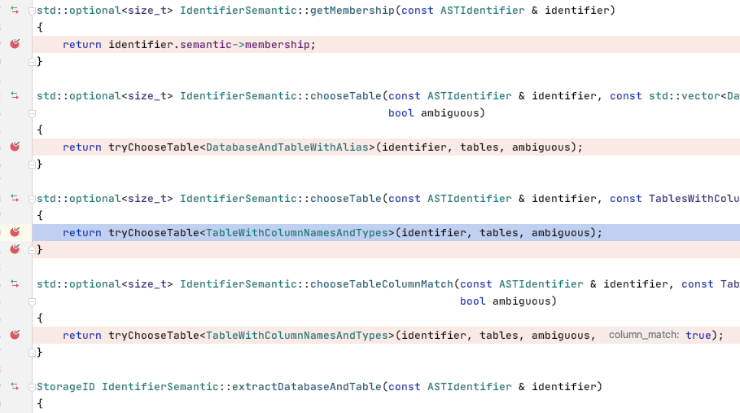


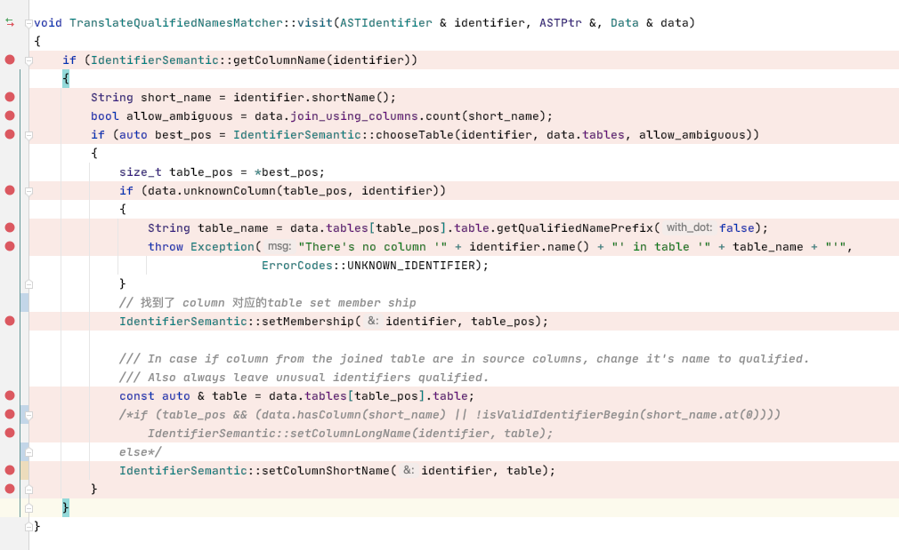


```sql

CREATE MATERIALIZED VIEW jasong.meterialized_table_3_3 TO jasong.meterialized_table_storage
(
    `day` Date,
    `RIGHT_TABLE2.id` UInt32,
    `RIGHT_TABLE2.number` UInt32
) AS
SELECT
    LEFT_TABLE2.day,
    RIGHT_TABLE2.id,
    RIGHT_TABLE2.number
FROM jasong.LEFT_TABLE2
INNER JOIN jasong.RIGHT_TABLE2 ON LEFT_TABLE2.id = RIGHT_TABLE2.id


CREATE MATERIALIZED VIEW jasong.meterialized_table_3_3 TO jasong.meterialized_table_storage
(
    `day` Date,
    `id` UInt32,
    `number` UInt32
) AS
SELECT
    LEFT_TABLE2.day,
    RIGHT_TABLE2.id,
    RIGHT_TABLE2.number
FROM jasong.LEFT_TABLE2
INNER JOIN jasong.RIGHT_TABLE2 ON LEFT_TABLE2.id = RIGHT_TABLE2.id


CREATE MATERIALIZED VIEW meterialized_table_3_4 TO meterialized_table_storage AS
SELECT
    LEFT_TABLE2.day as a1,
    RIGHT_TABLE2.id as a2,
    RIGHT_TABLE2.number a3
FROM LEFT_TABLE2
INNER JOIN RIGHT_TABLE2 ON LEFT_TABLE2.id = RIGHT_TABLE2.id


CREATE MATERIALIZED VIEW meterialized_table_3_5 TO meterialized_table_storage AS
SELECT
    A.day,
    B.id,
    B.number
FROM LEFT_TABLE2 as A 
INNER JOIN RIGHT_TABLE2 as B  ON A.id = B.id


CREATE MATERIALIZED VIEW meterialized_table_3 TO meterialized_table_storage AS
SELECT
    LEFT_TABLE2.day ,
    RIGHT_TABLE2.id ,
    RIGHT_TABLE2.number
FROM LEFT_TABLE2
INNER JOIN RIGHT_TABLE2 ON LEFT_TABLE2.id = RIGHT_TABLE2.id


CREATE MATERIALIZED VIEW jasong.meterialized_table_3_6 TO jasong.meterialized_table_storage
(
    `day` Date,
    `id` UInt32,
    `number` UInt32
) AS
SELECT
    A.day,
    B.id,
    B.number
FROM jasong.LEFT_TABLE2 AS A
INNER JOIN jasong.RIGHT_TABLE2 AS B ON A.id = B.id
```


```
2021.05.11 21:08:59.005781 [ 4601493 ] {} <Debug> system.query_thread_log (57aae4dc-c302-4473-8253-c640c4269180) (MergerMutator): Selected 5 parts from 202105_140_399_59 to 202105_403_403_0
2021.05.11 21:08:59.006015 [ 4601493 ] {} <Debug> DiskLocal: Reserving 1.00 MiB on disk `default`, having unreserved 94.12 TiB.
2021.05.11 21:08:59.006231 [ 4601507 ] {} <Debug> system.query_thread_log (57aae4dc-c302-4473-8253-c640c4269180) (MergerMutator): Merging 5 parts: from 202105_140_399_59 to 202105_403_403_0 into Compact
2021.05.11 21:08:59.006744 [ 4601507 ] {} <Debug> system.query_thread_log (57aae4dc-c302-4473-8253-c640c4269180) (MergerMutator): Selected MergeAlgorithm: Horizontal
2021.05.11 21:08:59.007399 [ 4601507 ] {} <Debug> MergeTreeSequentialSource: Reading 2 marks from part 202105_140_399_59, total 564 rows starting from the beginning of the part
2021.05.11 21:08:59.009473 [ 4601507 ] {} <Debug> MergeTreeSequentialSource: Reading 2 marks from part 202105_400_400_0, total 2 rows starting from the beginning of the part
2021.05.11 21:08:59.011118 [ 4601507 ] {} <Debug> MergeTreeSequentialSource: Reading 2 marks from part 202105_401_401_0, total 7 rows starting from the beginning of the part
2021.05.11 21:08:59.013097 [ 4601507 ] {} <Debug> MergeTreeSequentialSource: Reading 2 marks from part 202105_402_402_0, total 6 rows starting from the beginning of the part
2021.05.11 21:08:59.014814 [ 4601507 ] {} <Debug> MergeTreeSequentialSource: Reading 2 marks from part 202105_403_403_0, total 9 rows starting from the beginning of the part
2021.05.11 21:08:59.030767 [ 4601507 ] {} <Debug> system.query_thread_log (57aae4dc-c302-4473-8253-c640c4269180) (MergerMutator): Merge sorted 588 rows, containing 43 columns (43 merged, 0 gathered) in 0.024545 sec., 23955.999185170094 rows/sec., 18.91 MiB/sec.
2021.05.11 21:08:59.037239 [ 4601507 ] {} <Trace> system.query_thread_log (57aae4dc-c302-4473-8253-c640c4269180): Renaming temporary part tmp_merge_202105_140_403_60 to 202105_140_403_60.
2021.05.11 21:08:59.037967 [ 4601507 ] {} <Trace> system.query_thread_log (57aae4dc-c302-4473-8253-c640c4269180) (MergerMutator): Merged 5 parts: from 202105_140_399_59 to 202105_403_403_0
2021.05.11 21:08:59.038094 [ 4601507 ] {} <Debug> MemoryTracker: Peak memory usage: 4.00 MiB.
2021.05.11 21:09:02.905223 [ 4601493 ] {} <Debug> system.query_log (3af9aef6-4c0a-4261-8f4a-a0d8d22800eb) (MergerMutator): Selected 5 parts from 202105_141_399_59 to 202105_403_403_0
2021.05.11 21:09:02.905588 [ 4601493 ] {} <Debug> DiskLocal: Reserving 1.00 MiB on disk `default`, having unreserved 94.12 TiB.
2021.05.11 21:09:02.905991 [ 4601507 ] {} <Debug> system.query_log (3af9aef6-4c0a-4261-8f4a-a0d8d22800eb) (MergerMutator): Merging 5 parts: from 202105_141_399_59 to 202105_403_403_0 into Compact
2021.05.11 21:09:02.907077 [ 4601507 ] {} <Debug> system.query_log (3af9aef6-4c0a-4261-8f4a-a0d8d22800eb) (MergerMutator): Selected MergeAlgorithm: Horizontal
2021.05.11 21:09:02.908479 [ 4601507 ] {} <Debug> MergeTreeSequentialSource: Reading 2 marks from part 202105_141_399_59, total 588 rows starting from the beginning of the part
2021.05.11 21:09:02.911719 [ 4601507 ] {} <Debug> MergeTreeSequentialSource: Reading 2 marks from part 202105_400_400_0, total 2 rows starting from the beginning of the part
2021.05.11 21:09:02.914424 [ 4601507 ] {} <Debug> MergeTreeSequentialSource: Reading 2 marks from part 202105_401_401_0, total 2 rows starting from the beginning of the part
2021.05.11 21:09:02.916964 [ 4601507 ] {} <Debug> MergeTreeSequentialSource: Reading 2 marks from part 202105_402_402_0, total 4 rows starting from the beginning of the part
2021.05.11 21:09:02.919527 [ 4601507 ] {} <Debug> MergeTreeSequentialSource: Reading 2 marks from part 202105_403_403_0, total 2 rows starting from the beginning of the part
2021.05.11 21:09:02.944395 [ 4601507 ] {} <Debug> system.query_log (3af9aef6-4c0a-4261-8f4a-a0d8d22800eb) (MergerMutator): Merge sorted 598 rows, containing 62 columns (62 merged, 0 gathered) in 0.038454 sec., 15551.048005409059 rows/sec., 19.33 MiB/sec.
2021.05.11 21:09:02.952939 [ 4601507 ] {} <Trace> system.query_log (3af9aef6-4c0a-4261-8f4a-a0d8d22800eb): Renaming temporary part tmp_merge_202105_141_403_60 to 202105_141_403_60.
2021.05.11 21:09:02.953474 [ 4601507 ] {} <Trace> system.query_log (3af9aef6-4c0a-4261-8f4a-a0d8d22800eb) (MergerMutator): Merged 5 parts: from 202105_141_399_59 to 202105_403_403_0
2021.05.11 21:09:02.953544 [ 4601507 ] {} <Debug> MemoryTracker: Peak memory usage: 4.00 MiB.
2021.05.11 21:09:04.858320 [ 4601482 ] {} <Trace> PrometheusHandler-factory: HTTP Request for PrometheusHandler-factory. Method: GET, Address: [::1]:55284, User-Agent: Prometheus/2.26.0, Content Type: , Transfer Encoding: identity, X-Forwarded-For: (none)
2021.05.11 21:09:05.878994 [ 4601483 ] {4259e46e-43e3-439f-9c16-82d923c4e035} <Debug> executeQuery: (from [::ffff:127.0.0.1]:54639, using production parser) INSERT INTO jasong.LEFT_TABLE2 VALUES
2021.05.11 21:09:05.879256 [ 4601483 ] {4259e46e-43e3-439f-9c16-82d923c4e035} <Trace> ContextAccess (default): Access granted: INSERT(day, id, number) ON jasong.LEFT_TABLE2
2021.05.11 21:09:05.882249 [ 4601483 ] {4259e46e-43e3-439f-9c16-82d923c4e035} <Trace> ContextAccess (default): Access granted: SELECT(id, number) ON jasong.RIGHT_TABLE2
2021.05.11 21:09:05.882961 [ 4601483 ] {4259e46e-43e3-439f-9c16-82d923c4e035} <Debug> HashJoin: Right sample block: B.id UInt32 UInt32(size = 0), id UInt32 UInt32(size = 0), B.number UInt32 UInt32(size = 0)
2021.05.11 21:09:05.883460 [ 4601483 ] {4259e46e-43e3-439f-9c16-82d923c4e035} <Trace> ContextAccess (default): Access granted: SELECT(day, id) ON jasong.LEFT_TABLE2
2021.05.11 21:09:05.883835 [ 4601483 ] {4259e46e-43e3-439f-9c16-82d923c4e035} <Trace> ContextAccess (default): Access granted: USAGE ON jasong.meterialized_table_storage
2021.05.11 21:09:05.887779 [ 4601483 ] {4259e46e-43e3-439f-9c16-82d923c4e035} <Debug> DiskLocal: Reserving 1.00 MiB on disk `default`, having unreserved 94.12 TiB.
2021.05.11 21:09:05.889908 [ 4601483 ] {4259e46e-43e3-439f-9c16-82d923c4e035} <Trace> jasong.LEFT_TABLE2 (09723fad-a145-4323-bc92-be025ef6453a): Renaming temporary part tmp_insert_202104_4_4_0 to 202104_4_4_0.
2021.05.11 21:09:05.892444 [ 4601483 ] {4259e46e-43e3-439f-9c16-82d923c4e035} <Trace> ContextAccess (default): Access granted: SELECT(id, number) ON jasong.RIGHT_TABLE2
2021.05.11 21:09:05.892804 [ 4601483 ] {4259e46e-43e3-439f-9c16-82d923c4e035} <Debug> jasong.RIGHT_TABLE2 (b23ffb89-712c-4c97-bc3e-dd3b00dbac50) (SelectExecutor): Key condition: unknown
2021.05.11 21:09:05.892907 [ 4601483 ] {4259e46e-43e3-439f-9c16-82d923c4e035} <Debug> jasong.RIGHT_TABLE2 (b23ffb89-712c-4c97-bc3e-dd3b00dbac50) (SelectExecutor): Selected 1/1 parts by partition key, 1 parts by primary key, 1/1 marks by primary key, 1 marks to read from 1 ranges
2021.05.11 21:09:05.893094 [ 4601483 ] {4259e46e-43e3-439f-9c16-82d923c4e035} <Trace> InterpreterSelectQuery: FetchColumns -> Complete
2021.05.11 21:09:05.893476 [ 4601483 ] {4259e46e-43e3-439f-9c16-82d923c4e035} <Debug> HashJoin: Right sample block: B.id UInt32 UInt32(size = 0), id UInt32 UInt32(size = 0), B.number UInt32 UInt32(size = 0)
2021.05.11 21:09:05.893894 [ 4601483 ] {4259e46e-43e3-439f-9c16-82d923c4e035} <Trace> ContextAccess (default): Access granted: SELECT(day, id) ON jasong.LEFT_TABLE2
2021.05.11 21:09:05.894126 [ 4601483 ] {4259e46e-43e3-439f-9c16-82d923c4e035} <Trace> InterpreterSelectQuery: FetchColumns -> Complete
2021.05.11 21:09:05.895400 [ 4601483 ] {4259e46e-43e3-439f-9c16-82d923c4e035} <Debug> MergeTreeSelectProcessor: Reading 1 ranges from part all_1_1_0, approx. 3 rows starting from 0
2021.05.11 21:09:05.896717 [ 4601511 ] {4259e46e-43e3-439f-9c16-82d923c4e035} <Trace> CreatingSetsTransform: Creating join.
2021.05.11 21:09:05.896871 [ 4601511 ] {4259e46e-43e3-439f-9c16-82d923c4e035} <Debug> CreatingSetsTransform: Created Join with 3 entries from 3 rows in 0.000145 sec.
2021.05.11 21:09:05.897294 [ 4601511 ] {4259e46e-43e3-439f-9c16-82d923c4e035} <Trace> PipelineExecutor: Thread finished. Total time: 0.00086 sec. Execution time: 0.000652 sec. Processing time: 0.000192 sec. Wait time: 1.6e-05 sec.
2021.05.11 21:09:05.897318 [ 4601512 ] {4259e46e-43e3-439f-9c16-82d923c4e035} <Trace> PipelineExecutor: Thread finished. Total time: 0.000852 sec. Execution time: 2.2e-05 sec. Processing time: 1e-05 sec. Wait time: 0.00082 sec.
2021.05.11 21:09:05.897881 [ 4601483 ] {4259e46e-43e3-439f-9c16-82d923c4e035} <Trace> PushingToViewsBlockOutputStream: Pushing from jasong.LEFT_TABLE2 (09723fad-a145-4323-bc92-be025ef6453a) to jasong.meterialized_table_3_6 (3c491c90-e19d-466c-8523-06c0097b74f1) took 7 ms.
2021.05.11 21:09:05.898032 [ 4601483 ] {4259e46e-43e3-439f-9c16-82d923c4e035} <Debug> MemoryTracker: Peak memory usage (for query): 0.00 B.
2021.05.11 21:09:05.898340 [ 4601483 ] {} <Debug> TCPHandler: Processed in 0.019854 sec.
2021.05.11 21:09:08.805114 [ 4601486 ] {} <Trace> SystemLog (system.part_log): Flushing system log, 1 entries to flush up to offset 5
2021.05.11 21:09:08.808935 [ 4601486 ] {} <Debug> DiskLocal: Reserving 1.00 MiB on disk `default`, having unreserved 94.12 TiB.
2021.05.11 21:09:08.812741 [ 4601486 ] {} <Trace> system.part_log (bf6a96da-0471-40de-a194-1a0bcc080bfb): Renaming temporary part tmp_insert_20210510_5_5_0 to 20210510_34_34_0.
2021.05.11 21:09:08.813343 [ 4601486 ] {} <Trace> SystemLog (system.part_log): Flushed system log up to offset 5

2021.05.11 21:09:08.988367 [ 4601502 ] {} <Debug> DNSResolver: Updating DNS cache
2021.05.11 21:09:08.988625 [ 4601502 ] {} <Debug> DNSResolver: Updated DNS cache

2021.05.11 21:09:09.105078 [ 4601487 ] {} <Trace> SystemLog (system.query_thread_log): Flushing system log, 4 entries to flush up to offset 84
2021.05.11 21:09:09.109132 [ 4601487 ] {} <Debug> DiskLocal: Reserving 1.00 MiB on disk `default`, having unreserved 94.12 TiB.
2021.05.11 21:09:09.113739 [ 4601487 ] {} <Trace> system.query_thread_log (57aae4dc-c302-4473-8253-c640c4269180): Renaming temporary part tmp_insert_202105_32_32_0 to 202105_404_404_0.
2021.05.11 21:09:09.114409 [ 4601487 ] {} <Trace> SystemLog (system.query_thread_log): Flushed system log up to offset 84

2021.05.11 21:09:09.232290 [ 4601488 ] {} <Trace> SystemLog (system.query_log): Flushing system log, 2 entries to flush up to offset 82
2021.05.11 21:09:09.239423 [ 4601488 ] {} <Debug> DiskLocal: Reserving 1.00 MiB on disk `default`, having unreserved 94.12 TiB.
2021.05.11 21:09:09.246107 [ 4601488 ] {} <Trace> system.query_log (3af9aef6-4c0a-4261-8f4a-a0d8d22800eb): Renaming temporary part tmp_insert_202105_32_32_0 to 202105_404_404_0.
2021.05.11 21:09:09.246980 [ 4601488 ] {} <Trace> SystemLog (system.query_log): Flushed system log up to offset 82
```


```

```


- As 解决方案

```sql
CREATE MATERIALIZED VIEW jasong.meterialized_table_3_6 TO jasong.meterialized_table_storage
(
    `day` Date,
    `id` UInt32,
    `number` UInt32
) AS
SELECT
    A.day ,
    B.id  ,
    A.id  
FROM jasong.LEFT_TABLE2 AS A
INNER JOIN jasong.RIGHT_TABLE2 AS B ON A.id = B.id
```


- as 方案二 

```
CREATE MATERIALIZED VIEW jasong.meterialized_table_3_6 TO jasong.meterialized_table_storage
AS
SELECT
    A.day as day ,
    B.id  as id ,
    A.id  as number 
FROM jasong.LEFT_TABLE2 AS A
INNER JOIN jasong.RIGHT_TABLE2 AS B ON A.id = B.id


CREATE MATERIALIZED VIEW jasong.meterialized_table_3_6 TO jasong.meterialized_table_storage
AS
SELECT
    A.day as day1 ,
    B.id  as id1,
    A.id  as number1
FROM jasong.LEFT_TABLE2 AS A
INNER JOIN jasong.RIGHT_TABLE2 AS B ON A.id = B.id
```


只能算是优化了就

```sql
CREATE MATERIALIZED VIEW jasong.meterialized_table_3_7 TO jasong.meterialized_table_storage
AS
SELECT
    A.day ,
    B.id  ,
    B.number
FROM jasong.LEFT_TABLE2 AS A
INNER JOIN jasong.RIGHT_TABLE2 AS B ON A.id = B.id


CREATE MATERIALIZED VIEW jasong.meterialized_table_3_8 TO jasong.meterialized_table_storage
(
    `day` Date,
    `id` UInt32,
    `number` UInt32
) AS
SELECT
    A.day,
    B.id,
    A.id
FROM jasong.LEFT_TABLE2 AS A
INNER JOIN jasong.RIGHT_TABLE2 AS B ON A.id = B.id
```


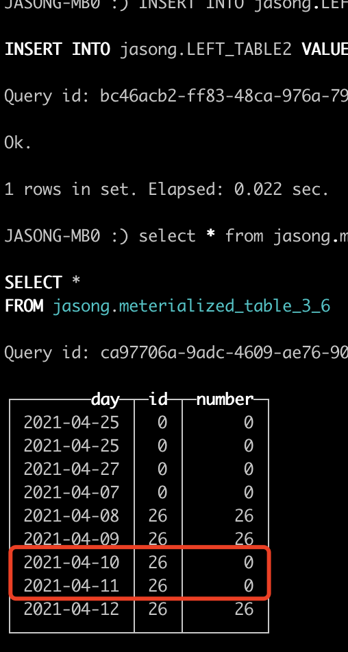


```sql

CREATE MATERIALIZED VIEW jasong.meterialized_table_3_7 TO jasong.meterialized_table_storage
(
    `day` Date,
    `id` UInt32,
    `number` UInt32
) AS
SELECT
    A.day,
    B.id,
    B.number
FROM jasong.LEFT_TABLE2 AS A
INNER JOIN jasong.RIGHT_TABLE2 AS B ON A.id = B.id


建立表失败
CREATE MATERIALIZED VIEW jasong.meterialized_table_3_8 TO jasong.meterialized_table_storage
AS
SELECT
    A.day,
    B.id,
    A.id
FROM jasong.LEFT_TABLE2 AS A
INNER JOIN jasong.RIGHT_TABLE2 AS B ON A.id = B.id


insert 失败会 不能直接修改对应字段
CREATE MATERIALIZED VIEW jasong.meterialized_table_3_8 TO jasong.meterialized_table_storage
(
    `day` Date,
    `id` UInt32,
    `number` UInt32
) AS
SELECT
    A.day,
    B.id,
    A.id
FROM jasong.LEFT_TABLE2 AS A
INNER JOIN jasong.RIGHT_TABLE2 AS B ON A.id = B.id
2021.05.12 11:02:09.355684 [ 4690477 ] {} <Debug> DNSResolver: Updating DNS cache
2021.05.12 11:02:09.355867 [ 4690477 ] {} <Debug> DNSResolver: Updated DNS cache
2021.05.12 11:02:17.520148 [ 4690468 ] {eb3bab9e-0450-4bcd-a4d9-8a172b8eea9c} <Debug> executeQuery: (from [::ffff:127.0.0.1]:60382, using production parser) INSERT INTO jasong.LEFT_TABLE2 VALUES
2021.05.12 11:02:17.520435 [ 4690468 ] {eb3bab9e-0450-4bcd-a4d9-8a172b8eea9c} <Trace> ContextAccess (default): Access granted: INSERT(day, id, number) ON jasong.LEFT_TABLE2
2021.05.12 11:02:17.522679 [ 4690468 ] {eb3bab9e-0450-4bcd-a4d9-8a172b8eea9c} <Trace> ContextAccess (default): Access granted: SELECT(id) ON jasong.RIGHT_TABLE2
2021.05.12 11:02:17.523157 [ 4690468 ] {eb3bab9e-0450-4bcd-a4d9-8a172b8eea9c} <Debug> HashJoin: Right sample block: B.id UInt32 UInt32(size = 0), id UInt32 UInt32(size = 0)
2021.05.12 11:02:17.523580 [ 4690468 ] {eb3bab9e-0450-4bcd-a4d9-8a172b8eea9c} <Trace> ContextAccess (default): Access granted: SELECT(day, id) ON jasong.LEFT_TABLE2
2021.05.12 11:02:17.524321 [ 4690468 ] {eb3bab9e-0450-4bcd-a4d9-8a172b8eea9c} <Error> executeQuery: Code: 15, e.displayText() = DB::Exception: Column id specified more than once (version 21.6.1.1) (from [::ffff:127.0.0.1]:60382) (in query: INSERT INTO jasong.LEFT_TABLE2 VALUES ), Stack trace (when copying this message, always include the lines below):

<Empty trace>

2021.05.12 11:02:17.524865 [ 4690468 ] {eb3bab9e-0450-4bcd-a4d9-8a172b8eea9c} <Error> TCPHandler: Code: 15, e.displayText() = DB::Exception: Column id specified more than once, Stack trace:

<Empty trace>


正常工作
CREATE MATERIALIZED VIEW jasong.meterialized_table_3_9 TO jasong.meterialized_table_storage
AS
SELECT
    A.day as day ,
    B.id as id,
    A.id as number 
FROM jasong.LEFT_TABLE2 AS A
INNER JOIN jasong.RIGHT_TABLE2 AS B ON A.id = B.id


所以现在的工作就是，如果没有alias ，则将alias 都加上 ，加的话 需要加为存储表中对应的字段 ，而不是 short name 
```


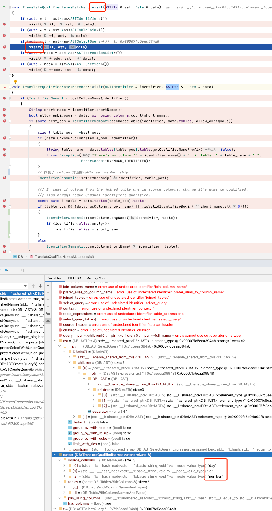


```
     UInt256 source_column = 0;


 for (auto & column_name :data.source_columns) {
            if(identifier.alias.empty() || short_name == column_name)
                identifier.alias = column_name;
        }
```

