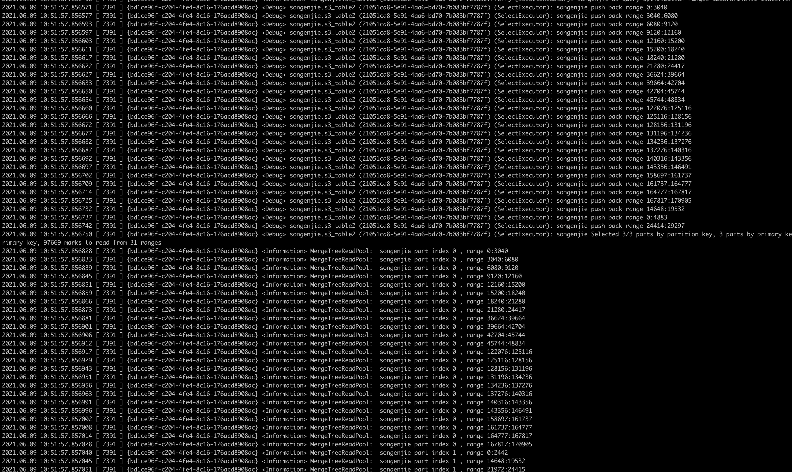

```c++
DB::MergeTreeDataSelectExecutor::readFromParts(std::__1::vector<std::__1::shared_ptr<DB::IMergeTreeDataPart const>, std::__1::allocator<std::__1::shared_ptr<DB::IMergeTreeDataPart const> > >, std::__1::vector<std::__1::basic_string<char, std::__1::char_traits<char>, std::__1::allocator<char> >, std::__1::allocator<std::__1::basic_string<char, std::__1::char_traits<char>, std::__1::allocator<char> > > > const&, std::__1::shared_ptr<DB::StorageInMemoryMetadata const> const&, DB::SelectQueryInfo const&, std::__1::shared_ptr<DB::Context>, unsigned long long, unsigned int, std::__1::unordered_map<std::__1::basic_string<char, std::__1::char_traits<char>, std::__1::allocator<char> >, long long, std::__1::hash<std::__1::basic_string<char, std::__1::char_traits<char>, std::__1::allocator<char> > >, std::__1::equal_to<std::__1::basic_string<char, std::__1::char_traits<char>, std::__1::allocator<char> > >, std::__1::allocator<std::__1::pair<std::__1::basic_string<char, std::__1::char_traits<char>, std::__1::allocator<char> > const, long long> > > const*) const MergeTreeDataSelectExecutor.cpp:184
  
DB::MergeTreeDataSelectExecutor::read(std::__1::vector<std::__1::basic_string<char, std::__1::char_traits<char>, std::__1::allocator<char> >, std::__1::allocator<std::__1::basic_string<char, std::__1::char_traits<char>, std::__1::allocator<char> > > > const&, std::__1::shared_ptr<DB::StorageInMemoryMetadata const> const&, DB::SelectQueryInfo const&, std::__1::shared_ptr<DB::Context>, unsigned long long, unsigned int, std::__1::unordered_map<std::__1::basic_string<char, std::__1::char_traits<char>, std::__1::allocator<char> >, long long, std::__1::hash<std::__1::basic_string<char, std::__1::char_traits<char>, std::__1::allocator<char> > >, std::__1::equal_to<std::__1::basic_string<char, std::__1::char_traits<char>, std::__1::allocator<char> > >, std::__1::allocator<std::__1::pair<std::__1::basic_string<char, std::__1::char_traits<char>, std::__1::allocator<char> > const, long long> > > const*) const MergeTreeDataSelectExecutor.cpp:163
  
DB::StorageMergeTree::read(DB::QueryPlan&, std::__1::vector<std::__1::basic_string<char, std::__1::char_traits<char>, std::__1::allocator<char> >, std::__1::allocator<std::__1::basic_string<char, std::__1::char_traits<char>, std::__1::allocator<char> > > > const&, std::__1::shared_ptr<DB::StorageInMemoryMetadata const> const&, DB::SelectQueryInfo&, std::__1::shared_ptr<DB::Context>, DB::QueryProcessingStage::Enum, unsigned long, unsigned int) StorageMergeTree.cpp:190
  
DB::InterpreterSelectQuery::executeFetchColumns(DB::QueryProcessingStage::Enum, DB::QueryPlan&) InterpreterSelectQuery.cpp:1806
DB::InterpreterSelectQuery::executeImpl(DB::QueryPlan&, std::__1::shared_ptr<DB::IBlockInputStream> const&, std::__1::optional<DB::Pipe>) InterpreterSelectQuery.cpp:998
DB::InterpreterSelectQuery::buildQueryPlan(DB::QueryPlan&) InterpreterSelectQuery.cpp:546
DB::InterpreterSelectWithUnionQuery::buildQueryPlan(DB::QueryPlan&) InterpreterSelectWithUnionQuery.cpp:244
DB::InterpreterSelectWithUnionQuery::execute() InterpreterSelectWithUnionQuery.cpp:311
DB::executeQueryImpl(char const*, char const*, std::__1::shared_ptr<DB::Context>, bool, DB::QueryProcessingStage::Enum, bool, DB::ReadBuffer*) executeQuery.cpp:561
DB::executeQuery(std::__1::basic_string<char, std::__1::char_traits<char>, std::__1::allocator<char> > const&, std::__1::shared_ptr<DB::Context>, bool, DB::QueryProcessingStage::Enum, bool) executeQuery.cpp:919
DB::TCPHandler::runImpl() TCPHandler.cpp:312
DB::TCPHandler::run() TCPHandler.cpp:1624
Poco::Net::TCPServerConnection::start() TCPServerConnection.cpp:43
Poco::Net::TCPServerDispatcher::run() TCPServerDispatcher.cpp:115
Poco::PooledThread::run() ThreadPool.cpp:199
Poco::(anonymous namespace)::RunnableHolder::run() Thread.cpp:55
Poco::ThreadImpl::runnableEntry(void*) Thread_POSIX.cpp:345
_pthread_start 0x00007fff2037f950
thread_start 0x00007fff2037b47b
```


```
M(Int64, max_partitions_to_read, -1, "Limit the max number of partitions that can be accessed in one query. <= 0 means unli
```


ReadFromMergeTree = step 


plan 

```cpp
DB::MergeTreeDataSelectExecutor::spreadMarkRangesAmongStreams(std::__1::vector<DB::RangesInDataPart, std::__1::allocator<DB::RangesInDataPart> >&&, std::__1::unique_ptr<std::__1::vector<DB::ReadFromMergeTree::IndexStat, std::__1::allocator<DB::ReadFromMergeTree::IndexStat> >, std::__1::default_delete<std::__1::vector<DB::ReadFromMergeTree::IndexStat, std::__1::allocator<DB::ReadFromMergeTree::IndexStat> > > >, unsigned long, std::__1::vector<std::__1::basic_string<char, std::__1::char_traits<char>, std::__1::allocator<char> >, std::__1::allocator<std::__1::basic_string<char, std::__1::char_traits<char>, std::__1::allocator<char> > > > const&, std::__1::shared_ptr<DB::StorageInMemoryMetadata const> const&, unsigned long long, bool, DB::SelectQueryInfo const&, std::__1::vector<std::__1::basic_string<char, std::__1::char_traits<char>, std::__1::allocator<char> >, std::__1::allocator<std::__1::basic_string<char, std::__1::char_traits<char>, std::__1::allocator<char> > > > const&, DB::Settings const&, DB::MergeTreeReaderSettings const&, std::__1::basic_string<char, std::__1::char_traits<char>, std::__1::allocator<char> > const&) const MergeTreeDataSelectExecutor.cpp:1110


DB::MergeTreeDataSelectExecutor::readFromParts(std::__1::vector<std::__1::shared_ptr<DB::IMergeTreeDataPart const>, std::__1::allocator<std::__1::shared_ptr<DB::IMergeTreeDataPart const> > >, std::__1::vector<std::__1::basic_string<char, std::__1::char_traits<char>, std::__1::allocator<char> >, std::__1::allocator<std::__1::basic_string<char, std::__1::char_traits<char>, std::__1::allocator<char> > > > const&, std::__1::shared_ptr<DB::StorageInMemoryMetadata const> const&, DB::SelectQueryInfo const&, std::__1::shared_ptr<DB::Context>, unsigned long long, unsigned int, std::__1::unordered_map<std::__1::basic_string<char, std::__1::char_traits<char>, std::__1::allocator<char> >, long long, std::__1::hash<std::__1::basic_string<char, std::__1::char_traits<char>, std::__1::allocator<char> > >, std::__1::equal_to<std::__1::basic_string<char, std::__1::char_traits<char>, std::__1::allocator<char> > >, std::__1::allocator<std::__1::pair<std::__1::basic_string<char, std::__1::char_traits<char>, std::__1::allocator<char> > const, long long> > > const*) const MergeTreeDataSelectExecutor.cpp:918


DB::MergeTreeDataSelectExecutor::read(std::__1::vector<std::__1::basic_string<char, std::__1::char_traits<char>, std::__1::allocator<char> >, std::__1::allocator<std::__1::basic_string<char, std::__1::char_traits<char>, std::__1::allocator<char> > > > const&, std::__1::shared_ptr<DB::StorageInMemoryMetadata const> const&, DB::SelectQueryInfo const&, std::__1::shared_ptr<DB::Context>, unsigned long long, unsigned int, std::__1::unordered_map<std::__1::basic_string<char, std::__1::char_traits<char>, std::__1::allocator<char> >, long long, std::__1::hash<std::__1::basic_string<char, std::__1::char_traits<char>, std::__1::allocator<char> > >, std::__1::equal_to<std::__1::basic_string<char, std::__1::char_traits<char>, std::__1::allocator<char> > >, std::__1::allocator<std::__1::pair<std::__1::basic_string<char, std::__1::char_traits<char>, std::__1::allocator<char> > const, long long> > > const*) const MergeTreeDataSelectExecutor.cpp:163


DB::StorageMergeTree::read(DB::QueryPlan&, std::__1::vector<std::__1::basic_string<char, std::__1::char_traits<char>, std::__1::allocator<char> >, std::__1::allocator<std::__1::basic_string<char, std::__1::char_traits<char>, std::__1::allocator<char> > > > const&, std::__1::shared_ptr<DB::StorageInMemoryMetadata const> const&, DB::SelectQueryInfo&, std::__1::shared_ptr<DB::Context>, DB::QueryProcessingStage::Enum, unsigned long, unsigned int) StorageMergeTree.cpp:190


DB::InterpreterSelectQuery::executeFetchColumns(DB::QueryProcessingStage::Enum, DB::QueryPlan&) InterpreterSelectQuery.cpp:1806


DB::InterpreterSelectQuery::executeImpl(DB::QueryPlan&, std::__1::shared_ptr<DB::IBlockInputStream> const&, std::__1::optional<DB::Pipe>) InterpreterSelectQuery.cpp:998

DB::InterpreterSelectQuery::buildQueryPlan(DB::QueryPlan&) InterpreterSelectQuery.cpp:546

DB::InterpreterSelectWithUnionQuery::buildQueryPlan(DB::QueryPlan&) InterpreterSelectWithUnionQuery.cpp:244

DB::InterpreterSelectWithUnionQuery::execute() InterpreterSelectWithUnionQuery.cpp:311


DB::executeQueryImpl(char const*, char const*, std::__1::shared_ptr<DB::Context>, bool, DB::QueryProcessingStage::Enum, bool, DB::ReadBuffer*) executeQuery.cpp:561
DB::executeQuery(std::__1::basic_string<char, std::__1::char_traits<char>, std::__1::allocator<char> > const&, std::__1::shared_ptr<DB::Context>, bool, DB::QueryProcessingStage::Enum, bool) executeQuery.cpp:919
DB::TCPHandler::runImpl() TCPHandler.cpp:312
DB::TCPHandler::run() TCPHandler.cpp:1624
Poco::Net::TCPServerConnection::start() TCPServerConnection.cpp:43
Poco::Net::TCPServerDispatcher::run() TCPServerDispatcher.cpp:115
Poco::PooledThread::run() ThreadPool.cpp:199
Poco::(anonymous namespace)::RunnableHolder::run() Thread.cpp:55
Poco::ThreadImpl::runnableEntry(void*) Thread_POSIX.cpp:345
_pthread_start 0x00007fff2037f950
thread_start 0x00007fff2037b47b


  


  
  

DB::TCPHandler::runImpl() TCPHandler.cpp:312
DB::TCPHandler::run() TCPHandler.cpp:1624
Poco::Net::TCPServerConnection::start() TCPServerConnection.cpp:43
Poco::Net::TCPServerDispatcher::run() TCPServerDispatcher.cpp:115
Poco::PooledThread::run() ThreadPool.cpp:199
Poco::(anonymous namespace)::RunnableHolder::run() Thread.cpp:55
Poco::ThreadImpl::runnableEntry(void*) Thread_POSIX.cpp:345
_pthread_start 0x00007fff2037f950
thread_start 0x00007fff2037b47b
    

```


## 2 executeQuery


### 2.1 executeQuery


```c++
BlockIO executeQuery(
    const String & query,
    ContextMutablePtr context,
    bool internal,
    QueryProcessingStage::Enum stage,
    bool may_have_embedded_data,
    bool allow_processors)
```


```c++
BlockIO executeQuery(
    const String & query,
    ContextMutablePtr context,
    bool internal,
    QueryProcessingStage::Enum stage,
    bool may_have_embedded_data)
{
    ASTPtr ast;
    BlockIO streams;
    std::tie(ast, streams) = executeQueryImpl(query.data(), query.data() + query.size(), context,
        internal, stage, !may_have_embedded_data, nullptr);

    if (const auto * ast_query_with_output = dynamic_cast<const ASTQueryWithOutput *>(ast.get()))
    {
        String format_name = ast_query_with_output->format
                ? getIdentifierName(ast_query_with_output->format)
                : context->getDefaultFormat();

        if (format_name == "Null")
            streams.null_format = true;
    }

    return streams;
}
```


```c++
static std::tuple<ASTPtr, BlockIO> executeQueryImpl(
    const char * begin,
    const char * end,
    ContextMutablePtr context,
    bool internal,
    QueryProcessingStage::Enum stage,
    bool has_query_tail,
    ReadBuffer * istr)
```


task reader

```c++
DB::MergeTreeBaseSelectProcessor::MergeTreeBaseSelectProcessor(DB::Block, DB::MergeTreeData const&, std::__1::shared_ptr<DB::StorageInMemoryMetadata const> const&, std::__1::shared_ptr<DB::PrewhereInfo> const&, unsigned long long, unsigned long long, unsigned long long, DB::MergeTreeReaderSettings const&, bool, std::__1::vector<std::__1::basic_string<char, std::__1::char_traits<char>, std::__1::allocator<char> >, std::__1::allocator<std::__1::basic_string<char, std::__1::char_traits<char>, std::__1::allocator<char> > > > const&) MergeTreeBaseSelectProcessor.cpp:44
  
DB::MergeTreeThreadSelectBlockInputProcessor::MergeTreeThreadSelectBlockInputProcessor(unsigned long, std::__1::shared_ptr<DB::MergeTreeReadPool> const&, unsigned long, unsigned long long, unsigned long, unsigned long, DB::MergeTreeData const&, std::__1::shared_ptr<DB::StorageInMemoryMetadata const> const&, bool, std::__1::shared_ptr<DB::PrewhereInfo> const&, DB::MergeTreeReaderSettings const&, std::__1::vector<std::__1::basic_string<char, std::__1::char_traits<char>, std::__1::allocator<char> >, std::__1::allocator<std::__1::basic_string<char, std::__1::char_traits<char>, std::__1::allocator<char> > > > const&) MergeTreeThreadSelectBlockInputProcessor.cpp:25
  
DB::MergeTreeThreadSelectBlockInputProcessor::MergeTreeThreadSelectBlockInputProcessor(unsigned long, std::__1::shared_ptr<DB::MergeTreeReadPool> const&, unsigned long, unsigned long long, unsigned long, unsigned long, DB::MergeTreeData const&, std::__1::shared_ptr<DB::StorageInMemoryMetadata const> const&, bool, std::__1::shared_ptr<DB::PrewhereInfo> const&, DB::MergeTreeReaderSettings const&, std::__1::vector<std::__1::basic_string<char, std::__1::char_traits<char>, std::__1::allocator<char> >, std::__1::allocator<std::__1::basic_string<char, std::__1::char_traits<char>, std::__1::allocator<char> > > > const&) MergeTreeThreadSelectBlockInputProcessor.cpp:32
  
void std::__1::allocator<DB::MergeTreeThreadSelectBlockInputProcessor>::construct<DB::MergeTreeThreadSelectBlockInputProcessor, unsigned long&, std::__1::shared_ptr<DB::MergeTreeReadPool>&, unsigned long&, unsigned long long&, unsigned long&, unsigned long&, DB::MergeTreeData const&, std::__1::shared_ptr<DB::StorageInMemoryMetadata const>&, bool&, std::__1::shared_ptr<DB::PrewhereInfo>&, DB::MergeTreeReaderSettings&, std::__1::vector<std::__1::basic_string<char, std::__1::char_traits<char>, std::__1::allocator<char> >, std::__1::allocator<std::__1::basic_string<char, std::__1::char_traits<char>, std::__1::allocator<char> > > >&>(DB::MergeTreeThreadSelectBlockInputProcessor*, unsigned long&, std::__1::shared_ptr<DB::MergeTreeReadPool>&, unsigned long&, unsigned long long&, unsigned long&, unsigned long&, DB::MergeTreeData const&, std::__1::shared_ptr<DB::StorageInMemoryMetadata const>&, bool&, std::__1::shared_ptr<DB::PrewhereInfo>&, DB::MergeTreeReaderSettings&, std::__1::vector<std::__1::basic_string<char, std::__1::char_traits<char>, std::__1::allocator<char> >, std::__1::allocator<std::__1::basic_string<char, std::__1::char_traits<char>, std::__1::allocator<char> > > >&) memory:886
  
  
void std::__1::allocator_traits<std::__1::allocator<DB::MergeTreeThreadSelectBlockInputProcessor> >::__construct<DB::MergeTreeThreadSelectBlockInputProcessor, unsigned long&, std::__1::shared_ptr<DB::MergeTreeReadPool>&, unsigned long&, unsigned long long&, unsigned long&, unsigned long&, DB::MergeTreeData const&, std::__1::shared_ptr<DB::StorageInMemoryMetadata const>&, bool&, std::__1::shared_ptr<DB::PrewhereInfo>&, DB::MergeTreeReaderSettings&, std::__1::vector<std::__1::basic_string<char, std::__1::char_traits<char>, std::__1::allocator<char> >, std::__1::allocator<std::__1::basic_string<char, std::__1::char_traits<char>, std::__1::allocator<char> > > >&>(std::__1::integral_constant<bool, true>, std::__1::allocator<DB::MergeTreeThreadSelectBlockInputProcessor>&, DB::MergeTreeThreadSelectBlockInputProcessor*, unsigned long&, std::__1::shared_ptr<DB::MergeTreeReadPool>&, unsigned long&, unsigned long long&, unsigned long&, unsigned long&, DB::MergeTreeData const&, std::__1::shared_ptr<DB::StorageInMemoryMetadata const>&, bool&, std::__1::shared_ptr<DB::PrewhereInfo>&, DB::MergeTreeReaderSettings&, std::__1::vector<std::__1::basic_string<char, std::__1::char_traits<char>, std::__1::allocator<char> >, std::__1::allocator<std::__1::basic_string<char, std::__1::char_traits<char>, std::__1::allocator<char> > > >&) allocator_traits.h:519
  
  
void std::__1::allocator_traits<std::__1::allocator<DB::MergeTreeThreadSelectBlockInputProcessor> >::construct<DB::MergeTreeThreadSelectBlockInputProcessor, unsigned long&, std::__1::shared_ptr<DB::MergeTreeReadPool>&, unsigned long&, unsigned long long&, unsigned long&, unsigned long&, DB::MergeTreeData const&, std::__1::shared_ptr<DB::StorageInMemoryMetadata const>&, bool&, std::__1::shared_ptr<DB::PrewhereInfo>&, DB::MergeTreeReaderSettings&, std::__1::vector<std::__1::basic_string<char, std::__1::char_traits<char>, std::__1::allocator<char> >, std::__1::allocator<std::__1::basic_string<char, std::__1::char_traits<char>, std::__1::allocator<char> > > >&>(std::__1::allocator<DB::MergeTreeThreadSelectBlockInputProcessor>&, DB::MergeTreeThreadSelectBlockInputProcessor*, unsigned long&, std::__1::shared_ptr<DB::MergeTreeReadPool>&, unsigned long&, unsigned long long&, unsigned long&, unsigned long&, DB::MergeTreeData const&, std::__1::shared_ptr<DB::StorageInMemoryMetadata const>&, bool&, std::__1::shared_ptr<DB::PrewhereInfo>&, DB::MergeTreeReaderSettings&, std::__1::vector<std::__1::basic_string<char, std::__1::char_traits<char>, std::__1::allocator<char> >, std::__1::allocator<std::__1::basic_string<char, std::__1::char_traits<char>, std::__1::allocator<char> > > >&) allocator_traits.h:481
  
  
std::__1::__shared_ptr_emplace<DB::MergeTreeThreadSelectBlockInputProcessor, std::__1::allocator<DB::MergeTreeThreadSelectBlockInputProcessor> >::__shared_ptr_emplace<unsigned long&, std::__1::shared_ptr<DB::MergeTreeReadPool>&, unsigned long&, unsigned long long&, unsigned long&, unsigned long&, DB::MergeTreeData const&, std::__1::shared_ptr<DB::StorageInMemoryMetadata const>&, bool&, std::__1::shared_ptr<DB::PrewhereInfo>&, DB::MergeTreeReaderSettings&, std::__1::vector<std::__1::basic_string<char, std::__1::char_traits<char>, std::__1::allocator<char> >, std::__1::allocator<std::__1::basic_string<char, std::__1::char_traits<char>, std::__1::allocator<char> > > >&>(std::__1::allocator<DB::MergeTreeThreadSelectBlockInputProcessor>, unsigned long&, std::__1::shared_ptr<DB::MergeTreeReadPool>&, unsigned long&, unsigned long long&, unsigned long&, unsigned long&, DB::MergeTreeData const&, std::__1::shared_ptr<DB::StorageInMemoryMetadata const>&, bool&, std::__1::shared_ptr<DB::PrewhereInfo>&, DB::MergeTreeReaderSettings&, std::__1::vector<std::__1::basic_string<char, std::__1::char_traits<char>, std::__1::allocator<char> >, std::__1::allocator<std::__1::basic_string<char, std::__1::char_traits<char>, std::__1::allocator<char> > > >&) memory:2594
  
  
std::__1::__shared_ptr_emplace<DB::MergeTreeThreadSelectBlockInputProcessor, std::__1::allocator<DB::MergeTreeThreadSelectBlockInputProcessor> >::__shared_ptr_emplace<unsigned long&, std::__1::shared_ptr<DB::MergeTreeReadPool>&, unsigned long&, unsigned long long&, unsigned long&, unsigned long&, DB::MergeTreeData const&, std::__1::shared_ptr<DB::StorageInMemoryMetadata const>&, bool&, std::__1::shared_ptr<DB::PrewhereInfo>&, DB::MergeTreeReaderSettings&, std::__1::vector<std::__1::basic_string<char, std::__1::char_traits<char>, std::__1::allocator<char> >, std::__1::allocator<std::__1::basic_string<char, std::__1::char_traits<char>, std::__1::allocator<char> > > >&>(std::__1::allocator<DB::MergeTreeThreadSelectBlockInputProcessor>, unsigned long&, std::__1::shared_ptr<DB::MergeTreeReadPool>&, unsigned long&, unsigned long long&, unsigned long&, unsigned long&, DB::MergeTreeData const&, std::__1::shared_ptr<DB::StorageInMemoryMetadata const>&
```


```c++
DB::MergeTreeBaseSelectProcessor::generate() MergeTreeBaseSelectProcessor.cpp:54
DB::ISource::tryGenerate() ISource.cpp:79
DB::ISource::work() ISource.cpp:53
DB::SourceWithProgress::work() SourceWithProgress.cpp:36
DB::executeJob(DB::IProcessor*) PipelineExecutor.cpp:80
DB::PipelineExecutor::addJob(DB::ExecutingGraph::Node*)::$_0::operator()() const PipelineExecutor.cpp:97
decltype(std::__1::forward<DB::PipelineExecutor::addJob(DB::ExecutingGraph::Node*)::$_0&>(fp)()) std::__1::__invoke<DB::PipelineExecutor::addJob(DB::ExecutingGraph::Node*)::$_0&>(DB::PipelineExecutor::addJob(DB::ExecutingGraph::Node*)::$_0&) type_traits:3676
void std::__1::__invoke_void_return_wrapper<void>::__call<DB::PipelineExecutor::addJob(DB::ExecutingGraph::Node*)::$_0&>(DB::PipelineExecutor::addJob(DB::ExecutingGraph::Node*)::$_0&) __functional_base:348
std::__1::__function::__default_alloc_func<DB::PipelineExecutor::addJob(DB::ExecutingGraph::Node*)::$_0, void ()>::operator()() functional:1608
void std::__1::__function::__policy_invoker<void ()>::__call_impl<std::__1::__function::__default_alloc_func<DB::PipelineExecutor::addJob(DB::ExecutingGraph::Node*)::$_0, void ()> >(std::__1::__function::__policy_storage const*) functional:2089
std::__1::__function::__policy_func<void ()>::operator()() const functional:2221
std::__1::function<void ()>::operator()() const functional:2560
DB::PipelineExecutor::executeStepImpl(unsigned long, unsigned long, std::__1::atomic<bool>*) PipelineExecutor.cpp:586
DB::PipelineExecutor::executeSingleThread(unsigned long, unsigned long) PipelineExecutor.cpp:474
DB::PipelineExecutor::executeImpl(unsigned long)::$_4::operator()() const PipelineExecutor.cpp:777
decltype(std::__1::forward<DB::PipelineExecutor::executeImpl(unsigned long)::$_4&>(fp)()) std::__1::__invoke_constexpr<DB::PipelineExecutor::executeImpl(unsigned long)::$_4&>(DB::PipelineExecutor::executeImpl(unsigned long)::$_4&) type_traits:3682
decltype(auto) std::__1::__apply_tuple_impl<DB::PipelineExecutor::executeImpl(unsigned long)::$_4&, std::__1::tuple<>&>(DB::PipelineExecutor::executeImpl(unsigned long)::$_4&, std::__1::tuple<>&, std::__1::__tuple_indices<>) tuple:1415
decltype(auto) std::__1::apply<DB::PipelineExecutor::executeImpl(unsigned long)::$_4&, std::__1::tuple<>&>(DB::PipelineExecutor::executeImpl(unsigned long)::$_4&, std::__1::tuple<>&) tuple:1424
ThreadFromGlobalPool::ThreadFromGlobalPool<DB::PipelineExecutor::executeImpl(unsigned long)::$_4>(DB::PipelineExecutor::executeImpl(unsigned long)::$_4&&)::'lambda'()::operator()() ThreadPool.h:178
decltype(std::__1::forward<DB::PipelineExecutor::executeImpl(unsigned long)::$_4>(fp)()) std::__1::__invoke<ThreadFromGlobalPool::ThreadFromGlobalPool<DB::PipelineExecutor::executeImpl(unsigned long)::$_4>(DB::PipelineExecutor::executeImpl(unsigned long)::$_4&&)::'lambda'()&>(DB::PipelineExecutor::executeImpl(unsigned long)::$_4&&) type_traits:3676
void std::__1::__invoke_void_return_wrapper<void>::__call<ThreadFromGlobalPool::ThreadFromGlobalPool<DB::PipelineExecutor::executeImpl(unsigned long)::$_4>(DB::PipelineExecutor::executeImpl(unsigned long)::$_4&&)::'lambda'()&>(ThreadFromGlobalPool::ThreadFromGlobalPool<DB::PipelineExecutor::executeImpl(unsigned long)::$_4>(DB::PipelineExecutor::executeImpl(unsigned long)::$_4&&)::'lambda'()&) __functional_base:348
std::__1::__function::__default_alloc_func<ThreadFromGlobalPool::ThreadFromGlobalPool<DB::PipelineExecutor::executeImpl(unsigned long)::$_4>(DB::PipelineExecutor::executeImpl(unsigned long)::$_4&&)::'lambda'(), void ()>::operator()() functional:1608
void std::__1::__function::__policy_invoker<void ()>::__call_impl<std::__1::__function::__default_alloc_func<ThreadFromGlobalPool::ThreadFromGlobalPool<DB::PipelineExecutor::executeImpl(unsigned long)::$_4>(DB::PipelineExecutor::executeImpl(unsigned long)::$_4&&)::'lambda'(), void ()> >(std::__1::__function::__policy_storage const*) functional:2089
std::__1::__function::__policy_func<void ()>::operator()() const functional:2221
std::__1::function<void ()>::operator()() const functional:2560
ThreadPoolImpl<std::__1::thread>::worker(std::__1::__list_iterator<std::__1::thread, void*>) ThreadPool.cpp:247
void ThreadPoolImpl<std::__1::thread>::scheduleImpl<void>(std::__1::function<void ()>, int, std::__1::optional<unsigned long long>)::'lambda1'()::operator()() const ThreadPool.cpp:124
decltype(std::__1::forward<void>(fp)()) std::__1::__invoke<void ThreadPoolImpl<std::__1::thread>::scheduleImpl<void>(std::__1::function<void ()>, int, std::__1::optional<unsigned long long>)::'lambda1'()>(void&&) type_traits:3676
void std::__1::__thread_execute<std::__1::unique_ptr<std::__1::__thread_struct, std::__1::default_delete<std::__1::__thread_struct> >, void ThreadPoolImpl<std::__1::thread>::scheduleImpl<void>(std::__1::function<void ()>, int, std::__1::optional<unsigned long long>)::'lambda1'()>(std::__1::tuple<void, void ThreadPoolImpl<std::__1::thread>::scheduleImpl<void>(std::__1::function<void ()>, int, std::__1::optional<unsigned long long>)::'lambda1'()>&, std::__1::__tuple_indices<>) thread:280
void* std::__1::__thread_proxy<std::__1::tuple<std::__1::unique_ptr<std::__1::__thread_struct, std::__1::default_delete<std::__1::__thread_struct> >, void ThreadPoolImpl<std::__1::thread>::scheduleImpl<void>(std::__1::function<void ()>, int, std::__1::optional<unsigned long long>)::'lambda1'()> >(void*) thread:291
_pthread_start 0x00007fff2037f950
thread_start 0x00007fff2037b47b
```


```c++
DB::MergeTreeBaseSelectProcessor::generate() MergeTreeBaseSelectProcessor.cpp:54
DB::ISource::tryGenerate() ISource.cpp:79
DB::ISource::work() ISource.cpp:53
DB::SourceWithProgress::work() SourceWithProgress.cpp:36
DB::executeJob(DB::IProcessor*) PipelineExecutor.cpp:80
DB::PipelineExecutor::addJob(DB::ExecutingGraph::Node*)::$_0::operator()() const PipelineExecutor.cpp:97
decltype(std::__1::forward<DB::PipelineExecutor::addJob(DB::ExecutingGraph::Node*)::$_0&>(fp)()) std::__1::__invoke<DB::PipelineExecutor::addJob(DB::ExecutingGraph::Node*)::$_0&>(DB::PipelineExecutor::addJob(DB::ExecutingGraph::Node*)::$_0&) type_traits:3676
void std::__1::__invoke_void_return_wrapper<void>::__call<DB::PipelineExecutor::addJob(DB::ExecutingGraph::Node*)::$_0&>(DB::PipelineExecutor::addJob(DB::ExecutingGraph::Node*)::$_0&) __functional_base:348
std::__1::__function::__default_alloc_func<DB::PipelineExecutor::addJob(DB::ExecutingGraph::Node*)::$_0, void ()>::operator()() functional:1608
void std::__1::__function::__policy_invoker<void ()>::__call_impl<std::__1::__function::__default_alloc_func<DB::PipelineExecutor::addJob(DB::ExecutingGraph::Node*)::$_0, void ()> >(std::__1::__function::__policy_storage const*) functional:2089
std::__1::__function::__policy_func<void ()>::operator()() const functional:2221
std::__1::function<void ()>::operator()() const functional:2560
DB::PipelineExecutor::executeStepImpl(unsigned long, unsigned long, std::__1::atomic<bool>*) PipelineExecutor.cpp:586
DB::PipelineExecutor::executeSingleThread(unsigned long, unsigned long) PipelineExecutor.cpp:474
DB::PipelineExecutor::executeImpl(unsigned long)::$_4::operator()() const PipelineExecutor.cpp:777
decltype(std::__1::forward<DB::PipelineExecutor::executeImpl(unsigned long)::$_4&>(fp)()) std::__1::__invoke_constexpr<DB::PipelineExecutor::executeImpl(unsigned long)::$_4&>(DB::PipelineExecutor::executeImpl(unsigned long)::$_4&) type_traits:3682
decltype(auto) std::__1::__apply_tuple_impl<DB::PipelineExecutor::executeImpl(unsigned long)::$_4&, std::__1::tuple<>&>(DB::PipelineExecutor::executeImpl(unsigned long)::$_4&, std::__1::tuple<>&, std::__1::__tuple_indices<>) tuple:1415
decltype(auto) std::__1::apply<DB::PipelineExecutor::executeImpl(unsigned long)::$_4&, std::__1::tuple<>&>(DB::PipelineExecutor::executeImpl(unsigned long)::$_4&, std::__1::tuple<>&) tuple:1424
ThreadFromGlobalPool::ThreadFromGlobalPool<DB::PipelineExecutor::executeImpl(unsigned long)::$_4>(DB::PipelineExecutor::executeImpl(unsigned long)::$_4&&)::'lambda'()::operator()() ThreadPool.h:178
decltype(std::__1::forward<DB::PipelineExecutor::executeImpl(unsigned long)::$_4>(fp)()) std::__1::__invoke<ThreadFromGlobalPool::ThreadFromGlobalPool<DB::PipelineExecutor::executeImpl(unsigned long)::$_4>(DB::PipelineExecutor::executeImpl(unsigned long)::$_4&&)::'lambda'()&>(DB::PipelineExecutor::executeImpl(unsigned long)::$_4&&) type_traits:3676
void std::__1::__invoke_void_return_wrapper<void>::__call<ThreadFromGlobalPool::ThreadFromGlobalPool<DB::PipelineExecutor::executeImpl(unsigned long)::$_4>(DB::PipelineExecutor::executeImpl(unsigned long)::$_4&&)::'lambda'()&>(ThreadFromGlobalPool::ThreadFromGlobalPool<DB::PipelineExecutor::executeImpl(unsigned long)::$_4>(DB::PipelineExecutor::executeImpl(unsigned long)::$_4&&)::'lambda'()&) __functional_base:348
std::__1::__function::__default_alloc_func<ThreadFromGlobalPool::ThreadFromGlobalPool<DB::PipelineExecutor::executeImpl(unsigned long)::$_4>(DB::PipelineExecutor::executeImpl(unsigned long)::$_4&&)::'lambda'(), void ()>::operator()() functional:1608
void std::__1::__function::__policy_invoker<void ()>::__call_impl<std::__1::__function::__default_alloc_func<ThreadFromGlobalPool::ThreadFromGlobalPool<DB::PipelineExecutor::executeImpl(unsigned long)::$_4>(DB::PipelineExecutor::executeImpl(unsigned long)::$_4&&)::'lambda'(), void ()> >(std::__1::__function::__policy_storage const*) functional:2089
std::__1::__function::__policy_func<void ()>::operator()() const functional:2221
std::__1::function<void ()>::operator()() const functional:2560
ThreadPoolImpl<std::__1::thread>::worker(std::__1::__list_iterator<std::__1::thread, void*>) ThreadPool.cpp:247
void ThreadPoolImpl<std::__1::thread>::scheduleImpl<void>(std::__1::function<void ()>, int, std::__1::optional<unsigned long long>)::'lambda1'()::operator()() const ThreadPool.cpp:124
decltype(std::__1::forward<void>(fp)()) std::__1::__invoke<void ThreadPoolImpl<std::__1::thread>::scheduleImpl<void>(std::__1::function<void ()>, int, std::__1::optional<unsigned long long>)::'lambda1'()>(void&&) type_traits:3676
void std::__1::__thread_execute<std::__1::unique_ptr<std::__1::__thread_struct, std::__1::default_delete<std::__1::__thread_struct> >, void ThreadPoolImpl<std::__1::thread>::scheduleImpl<void>(std::__1::function<void ()>, int, std::__1::optional<unsigned long long>)::'lambda1'()>(std::__1::tuple<void, void ThreadPoolImpl<std::__1::thread>::scheduleImpl<void>(std::__1::function<void ()>, int, std::__1::optional<unsigned long long>)::'lambda1'()>&, std::__1::__tuple_indices<>) thread:280
void* std::__1::__thread_proxy<std::__1::tuple<std::__1::unique_ptr<std::__1::__thread_struct, std::__1::default_delete<std::__1::__thread_struct> >, void ThreadPoolImpl<std::__1::thread>::scheduleImpl<void>(std::__1::function<void ()>, int, std::__1::optional<unsigned long long>)::'lambda1'()> >(void*) thread:291
_pthread_start 0x00007fff2037f950
thread_start 0x00007fff2037b47b
```


```c++
    struct ThreadTask
    {
        struct PartIndexAndRange
        {
            size_t part_idx;
            MarkRanges ranges;
        };

        std::vector<PartIndexAndRange> parts_and_ranges;
        std::vector<size_t> sum_marks_in_parts;
    };

    std::vector<ThreadTask> threads_tasks;

    std::set<size_t> remaining_thread_tasks;

    RangesInDataParts parts_ranges;

    mutable std::mutex mutex;

    Poco::Logger * log = &Poco::Logger::get("MergeTreeReadPool");
};
```


获取task

```c++
DB::MergeTreeThreadSelectBlockInputProcessor::getNewTask() MergeTreeThreadSelectBlockInputProcessor.cpp:104
DB::MergeTreeBaseSelectProcessor::generate() MergeTreeBaseSelectProcessor.cpp:56
DB::ISource::tryGenerate() ISource.cpp:79
DB::ISource::work() ISource.cpp:53
DB::SourceWithProgress::work() SourceWithProgress.cpp:36
DB::executeJob(DB::IProcessor*) PipelineExecutor.cpp:80
DB::PipelineExecutor::addJob(DB::ExecutingGraph::Node*)::$_0::operator()() const PipelineExecutor.cpp:97
decltype(std::__1::forward<DB::PipelineExecutor::addJob(DB::ExecutingGraph::Node*)::$_0&>(fp)()) std::__1::__invoke<DB::PipelineExecutor::addJob(DB::ExecutingGraph::Node*)::$_0&>(DB::PipelineExecutor::addJob(DB::ExecutingGraph::Node*)::$_0&) type_traits:3676
void std::__1::__invoke_void_return_wrapper<void>::__call<DB::PipelineExecutor::addJob(DB::ExecutingGraph::Node*)::$_0&>(DB::PipelineExecutor::addJob(DB::ExecutingGraph::Node*)::$_0&) __functional_base:348
std::__1::__function::__default_alloc_func<DB::PipelineExecutor::addJob(DB::ExecutingGraph::Node*)::$_0, void ()>::operator()() functional:1608
  
void std::__1::__function::__policy_invoker<void ()>::__call_impl<std::__1::__function::__default_alloc_func<DB::PipelineExecutor::addJob(DB::ExecutingGraph::Node*)::$_0, void ()> >(std::__1::__function::__policy_storage const*) functional:2089
  
std::__1::__function::__policy_func<void ()>::operator()() const functional:2221
  
std::__1::function<void ()>::operator()() const functional:2560
DB::PipelineExecutor::executeStepImpl(unsigned long, unsigned long, std::__1::atomic<bool>*) PipelineExecutor.cpp:586
DB::PipelineExecutor::executeSingleThread(unsigned long, unsigned long) PipelineExecutor.cpp:474
DB::PipelineExecutor::executeImpl(unsigned long)::$_4::operator()() const PipelineExecutor.cpp:777
decltype(std::__1::forward<DB::PipelineExecutor::executeImpl(unsigned long)::$_4&>(fp)()) std::__1::__invoke_constexpr<DB::PipelineExecutor::executeImpl(unsigned long)::$_4&>(DB::PipelineExecutor::executeImpl(unsigned long)::$_4&) type_traits:3682
decltype(auto) std::__1::__apply_tuple_impl<DB::PipelineExecutor::executeImpl(unsigned long)::$_4&, std::__1::tuple<>&>(DB::PipelineExecutor::executeImpl(unsigned long)::$_4&, std::__1::tuple<>&, std::__1::__tuple_indices<>) tuple:1415
decltype(auto) std::__1::apply<DB::PipelineExecutor::executeImpl(unsigned long)::$_4&, std::__1::tuple<>&>(DB::PipelineExecutor::executeImpl(unsigned long)::$_4&, std::__1::tuple<>&) tuple:1424
ThreadFromGlobalPool::ThreadFromGlobalPool<DB::PipelineExecutor::executeImpl(unsigned long)::$_4>(DB::PipelineExecutor::executeImpl(unsigned long)::$_4&&)::'lambda'()::operator()() ThreadPool.h:178
decltype(std::__1::forward<DB::PipelineExecutor::executeImpl(unsigned long)::$_4>(fp)()) std::__1::__invoke<ThreadFromGlobalPool::ThreadFromGlobalPool<DB::PipelineExecutor::executeImpl(unsigned long)::$_4>(DB::PipelineExecutor::executeImpl(unsigned long)::$_4&&)::'lambda'()&>(DB::PipelineExecutor::executeImpl(unsigned long)::$_4&&) type_traits:3676
  
 
void std::__1::__invoke_void_return_wrapper<void>::__call<ThreadFromGlobalPool::ThreadFromGlobalPool<DB::PipelineExecutor::executeImpl(unsigned long)::$_4>(DB::PipelineExecutor::executeImpl(unsigned long)::$_4&&)::'lambda'()&>(ThreadFromGlobalPool::ThreadFromGlobalPool<DB::PipelineExecutor::executeImpl(unsigned long)::$_4>(DB::PipelineExecutor::executeImpl(unsigned long)::$_4&&)::'lambda'()&) __functional_base:348
std::__1::__function::__default_alloc_func<ThreadFromGlobalPool::ThreadFromGlobalPool<DB::PipelineExecutor::executeImpl(unsigned long)::$_4>(DB::PipelineExecutor::executeImpl(unsigned long)::$_4&&)::'lambda'(), void ()>::operator()() functional:1608
  
  
  
void std::__1::__function::__policy_invoker<void ()>::__call_impl<std::__1::__function::__default_alloc_func<ThreadFromGlobalPool::ThreadFromGlobalPool<DB::PipelineExecutor::executeImpl(unsigned long)::$_4>(DB::PipelineExecutor::executeImpl(unsigned long)::$_4&&)::'lambda'(), void ()> >(std::__1::__function::__policy_storage const*) functional:2089
std::__1::__function::__policy_func<void ()>::operator()() const functional:2221
std::__1::function<void ()>::operator()() const functional:2560
ThreadPoolImpl<std::__1::thread>::worker(std::__1::__list_iterator<std::__1::thread, void*>) ThreadPool.cpp:247
void ThreadPoolImpl<std::__1::thread>::scheduleImpl<void>(std::__1::function<void ()>, int, std::__1::optional<unsigned long long>)::'lambda1'()::operator()() const ThreadPool.cpp:124
decltype(std::__1::forward<void>(fp)()) std::__1::__invoke<void ThreadPoolImpl<std::__1::thread>::scheduleImpl<void>(std::__1::function<void ()>, int, std::__1::optional<unsigned long long>)::'lambda1'()>(void&&) type_traits:3676
void std::__1::__thread_execute<std::__1::unique_ptr<std::__1::__thread_struct, std::__1::default_delete<std::__1::__thread_struct> >, void ThreadPoolImpl<std::__1::thread>::scheduleImpl<void>(std::__1::function<void ()>, int, std::__1::optional<unsigned long long>)::'lambda1'()>(std::__1::tuple<void, void ThreadPoolImpl<std::__1::thread>::scheduleImpl<void>(std::__1::function<void ()>, int, std::__1::optional<unsigned long long>)::'lambda1'()>&, std::__1::__tuple_indices<>) thread:280
void* std::__1::__thread_proxy<std::__1::tuple<std::__1::unique_ptr<std::__1::__thread_struct, std::__1::default_delete<std::__1::__thread_struct> >, void ThreadPoolImpl<std::__1::thread>::scheduleImpl<void>(std::__1::function<void ()>, int, std::__1::optional<unsigned long long>)::'lambda1'()> >(void*) thread:291
_pthread_start 0x00007fff2037f950
thread_start 0x00007fff2037b47b
```


```c++
CREATE TABLE system.download2
(
    `when` DateTime,
    `userid` UInt32,
    `bytes` UInt32
)
ENGINE = MergeTree
PARTITION BY toYYYYMM(when)
ORDER BY (userid, bytes)
SETTINGS index_granularity = 8192;

2021-08-01 01:39:00
  
  
 INSERT INTO songenjie.s3_table　  SELECT　'2021-08-01 01:39:00', rand()%10 , rand()%10  FROM system.numbers　  LIMIT  8291;
```


```c++
  
 ./clickhouse server --config-file=/Users/songenjie/Engine/ClickHouse/master/conf/config1.xml --pid-file=/Users/songenjie/Engine/ClickHouse/master/01/clickhouse-server.pid  --daemon
   
   
./clickhouse client -h 127.0.0.1 --port 18000 -u default --password=jasong -m

create database songenjie;
  
CREATE TABLE songenjie.tpch_table6
(
    `when` DateTime,
    `userid` UInt32,
    `bytes` UInt32
)
ENGINE = MergeTree
PARTITION BY toYYYYMM(when)
ORDER BY (userid, bytes)
SETTINGS storage_policy = 'cos', index_granularity = 8192;

INSERT INTO songenjie.s3_table1　  SELECT　'2021-08-01 01:39:00', 1, 1  FROM system.numbers　  LIMIT  50000000;
INSERT INTO songenjie.s3_table1　  SELECT　'2021-08-01 01:39:00', 1, 2  FROM system.numbers　  LIMIT  50000000;
INSERT INTO songenjie.s3_table1　  SELECT　'2021-08-01 01:39:00', 1, 3  FROM system.numbers　  LIMIT  50000000;
INSERT INTO songenjie.s3_table1　  SELECT　'2021-08-01 01:39:00', 1, 4  FROM system.numbers　  LIMIT  50000000;
INSERT INTO songenjie.s3_table1　  SELECT　'2021-08-01 01:39:00', 1, 5  FROM system.numbers　  LIMIT  50000000;
INSERT INTO songenjie.s3_table1　  SELECT　'2021-08-01 01:39:00', 1, 6  FROM system.numbers　  LIMIT  50000000;
INSERT INTO songenjie.s3_table1　  SELECT　'2021-08-01 01:39:00', 1, 7  FROM system.numbers　  LIMIT  50000000;
INSERT INTO songenjie.s3_table1　  SELECT　'2021-08-01 01:39:00', 1, 8  FROM system.numbers　  LIMIT  50000000;
INSERT INTO songenjie.s3_table1　  SELECT　'2021-08-01 01:39:00', 1, 9  FROM system.numbers　  LIMIT  50000000;
INSERT INTO songenjie.s3_table1　  SELECT　'2021-08-01 01:39:00', 1, 10  FROM system.numbers　  LIMIT  50000000;
INSERT INTO songenjie.s3_table1　  SELECT　'2021-08-01 01:39:00', 2, 1  FROM system.numbers　  LIMIT  50000000;
INSERT INTO songenjie.s3_table1　  SELECT　'2021-08-01 01:39:00', 2, 2  FROM system.numbers　  LIMIT  50000000;
INSERT INTO songenjie.s3_table1　  SELECT　'2021-08-01 01:39:00', 2, 3  FROM system.numbers　  LIMIT  50000000;
INSERT INTO songenjie.s3_table1　  SELECT　'2021-08-01 01:39:00', 2, 4  FROM system.numbers　  LIMIT  50000000;
INSERT INTO songenjie.s3_table1　  SELECT　'2021-08-01 01:39:00', 2, 5  FROM system.numbers　  LIMIT  50000000;
INSERT INTO songenjie.s3_table1　  SELECT　'2021-08-01 01:39:00', 2, 6  FROM system.numbers　  LIMIT  50000000;
INSERT INTO songenjie.s3_table1　  SELECT　'2021-08-01 01:39:00', 2, 7  FROM system.numbers　  LIMIT  50000000;
INSERT INTO songenjie.s3_table1　  SELECT　'2021-08-01 01:39:00', 2, 8  FROM system.numbers　  LIMIT  50000000;
INSERT INTO songenjie.s3_table1　  SELECT　'2021-08-01 01:39:00', 2, 9  FROM system.numbers　  LIMIT  50000000;
INSERT INTO songenjie.s3_table1　  SELECT　'2021-08-01 01:39:00', 2, 10  FROM system.numbers　  LIMIT  50000000;

INSERT INTO songenjie.s3_table1　  SELECT　'2021-09-01 01:39:00', 1, 1  FROM system.numbers　  LIMIT  100000;
INSERT INTO songenjie.s3_table1　  SELECT　'2021-09-01 01:39:00', 1, 2  FROM system.numbers　  LIMIT  100000;
INSERT INTO songenjie.s3_table1　  SELECT　'2021-09-01 01:39:00', 1, 3  FROM system.numbers　  LIMIT  100000;
INSERT INTO songenjie.s3_table1　  SELECT　'2021-09-01 01:39:00', 1, 4  FROM system.numbers　  LIMIT  100000;
INSERT INTO songenjie.s3_table1　  SELECT　'2021-09-01 01:39:00', 1, 5  FROM system.numbers　  LIMIT  10000;
INSERT INTO songenjie.s3_table1　  SELECT　'2021-09-01 01:39:00', 1, 6  FROM system.numbers　  LIMIT  100000;
INSERT INTO songenjie.s3_table1　  SELECT　'2021-09-01 01:39:00', 1, 7  FROM system.numbers　  LIMIT  100000;
INSERT INTO songenjie.s3_table1　  SELECT　'2021-09-01 01:39:00', 1, 8  FROM system.numbers　  LIMIT  10000000;
INSERT INTO songenjie.s3_table1　  SELECT　'2021-09-01 01:39:00', 1, 9  FROM system.numbers　  LIMIT  10000000;
INSERT INTO songenjie.s3_table1　  SELECT　'2021-09-01 01:39:00', 1, 10  FROM system.numbers　  LIMIT  10000000;
INSERT INTO songenjie.s3_table1　  SELECT　'2021-09-01 01:39:00', 2, 1  FROM system.numbers　  LIMIT  10000000;
INSERT INTO songenjie.s3_table1　  SELECT　'2021-09-01 01:39:00', 2, 2  FROM system.numbers　  LIMIT  10000000;
INSERT INTO songenjie.s3_table1　  SELECT　'2021-09-01 01:39:00', 2, 3  FROM system.numbers　  LIMIT  10000000;
INSERT INTO songenjie.s3_table1　  SELECT　'2021-09-01 01:39:00', 2, 4  FROM system.numbers　  LIMIT  10000000;
INSERT INTO songenjie.s3_table1　  SELECT　'2021-09-01 01:39:00', 2, 5  FROM system.numbers　  LIMIT  10000000;
INSERT INTO songenjie.s3_table1　  SELECT　'2021-09-01 01:39:00', 2, 6  FROM system.numbers　  LIMIT  10000000;
INSERT INTO songenjie.s3_table1　  SELECT　'2021-09-01 01:39:00', 2, 7  FROM system.numbers　  LIMIT  10000000;
INSERT INTO songenjie.s3_table1　  SELECT　'2021-09-01 01:39:00', 2, 8  FROM system.numbers　  LIMIT  10000000;
INSERT INTO songenjie.s3_table1　  SELECT　'2021-09-01 01:39:00', 2, 9  FROM system.numbers　  LIMIT  10000000;
INSERT INTO songenjie.s3_table1　  SELECT　'2021-09-01 01:39:00', 2, 10  FROM system.numbers　  LIMIT  10000000;

INSERT INTO songenjie.s3_table1　  SELECT　'2021-10-01 01:39:00', 1, 1  FROM system.numbers　  LIMIT  10000000;
INSERT INTO songenjie.s3_table1　  SELECT　'2021-10-01 01:39:00', 1, 2  FROM system.numbers　  LIMIT  10000000;
INSERT INTO songenjie.s3_table1　  SELECT　'2021-10-01 01:39:00', 1, 3  FROM system.numbers　  LIMIT  10000000;
INSERT INTO songenjie.s3_table1　  SELECT　'2021-10-01 01:39:00', 1, 4  FROM system.numbers　  LIMIT  10000000;
INSERT INTO songenjie.s3_table1　  SELECT　'2021-10-01 01:39:00', 1, 5  FROM system.numbers　  LIMIT  10000000;
INSERT INTO songenjie.s3_table1　  SELECT　'2021-10-01 01:39:00', 1, 6  FROM system.numbers　  LIMIT  10000000;
INSERT INTO songenjie.s3_table1　  SELECT　'2021-10-01 01:39:00', 1, 7  FROM system.numbers　  LIMIT  10000000;
INSERT INTO songenjie.s3_table1　  SELECT　'2021-10-01 01:39:00', 1, 8  FROM system.numbers　  LIMIT  10000000;
INSERT INTO songenjie.s3_table1　  SELECT　'2021-10-01 01:39:00', 1, 9  FROM system.numbers　  LIMIT  10000000;
INSERT INTO songenjie.s3_table1　  SELECT　'2021-10-01 01:39:00', 1, 10  FROM system.numbers　  LIMIT  10000000;
INSERT INTO songenjie.s3_table1　  SELECT　'2021-10-01 01:39:00', 2, 1  FROM system.numbers　  LIMIT  10000000;
INSERT INTO songenjie.s3_table1　  SELECT　'2021-10-01 01:39:00', 2, 2  FROM system.numbers　  LIMIT  10000000;
INSERT INTO songenjie.s3_table1　  SELECT　'2021-10-01 01:39:00', 2, 3  FROM system.numbers　  LIMIT  10000000;
INSERT INTO songenjie.s3_table1　  SELECT　'2021-10-01 01:39:00', 2, 4  FROM system.numbers　  LIMIT  10000000;
INSERT INTO songenjie.s3_table1　  SELECT　'2021-10-01 01:39:00', 2, 5  FROM system.numbers　  LIMIT  10000000;
INSERT INTO songenjie.s3_table1　  SELECT　'2021-10-01 01:39:00', 2, 6  FROM system.numbers　  LIMIT  10000000;
INSERT INTO songenjie.s3_table1　  SELECT　'2021-10-01 01:39:00', 2, 7  FROM system.numbers　  LIMIT  10000000;
INSERT INTO songenjie.s3_table1　  SELECT　'2021-10-01 01:39:00', 2, 8  FROM system.numbers　  LIMIT  10000000;
INSERT INTO songenjie.s3_table1　  SELECT　'2021-10-01 01:39:00', 2, 9  FROM system.numbers　  LIMIT  10000000;
INSERT INTO songenjie.s3_table1　  SELECT　'2021-10-01 01:39:00', 2, 10  FROM system.numbers　  LIMIT  10000000;


select bytes  from  songenjie.tpch_table5  where when='2021-10-01 00:00:00' and userid = 1 and bytes = 1 or bytes = 2 or bytes = 4;
select bytes  from  songenjie.tpch_table5  where userid = 1 and bytes = 1 or bytes = 2 or bytes = 4;
select bytes  from  songenjie.tpch_table5  where userid = 1 or userid = 2 or userid = 4;

select bytes from  songenjie.tpch_table5  where (userid = 11 or userid = 12  or userid = 14 ) or (userid = 214 or userid = 215  or userid = 217) or (userid = 313 or userid = 314 or userid = 316) ;


select bytes from  songenjie.tpch_table5  where (11 <= userid <= 19) and (1<= bytes <= 10)

   ./clickhouse-s3-opt server --config-file=/Users/songenjie/Engine/ClickHouse/master/conf/config2.xml --pid-file=/Users/songenjie/Engine/ClickHouse/master/02/clickhouse-server.pid 
     

./clickhouse-s3-opt client -h 127.0.0.1 --port 19000 -u default --password=jasong -m

create database songenjie;

CREATE TABLE songenjie.s3_table2
(
    `when` DateTime,
    `userid` UInt32,
    `bytes` UInt32
)
ENGINE = MergeTree
PARTITION BY toYYYYMM(when)
ORDER BY (userid, bytes)
SETTINGS storage_policy = 'cos', index_granularity = 4096;

INSERT INTO songenjie.s3_table2　  SELECT　'2021-08-01 01:39:00', 1, 1  FROM system.numbers　  LIMIT  5000;
INSERT INTO songenjie.s3_table2　  SELECT　'2021-08-01 01:39:00', 1, 2  FROM system.numbers　  LIMIT  5000;
INSERT INTO songenjie.s3_table2　  SELECT　'2021-08-01 01:39:00', 1, 3  FROM system.numbers　  LIMIT  5000;
INSERT INTO songenjie.s3_table2　  SELECT　'2021-08-01 01:39:00', 1, 4  FROM system.numbers　  LIMIT  5000;
INSERT INTO songenjie.s3_table2　  SELECT　'2021-08-01 01:39:00', 1, 5  FROM system.numbers　  LIMIT  5000;
INSERT INTO songenjie.s3_table2　  SELECT　'2021-08-01 01:39:00', 1, 6  FROM system.numbers　  LIMIT  50000000;
INSERT INTO songenjie.s3_table2　  SELECT　'2021-08-01 01:39:00', 1, 7  FROM system.numbers　  LIMIT  50000000;
INSERT INTO songenjie.s3_table2　  SELECT　'2021-08-01 01:39:00', 1, 8  FROM system.numbers　  LIMIT  50000000;
INSERT INTO songenjie.s3_table2　  SELECT　'2021-08-01 01:39:00', 1, 9  FROM system.numbers　  LIMIT  50000000;
INSERT INTO songenjie.s3_table2　  SELECT　'2021-08-01 01:39:00', 1, 10  FROM system.numbers　  LIMIT  50000000;
INSERT INTO songenjie.s3_table2　  SELECT　'2021-08-01 01:39:00', 2, 1  FROM system.numbers　  LIMIT  50000000;
INSERT INTO songenjie.s3_table2　  SELECT　'2021-08-01 01:39:00', 2, 2  FROM system.numbers　  LIMIT  50000000;
INSERT INTO songenjie.s3_table2　  SELECT　'2021-08-01 01:39:00', 2, 3  FROM system.numbers　  LIMIT  50000000;
INSERT INTO songenjie.s3_table2　  SELECT　'2021-08-01 01:39:00', 2, 4  FROM system.numbers　  LIMIT  50000000;
INSERT INTO songenjie.s3_table2　  SELECT　'2021-08-01 01:39:00', 2, 5  FROM system.numbers　  LIMIT  50000000;
INSERT INTO songenjie.s3_table2　  SELECT　'2021-08-01 01:39:00', 2, 6  FROM system.numbers　  LIMIT  50000000;
INSERT INTO songenjie.s3_table2　  SELECT　'2021-08-01 01:39:00', 2, 7  FROM system.numbers　  LIMIT  50000000;
INSERT INTO songenjie.s3_table2　  SELECT　'2021-08-01 01:39:00', 2, 8  FROM system.numbers　  LIMIT  50000000;
INSERT INTO songenjie.s3_table2　  SELECT　'2021-08-01 01:39:00', 2, 9  FROM system.numbers　  LIMIT  50000000;
INSERT INTO songenjie.s3_table2　  SELECT　'2021-08-01 01:39:00', 2, 10  FROM system.numbers　  LIMIT  50000000;

INSERT INTO songenjie.s3_table2　  SELECT　'2021-09-01 01:39:00', 1, 1  FROM system.numbers　  LIMIT  10000000;
INSERT INTO songenjie.s3_table2　  SELECT　'2021-09-01 01:39:00', 1, 2  FROM system.numbers　  LIMIT  10000000;
INSERT INTO songenjie.s3_table2　  SELECT　'2021-09-01 01:39:00', 1, 3  FROM system.numbers　  LIMIT  10000000;
INSERT INTO songenjie.s3_table2　  SELECT　'2021-09-01 01:39:00', 1, 4  FROM system.numbers　  LIMIT  10000000;
INSERT INTO songenjie.s3_table2　  SELECT　'2021-09-01 01:39:00', 1, 5  FROM system.numbers　  LIMIT  10000000;
INSERT INTO songenjie.s3_table2　  SELECT　'2021-09-01 01:39:00', 1, 6  FROM system.numbers　  LIMIT  10000000;
INSERT INTO songenjie.s3_table2　  SELECT　'2021-09-01 01:39:00', 1, 7  FROM system.numbers　  LIMIT  10000000;
INSERT INTO songenjie.s3_table2　  SELECT　'2021-09-01 01:39:00', 1, 8  FROM system.numbers　  LIMIT  10000000;
INSERT INTO songenjie.s3_table2　  SELECT　'2021-09-01 01:39:00', 1, 9  FROM system.numbers　  LIMIT  10000000;
INSERT INTO songenjie.s3_table2　  SELECT　'2021-09-01 01:39:00', 1, 10  FROM system.numbers　  LIMIT  10000000;
INSERT INTO songenjie.s3_table2　  SELECT　'2021-09-01 01:39:00', 2, 1  FROM system.numbers　  LIMIT  10000000;
INSERT INTO songenjie.s3_table2　  SELECT　'2021-09-01 01:39:00', 2, 2  FROM system.numbers　  LIMIT  10000000;
INSERT INTO songenjie.s3_table2　  SELECT　'2021-09-01 01:39:00', 2, 3  FROM system.numbers　  LIMIT  10000000;
INSERT INTO songenjie.s3_table2　  SELECT　'2021-09-01 01:39:00', 2, 4  FROM system.numbers　  LIMIT  10000000;
INSERT INTO songenjie.s3_table2　  SELECT　'2021-09-01 01:39:00', 2, 5  FROM system.numbers　  LIMIT  10000000;
INSERT INTO songenjie.s3_table2　  SELECT　'2021-09-01 01:39:00', 2, 6  FROM system.numbers　  LIMIT  10000000;
INSERT INTO songenjie.s3_table2　  SELECT　'2021-09-01 01:39:00', 2, 7  FROM system.numbers　  LIMIT  10000000;
INSERT INTO songenjie.s3_table2　  SELECT　'2021-09-01 01:39:00', 2, 8  FROM system.numbers　  LIMIT  10000000;
INSERT INTO songenjie.s3_table2　  SELECT　'2021-09-01 01:39:00', 2, 9  FROM system.numbers　  LIMIT  10000000;
INSERT INTO songenjie.s3_table2　  SELECT　'2021-09-01 01:39:00', 2, 10  FROM system.numbers　  LIMIT  10000000;

INSERT INTO songenjie.s3_table2　  SELECT　'2021-10-01 01:39:00', 1, 1  FROM system.numbers　  LIMIT  10000000;
INSERT INTO songenjie.s3_table2　  SELECT　'2021-10-01 01:39:00', 1, 2  FROM system.numbers　  LIMIT  10000000;
INSERT INTO songenjie.s3_table2　  SELECT　'2021-10-01 01:39:00', 1, 3  FROM system.numbers　  LIMIT  10000000;
INSERT INTO songenjie.s3_table2　  SELECT　'2021-10-01 01:39:00', 1, 4  FROM system.numbers　  LIMIT  10000000;
INSERT INTO songenjie.s3_table2　  SELECT　'2021-10-01 01:39:00', 1, 5  FROM system.numbers　  LIMIT  10000000;
INSERT INTO songenjie.s3_table2　  SELECT　'2021-10-01 01:39:00', 1, 6  FROM system.numbers　  LIMIT  10000000;
INSERT INTO songenjie.s3_table2　  SELECT　'2021-10-01 01:39:00', 1, 7  FROM system.numbers　  LIMIT  10000000;
INSERT INTO songenjie.s3_table2　  SELECT　'2021-10-01 01:39:00', 1, 8  FROM system.numbers　  LIMIT  10000000;
INSERT INTO songenjie.s3_table2　  SELECT　'2021-10-01 01:39:00', 1, 9  FROM system.numbers　  LIMIT  10000000;
INSERT INTO songenjie.s3_table2　  SELECT　'2021-10-01 01:39:00', 1, 10  FROM system.numbers　  LIMIT  10000000;
INSERT INTO songenjie.s3_table2　  SELECT　'2021-10-01 01:39:00', 2, 1  FROM system.numbers　  LIMIT  10000000;
INSERT INTO songenjie.s3_table2　  SELECT　'2021-10-01 01:39:00', 2, 2  FROM system.numbers　  LIMIT  10000000;
INSERT INTO songenjie.s3_table2　  SELECT　'2021-10-01 01:39:00', 2, 3  FROM system.numbers　  LIMIT  10000000;
INSERT INTO songenjie.s3_table2　  SELECT　'2021-10-01 01:39:00', 2, 4  FROM system.numbers　  LIMIT  10000000;
INSERT INTO songenjie.s3_table2　  SELECT　'2021-10-01 01:39:00', 2, 5  FROM system.numbers　  LIMIT  10000000;
INSERT INTO songenjie.s3_table2　  SELECT　'2021-10-01 01:39:00', 2, 6  FROM system.numbers　  LIMIT  10000000;
INSERT INTO songenjie.s3_table2　  SELECT　'2021-10-01 01:39:00', 2, 7  FROM system.numbers　  LIMIT  10000000;
INSERT INTO songenjie.s3_table2　  SELECT　'2021-10-01 01:39:00', 2, 8  FROM system.numbers　  LIMIT  10000000;
INSERT INTO songenjie.s3_table2　  SELECT　'2021-10-01 01:39:00', 2, 9  FROM system.numbers　  LIMIT  10000000;
INSERT INTO songenjie.s3_table2　  SELECT　'2021-10-01 01:39:00', 2, 10  FROM system.numbers　  LIMIT  10000000;


INSERT INTO songenjie.s3_table2　  SELECT　'2021-10-01 01:39:00', 1, 1  FROM system.numbers　  LIMIT  1000000;
INSERT INTO songenjie.s3_table2　  SELECT　'2021-10-01 01:39:00', 1, 2  FROM system.numbers　  LIMIT  1000000;
INSERT INTO songenjie.s3_table2　  SELECT　'2021-10-01 01:39:00', 1, 3  FROM system.numbers　  LIMIT  1000000;
INSERT INTO songenjie.s3_table2　  SELECT　'2021-10-01 01:39:00', 1, 4  FROM system.numbers　  LIMIT  1000000;
INSERT INTO songenjie.s3_table2　  SELECT　'2021-10-01 01:39:00', 1, 5  FROM system.numbers　  LIMIT  1000000;
INSERT INTO songenjie.s3_table2　  SELECT　'2021-10-01 01:39:00', 1, 6  FROM system.numbers　  LIMIT  1000000;
INSERT INTO songenjie.s3_table2　  SELECT　'2021-10-01 01:39:00', 1, 7  FROM system.numbers　  LIMIT  1000000;
INSERT INTO songenjie.s3_table2　  SELECT　'2021-10-01 01:39:00', 1, 8  FROM system.numbers　  LIMIT  1000000;
INSERT INTO songenjie.s3_table2　  SELECT　'2021-10-01 01:39:00', 1, 9  FROM system.numbers　  LIMIT  1000000;
INSERT INTO songenjie.s3_table2　  SELECT　'2021-10-01 01:39:00', 1, 10  FROM system.numbers　  LIMIT  1000000;
INSERT INTO songenjie.s3_table2　  SELECT　'2021-10-01 01:39:00', 2, 1  FROM system.numbers　  LIMIT  1000000;
INSERT INTO songenjie.s3_table2　  SELECT　'2021-10-01 01:39:00', 2, 2  FROM system.numbers　  LIMIT  1000000;
INSERT INTO songenjie.s3_table2　  SELECT　'2021-10-01 01:39:00', 2, 3  FROM system.numbers　  LIMIT  1000000;
INSERT INTO songenjie.s3_table2　  SELECT　'2021-10-01 01:39:00', 2, 4  FROM system.numbers　  LIMIT  1000000;
INSERT INTO songenjie.s3_table2　  SELECT　'2021-10-01 01:39:00', 2, 5  FROM system.numbers　  LIMIT  1000000;
INSERT INTO songenjie.s3_table2　  SELECT　'2021-10-01 01:39:00', 2, 6  FROM system.numbers　  LIMIT  1000000;
INSERT INTO songenjie.s3_table2　  SELECT　'2021-10-01 01:39:00', 2, 7  FROM system.numbers　  LIMIT  1000000;
INSERT INTO songenjie.s3_table2　  SELECT　'2021-10-01 01:39:00', 2, 8  FROM system.numbers　  LIMIT  1000000;
INSERT INTO songenjie.s3_table2　  SELECT　'2021-10-01 01:39:00', 2, 9  FROM system.numbers　  LIMIT  1000000;
INSERT INTO songenjie.s3_table2　  SELECT　'2021-10-01 01:39:00', 2, 10  FROM system.numbers　  LIMIT  1000000;


INSERT INTO songenjie.s3_table2　  SELECT　'2021-11-01 01:39:00', 1, 1  FROM system.numbers　  LIMIT  1000000;
INSERT INTO songenjie.s3_table2　  SELECT　'2021-11-01 01:39:00', 1, 2  FROM system.numbers　  LIMIT  1000000;
INSERT INTO songenjie.s3_table2　  SELECT　'2021-11-01 01:39:00', 1, 3  FROM system.numbers　  LIMIT  1000000;
INSERT INTO songenjie.s3_table2　  SELECT　'2021-11-01 01:39:00', 1, 4  FROM system.numbers　  LIMIT  1000000;
INSERT INTO songenjie.s3_table2　  SELECT　'2021-11-01 01:39:00', 1, 5  FROM system.numbers　  LIMIT  1000000;
INSERT INTO songenjie.s3_table2　  SELECT　'2021-11-01 01:39:00', 1, 6  FROM system.numbers　  LIMIT  1000000;
INSERT INTO songenjie.s3_table2　  SELECT　'2021-11-01 01:39:00', 1, 7  FROM system.numbers　  LIMIT  1000000;
INSERT INTO songenjie.s3_table2　  SELECT　'2021-11-01 01:39:00', 1, 8  FROM system.numbers　  LIMIT  1000000;
INSERT INTO songenjie.s3_table2　  SELECT　'2021-11-01 01:39:00', 1, 9  FROM system.numbers　  LIMIT  1000000;
INSERT INTO songenjie.s3_table2　  SELECT　'2021-11-01 01:39:00', 1, 10  FROM system.numbers　  LIMIT  1000000;
INSERT INTO songenjie.s3_table2　  SELECT　'2021-11-01 01:39:00', 2, 1  FROM system.numbers　  LIMIT  1000000;
INSERT INTO songenjie.s3_table2　  SELECT　'2021-11-01 01:39:00', 2, 2  FROM system.numbers　  LIMIT  1000000;
INSERT INTO songenjie.s3_table2　  SELECT　'2021-11-01 01:39:00', 2, 3  FROM system.numbers　  LIMIT  1000000;
INSERT INTO songenjie.s3_table2　  SELECT　'2021-11-01 01:39:00', 2, 4  FROM system.numbers　  LIMIT  1000000;
INSERT INTO songenjie.s3_table2　  SELECT　'2021-11-01 01:39:00', 2, 5  FROM system.numbers　  LIMIT  1000000;
INSERT INTO songenjie.s3_table2　  SELECT　'2021-11-01 01:39:00', 2, 6  FROM system.numbers　  LIMIT  1000000;
INSERT INTO songenjie.s3_table2　  SELECT　'2021-11-01 01:39:00', 2, 7  FROM system.numbers　  LIMIT  1000000;
INSERT INTO songenjie.s3_table2　  SELECT　'2021-11-01 01:39:00', 2, 8  FROM system.numbers　  LIMIT  1000000;
INSERT INTO songenjie.s3_table2　  SELECT　'2021-11-01 01:39:00', 2, 9  FROM system.numbers　  LIMIT  1000000;
INSERT INTO songenjie.s3_table2　  SELECT　'2021-11-01 01:39:00', 2, 10  FROM system.numbers　  LIMIT  1000000;


select bytes from  songenjie.tpch_table6  where (userid = 711 or userid = 712  or userid = 714 ) or (userid =  811 or userid = 812  or userid = 814) or (userid = 911 or userid = 912  or userid = 914 ) ;


  select count(distinct bytes) from  songenjie.s3_table2 where  bytes = 1 or bytes = 3 or bytes = 5;

```


****


```c++
2021.06.07 20:32:48.436982 [ 5297 ] {ff4c7bba-1031-4c22-9e72-b4c58e394ebe} <Debug> executeQuery: (from 127.0.0.1:41706, using production parser) select count(distinct bytes) from songenjie.s3_table1 where bytes = 1 or bytes = 3 or bytes = 5;
2021.06.07 20:32:48.438022 [ 5297 ] {ff4c7bba-1031-4c22-9e72-b4c58e394ebe} <Trace> ContextAccess (default): Access granted: SELECT(bytes) ON songenjie.s3_table1
2021.06.07 20:32:48.438140 [ 5297 ] {ff4c7bba-1031-4c22-9e72-b4c58e394ebe} <Debug> songenjie.s3_table1 (a4aeb0f2-7381-46d8-b4b5-f3a0f364c764) (SelectExecutor): Key condition: (column 1 in 3-element set)
2021.06.07 20:32:48.438157 [ 5297 ] {ff4c7bba-1031-4c22-9e72-b4c58e394ebe} <Debug> songenjie.s3_table1 (a4aeb0f2-7381-46d8-b4b5-f3a0f364c764) (SelectExecutor): MinMax index condition: unknown
2021.06.07 20:32:48.477191 [ 5297 ] {ff4c7bba-1031-4c22-9e72-b4c58e394ebe} <Trace> songenjie.s3_table1 (a4aeb0f2-7381-46d8-b4b5-f3a0f364c764) (SelectExecutor): Used generic exclusion search over index for part 202108_1_960_10 with 84560 steps
2021.06.07 20:32:48.477250 [ 5297 ] {ff4c7bba-1031-4c22-9e72-b4c58e394ebe} <Debug> songenjie.s3_table1 (a4aeb0f2-7381-46d8-b4b5-f3a0f364c764) (SelectExecutor): Selected 1/1 parts by partition key, 1 parts by primary key, 73248/244142 marks by primary key, 73248 marks to read from 6 ranges
2021.06.07 20:32:48.477362 [ 5297 ] {ff4c7bba-1031-4c22-9e72-b4c58e394ebe} <Trace> songenjie.s3_table1 (a4aeb0f2-7381-46d8-b4b5-f3a0f364c764) (SelectExecutor): Reading approx. 300023808 rows with 48 streams
2021.06.07 20:32:48.484775 [ 8211 ] {ff4c7bba-1031-4c22-9e72-b4c58e394ebe} <Debug> DiskS3: Read from file by path: `/Users/songenjie/Engine/ClickHouse/master/01/data/disks/cos/store/a4a/a4aeb0f2-7381-46d8-b4b5-f3a0f364c764/202108_1_960_10/bytes.bin`. Existing S3 objects: 1
2021.06.07 20:32:48.484782 [ 8198 ] {ff4c7bba-1031-4c22-9e72-b4c58e394ebe} <Debug> DiskS3: Read from file by path: `/Users/songenjie/Engine/ClickHouse/master/01/data/disks/cos/store/a4a/a4aeb0f2-7381-46d8-b4b5-f3a0f364c764/202108_1_960_10/bytes.bin`. Existing S3 objects: 1
2021.06.07 20:32:48.484816 [ 8199 ] {ff4c7bba-1031-4c22-9e72-b4c58e394ebe} <Debug> DiskS3: Read from file by path: `/Users/songenjie/Engine/ClickHouse/master/01/data/disks/cos/store/a4a/a4aeb0f2-7381-46d8-b4b5-f3a0f364c764/202108_1_960_10/bytes.bin`. Existing S3 objects: 1
2021.06.07 20:32:48.484809 [ 8202 ] {ff4c7bba-1031-4c22-9e72-b4c58e394ebe} <Debug> DiskS3: Read from file by path: `/Users/songenjie/Engine/ClickHouse/master/01/data/disks/cos/store/a4a/a4aeb0f2-7381-46d8-b4b5-f3a0f364c764/202108_1_960_10/bytes.bin`. Existing S3 objects: 1
2021.06.07 20:32:48.484904 [ 8193 ] {ff4c7bba-1031-4c22-9e72-b4c58e394ebe} <Debug> DiskS3: Read from file by path: `/Users/songenjie/Engine/ClickHouse/master/01/data/disks/cos/store/a4a/a4aeb0f2-7381-46d8-b4b5-f3a0f364c764/202108_1_960_10/bytes.bin`. Existing S3 objects: 1
2021.06.07 20:32:48.484808 [ 5602 ] {ff4c7bba-1031-4c22-9e72-b4c58e394ebe} <Debug> DiskS3: Read from file by path: `/Users/songenjie/Engine/ClickHouse/master/01/data/disks/cos/store/a4a/a4aeb0f2-7381-46d8-b4b5-f3a0f364c764/202108_1_960_10/bytes.bin`. Existing S3 objects: 1
2021.06.07 20:32:48.484954 [ 8201 ] {ff4c7bba-1031-4c22-9e72-b4c58e394ebe} <Debug> DiskS3: Read from file by path: `/Users/songenjie/Engine/ClickHouse/master/01/data/disks/cos/store/a4a/a4aeb0f2-7381-46d8-b4b5-f3a0f364c764/202108_1_960_10/bytes.bin`. Existing S3 objects: 1
2021.06.07 20:32:48.484975 [ 5608 ] {ff4c7bba-1031-4c22-9e72-b4c58e394ebe} <Debug> DiskS3: Read from file by path: `/Users/songenjie/Engine/ClickHouse/master/01/data/disks/cos/store/a4a/a4aeb0f2-7381-46d8-b4b5-f3a0f364c764/202108_1_960_10/bytes.bin`. Existing S3 objects: 1
2021.06.07 20:32:48.484885 [ 5605 ] {ff4c7bba-1031-4c22-9e72-b4c58e394ebe} <Debug> DiskS3: Read from file by path: `/Users/songenjie/Engine/ClickHouse/master/01/data/disks/cos/store/a4a/a4aeb0f2-7381-46d8-b4b5-f3a0f364c764/202108_1_960_10/bytes.bin`. Existing S3 objects: 1
2021.06.07 20:32:48.485019 [ 5621 ] {ff4c7bba-1031-4c22-9e72-b4c58e394ebe} <Debug> DiskS3: Read from file by path: `/Users/songenjie/Engine/ClickHouse/master/01/data/disks/cos/store/a4a/a4aeb0f2-7381-46d8-b4b5-f3a0f364c764/202108_1_960_10/bytes.bin`. Existing S3 objects: 1
2021.06.07 20:32:48.485061 [ 8214 ] {ff4c7bba-1031-4c22-9e72-b4c58e394ebe} <Debug> DiskS3: Read from file by path: `/Users/songenjie/Engine/ClickHouse/master/01/data/disks/cos/store/a4a/a4aeb0f2-7381-46d8-b4b5-f3a0f364c764/202108_1_960_10/bytes.bin`. Existing S3 objects: 1
2021.06.07 20:32:48.484895 [ 8192 ] {ff4c7bba-1031-4c22-9e72-b4c58e394ebe} <Debug> DiskS3: Read from file by path: `/Users/songenjie/Engine/ClickHouse/master/01/data/disks/cos/store/a4a/a4aeb0f2-7381-46d8-b4b5-f3a0f364c764/202108_1_960_10/bytes.bin`. Existing S3 objects: 1
2021.06.07 20:32:48.484831 [ 8215 ] {ff4c7bba-1031-4c22-9e72-b4c58e394ebe} <Debug> DiskS3: Read from file by path: `/Users/songenjie/Engine/ClickHouse/master/01/data/disks/cos/store/a4a/a4aeb0f2-7381-46d8-b4b5-f3a0f364c764/202108_1_960_10/bytes.bin`. Existing S3 objects: 1
2021.06.07 20:32:48.485102 [ 8209 ] {ff4c7bba-1031-4c22-9e72-b4c58e394ebe} <Debug> DiskS3: Read from file by path: `/Users/songenjie/Engine/ClickHouse/master/01/data/disks/cos/store/a4a/a4aeb0f2-7381-46d8-b4b5-f3a0f364c764/202108_1_960_10/bytes.bin`. Existing S3 objects: 1
2021.06.07 20:32:48.484917 [ 5607 ] {ff4c7bba-1031-4c22-9e72-b4c58e394ebe} <Debug> DiskS3: Read from file by path: `/Users/songenjie/Engine/ClickHouse/master/01/data/disks/cos/store/a4a/a4aeb0f2-7381-46d8-b4b5-f3a0f364c764/202108_1_960_10/bytes.bin`. Existing S3 objects: 1
2021.06.07 20:32:48.485183 [ 5618 ] {ff4c7bba-1031-4c22-9e72-b4c58e394ebe} <Debug> DiskS3: Read from file by path: `/Users/songenjie/Engine/ClickHouse/master/01/data/disks/cos/store/a4a/a4aeb0f2-7381-46d8-b4b5-f3a0f364c764/202108_1_960_10/bytes.bin`. Existing S3 objects: 1
2021.06.07 20:32:48.485220 [ 8197 ] {ff4c7bba-1031-4c22-9e72-b4c58e394ebe} <Debug> DiskS3: Read from file by path: `/Users/songenjie/Engine/ClickHouse/master/01/data/disks/cos/store/a4a/a4aeb0f2-7381-46d8-b4b5-f3a0f364c764/202108_1_960_10/bytes.bin`. Existing S3 objects: 1
2021.06.07 20:32:48.485252 [ 5609 ] {ff4c7bba-1031-4c22-9e72-b4c58e394ebe} <Debug> DiskS3: Read from file by path: `/Users/songenjie/Engine/ClickHouse/master/01/data/disks/cos/store/a4a/a4aeb0f2-7381-46d8-b4b5-f3a0f364c764/202108_1_960_10/bytes.bin`. Existing S3 objects: 1
2021.06.07 20:32:48.485341 [ 5611 ] {ff4c7bba-1031-4c22-9e72-b4c58e394ebe} <Debug> DiskS3: Read from file by path: `/Users/songenjie/Engine/ClickHouse/master/01/data/disks/cos/store/a4a/a4aeb0f2-7381-46d8-b4b5-f3a0f364c764/202108_1_960_10/bytes.bin`. Existing S3 objects: 1
2021.06.07 20:32:48.485405 [ 5612 ] {ff4c7bba-1031-4c22-9e72-b4c58e394ebe} <Debug> DiskS3: Read from file by path: `/Users/songenjie/Engine/ClickHouse/master/01/data/disks/cos/store/a4a/a4aeb0f2-7381-46d8-b4b5-f3a0f364c764/202108_1_960_10/bytes.bin`. Existing S3 objects: 1
2021.06.07 20:32:48.485413 [ 5617 ] {ff4c7bba-1031-4c22-9e72-b4c58e394ebe} <Debug> DiskS3: Read from file by path: `/Users/songenjie/Engine/ClickHouse/master/01/data/disks/cos/store/a4a/a4aeb0f2-7381-46d8-b4b5-f3a0f364c764/202108_1_960_10/bytes.bin`. Existing S3 objects: 1
2021.06.07 20:32:48.485456 [ 5619 ] {ff4c7bba-1031-4c22-9e72-b4c58e394ebe} <Debug> DiskS3: Read from file by path: `/Users/songenjie/Engine/ClickHouse/master/01/data/disks/cos/store/a4a/a4aeb0f2-7381-46d8-b4b5-f3a0f364c764/202108_1_960_10/bytes.bin`. Existing S3 objects: 1
2021.06.07 20:32:48.485483 [ 8212 ] {ff4c7bba-1031-4c22-9e72-b4c58e394ebe} <Debug> DiskS3: Read from file by path: `/Users/songenjie/Engine/ClickHouse/master/01/data/disks/cos/store/a4a/a4aeb0f2-7381-46d8-b4b5-f3a0f364c764/202108_1_960_10/bytes.bin`. Existing S3 objects: 1
2021.06.07 20:32:48.485502 [ 8213 ] {ff4c7bba-1031-4c22-9e72-b4c58e394ebe} <Debug> DiskS3: Read from file by path: `/Users/songenjie/Engine/ClickHouse/master/01/data/disks/cos/store/a4a/a4aeb0f2-7381-46d8-b4b5-f3a0f364c764/202108_1_960_10/bytes.bin`. Existing S3 objects: 1
2021.06.07 20:32:48.485109 [ 5613 ] {ff4c7bba-1031-4c22-9e72-b4c58e394ebe} <Debug> DiskS3: Read from file by path: `/Users/songenjie/Engine/ClickHouse/master/01/data/disks/cos/store/a4a/a4aeb0f2-7381-46d8-b4b5-f3a0f364c764/202108_1_960_10/bytes.bin`. Existing S3 objects: 1
2021.06.07 20:32:48.485116 [ 5614 ] {ff4c7bba-1031-4c22-9e72-b4c58e394ebe} <Debug> DiskS3: Read from file by path: `/Users/songenjie/Engine/ClickHouse/master/01/data/disks/cos/store/a4a/a4aeb0f2-7381-46d8-b4b5-f3a0f364c764/202108_1_960_10/bytes.bin`. Existing S3 objects: 1
2021.06.07 20:32:48.485580 [ 8189 ] {ff4c7bba-1031-4c22-9e72-b4c58e394ebe} <Debug> DiskS3: Read from file by path: `/Users/songenjie/Engine/ClickHouse/master/01/data/disks/cos/store/a4a/a4aeb0f2-7381-46d8-b4b5-f3a0f364c764/202108_1_960_10/bytes.bin`. Existing S3 objects: 1
2021.06.07 20:32:48.484939 [ 5615 ] {ff4c7bba-1031-4c22-9e72-b4c58e394ebe} <Debug> DiskS3: Read from file by path: `/Users/songenjie/Engine/ClickHouse/master/01/data/disks/cos/store/a4a/a4aeb0f2-7381-46d8-b4b5-f3a0f364c764/202108_1_960_10/bytes.bin`. Existing S3 objects: 1
2021.06.07 20:32:48.485199 [ 8187 ] {ff4c7bba-1031-4c22-9e72-b4c58e394ebe} <Debug> DiskS3: Read from file by path: `/Users/songenjie/Engine/ClickHouse/master/01/data/disks/cos/store/a4a/a4aeb0f2-7381-46d8-b4b5-f3a0f364c764/202108_1_960_10/bytes.bin`. Existing S3 objects: 1
2021.06.07 20:32:48.485261 [ 8186 ] {ff4c7bba-1031-4c22-9e72-b4c58e394ebe} <Debug> DiskS3: Read from file by path: `/Users/songenjie/Engine/ClickHouse/master/01/data/disks/cos/store/a4a/a4aeb0f2-7381-46d8-b4b5-f3a0f364c764/202108_1_960_10/bytes.bin`. Existing S3 objects: 1
2021.06.07 20:32:48.485294 [ 8208 ] {ff4c7bba-1031-4c22-9e72-b4c58e394ebe} <Debug> DiskS3: Read from file by path: `/Users/songenjie/Engine/ClickHouse/master/01/data/disks/cos/store/a4a/a4aeb0f2-7381-46d8-b4b5-f3a0f364c764/202108_1_960_10/bytes.bin`. Existing S3 objects: 1
2021.06.07 20:32:48.484999 [ 5620 ] {ff4c7bba-1031-4c22-9e72-b4c58e394ebe} <Debug> DiskS3: Read from file by path: `/Users/songenjie/Engine/ClickHouse/master/01/data/disks/cos/store/a4a/a4aeb0f2-7381-46d8-b4b5-f3a0f364c764/202108_1_960_10/bytes.bin`. Existing S3 objects: 1
2021.06.07 20:32:48.485328 [ 8194 ] {ff4c7bba-1031-4c22-9e72-b4c58e394ebe} <Debug> DiskS3: Read from file by path: `/Users/songenjie/Engine/ClickHouse/master/01/data/disks/cos/store/a4a/a4aeb0f2-7381-46d8-b4b5-f3a0f364c764/202108_1_960_10/bytes.bin`. Existing S3 objects: 1
2021.06.07 20:32:48.485329 [ 8207 ] {ff4c7bba-1031-4c22-9e72-b4c58e394ebe} <Debug> DiskS3: Read from file by path: `/Users/songenjie/Engine/ClickHouse/master/01/data/disks/cos/store/a4a/a4aeb0f2-7381-46d8-b4b5-f3a0f364c764/202108_1_960_10/bytes.bin`. Existing S3 objects: 1
2021.06.07 20:32:48.485398 [ 8203 ] {ff4c7bba-1031-4c22-9e72-b4c58e394ebe} <Debug> DiskS3: Read from file by path: `/Users/songenjie/Engine/ClickHouse/master/01/data/disks/cos/store/a4a/a4aeb0f2-7381-46d8-b4b5-f3a0f364c764/202108_1_960_10/bytes.bin`. Existing S3 objects: 1
2021.06.07 20:32:48.485411 [ 8196 ] {ff4c7bba-1031-4c22-9e72-b4c58e394ebe} <Debug> DiskS3: Read from file by path: `/Users/songenjie/Engine/ClickHouse/master/01/data/disks/cos/store/a4a/a4aeb0f2-7381-46d8-b4b5-f3a0f364c764/202108_1_960_10/bytes.bin`. Existing S3 objects: 1
2021.06.07 20:32:48.485052 [ 5601 ] {ff4c7bba-1031-4c22-9e72-b4c58e394ebe} <Debug> DiskS3: Read from file by path: `/Users/songenjie/Engine/ClickHouse/master/01/data/disks/cos/store/a4a/a4aeb0f2-7381-46d8-b4b5-f3a0f364c764/202108_1_960_10/bytes.bin`. Existing S3 objects: 1
2021.06.07 20:32:48.485452 [ 5616 ] {ff4c7bba-1031-4c22-9e72-b4c58e394ebe} <Debug> DiskS3: Read from file by path: `/Users/songenjie/Engine/ClickHouse/master/01/data/disks/cos/store/a4a/a4aeb0f2-7381-46d8-b4b5-f3a0f364c764/202108_1_960_10/bytes.bin`. Existing S3 objects: 1
2021.06.07 20:32:48.485081 [ 8188 ] {ff4c7bba-1031-4c22-9e72-b4c58e394ebe} <Debug> DiskS3: Read from file by path: `/Users/songenjie/Engine/ClickHouse/master/01/data/disks/cos/store/a4a/a4aeb0f2-7381-46d8-b4b5-f3a0f364c764/202108_1_960_10/bytes.bin`. Existing S3 objects: 1
2021.06.07 20:32:48.485525 [ 5604 ] {ff4c7bba-1031-4c22-9e72-b4c58e394ebe} <Debug> DiskS3: Read from file by path: `/Users/songenjie/Engine/ClickHouse/master/01/data/disks/cos/store/a4a/a4aeb0f2-7381-46d8-b4b5-f3a0f364c764/202108_1_960_10/bytes.bin`. Existing S3 objects: 1
2021.06.07 20:32:48.485526 [ 5603 ] {ff4c7bba-1031-4c22-9e72-b4c58e394ebe} <Debug> DiskS3: Read from file by path: `/Users/songenjie/Engine/ClickHouse/master/01/data/disks/cos/store/a4a/a4aeb0f2-7381-46d8-b4b5-f3a0f364c764/202108_1_960_10/bytes.bin`. Existing S3 objects: 1
2021.06.07 20:32:48.485585 [ 8206 ] {ff4c7bba-1031-4c22-9e72-b4c58e394ebe} <Debug> DiskS3: Read from file by path: `/Users/songenjie/Engine/ClickHouse/master/01/data/disks/cos/store/a4a/a4aeb0f2-7381-46d8-b4b5-f3a0f364c764/202108_1_960_10/bytes.bin`. Existing S3 objects: 1
2021.06.07 20:32:48.485155 [ 8205 ] {ff4c7bba-1031-4c22-9e72-b4c58e394ebe} <Debug> DiskS3: Read from file by path: `/Users/songenjie/Engine/ClickHouse/master/01/data/disks/cos/store/a4a/a4aeb0f2-7381-46d8-b4b5-f3a0f364c764/202108_1_960_10/bytes.bin`. Existing S3 objects: 1
2021.06.07 20:32:48.484979 [ 8200 ] {ff4c7bba-1031-4c22-9e72-b4c58e394ebe} <Debug> DiskS3: Read from file by path: `/Users/songenjie/Engine/ClickHouse/master/01/data/disks/cos/store/a4a/a4aeb0f2-7381-46d8-b4b5-f3a0f364c764/202108_1_960_10/bytes.bin`. Existing S3 objects: 1
2021.06.07 20:32:48.485054 [ 5606 ] {ff4c7bba-1031-4c22-9e72-b4c58e394ebe} <Debug> DiskS3: Read from file by path: `/Users/songenjie/Engine/ClickHouse/master/01/data/disks/cos/store/a4a/a4aeb0f2-7381-46d8-b4b5-f3a0f364c764/202108_1_960_10/bytes.bin`. Existing S3 objects: 1
2021.06.07 20:32:48.485472 [ 8190 ] {ff4c7bba-1031-4c22-9e72-b4c58e394ebe} <Debug> DiskS3: Read from file by path: `/Users/songenjie/Engine/ClickHouse/master/01/data/disks/cos/store/a4a/a4aeb0f2-7381-46d8-b4b5-f3a0f364c764/202108_1_960_10/bytes.bin`. Existing S3 objects: 1
2021.06.07 20:32:48.485162 [ 8204 ] {ff4c7bba-1031-4c22-9e72-b4c58e394ebe} <Debug> DiskS3: Read from file by path: `/Users/songenjie/Engine/ClickHouse/master/01/data/disks/cos/store/a4a/a4aeb0f2-7381-46d8-b4b5-f3a0f364c764/202108_1_960_10/bytes.bin`. Existing S3 objects: 1
2021.06.07 20:32:48.484860 [ 8195 ] {ff4c7bba-1031-4c22-9e72-b4c58e394ebe} <Debug> DiskS3: Read from file by path: `/Users/songenjie/Engine/ClickHouse/master/01/data/disks/cos/store/a4a/a4aeb0f2-7381-46d8-b4b5-f3a0f364c764/202108_1_960_10/bytes.bin`. Existing S3 objects: 1
```


````
CREATE TABLE tpch2 (
  when DateTime,
  userid UInt32,
  userid2 UInt32,
  bytes UInt64
) ENGINE=MergeTree
PARTITION BY toYYYYMM(when)
ORDER BY (userid, when)
SETTINGS storage_policy = 'cos';


INSERT INTO songenjie.tpch2
  WITH
    (SELECT groupArray(userid) FROM user) AS user_ids
  SELECT
    now() + number * 60 AS when,
    number % 100 AS user_id,
    number % 100 AS user_id2,
    rand() % 100000000 AS bytes
  FROM system.numbers
  LIMIT 100000000;
  
  
  
 
 
 CREATE TABLE lineorder
(
LO_ORDERKEY UInt32,
LO_LINENUMBER UInt8,
LO_CUSTKEY UInt32,
LO_PARTKEY UInt32,
LO_SUPPKEY UInt32,
LO_ORDERDATE Date,
LO_ORDERPRIORITY LowCardinality(String),
LO_SHIPPRIORITY UInt8,
LO_QUANTITY UInt8,
LO_EXTENDEDPRICE UInt32,
LO_ORDTOTALPRICE UInt32,
LO_DISCOUNT UInt8,
LO_REVENUE UInt32,
LO_SUPPLYCOST UInt32,
LO_TAX UInt8,
LO_COMMITDATE Date,
LO_SHIPMODE LowCardinality(String)
)
ENGINE = MergeTree PARTITION BY toYear(LO_ORDERDATE) ORDER BY (LO_ORDERDATE, LO_ORDERKEY)
SETTINGS storage_policy = 'cos';


clickhouse-client --query "INSERT INTO lineorder FORMAT CSV" < lcustom.tbl
````


```c++
#0  DB::ReadBufferFromS3::seek (this=0x7f51c2685300, offset_=0, whence=0) at ../src/IO/ReadBufferFromS3.cpp:108
#1  0x000000002c2ee2f3 in DB::(anonymous namespace)::ReadIndirectBufferFromS3::initialize (this=0x7f51b3248900) at ../src/Disks/S3/DiskS3.cpp:234
#2  0x000000002c2edbce in DB::(anonymous namespace)::ReadIndirectBufferFromS3::nextImpl (this=0x7f51b3248900) at ../src/Disks/S3/DiskS3.cpp:246
#3  0x00000000223867cb in DB::ReadBuffer::next (this=0x7f51b3248900) at ../src/IO/ReadBuffer.h:59
#4  0x000000002c309710 in DB::SeekAvoidingReadBuffer::nextImpl (this=0x7f51a603fcc0) at ../src/IO/SeekAvoidingReadBuffer.cpp:61
#5  0x00000000223867cb in DB::ReadBuffer::next (this=0x7f51a603fcc0) at ../src/IO/ReadBuffer.h:59
#6  0x000000002c0f8dcb in DB::ReadBuffer::eof (this=0x7f51a603fcc0) at ../src/IO/ReadBuffer.h:87
#7  DB::CompressedReadBufferBase::readCompressedData (this=0x7f51a601e348, size_decompressed=@0x7f5176bbf708: 0, 
    size_compressed_without_checksum=@0x7f5176bbf700: 139987861108512) at ../src/Compression/CompressedReadBufferBase.cpp:95
#8  0x000000002cc6a1b6 in DB::CompressedReadBufferFromFile::nextImpl (this=0x7f51a601e2e0)
    at ../src/Compression/CompressedReadBufferFromFile.cpp:22
#9  0x000000002cc6a71d in DB::CompressedReadBufferFromFile::seek (this=0x7f51a601e2e0, offset_in_compressed_file=0, 
    offset_in_decompressed_block=0) at ../src/Compression/CompressedReadBufferFromFile.cpp:74
#10 0x000000002d4f1978 in DB::MergeTreeReaderStream::seekToStart (this=0x7f51a601e200) at ../src/Storages/MergeTree/MergeTreeReaderStream.cpp:150
#11 0x000000002d4f6c59 in DB::MergeTreeReaderWide::readData(std::__1::basic_string<char, std::__1::char_traits<char>, std::__1::allocator<char> > const&, DB::IDataType const&, DB::IColumn&, unsigned long, bool, unsigned long, bool)::$_1::operator()(bool) const::{lambda(std::__1::vector<DB::IDataType::Substream, std::__1::allocator<DB::IDataType::Substream> > const&)#1}::operator()(std::__1::vector<DB::IDataType::Substream, std::__1::allocator<DB::IDataType::Substream> > const&) const (this=0x7f51c2613108, substream_path=...)
    at ../src/Storages/MergeTree/MergeTreeReaderWide.cpp:243
#12 0x000000002d4f6ad2 in std::__1::__invoke<DB::MergeTreeReaderWide::readData(std::__1::basic_string<char, std::__1::char_traits<char>, std::__1::allocator<char> > const&, DB::IDataType const&, DB::IColumn&, unsigned long, bool, unsigned long, bool)::$_1::operator()(bool) const::{lambda(std::__1::vector<DB::IDataType::Substream, std::__1::allocator<DB::IDataType::Substream> > const&)#1}&, std::__1::vector<DB::IDataType::Substream, std::__1::allocator<DB::IDataType::Substream> > const&> (__f=..., __args=...) at ../contrib/libcxx/include/type_traits:3519
#13 0x000000002d4f6a72 in std::__1::__invoke_void_return_wrapper<DB::ReadBuffer*>::__call<DB::MergeTreeReaderWide::readData(std::__1::basic_string<char, std::__1::char_traits<char>, std::__1::allocator<char> > const&, DB::IDataType const&, DB::IColumn&, unsigned long, bool, unsigned long, bool)::$_1::operator()(bool) const::{lambda(std::__1::vector<DB::IDataType::Substream, std::__1::allocator<DB::IDataType::Substream> > const&)#1}&, std::__1::vector<DB::IDataType::Substream, std::__1::allocator<DB::IDataType::Substream> > const&>(DB::MergeTreeReaderWide::readData(std::__1::basic_string<char, std::__1::char_traits<char>, std::__1::allocator<char> > const&, DB::IDataType const&, DB::IColumn&, unsigned long, bool, unsigned long, bool)::$_1::operator()(bool) const::{lambda(std::__1::vector<DB::IDataType::Substream, std::__1::allocator<DB::IDataType::Substream> > const&)#1}&, std::__1::vector<DB::IDataType::Substream, std::__1::allocator<DB::IDataType::Substream> > const&) (__args=..., __args=...)
    at ../contrib/libcxx/include/__functional_base:317
```

