#                      CDW-ClickHouse 微信交流


### 1OLAP

- Olap

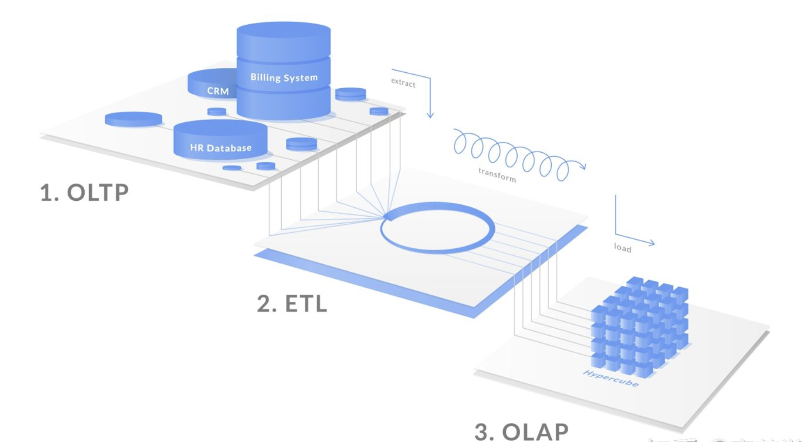


- 设计模式


- 执行模式

在深入到资源隔离之前，这里有必要简单介绍一下ClickHouse社区纯自研的MPP计算模型，因为ClickHouse的MPP计算模型和成熟的开源MPP计算引擎（例如：Presto、HAWQ、Impala）存在着较大的差异（que xian），这使得ClickHouse的资源隔离也有一些独特的要求，同时希望这部分内容能指导用户更好地对ClickHouse查询进行调优。

ClickHouse的MPP计算模型最大的特点是：它压根没有分布式执行计划，只能通过递归子查询和广播表来解决多表关联查询，这给分布式多表关联查询带来的问题是数据shuffle爆炸。另外ClickHouse的执行计划生成过程中，仅有一些简单的filter push down，column prune规则，完全没有join reorder能力。对用户来说就是"所写即所得"的模式，要求人人都是DBA，下面将结合简单的查询例子来介绍一下ClickHouse计算模型最大的几个原则。

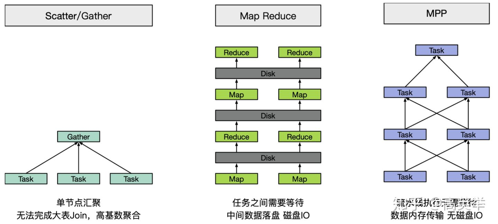


### 2 Distributed

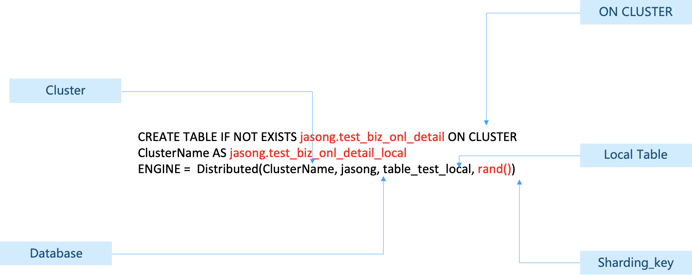

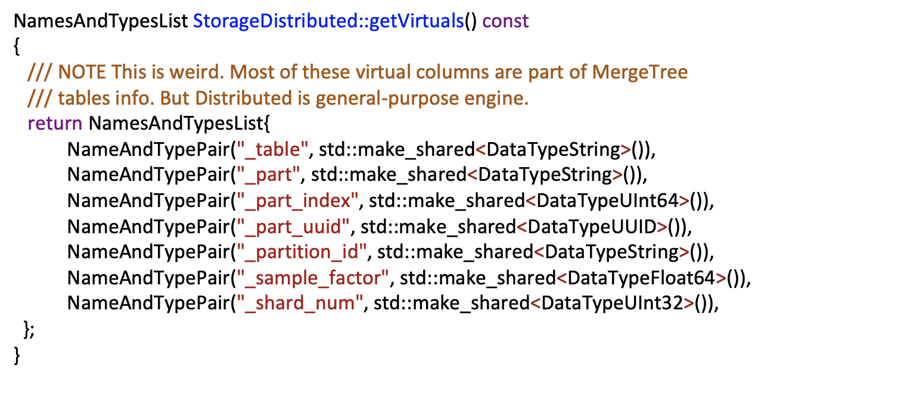

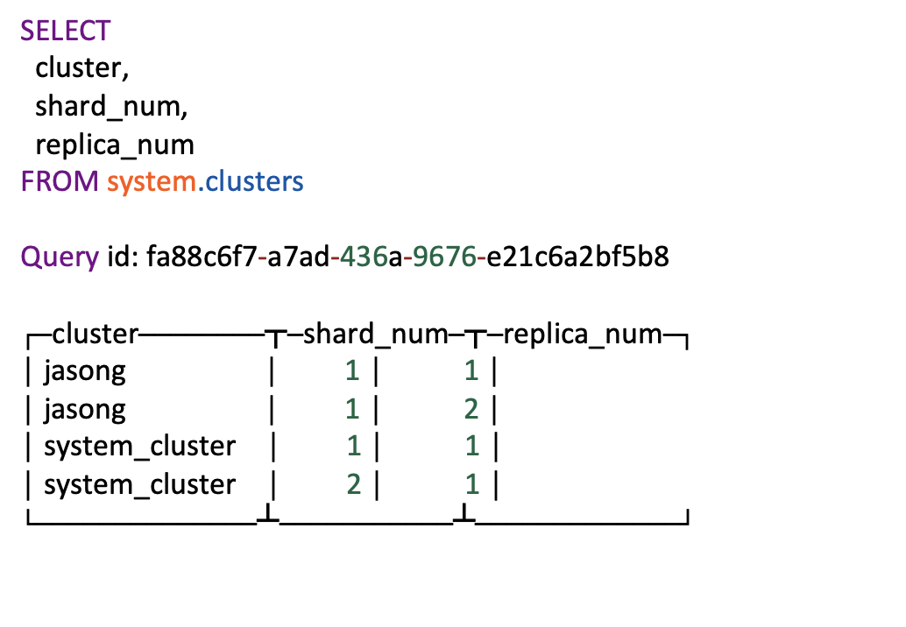

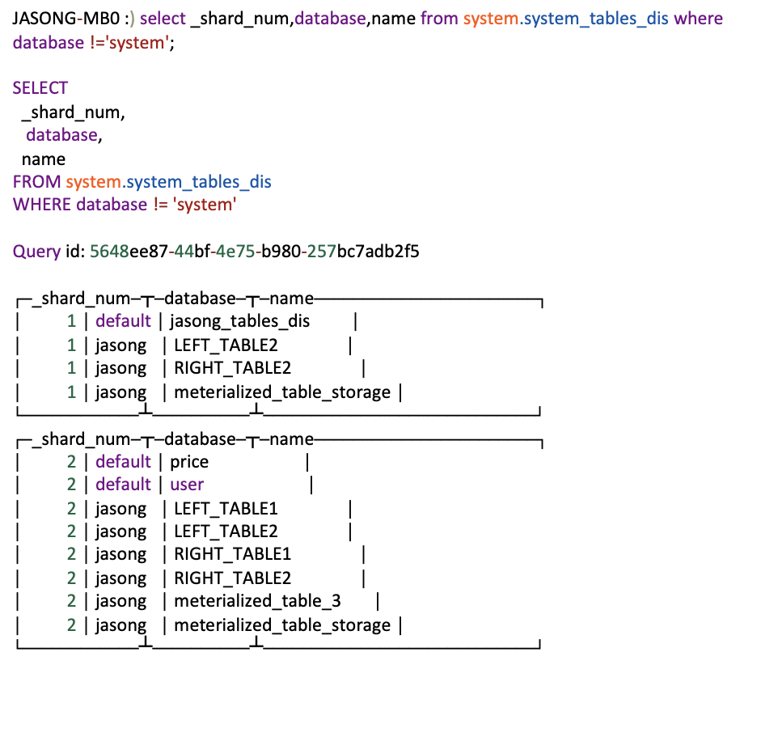

- 解决 慢查询 、 znode 表占用分析、节点元数据校验


### 2 clickhouse 存储和查询

- clickhouse 文件关系


- 写入

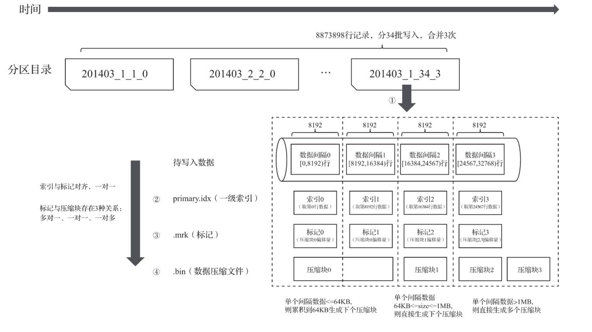


- 查询

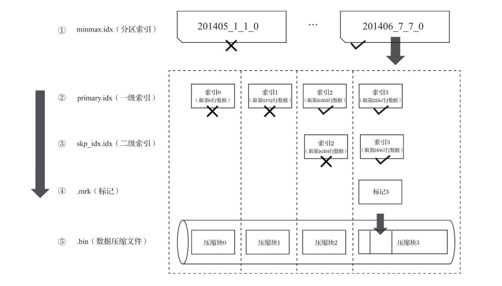

- 分区、索引、标记和压缩数据 + zookeeper 

| .mrk           | .mrk                                                         | .mrk                 | 当前行所在偏移大小 |            | .binhead   | .binhead   |
| -------------- | ------------------------------------------------------------ | -------------------- | ------------------ | ---------- | ---------- | ---------- |
| 未压缩文件编号 | 压缩块偏移量                                                 | 未/解压缩块偏移量 行 | 偏移大小           | 压缩块编号 | 压缩块大小 | 未压缩大小 |
| 0              | 0                                                            | 0                    | 0                  | 0          |            |            |
| 1              | 0                                                            | 8192                 | 8192               | 0          |            |            |
| 2              | 0                                                            | 16384                | 16384              | 0          |            |            |
| 3              | 0                                                            | 24576                | 24576              | 0          |            |            |
| 4              | 0                                                            | 32768                | 32768              | 0          |            |            |
| 5              | 0                                                            | 40960                | 40960              | 0          |            |            |
| 6              | 0                                                            | 49152                | 49152              | 0          |            |            |
| 7              | 0                                                            | 57344                | 57344              | 0          | 12000      | 65535      |
| 8              | 12016                                                        | 65536/0              | 65536              | 1          | 14661      | 65535      |
| 9              | 12016=8(前压缩块头)+12000(前压缩块大小)+8(当前压缩块的头大小) | 8192                 | 65536+8192         | 1          |            |            |
|                | 12016                                                        | ...                  |                    | 1          |            |            |
|                | ...                                                          |                      |                    |            |            |            |
|                | 1402429                                                      |                      |                    |            |            |            |


| .mrk           | .mrk                                                         | .mrk                 | 当前行所在字节大小 |            | .binhead   | .binhead   |
| -------------- | ------------------------------------------------------------ | -------------------- | ------------------ | ---------- | ---------- | ---------- |
| 未压缩文件编号 | 压缩块偏移量                                                 | 未/解压缩块偏移量 行 | 偏移大小           | 压缩块编号 | 压缩块大小 | 未压缩大小 |
| 0              | 0                                                            | 0                    | 0                  | 0          |            |            |
| 1              | 0                                                            | 8192                 | 16384              | 0          |            |            |
| 2              | 0                                                            | 16384                | 32768              | 0          |            |            |
| 3              | 0                                                            | 24576                | 49152              | 0          | 12000      | 65525      |
| 4              | 12016=8(前压缩块头)+12000(前压缩块大小)+8(当前压缩块的头大小) | 32768                | 65536              | 1          | 14661      | 65535      |
| 5              | 12016                                                        | 40960                | 63336+16384        | 1          |            |            |
| 6              | 12016                                                        | 49152                |                    | 1          |            |            |
| 7              | 12016                                                        | 57344                |                    | 1          | 14661      | 65535      |
| 8              | *=8+12000+8+14661+8                                          | 65536/0              |                    | 2          | *          | 65535      |
| 9              | *=8+12000+8+14661+8                                          | 8192                 |                    | 2          |            |            |

分区 partition + 索引 primary key + 标记 ark + 压缩 bin,


写入的一致性 不在这里介绍


### clickhouse (ReplicatedMergeTree) with zk


- 副本同步设计

1. 两个节点初始化 zkpath 会在第一次的时候初始化完成，各个节点的监听任务会起来

2. Insert *** block_id 可能是多个 也可能是一个 (server 不停止写入)

3. 推送insert 日志 logEntry  get 任务数据logEntry

4. 副本监听到log变化，创建task  

5. 数据源的选择优化算法

   - 找到所有副本
   - 选择 log_pointer 最大的，也就是最新的（也就是它需要更新的数据的replica)
   - 选择节点内 任务最少的额副本

   Fetch part ** fron 源节点

   Max_fetch_partition_retris_count =5 

6. 源 主节点接受 返回 part 数据

7. 副本接受和创建tmp_fetch_**. 重命名 ***

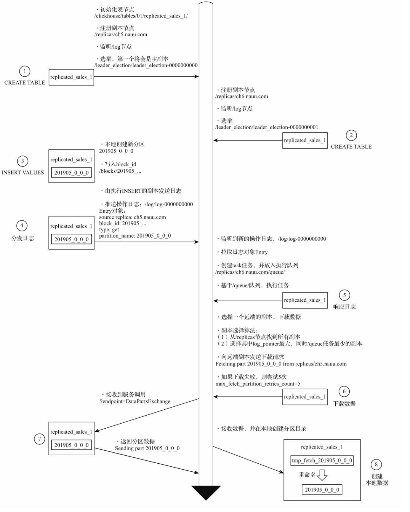


- merge 操作

1. 从 节点 optimze table
2. 建立连接 到主节点
3. 主节点 执行merge计划，推送 log日志 type merge command 2000* 20002 int ***
   - 2020_0_0_0 2020_1_1_0. -> 2020_0_1_1

4. 主从都监听到log操作日志，拉去日志 logEntry对象，加入自己的task queue
5. 相应任务合并

merge 操作，不涉及数据内容的传输

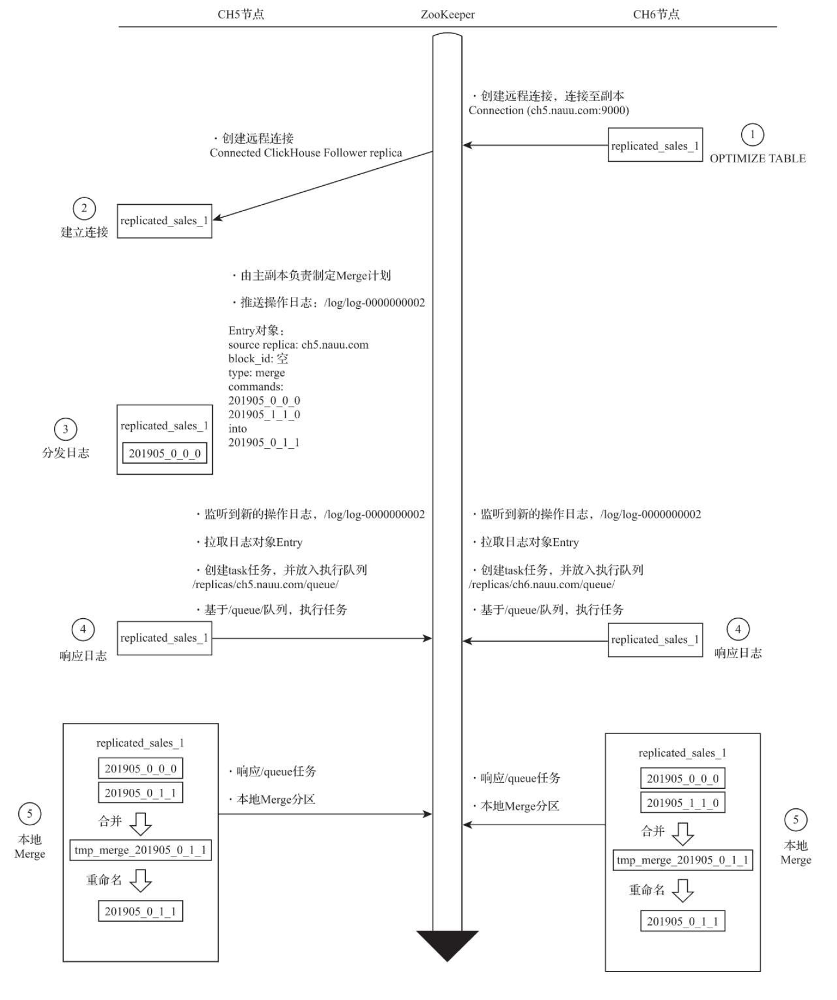


- Mutation

1. 从节点 alter delete command
2. 创建muattions 日志 mutationEntry 推送日志
3. 主从都监听到  
4. 主副本响应mutation  推送 mutation 操作日志 mutata 空 mutate 
5. 主从拉取日志，放入队列
6. 主从响应

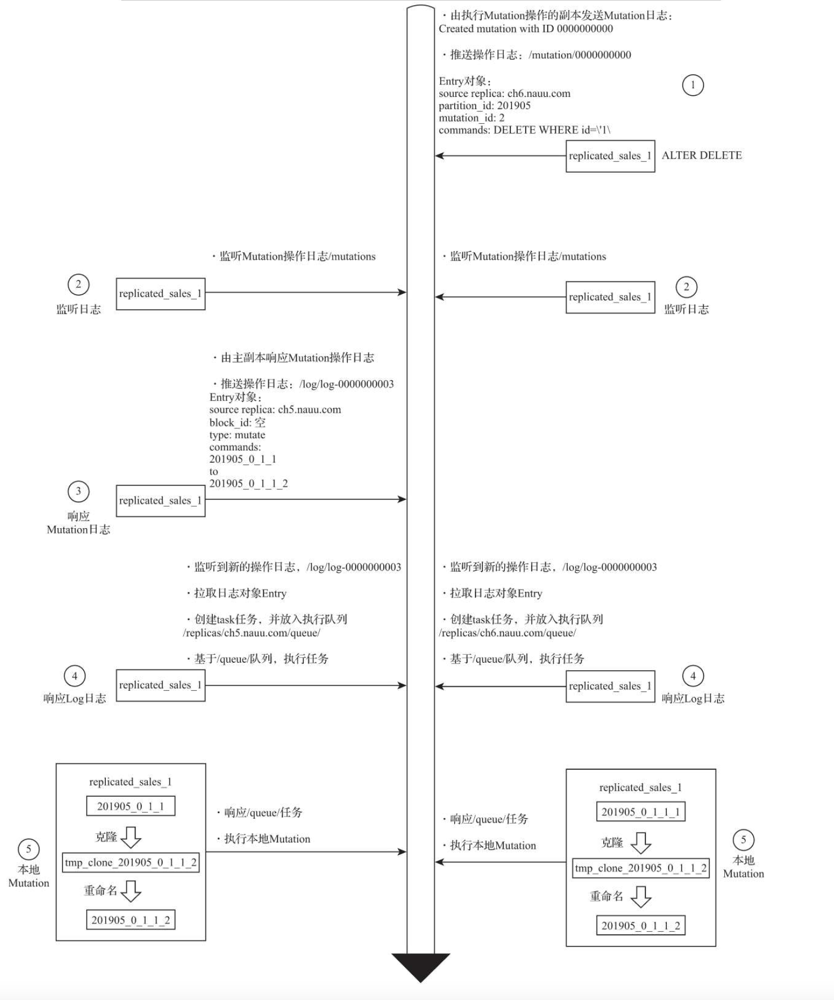


### Clickhouse-quotas

集群稳定性 ，大查询oom..

- Profile

```xml
<!-- Settings profiles -->
<profiles>
    <!-- Default settings -->
    <default>
        <!-- The maximum number of threads when running a single query. -->
        <max_threads>8</max_threads>
    </default>

    <!-- Settings for quries from the user interface -->
    <web>
        <max_rows_to_read>1000000000</max_rows_to_read>
        <max_bytes_to_read>100000000000</max_bytes_to_read>

        <max_rows_to_group_by>1000000</max_rows_to_group_by>
        <group_by_overflow_mode>any</group_by_overflow_mode>

        <max_rows_to_sort>1000000</max_rows_to_sort>
        <max_bytes_to_sort>1000000000</max_bytes_to_sort>

        <max_result_rows>100000</max_result_rows>
        <max_result_bytes>100000000</max_result_bytes>
        <result_overflow_mode>break</result_overflow_mode>

        <max_execution_time>600</max_execution_time>
        <min_execution_speed>1000000</min_execution_speed>
        <timeout_before_checking_execution_speed>15</timeout_before_checking_execution_speed>

        <max_columns_to_read>25</max_columns_to_read>
        <max_temporary_columns>100</max_temporary_columns>
        <max_temporary_non_const_columns>50</max_temporary_non_const_columns>

        <max_subquery_depth>2</max_subquery_depth>
        <max_pipeline_depth>25</max_pipeline_depth>
        <max_ast_depth>50</max_ast_depth>
        <max_ast_elements>100</max_ast_elements>

        <readonly>1</readonly>
    </web>
</profiles>
```

```
1：max_memory_usage：在单个ClickHouse服务进程中，运行一次查询限制使用的最大内存用量，默认值为10G；
2：max_memory_usage_for_user：在单个ClickHouse服务进程中，以用户为单位进行统计，单个用户在运行查询时，限制使用的最大内存用量，默认值为0，即不做限制；
3：max_memory_usage_for_all_queries：在单个ClickHouse服务进程中，所有运行的查询累加在一起，限制使用的最大内存用量，默认为0不做限制；
4：max_partitions_per_insert_block：在单次INSERT写入的时候，限制创建的最大分区个数，默认值为100个。如果超出这个阈值数目，将会得到异常；
5:max_rows_to_group_by：在执行GROUP BY聚合查询的时候，限制去重后的聚合KEY的最大个数，默认值为0，即不做限制。当超过阈值数量的时候，其处理方式由group_by_overflow_mode参数决定；
6:group_by_overflow_mode：当max_rows_to_group_by熔断规则触发的时候，有三种处理形式: 
throw抛出异常，此乃默认值；
break立即停止查询，并返回当前部分的数据；
any仅以当前已存在的聚合KEY，继续完成聚合查询；
7:max_bytes_before_external_group_by：在执行GROUP BY聚合查询的时候，限制使用的最大内存用量，默认值为0，即不做限制。当超过阈值数量的时候，聚合查询将会进一步借用本地磁盘。
```


- qutoas

```xml
<!-- Quotas -->
<quotas>
    <!-- Quota name. -->
    <default>
        <!-- Restrictions for a time period. You can set many intervals with different restrictions. -->
        <interval>
            <!-- Length of the interval. -->
            <duration>3600</duration>

            <!-- Unlimited. Just collect data for the specified time interval. -->
            <queries>0</queries>
            <query_selects>0</query_selects>
            <query_inserts>0</query_inserts>
            <errors>0</errors>
            <result_rows>0</result_rows>
            <read_rows>0</read_rows>
            <execution_time>0</execution_time>
        </interval>
    </default>
```

参数介绍：

默认情况下，配额仅跟踪每小时的资源消耗，而没有限制使用情况。在每个请求之后，将为每个时间间隔计算的资源消耗输出到服务器日志。

说明：

```
<default>：配额规则名。
<interval>：配置时间间隔，每个时间内的资源消耗限制。
<duration>：时间周期，单位秒。duration表示累计的时间周期，单位为秒，达到该时间周期后，清除所有收集的值，接下来的周期，将重新开始计算，当服务重启时，也会清除所有的值，重新开始新的周期。
<queries>：时间周期内允许的请求总数，0表示不限制。
<errors>：时间周期内允许的异常总数，0表示不限制
<result_rows>：时间周期内允许返回的行数，0表示不限制。
<read_rows>：时间周期内允许在分布式查询中，远端节点读取的数据行数，0表示不限制。
<execution_time>：时间周期内允许执行的查询时间，单位是秒，0表示不限制。
上面示例中的配置，属性值均为0，所以资源配额不做任何限制。现在继续声明另外一组配额：
```

- users

```xml
<users>
    <!-- If user name was not specified, 'default' user is used. -->
    <user_name>
        <profile>profile_name</profile>
        <quota>default</quota>
  </user_name>
</users>
```


### 数据更新

虽然ReplacingMergeTree提供了主键去重的能力，但是仍旧有以下限制：

- 在没有彻底optimize之前，可能无法达到主键去重的效果，比如部分数据已经被去重，而另外一部分数据仍旧有主键重复；
- 在分布式场景下，相同primary key的数据可能被sharding到不同节点上，不同shard间可能无法去重；
- optimize是后台动作，无法预测具体执行时间点；
- 手动执行optimize在海量数据场景下要消耗大量时间，无法满足业务即时查询的需求；

因此ReplacingMergeTree更多被用于确保数据最终被去重，而无法保证查询过程中主键不重复。


ClickHouse实现了CollapsingMergeTree来消除ReplacingMergeTree的限制。该引擎要求在建表语句中指定一个标记列Sign，后台Compaction时会将主键相同、Sign相反的行进行折叠，也即删除。

CollapsingMergeTree将行按照Sign的值分为两类：Sign=1的行称之为状态行，Sign=-1的行称之为取消行。


为了解决CollapsingMergeTree乱序写入情况下无法正常折叠问题，VersionedCollapsingMergeTree表引擎在建表语句中新增了一列Version，用于在乱序情况下记录状态行与取消行的对应关系。主键相同，且Version相同、Sign相反的行，在Compaction时会被删除。

与CollapsingMergeTree类似， 为了获得正确结果，业务层需要改写SQL，将`count()、sum(col)`分别改写为`sum(Sign)、sum(col * Sign)`。


### 近似精确去重

- 近似去重：

查询性能方面：uniq 查询性能最佳，其次是 uniqHLL12、uniqCombined 和 uniqCombined64

内存消耗方面：uniq 内存消耗最多，其次是 uniqCombined，uniqCombined64，uniqHLL12

综合查询性能，内存消耗，精度等原因，使用 uniqCombined（uniqCombined64）更好


- 精确去重： 

查询性能方面：count group by 查询性能最佳，其次是 uniqExact，count(distinct sku_id)

内存消耗方面：count group by 内存消耗最多，其次是 uniqExact，count(distinct sku_id)


### dict VS colocate join 

| **     策略** | **大表数据量** | **小表数据量** | **查询耗时** | **查询速度** |
| ------------- | -------------- | -------------- | ------------ | ------------ |
| colocate join | 1000万         | 1万            | 0.026 s      | 1.36 GB/s    |
| 字典          | 1000万         | 1万            | 0.057s       | 1.40 GB/s.   |
| colocate join | 1000万         | 10万           | 0.062s       | 1.30GB/s     |
| 字典          | 1000万         | 10万           | 0.071s       | 1.13 GB/s    |
| colocate join | 1000万         | 100万          | 0.092s       | 953.63MB/s   |
| 字典          | 1000万         | 100万          | 0.306s       | 261.46 MB/s  |
| colocate join | 1亿            | 10万           | 0.092s       | 8.72GB/s     |
| 字典          | 1亿            | 10万           | 0.512s       | 1.56 GB/s    |
| colocate join | 1亿            | 100万          | 0.268s       | 3.01GB/s     |
| 字典          | 1亿            | 100万          | 1.030s       | 776.45 MB/s  |
| colocate join | 1亿            | 1000万         | 0.904s       | 973.52MB/s   |
| 字典          | 1亿            | 1000万         | 3.679s       | 217.43 MB/s  |
| colocate join | 10亿           | 100万          | 0.908s       | 8.82GB/s     |
| 字典          | 10亿           | 100万          | 6.211s       | 1.29 GB/s    |
| colocate join | 10亿           | 1000万         | 3.549s       | 2.28GB/s     |
| 字典          | 10亿           | 1000万         | 11.086s      | 721.62 MB/s  |
| colocate join | 10亿           | 1亿            | 7.659s       | 1.15GB/s     |
| 字典          | 10亿           | 1亿            | 48.76s       | 560.36MB/s   |


### local join 


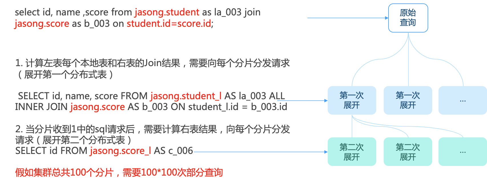

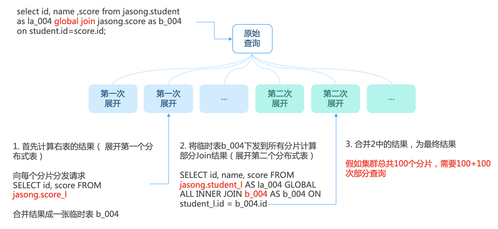

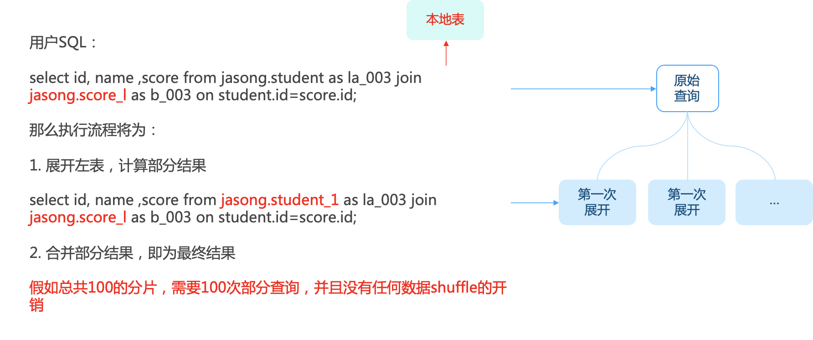