# 宋恩杰_JD_总结分享

1 ha

2 quota

3 元数据 节点管理 同步

4 节点上下线 节点状态

5 raft 替换zk

6 chpoxy

7 管控 监控

8 最近物化视图的问题

9 未来方向 ddl、query plan 、master、rebalance 


- 1 clickhouse ha by group 

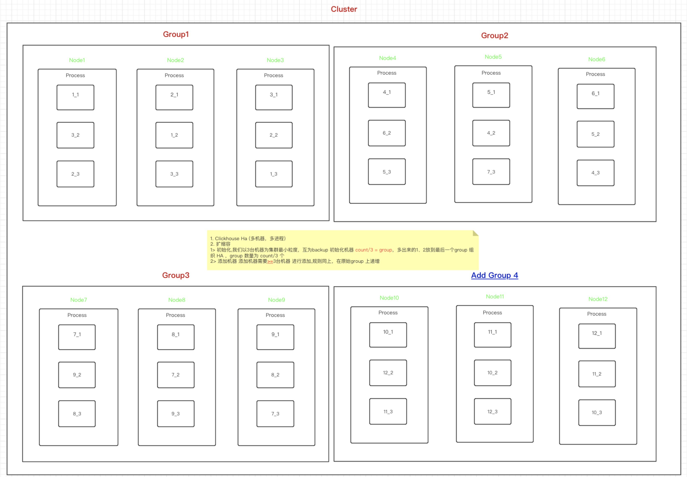


- 2 quotas

查询QPS

查询时间范围（天）

每日导入数据量和次数``quota/queries = （qps*``60``(一分钟) + 写入次数（一分钟）） * ``2(qutoa放大系数) / 分片数``quota/read_rows = ``1000``亿（暂时评估一个较大的值，大于最大用户一分钟请求数的``10``倍）

| 集群 | 用户 | 业务 | 是否0级 | 峰值queries/m | queries/m用户填报值 | 峰值read_rows/m(单位万) | read_rows/m用户填报值（通过计算） | quota/queries/m | quota/read_rows/m(单位万) | 分片数 | 备注 |
| :--- | :--- | :--- | :------ | :------------ | :------------------ | :---------------------- | :-------------------------------- | :-------------- | :------------------------ | :----- | :--- |
|      |      |      |         |               |                     |                         |                                   |                 |                           |        |      |
| ***  | ***  |      | 否      | 60            |                     | 15000                   |                                   | 100             | 10000000                  | 15     |      |
|      | ***  |      |         | 5000          | 50                  | 60000                   | 270000000                         | 500             | 10000000                  |        |      |


- 3 元数据管理

```
table_name 的子节点如下

1）/clickhouse/metadata/database_name/table_name/sql_id

保存建表SQL，如果有多个保存多个。sql_id 由对建表语句做hash生成为String。里面存储的数据为建表语句。

2）/clickhouse/metadata/database_name/table_name/sql_id/hostid

保存 sql_id 的所有server（ip:port）节点。


更新操作可以通过：CLUSTER SYNC METADATA [IP:PORT] [DATABASE] [TABLE] [SQLID]来操作

CLUSTER SYNC METADATA，同步ZK中的所有完整的库表到所有本地节点（一般指新增节点。新节点启动服务，但未配置到原集群中的时候操作）

CLUSTER SYNC METADATA IP:PORT，同步ZK中所有完整的库表到指定的IP:PORT的节点（一般用于替换节点。新节点启动服务，但未配置到原集群中的时候操作）

CLUSTER REPAIR METADATA DATABASE TABLE SQLID，同步ZK中指定的的库+表+SQL到所有节点，如果本地存在且不一致删除本地同步ZK中的，如果不存在直接同步ZK中的（一般用于解决元数据不一致的问题）

CLUSTER REPAIR METADATA IP:PORT DATABASE TABLE SQLID，同步ZK中指定的库+表+SQL到指定的IP:PORT的节点（解决元数据不一致的问题）


产品化

1）日常检查：列出不完整的库表，手工选择正确的元数据同步到其他节点

2）新增节点时，默认会同步元数据到本地节点

3）替换节点上线时，会默认检查元数据是否完整，并自动同步
```


- 4 节点上下线

```sql
MySQL [(none)]> cluster  pause  node ip:port;
+---------------+------+--------+-------+---------------------+------------------+
| host          | port | status | error | num_hosts_remaining | num_hosts_active |
+---------------+------+--------+-------+---------------------+------------------+
| xx | 9600 |      0 |       |                  16 |                0 |
| xx | 9800 |      0 |       |                  15 |                0 |
| xx | 9800 |      0 |       |                  14 |                0 |
| xx  | 9700 |      0 |       |                  13 |                0 |
| xx  | 9600 |      0 |       |                  12 |                0 |
| xx | 9700 |      0 |       |                  11 |                0 |
| xxx | 9600 |      0 |       |                  10 |                0 |

17 rows in set (0.12 sec)


select cluster, host_name,port ,status,is_local  from system.clusters where cluster='' order by host_name;

SELECT
    cluster,
    host_name,
    port,
    status,
    is_local
FROM system.clusters
WHERE cluster = ''
ORDER BY host_name ASC

┌─cluster──────┬─host_name─────┬─port─┬─status─┬─is_local─┐
│ xx │ xx  │ 9600 │      1 │        0 │
│ xx │ xx  │ 9800 │      1 │        0 │

 cluster start  node 10.199.141.54:9600;
+---------------+------+--------+-------+---------------------+------------------+
| host          | port | status | error | num_hosts_remaining | num_hosts_active |
+---------------+------+--------+-------+---------------------+------------------+
| xx | 9600 |      0 |       |                  16 |                0 |
| xx | 9800 |      0 |       |                  15 |                0 |
| xx | 9800 |      0 |       |                  14 |                0 |
| xx  | 9700 |      0 |       |                  13 |                0 |
| xx  | 9600 |      0 |       |                  12 |                0 |
| xx | 9700 |      0 |       |                  11 |                0 |
| xxx | 9600 |      0 |       |                  10 |                0 |
17 rows in set (0.12 sec)


```


- 5 raft 


- raft service

***\*CHService集群（3节点）\****

***\*1.tps\****

***\*测试要点：压力机不断加压，直到连续3次服务端响应的TPS没有增加，此时压到极限TPS\****


***\*2.Latency\****

***\*测试要点：不同压力下的TP90、TP90和平均RT\****

 

 


***\*CHService（单节点）\****

***\*1.tps\****

***\*测试要点：压力机不断加压，直到连续3次服务端响应的TPS没有增加，此时压到极限TPS\****

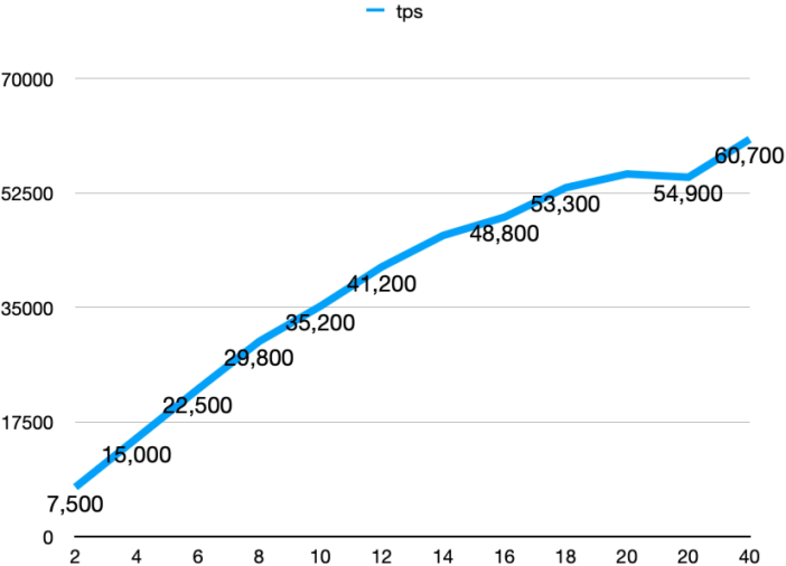

***\*2.Latency\****

***\*测试要点：不同压力下的TP90、TP90和平均RT\****


 


***\*zookeeper集群（3节点）\****

***\*1.tps\****

***\*测试要点：压力机不断加压，直到连续3次服务端响应的TPS没有增加，此时压到极限TPS\****


***\*2.Latency\****

***\*测试要点：不同压力下的TP90、TP90和平均RT\****


 

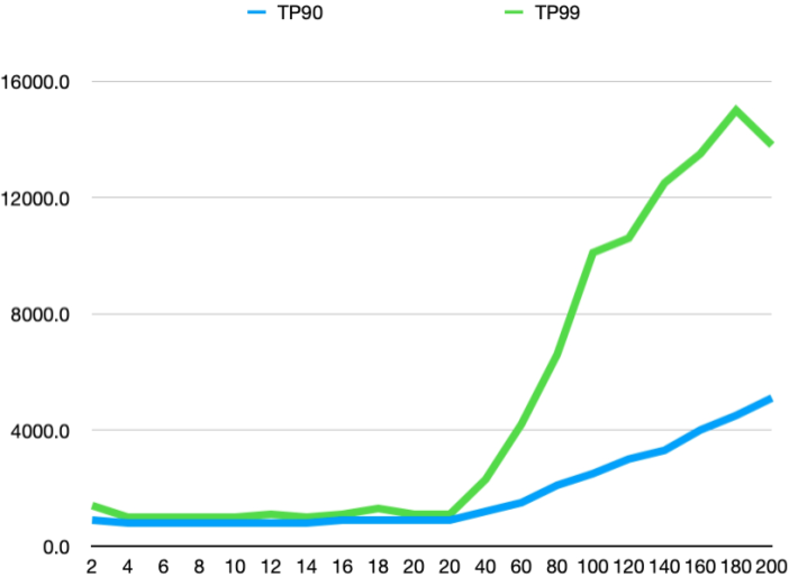

***\*zookeeper（单节点）\****

***\*1.tps\****

***\*测试要点：压力机不断加压，直到连续3次服务端响应的TPS没有增加，此时压到极限TPS\****

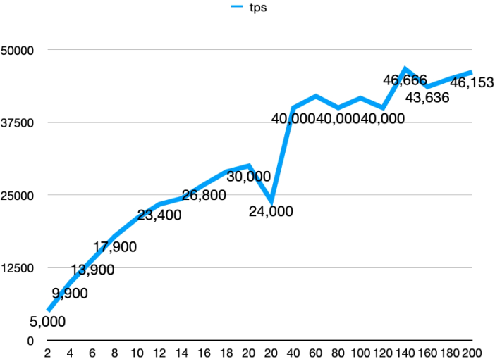

***\*2.Latency\****

***\*测试要点：不同压力下的TP90、TP90和平均RT\****


 

 

***\*Etcd集群（3节点）\****

***\*1.tps\****

***\*测试要点：压力机不断加压，直到连续3次服务端响应的TPS没有增加，此时压到极限TPS\****

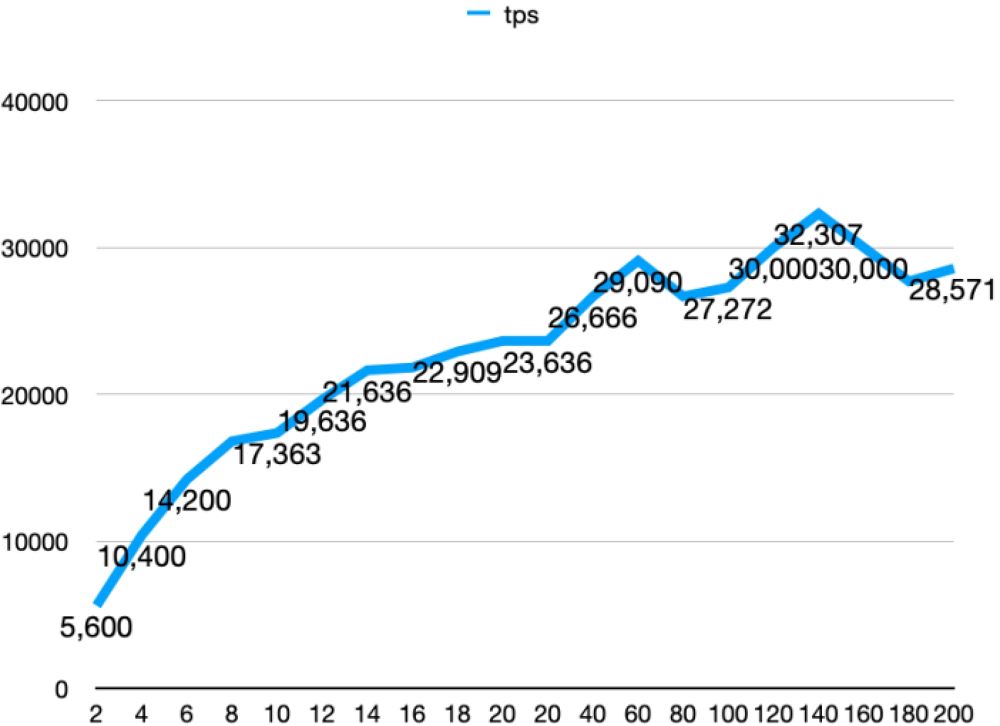

***\*2.Latency\****

***\*测试要点：不同压力下的TP90、TP90和平均RT\****

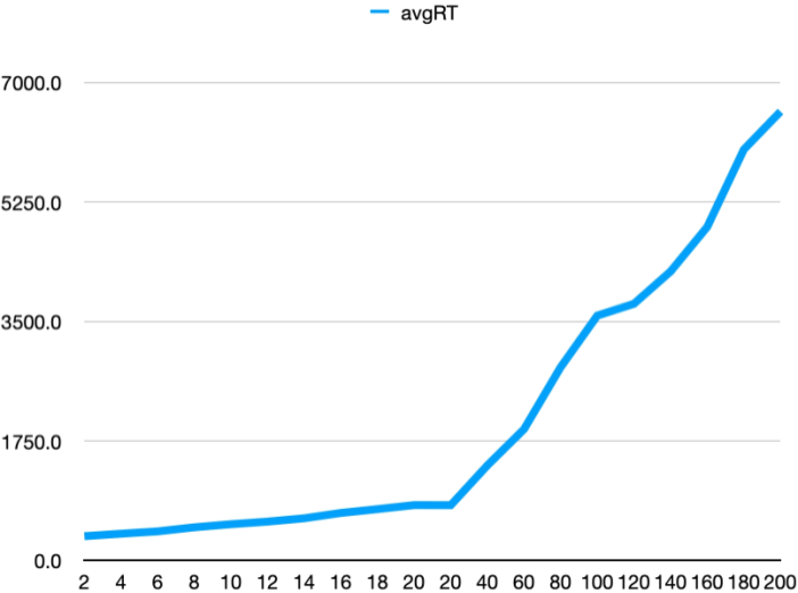

 

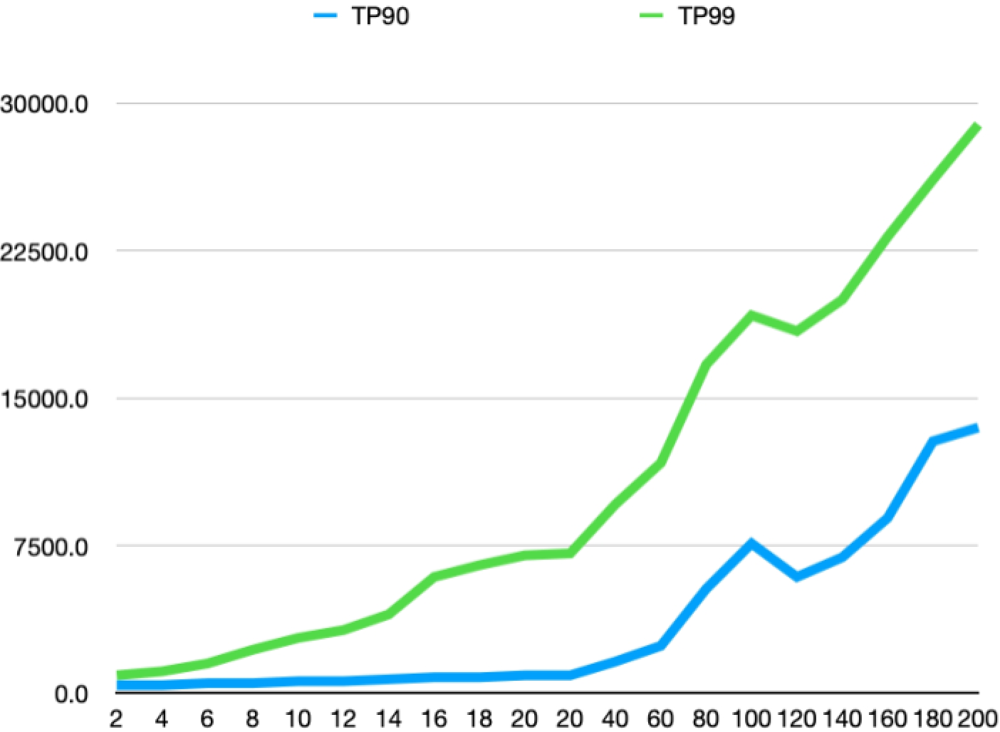

 

 

***\*CHService集群（3节点）\****

***\*1.tps\****

***\*测试要点：压力机不断加压，直到连续3次服务端响应的TPS没有增加，此时压到极限TPS\****

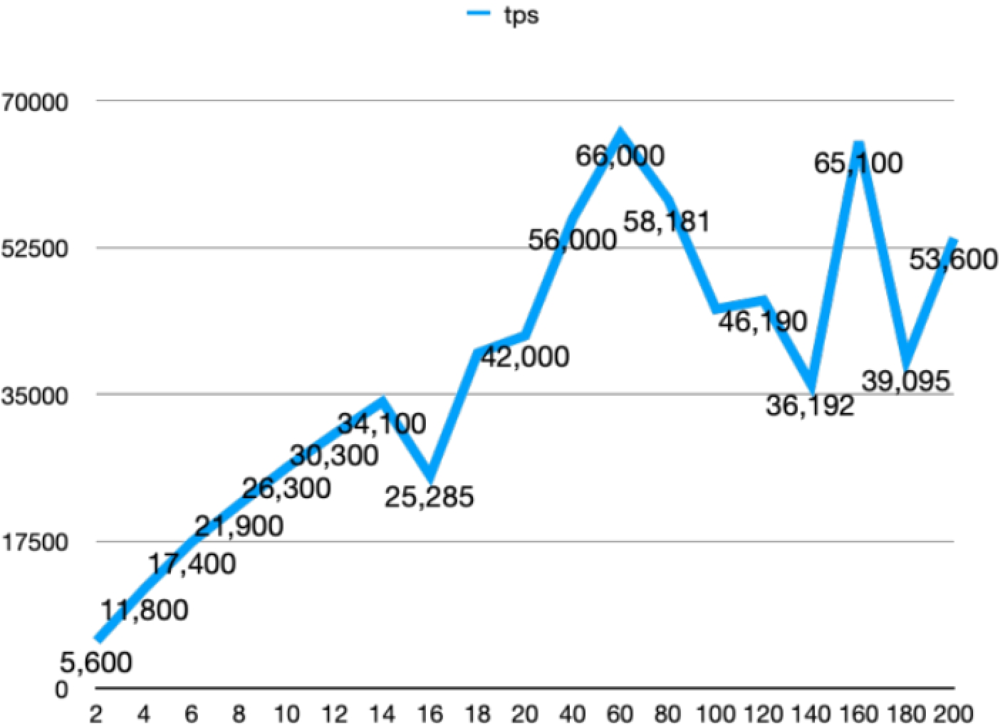

***\*2.Latency\****

***\*测试要点：不同压力下的TP90、TP90和平均RT\****

 

 

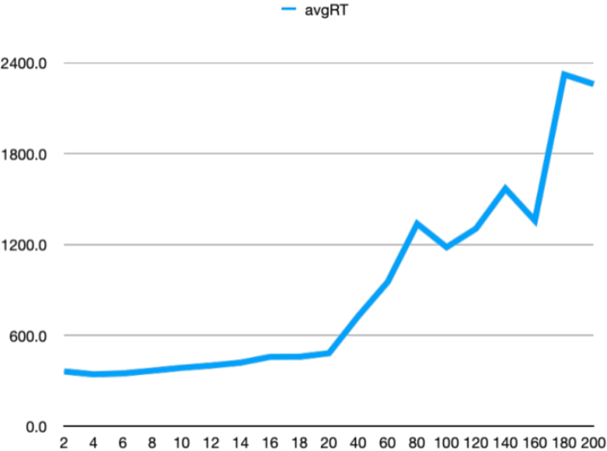

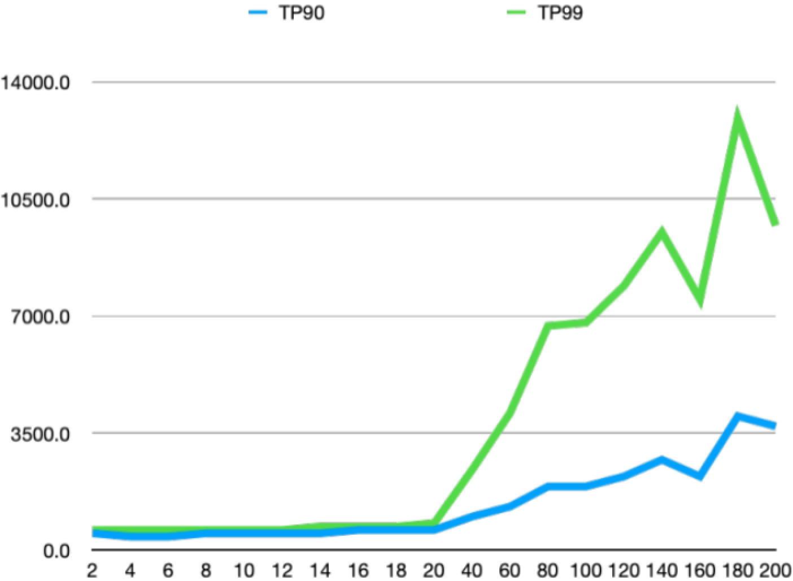


***\*CHService（单节点）\****

***\*1.tps\****

***\*测试要点：压力机不断加压，直到连续3次服务端响应的TPS没有增加，此时压到极限TPS\****


***\*2.Latency\****

***\*测试要点：不同压力下的TP90、TP90和平均RT\****

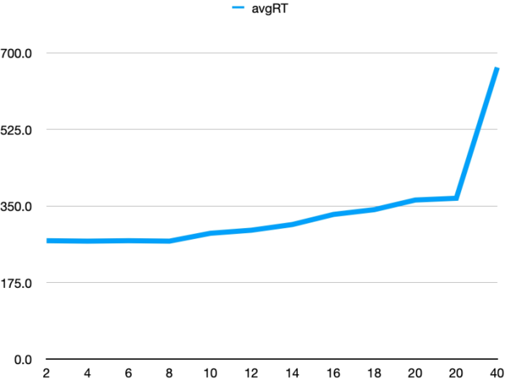

 

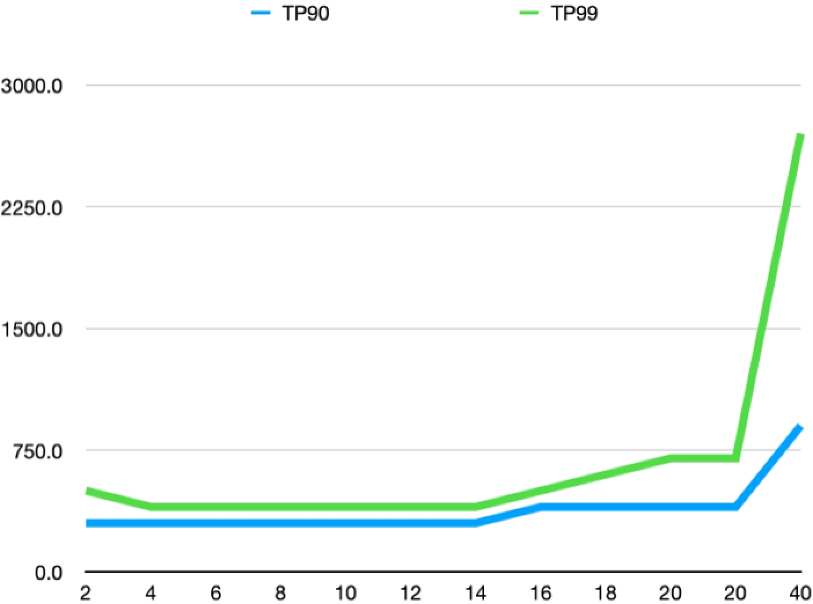


未来方向

```
1. ck 节点状态管理
2. 元数据管理
3. ddl 并行开发
4. raft 
5. query 分离 insert \select 
6. olap 端到端管控面 功能 升级、配置修改、一键降级、恢复、节点替换
7. 数据导入产品化
8. 集群数据迁移工具 copier
9. 物化视图、字典表解决方法
10. 容器化部署
11. 公司培训、发表文章、专利
12. 落地业务场景
```


