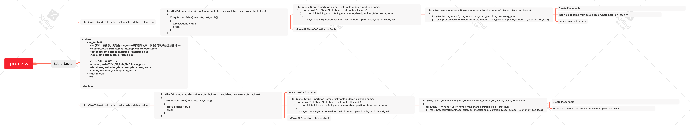
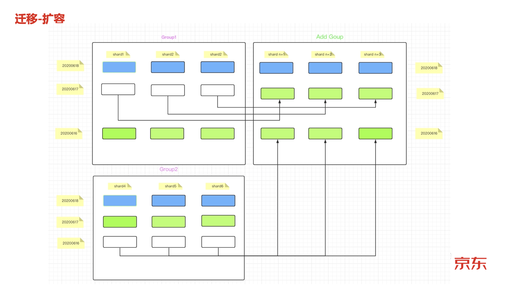

Clickhouse_FETCH_PART


### STOP MERGES[ ](https://clickhouse.tech/docs/zh/sql-reference/statements/system/#query_language-system-stop-merges)

为MergeTree系列引擎表停止后台合并操作。

```
SYSTEM STOP MERGES [[db.]merge_tree_family_table_name]
```


stop insert 权限


1. 停止数据写入，确保迁移的数据的全量性
2. 停止merge  确保当前查到的所有数据 文件都没有变化


开始 fetch part 

https://github.com/ClickHouse/ClickHouse/pull/22706


扩容需求

# clickhouse 跨集群迁移


## 1 需求

cluster 1   数据 迁移值 cluster 2


## 2 解决方案

方案 1 ：clickhhouse copier 生成配置文件

方案 2  :  clickhouse alter table fetch partition from "remote:/shardpath" 这里我们介绍方案2使用方法


## 3 源集群

####  1 表信息

```mysql
BJHTYD-Hope-17-5.hadoop.jd.local :) select * from system.macros;

SELECT *
FROM system.macros

┌─macro────────┬─substitution─┐
│ replica      │ 00           │
│ replica_dict │ 010-00       │
│ shard        │ 010          │
│ shard_dict   │ 1            │
└──────────────┴──────────────┘

show create table xxxx;

SHOW CREATE TABLE xxxx

┌─statement──────────────────────────────────────────────────────────────────────────────────────────────────────────────────────────────────────────────────────────────────────────────────────────────────────────────────────────────────────────────────┐
│ CREATE TABLE pc.xxxx
(
    `sale_mode` String,
    `shop_id` String,
    `dept_list` String,
    `dt` Date,
    `hash_key_for_shard` Int32
)
ENGINE = ReplicatedMergeTree('/clickhouse/tables/pc/xxxx/{shard}', '{replica}')
PARTITION BY dt
ORDER BY (sale_mode, shop_id, dept_list)
SETTINGS storage_policy = 'jdob_ha', index_granularity = 8192


所以这里 ：当前shard 在zookeeper 中创建路径为： /clickhouse/tables/pc/xxxx/010
```


#### 2 分区数据

```mysql
select distinct partition from system.parts where table='xxxx';

SELECT DISTINCT partition
FROM system.parts
WHERE table = 'xxxx'

┌─partition──┐
│ 2020-09-16 │
│ 2020-09-17 │
│ 2020-09-18 │
│ 2020-09-19 │
│ 2020-09-20 │
│ 2020-09-21 │
│ 2020-09-22 │
│ 2020-09-23 │
│ 2020-09-24 │
│ 2020-09-25 │
│ 2020-09-26 │
│ 2020-09-27 │
│ 2020-09-28 │
│ 2020-09-29 │
│ 2020-09-30 │
│ 2020-10-01 │

我们这里选择一个分区做测试
```


#### 3 分区数据量

```mysql
select count(*) from xxxx where dt='2020-09-16';

SELECT count(*)
FROM xxx
WHERE dt = '2020-09-16'

┌─count()─┐
│   16244 │
└─────────┘

当前分区 为 '2020-09-16，16244'

select count(*) from xxx  where dt='2020-09-16';

SELECT count(*)
FROM xxx
WHERE dt = '2020-09-16'


┌─count()─┐
│  639228 │
└─────────┘

1 rows in set. Elapsed: 2.347 sec. Processed 639.23 thousand rows, 1.28 MB (272.32 thousand rows/s., 544.64 KB/s.)

```


##  4 目标集群

#### ·1 config.xml   源集群 zookeeper 集群添加

```mysql
<auxiliary_zookeepers>
	<cluster1>
	  <node index="1">
		<host></host>
		<port>2281</port>
	  </node>
	  <node index="2">
		<host></host>
		<port>2281</port>
	  </node>
	  <node index="3">
		<host></host>
		<port>2281</port>
	  </node>
    </cluster1>
</auxiliary_zookeepers>
```


#### 2 重启服务

System restart clickhouse-server*


#### 3 fetch 

```
ALTER TABLE xxx FETCH PARTITION '2020-09-16'  FROM 'xxx:/clickhouse/tables/pc/xxx/010';
```

为什么能够支持 请查看我上一片文章 ，这里主要是副本间通信，默认没有身份验证

```c++
    //节点之间通信是不需要用户名和密码的
    if (config().has("interserver_http_credentials"))
    {
        String user = config().getString("interserver_http_credentials.user", "");
        String password = config().getString("interserver_http_credentials.password", "");

        if (user.empty())
            throw Exception("Configuration parameter interserver_http_credentials user can't be empty", ErrorCodes::NO_ELEMENTS_IN_CONFIG);

        global_context->setInterserverCredentials(user, password);
    }
```


 interserver_http_credentials：在使用Replicated *引擎进行复制期间进行身份验证的用户名和密码。 这些凭据仅用于副本之间的通信，与ClickHouse客户端的凭据无关。 服务器正在检查这些凭据以连接副本，并在连接到其他副本时使用相同的凭据。 因此，对于群集中的所有副本，应将这些凭据设置为相同。默认不使用身份验证。

```xml
<interserver_http_credentials>
    <user>admin</user>
    <password>222</password>
</interserver_http_credentials>
```


操作日志

```
2021.04.02 15:10:14.286751 [ 145145 ] {3790665d-1aff-47d8-bef7-a5a718a9f97c} <Debug> executeQuery: (from [::ffff:172.18.160.19]:52662) ALTER TABLE xxxx FETCH PARTITION '2020-09-16' FROM 'HT0_CK_Pub_01:/clickhouse/tables/pc/xxxx/010';
2021.04.02 15:10:14.286860 [ 145145 ] {3790665d-1aff-47d8-bef7-a5a718a9f97c} <Trace> ContextAccess (default): Access granted: ALTER FETCH PARTITION ON jason.xxxx
2021.04.02 15:10:14.289740 [ 145145 ] {3790665d-1aff-47d8-bef7-a5a718a9f97c} <Information> jason.xxxx (5352004e-b633-40f1-9b6b-fc064b5034bd): Will fetch partition 20200916 from shard HT0_CK_Pub_01:/clickhouse/tables/pc/xxxx/010 (auxiliary zookeeper 'HT0_CK_Pub_01')
2021.04.02 15:10:14.297859 [ 145145 ] {3790665d-1aff-47d8-bef7-a5a718a9f97c} <Information> jason.xxxx (5352004e-b633-40f1-9b6b-fc064b5034bd): Found 3 replicas, 3 of them are active. Selected 00 to fetch from.
2021.04.02 15:10:14.299013 [ 145145 ] {3790665d-1aff-47d8-bef7-a5a718a9f97c} <Information> jason.xxxx (5352004e-b633-40f1-9b6b-fc064b5034bd): Parts to fetch: 1
2021.04.02 15:10:14.299034 [ 145145 ] {3790665d-1aff-47d8-bef7-a5a718a9f97c} <Debug> jason.xxxx (5352004e-b633-40f1-9b6b-fc064b5034bd): Fetching part 20200916_1_1_0 from /clickhouse/tables/pc/xxxx/010/replicas/00
2021.04.02 15:10:14.300032 [ 145145 ] {3790665d-1aff-47d8-bef7-a5a718a9f97c} <Trace> ReadWriteBufferFromHTTP: Sending request to http://10.198.17.5:9509/?endpoint=DataPartsExchange%3A%2Fclickhouse%2Ftables%2Fpc%2Fxxxx%2F010%2Freplicas%2F00&part=20200916_1_1_0&client_protocol_version=5&compress=false
2021.04.02 15:10:14.344212 [ 145145 ] {3790665d-1aff-47d8-bef7-a5a718a9f97c} <Debug> jason.xxxx (5352004e-b633-40f1-9b6b-fc064b5034bd): Fetched part 20200916_1_1_0 from /clickhouse/tables/pc/xxxx/010/replicas/00 (to 'detached' directory)
2021.04.02 15:10:21.870276 [ 145119 ] {} <Debug> jason.xxxx (ReplicatedMergeTreeRestartingThread): Activating replica.
2021.04.02 15:10:21.872309 [ 145119 ] {} <Debug> jason.xxxx (ReplicatedMergeTreeQueue): Loading queue from /clickhouse/tables/jason/xxxx/00/replicas/01/queue
2021.04.02 15:10:21.872815 [ 145119 ] {} <Debug> jason.xxxx (ReplicatedMergeTreeQueue): Having 0 queue entries to load, 0 entries already loaded.
2021.04.02 15:10:21.873127 [ 145119 ] {} <Trace> jason.xxxx (ReplicatedMergeTreeQueue): Loaded queue
```

fetch 后数据不可见 在 detach 目录存放


#### 4 attach partition

```mysql
alter table xxxx attach partition '2020-09-16';
```


#### 5 数据校验

```mysql
 select count(*) from xxxx;

SELECT count(*)
FROM xxxx

┌─count()─┐
│   16244 │
└─────────┘

1 rows in set. Elapsed: 0.005 sec.
```


## 5 完成


## 6 后续优化

1. auxiliary_zookeepers 动态更新
2. 支持更细力度的 如 fetach part
3. 目前应该是 不支持相同part 名字落入同一个目前集群，如果支持
4. 直接支持集群迁移的命令


