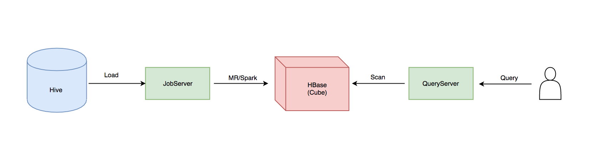
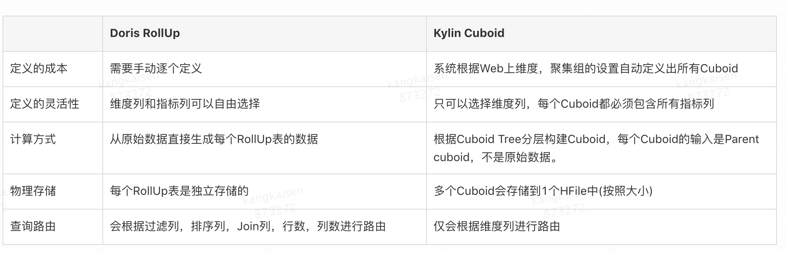
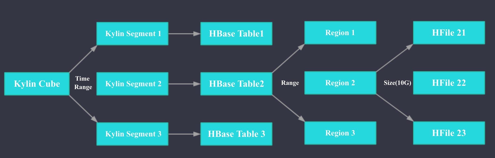
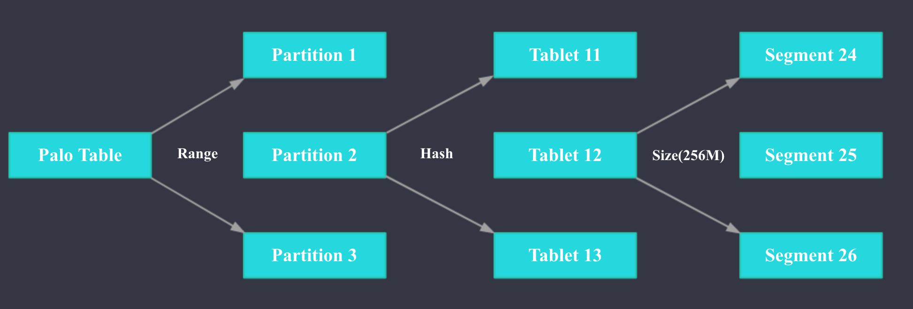
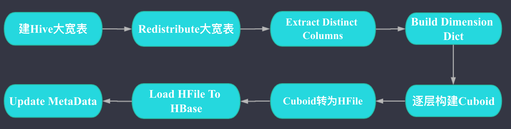
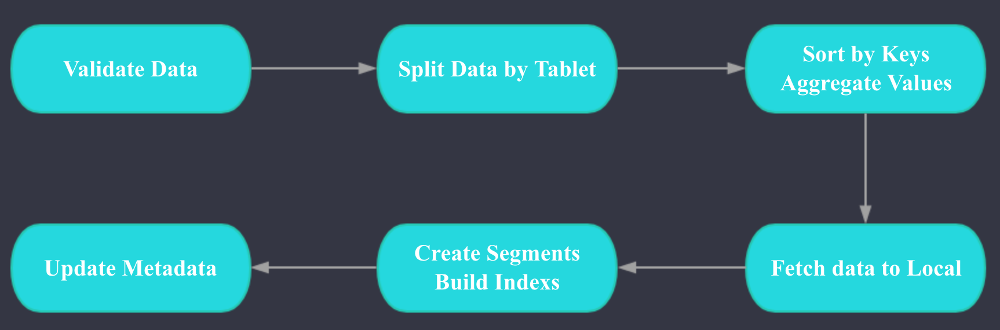

1. 系统架构
2. 数据模型
3. 存储引擎 
4. 数据导入 
5. 数据查询
6. 精确去重
7. 元数据
8. 高性能
9. 高可用
10. 可维护性
11. 易用性
12. 功能
13. 社区生态

### 1 系统架构 

Kylin 核心思想预计算 时间换空间 cube是素有维度的组合，cuild是一种维度

doris mpp架构 google mesa 数据模型➕Apache Impala(MPP query engine)➕Apache ORCFile 存储格式

Kylin: jobServer + QueryServer

JobServer主要负责将数据源（Hive,Kafka）的数据通过计算引擎（MapReduce，Spark）生成Cube存储到存储引擎（HBase）中；QueryServer主要负责SQL的解析，逻辑计划的生成和优化，向HBase的多个Region发起请求，并对多个Region的结果进行汇总，生成最终的结果集

Doris: fe+be

Doris主要分为FE和BE两个组件，FE主要负责查询的编译，分发和元数据管理（基于内存，类似HDFS NN）；BE主要负责查询的执行和存储系统。

### 2 数据模型

kylin :kv.

doris: kv, duplicated

rollup

1. 选择包含所查询列的rollup表
2. 按照过滤和排序和column 选择最符合的rollup
3. 按照join的colomn筛选最合适的rollup
4. 行最小
5. 最小

### 3 存储

Kylin

doris

### 4 数据导入

**Kylin数据导入：** 

如上图，Kylin数据导入主要分为建Hive大宽表(这一步会处理Join)；维度列构建字典；逐层构建Cuboid；Cuboid转为HFile；Load HFile To HBase; 元数据更新这几步。

其中Redistribute大宽表这一步的作用是为了将整个表的数据搞均匀，避免后续的步骤中有数据倾斜，Kylin有配置可以跳过这一步。

其中Extract Distinct Columns这一步的作用是获取需要构建字典的维度列的Distinct值。假如一个ID维度列有1，2，1，2，2，1，1，2这8行，那么经过这一步后ID列的值就只有1，2两行，做这一步是为了下一步对维度列构建字典时更快速。

其他几个步骤都比较好理解，我就不再赘述。更详细的信息可以参考 [Apache Kylin Cube 构建原理](https://blog.bcmeng.com/post/kylin-cube.html)

**Doris数据导入：** 

Doris 数据导入的两个核心阶段是ETL和LOADING, ETL阶段主要完成以下工作：

- 数据类型和格式的校验
- 根据Teblet拆分数据 
- 按照Key列进行排序, 对Value进行聚合

LOADING阶段主要完成以下工作：

- 每个Tablet对应的BE拉取排序好的数据
- 进行数据的格式转换，生成索引

LOADING完成后会进行元数据的更新。

### 5 查询

### 6 去重

### 7 元数据

**Kylin的元数据** ：

Kylin的元数据是利用HBase存储的，可以很好地横向扩展。Kylin每个具体的元数据都是一个Json文件，HBase的Rowkey是文件名，Value是Json文件的内容。Kylin的元数据表设置了IN_MEMORY => 'true' 属性, 元数据表会常驻HBase RegionServer的内存，所以元数据的查询性能很好，一般在几ms到几十ms。

Kylin元数据利用HBase存储的一个问题是，在Kylin可插拔架构下，即使我们实现了另一种存储引擎，我们也必须部署HBase来存储元数据，所以Kylin要真正做到存储引擎的可插拔，就必须实现一个独立的元数据存储。

**Doris的元数据**：

Doris的元数据是基于内存的，这样做的好处是性能很好且不需要额外的系统依赖。 缺点是单机的内存是有限的，扩展能力受限，但是根据Doris开发者的反馈，由于Doris本身的元数据不多，所以元数据本身占用的内存不是很多，目前用大内存的物理机，应该可以支撑数百台机器的OLAP集群。 此外，OLAP系统和HDFS这种分布式存储系统不一样，我们部署多个集群的运维成本和1个集群区别不大。

关于Doris元数据的具体原理大家可以参考Doris官方文档[Doris 元数据设计文档](https://github.com/baidu/palo/wiki/Metadata-Design)

### 8 查询

Kylin:

预计算

doris

1. In-Memory Metadata。 Doris的元数据就在内存中，元数据访问速度很快。
2. 聚合模型可以在数据导入时进行预聚合。
3. 和Kylin一样，也支持预计算的RollUp Table。
4. MPP的查询引擎。
5. 向量化执行。相比Kylin中Calcite的代码生成，向量化执行在处理高并发的低延迟查询时性能更好，**Kylin的代码生成本身可能会花费几十ms甚至几百ms**。
6. 列式存储 + 前缀索引。

### 9 高可用

**Kylin高可用：**

**Kylin JobServer的高可用**： Kylin的JobServer是无状态的，一台JobServer挂掉后，其他JobServer会很快接管正在Running的Job。JobServer的高可用是基于Zookeeper实现的，具体可以参考[Apache Kylin Job 生成和调度详解](https://blog.bcmeng.com/post/kylin-job.html)。

**Kylin QueryServer的高可用**：Kylin的QueryServer也是无状态的，其高可用一般通过Nginx这类的负载均衡组件来实现。 

**Kylin Hadoop依赖的高可用**： 要单纯保证Kylin自身组件的高可用并不困难，但是要保证Kylin整体数据导入和查询的高可用是**十分困难的**，因为必须同时保证HBase，Hive，Hive Metastore，Spark，Mapreduce，HDFS，Yarn，Zookeeper，Kerberos这些服务的高可用。

**Doris高可用：**

**Doris FE的高可用**： Doris FE的高可用主要基于BerkeleyDB java version实现，BDB-JE实现了**类Paxos一致性协议算法**。

**Doris BE的高可用：** Doris会保证每个Tablet的多个副本分配到不同的BE上，所以一个BE down掉，不会影响查询的可用性。

### 10 易用

**Kylin学习成本**：用户要用好Kylin，需要理解以下概念：

- Cuboid
- 聚集组
- 强制维度
- 联合维度
- 层次维度
- 衍生维度
- Extend Column
- HBase RowKey 顺序

此外，前面提到过，用户还需要学会怎么看Mapreduce Job和Spark Job日志。

**Doris学习成本**：用户需要理解聚合模型，明细模型，前缀索引，RollUp表这些概念。