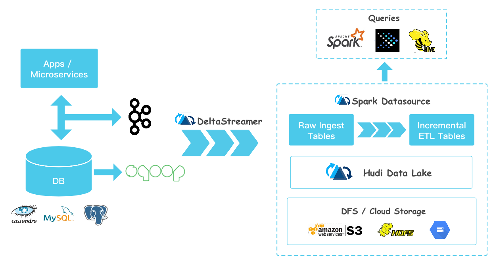

## **简介**

Apache Hudi是一个Data Lakes的开源方案，Hudi是Hadoop Updates and Incrementals的简写，它是由Uber开发并开源的Data Lakes解决方案。

## 特性

- Hudi能够摄入（Ingest）和管理（Manage）基于HDFS之上的大型分析数据集，主要目的是高效的减少入库延时。
- Hudi基于Spark来对HDFS上的数据进行更新、插入、删除等。
- Hudi在HDFS数据集上提供如下流原语：插入更新（如何改变数据集）；增量拉取（如何获取变更的数据）。
- Hudi可以对HDFS上的parquet格式数据进行插入/更新操作。
- Hudi通过自定义InputFormat与Hadoop生态系统（Spark、Hive、Parquet）集成。
- Hudi通过Savepoint来实现数据恢复。
- 目前，Hudi支持Spark 2.x版本，建议使用2.4.4+版本的Spark。

## **架构**

Hudi能够整合Batch和Streaming处理的能力，这是通过利用Spark自身支持的基本能力来实现的。一个数据处理Pipeline通常由Source、Processing、Sink三个部分组成，Hudi可以作为Source、Sink，它把数据存储到分布式文件系统（如HDFS）中。
Apache Hudi在大数据应用场景中，所处的位置，如下图所示：

从上图中可见，Hudi能够与Hive、Spark、Presto这类处理引擎一起工作。Hudi有自己的数据表，通过将Hudi的Bundle整合进Hive、Spark、Presto等这类引擎中，使得这些引擎可以查询Hudi表数据，从而具备Hudi所提供的Snapshot Query、Incremental Query、Read Optimized Query的能力。