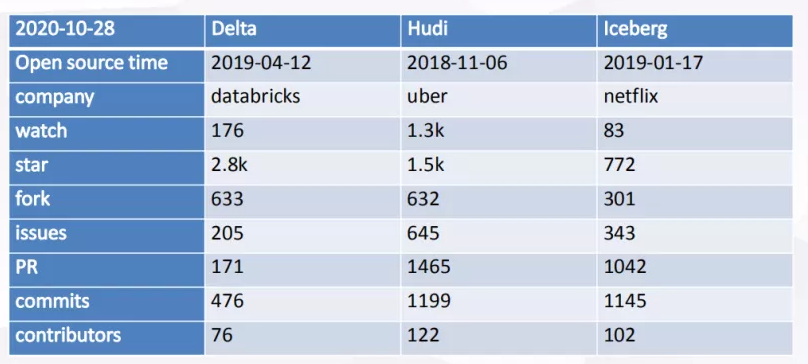

## **简介**

Apache Iceberg是由 Netflix 开发开源的用于庞大分析数据集的开放表格式。 Iceberg在Presto和Spark中添加了使用高性能格式的表，该格式的工作方式类似于SQL表。

我们可以简单理解为他是基于计算层（flink ， spark）和存储层（orc，parqurt）的一个中间层，我们在hive建立一个iceberg格式的表。用flink或者spark写入iceberg，然后再通过其他方式来读取这个表，比如spark，flink，presto等。

与其他数据湖产品对比

