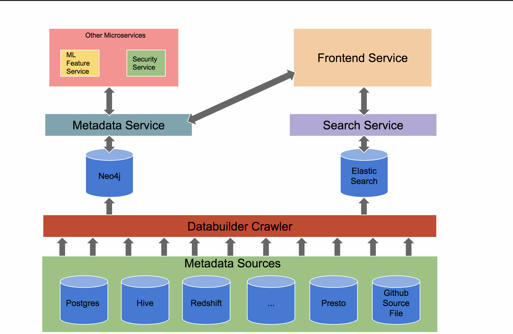

## **简介**

Amundsen 是来自Lyft 开源的元数据管理、数据发现平台，功能点很全，有一个比较全的前端、后端以及数据处理框架。

Amundsen提供了搜索与排名的功能，帮助更好的查找数据表。

支持的数据源非常丰富，支持hive ，druid等超过15个数据源，而且还提供与任务调度airflow的融合，并提供了与superset等BI工具的集成方式。

而数据血统的功能也正在开发之中。

## **架构**

